# Introduction

## Contexte

Dans un monde où les indicateurs de développement sont multiples (revenu, santé, éducation, accès aux services, environnement), il devient crucial de **synthétiser l’information** pour comprendre les grands profils qui distinguent les pays. Pour ce faire, nous mobilisons deux techniques statistiques puissantes et complémentaires :

- **L’analyse en composantes principales (`ACP`)**, qui permet de **réduire la dimension des données** en identifiant les axes principaux de variation entre les pays,
- **Le clustering par K-means**, qui regroupe les pays selon leurs **profils de développement similaires** dans l’espace défini par l’`ACP`.

Cette approche nous permettra :
- D’identifier visuellement les dimensions clés du développement,
- De regrouper les pays en **classes homogènes**, facilitant ainsi l’analyse comparative.

Nous appliquerons cette démarche sur un ensemble de variables décrivant les niveaux de vie, l’éducation, la santé, l’environnement et l’accès aux services, dans le but de dresser une **cartographie synthétique et interprétable des grandes catégories de pays** à travers le monde.


## Présentation de l’ACP et du K-means

### ***Source de données***

Le jeu de données utilisé dans cette analyse provient de [Kaggle](https://www.kaggle.com/code/zohrehtofighizavareh/clustering-on-country-dataset/input) et regroupe plusieurs indicateurs socio-économiques et de santé pour 167 pays.

### **Analyse en Composantes Principales (`ACP`)**

L’ACP est une méthode statistique de réduction de dimensionnalité. Elle transforme un grand nombre de variables corrélées en un nombre plus petit de variables non corrélées appelées composantes principales. Ces composantes capturent l’essentiel de la variation présente dans les données originales.

**Pourquoi utiliser l’ACP ?**  
- Simplifier l’analyse en réduisant la complexité des données multidimensionnelles,  
- Visualiser facilement les relations entre observations et variables,  
- Mettre en évidence les structures sous-jacentes dans les données.

### **Le Clustering K-means**

|       K-means est une méthode de classification non supervisée qui consiste à regrouper un ensemble d’observations en K clusters (groupes), où chaque observation appartient au cluster dont elle est la plus proche selon une mesure de distance (souvent euclidienne).

**Pourquoi utiliser K-means ?**  

- Identifier des groupes homogènes dans les données,  
- Faciliter l’interprétation en catégorisant les observations,  
- Détecter des profils ou comportements similaires.

### **Complémentarité entre ACP et K-means**

L’ACP et le K-means sont souvent utilisés conjointement car ils se complètent parfaitement :  
- **ACP prépare les données** en réduisant leur dimension, en supprimant le bruit et les redondances, ce qui facilite la visualisation et la compréhension,  
- **K-means exploite l’espace réduit** par l’ACP pour effectuer un regroupement plus robuste et plus interprétable, évitant les problèmes liés à la malédiction de la dimension.

Ainsi, l’association ACP + K-means permet d’analyser efficacement des données complexes, en identifiant à la fois les principales dimensions d’influence et les groupes d’observations partageant des caractéristiques communes.


---

## Installation des pacakges


::: {.cell}

```{.r .cell-code  code-fold="show"}
rm(list=ls())

##--- package à installer
packages <- c(
  "dplyr","cluster",
  "ggplot2","factoextra",
  "FactoMineR", "pheatmap",
  "ggrepel", "patchwork"
)

##-- Boucle pour installer et charger les packages
for (pkg in packages) {
  if (!requireNamespace(pkg, quietly = TRUE)) {
    install.packages(pkg, dependencies = T)
  }
  library(pkg, character.only = TRUE)
}
```
:::


## Chargement de la base de données et informations


::: {.cell}

```{.r .cell-code  code-fold="true"}
df <- read.csv('data_country.csv')
# vérification
glimpse(df)
```

::: {.cell-output .cell-output-stdout}

```
Rows: 167
Columns: 10
$ Country    <chr> "Afghanistan", "Albania", "Algeria", "Angola", "Antigua and…
$ child_mort <dbl> 90.2, 16.6, 27.3, 119.0, 10.3, 14.5, 18.1, 4.8, 4.3, 39.2, …
$ exports    <dbl> 10.0, 28.0, 38.4, 62.3, 45.5, 18.9, 20.8, 19.8, 51.3, 54.3,…
$ health     <dbl> 7.58, 6.55, 4.17, 2.85, 6.03, 8.10, 4.40, 8.73, 11.00, 5.88…
$ imports    <dbl> 44.9, 48.6, 31.4, 42.9, 58.9, 16.0, 45.3, 20.9, 47.8, 20.7,…
$ income     <int> 1610, 9930, 12900, 5900, 19100, 18700, 6700, 41400, 43200, …
$ inflation  <dbl> 9.440, 4.490, 16.100, 22.400, 1.440, 20.900, 7.770, 1.160, …
$ life_expec <dbl> 56.2, 76.3, 76.5, 60.1, 76.8, 75.8, 73.3, 82.0, 80.5, 69.1,…
$ total_fer  <dbl> 5.82, 1.65, 2.89, 6.16, 2.13, 2.37, 1.69, 1.93, 1.44, 1.92,…
$ gdpp       <int> 553, 4090, 4460, 3530, 12200, 10300, 3220, 51900, 46900, 58…
```


:::
:::


>>> Description des données

Le jeu de données contient les indicateurs suivants avec leurs éventuelles significations pour 167 pays :

- `child_mort` : taux de mortalité infantile (pour 1000 naissances vivantes)

- `exports et imports` : en % du PIB

-  `health` : dépenses de santé en % du PIB

- `income` : revenu moyen par personne

- `inflation` : taux d'inflation

- `life_expec` : espérance de vie

- `total_fer` : taux de fécondité

- `gdpp` : PIB par habitant 

Les formats des variables semblent être adéquats.

Pour aller plus loin dans le descriptis des données, on peut taper la commande suivante :


::: {.cell}

```{.r .cell-code  code-fold="true"}
summary(df)
```

::: {.cell-output .cell-output-stdout}

```
   Country            child_mort        exports            health      
 Length:167         Min.   :  2.60   Min.   :  0.109   Min.   : 1.810  
 Class :character   1st Qu.:  8.25   1st Qu.: 23.800   1st Qu.: 4.920  
 Mode  :character   Median : 19.30   Median : 35.000   Median : 6.320  
                    Mean   : 38.27   Mean   : 41.109   Mean   : 6.816  
                    3rd Qu.: 62.10   3rd Qu.: 51.350   3rd Qu.: 8.600  
                    Max.   :208.00   Max.   :200.000   Max.   :17.900  
    imports             income         inflation         life_expec   
 Min.   :  0.0659   Min.   :   609   Min.   : -4.210   Min.   :32.10  
 1st Qu.: 30.2000   1st Qu.:  3355   1st Qu.:  1.810   1st Qu.:65.30  
 Median : 43.3000   Median :  9960   Median :  5.390   Median :73.10  
 Mean   : 46.8902   Mean   : 17145   Mean   :  7.782   Mean   :70.56  
 3rd Qu.: 58.7500   3rd Qu.: 22800   3rd Qu.: 10.750   3rd Qu.:76.80  
 Max.   :174.0000   Max.   :125000   Max.   :104.000   Max.   :82.80  
   total_fer          gdpp       
 Min.   :1.150   Min.   :   231  
 1st Qu.:1.795   1st Qu.:  1330  
 Median :2.410   Median :  4660  
 Mean   :2.948   Mean   : 12964  
 3rd Qu.:3.880   3rd Qu.: 14050  
 Max.   :7.490   Max.   :105000  
```


:::
:::


On voit qu'on des données qui sont propres ,ce qui est rarement le cas dans des situations réélles.

>>> Visualisation des informations sur la distribution des variables


::: {.cell}

```{.r .cell-code  code-fold="true"}
plot_box_plot <- function(variable_name_str, title = "") {
  # Vérification que la variable existe dans df
  if(!variable_name_str %in% colnames(df)) {
    stop("La variable spécifiée n'existe pas dans la table")
  }

  
  var_titles <- list(
    "child_mort" = "Taux de mortalité infantile",
    "exports"    = "Exportations (% du PIB)",
    "health"     = "Dépenses de santé (% du PIB)",
    "imports"    = "Importations (% du PIB)",
    "income"     = "Revenu par habitant (en USD)",
    "inflation"  = "Taux d'inflation (%)",
    "life_expec" = "Espérance de vie (en années)",
    "total_fer"  = "Taux de fécondité (enfants par femme)",
    "gdpp"       = "PIB par habitant (en USD)"
  )
  
  title <- var_titles[[variable_name_str]]
  # titre par défaut
  if (title == "") {
    title <- paste("Distribution de la variable", variable_name_str)
  }

  # Création du graphique
  plt <- ggplot(df, aes(y = .data[[variable_name_str]])) +
    geom_boxplot(fill = "skyblue", color = "darkblue") +
    theme_light() +
    labs(title = title, y = variable_name_str)+
  theme(plot.title = element_text(size = 9)) 

  return(plt)
}

plots <- lapply(colnames(df[,-1]), plot_box_plot)
wrap_plots(plots, ncol = 3)
```

::: {.cell-output-display}
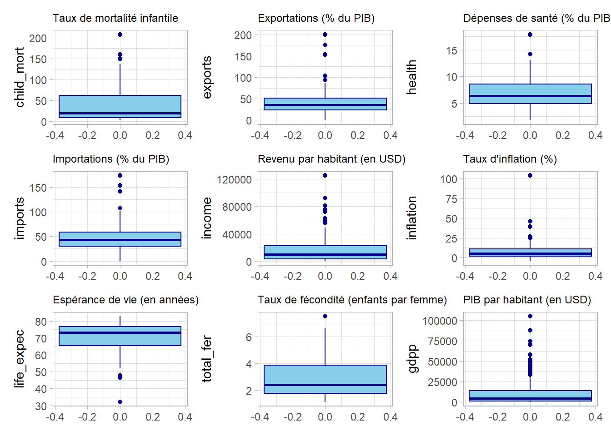{width=95% height=95%}
:::
:::


---

## Corrélogramme des variables

|       On calcule les corrélation de Pearson quand on suspecte des relations linéaires entre les variables, quand celles -ci sont sous forme d'échelle ou de ratio. Ici en plus de ploter le `heatmap` des variables, nous afficherons celles qui sont significativement corrélées (`Test de corrélation de Pearson` ***cf. Annexe 1***)


::: {.cell}

```{.r .cell-code  code-fold="true"}
# calcul de la matrice de corrélations de pearson
cor_matrix <- cor(df[, -1], method = "pearson")

# fonction pour extraire les p-values
get_pval <- function(x, y) {
  res <- suppressWarnings(cor.test(x, y, method = "pearson"))
  return(res$p.value)
}

# matrice des p-values
n <- ncol(df[, -1])
pval_matrix <- matrix(NA, nrow = n, ncol = n)
rownames(pval_matrix) <- colnames(df[, -1])
colnames(pval_matrix) <- colnames(df[, -1])
for (i in 1:n) {
  for (j in 1:n) {
    pval_matrix[i, j] <- get_pval(df[, -1][[i]], df[, -1][[j]])
  }
}

get_signif_stars <- function(p) {
  if (p < 0.01) {
    return("***")
  } else if (p < 0.05) {
    return("**")
  } else if (p < 0.1) {
    return("*")
  } else {
    return("")
  }
}

# Création de la matrice des annotations
number_labels <- matrix("", nrow = n, ncol = n)
for (i in 1:n) {
  for (j in 1:n) {
    rho <- cor_matrix[i, j]
    p <- pval_matrix[i, j]
    stars <- get_signif_stars(p)
    number_labels[i, j] <- paste0(sprintf("%.2f", rho), stars)
  }
}
rownames(number_labels) <- rownames(cor_matrix)
colnames(number_labels) <- colnames(cor_matrix)


# heatmat sans clustering (car par defaut la fonction essaie de faire une CAH)
plt <- pheatmap(
  cor_matrix,
  cluster_rows = FALSE,
  cluster_cols = FALSE,
  color = colorRampPalette(c("blue", "white", "red"))(50),
  display_numbers = number_labels,
  number_format = "",
  fontsize_number = 8,
  main = "Heatmap de la corrélation de Person",
  angle_col = 90 
)
plt
```

::: {.cell-output-display}
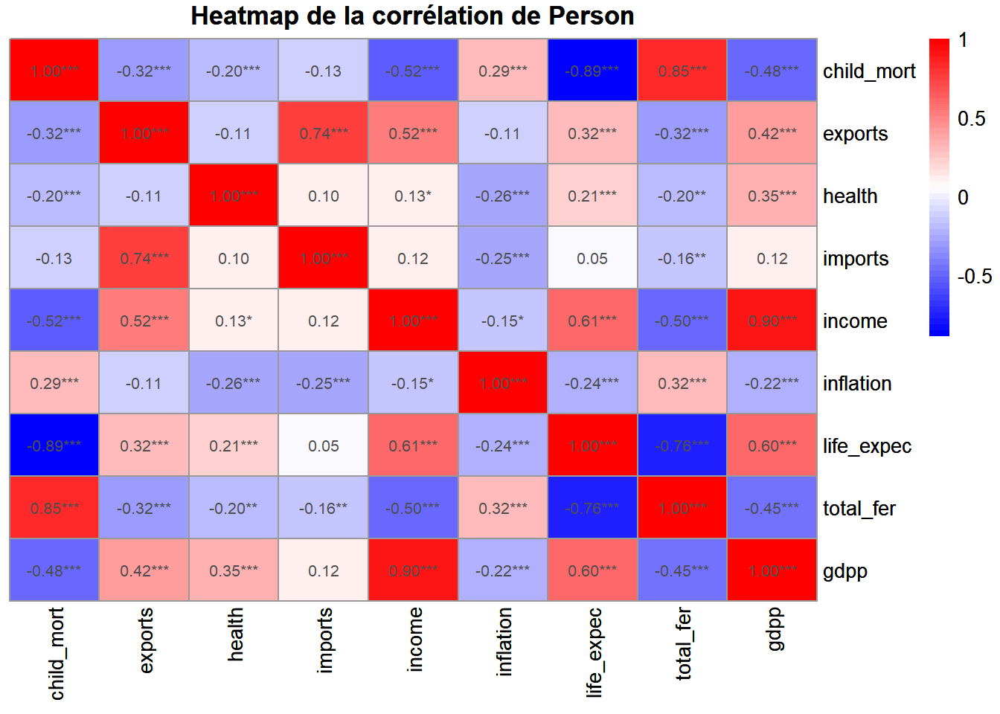{width=672}
:::
:::


**Interpretation** :

Comme on peut le constater, plusieurs variables présentent des corrélations significatives entre elles. Cela est mis en évidence par les étoiles indiquant le niveau de signification statistique : `***` pour une signification au seuil de `1 %`, `**` pour `5 %`, et `*` pour `10 %`. La coloration des cellules — plus elles sont proches du rouge ou du bleu foncé, plus la corrélation est forte (positive ou négative) — renforce cette lecture. Par exemple le **taux de mortalité infantile** est négativement corrélé à l'**expérance de vie** (`-0,89 ***`). Un taux de mortalité infantile élevé signifie que de nombreux décès surviennent très tôt dans la vie. Comme l'espérance de vie est une **moyenne pondérée** des âges au décès, la présence de nombreux décès précoces fait chuter la moyenne, d'où la corrélation négative. Par contre le **taux de mortalité infantile** est positivement corrélé à le **taux de fécondité** (`0,85 ***`). Cela peut s'expliquer par le fait que, dans les pays où le taux de fécondité est élevé, le nombre total de naissances est plus important. Dès lors, si les conditions sanitaires restent précaires, cela augmente mécaniquement le nombre d'enfants susceptibles de décéder en bas âge. Ce phénomène s'apparente à un processus binomial, où chaque naissance représente une "épreuve" avec une certaine probabilité de décès. Plus il y a d'épreuves, plus la fréquence des décès peut être élevée, ce qui se traduit par un taux de mortalité infantile plus important.

Ces interdépendances marquées entre les variables justifient le recours à une analyse en composantes principales (`ACP`), qui permettra de résumer l'information contenue dans ces variables corrélées tout en réduisant la dimensionnalité du jeu de données.

---

## Mise en oeuvre de l'`ACP`

|       Plusieurs packages sur `R` permettre de mettre en oeuvre l'analyse en composantes principales. Nous utiliserons les packages `FactoMineR` et `factoextra`. Très souvent, on **standardise** les données avant de réaliser une analyse en composantes principales. Cette étape permet de ramener toutes les variables à une **échelle comparable**, en neutralisant les différences d’unités ou d’amplitudes. Ainsi, chaque variable contribue équitablement à la construction des composantes principales, sans que celles ayant une grande variance ne dominent l’analyse.


::: {.cell}

```{.r .cell-code}
df_acp <- df[, -1]
rownames(df_acp) <- df[,1]
acp_model <- PCA(df_acp, scale.unit = TRUE, graph = FALSE)
```
:::


- **Les infos du modèle**


::: {.cell}

```{.r .cell-code}
names(acp_model)
```

::: {.cell-output .cell-output-stdout}

```
[1] "eig"  "var"  "ind"  "svd"  "call"
```


:::
:::


- `eig` : Valeurs propres associées aux composantes principales. Elles indiquent la variance expliquée par chaque axe.

- `var` : Informations sur les variables actives (`coordonnées`, `contributions`, `qualités de représentation` (cos2)).

- `ind` : Informations sur les individus (lignes) : `coordonnées` dans l’espace factoriel, `contributions`, `cos2`.

- `svd` : Résultats de la décomposition en valeurs singulières (utile si vous voulez aller dans le détail mathématique).

- `call` : L’appel de la fonction (`PCA(...)`), utile pour garder la trace de tes paramètres d’appel.

Mais nous allons nous concentrés que sur `eig`, `var` et `ind`.

>>> Valeurs proppres : Choix des dimensions d'analyse


::: {.cell}

```{.r .cell-code  code-fold="true"}
fviz_eig(acp_model, geom = 'line') +
  labs(title = "Pourcentages des variances expliquées par les composantes principales",
       y = "Pourcentage d'inertie", x = "Composantes principales")
```

::: {.cell-output-display}
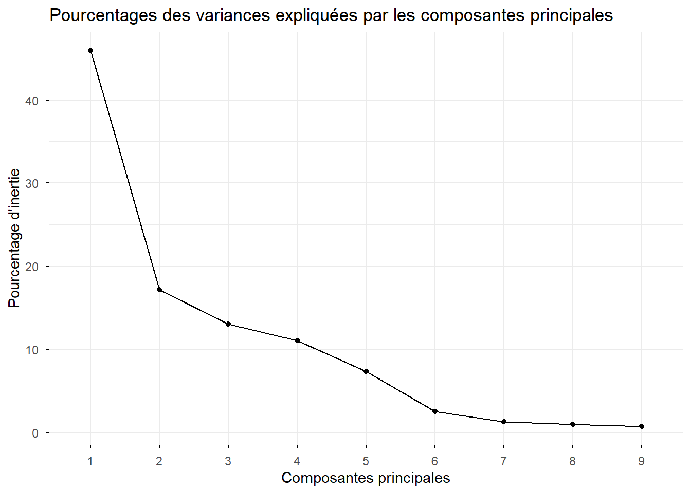{width=672}
:::
:::


|       Le `screeplot` (ou graphique des éboulis) met en évidence une chute marquée des valeurs propres entre la première et la deuxième dimension. Un léger coude apparaît ensuite entre la deuxième et la troisième composante. Au-delà, la décroissance devient plus faible et progressive, avec un second coude observable autour de la sixième dimension.

Pour déterminer le nombre optimal d’axes à retenir, nous nous appuierons sur deux critères complémentaires :

- Le `critère de Kaiser`, qui recommande de ne retenir que les composantes dont la valeur propre est supérieure à 1.

- Le `critère du taux d’inertie`, qui suggère de conserver le nombre de dimensions nécessaires pour expliquer un seuil acceptable de la variance totale, souvent fixé à 70 % ou 80 % selon le contexte.


::: {.cell}

```{.r .cell-code  code-fold="true"}
fviz_eig(acp_model, choice = "eigenvalue" , geom = 'bar')+
  geom_hline(yintercept = 1, linetype = 2, color = "red") +
  labs(title = "Valeurs propres des composantes principales",
       y = "Valeur propre", x = "Composantes principales")
```

::: {.cell-output .cell-output-stderr}

```
Warning in geom_bar(stat = "identity", fill = barfill, color = barcolor, :
Ignoring empty aesthetic: `width`.
```


:::

::: {.cell-output-display}
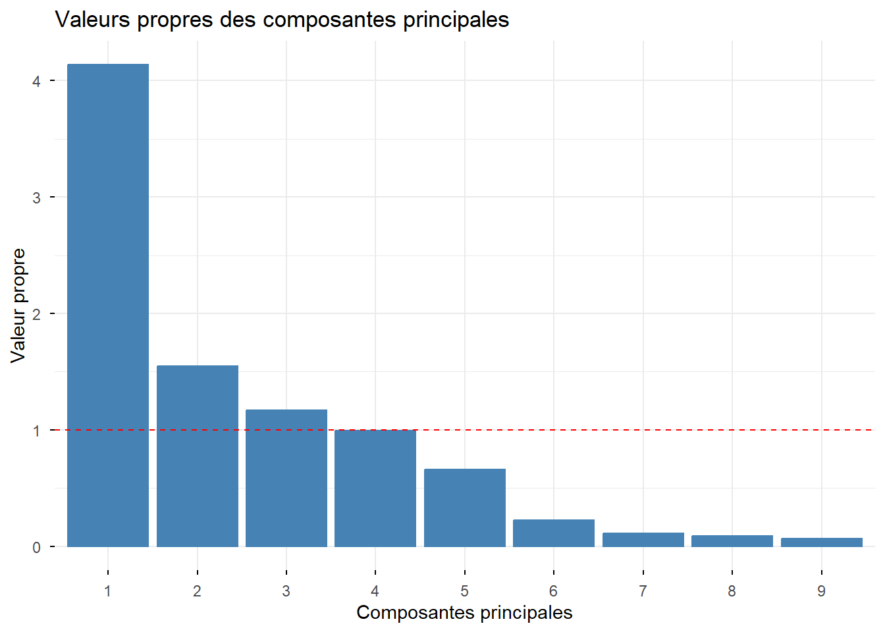{width=672}
:::
:::


En se basant donc sur ces deux critère nous pouvons sélectionner les trois premières dimensions.

>>> Analyses des variables


::: {.cell layout-ncol="2"}

```{.r .cell-code  code-fold="true"}
fviz_pca_var(acp_model, col.var = "cos2", 
             gradient.cols = c("#00AFBB", "#E7B800", "#FC4E07"))+
  labs(title = "Cercle de corrélation des variables",
       y = "Dimension 2", x = "Dimension 1") + 
  theme_light()
```

::: {.cell-output .cell-output-stderr}

```
Warning: Using `size` aesthetic for lines was deprecated in ggplot2 3.4.0.
ℹ Please use `linewidth` instead.
ℹ The deprecated feature was likely used in the ggpubr package.
  Please report the issue at <https://github.com/kassambara/ggpubr/issues>.
```


:::

::: {.cell-output .cell-output-stderr}

```
Warning: `aes_string()` was deprecated in ggplot2 3.0.0.
ℹ Please use tidy evaluation idioms with `aes()`.
ℹ See also `vignette("ggplot2-in-packages")` for more information.
ℹ The deprecated feature was likely used in the factoextra package.
  Please report the issue at <https://github.com/kassambara/factoextra/issues>.
```


:::

```{.r .cell-code  code-fold="true"}
fviz_pca_var(acp_model, axes = c(1, 3), col.var = "cos2", 
             gradient.cols = c("#00AFBB", "#E7B800", "#FC4E07"))+
  labs(title = "Cercle de corrélation des variables",
       y = "Dimension 3", x = "Dimension 1") + 
  theme_light()


fviz_pca_var(acp_model, axes = c(2, 3), col.var = "cos2", 
             gradient.cols = c("#00AFBB", "#E7B800", "#FC4E07"))+
  labs(title = "Cercle de corrélation des variables",
       y = "Dimension 3", x = "Dimension 2") + 
  theme_light()
```

::: {.cell-output-display}
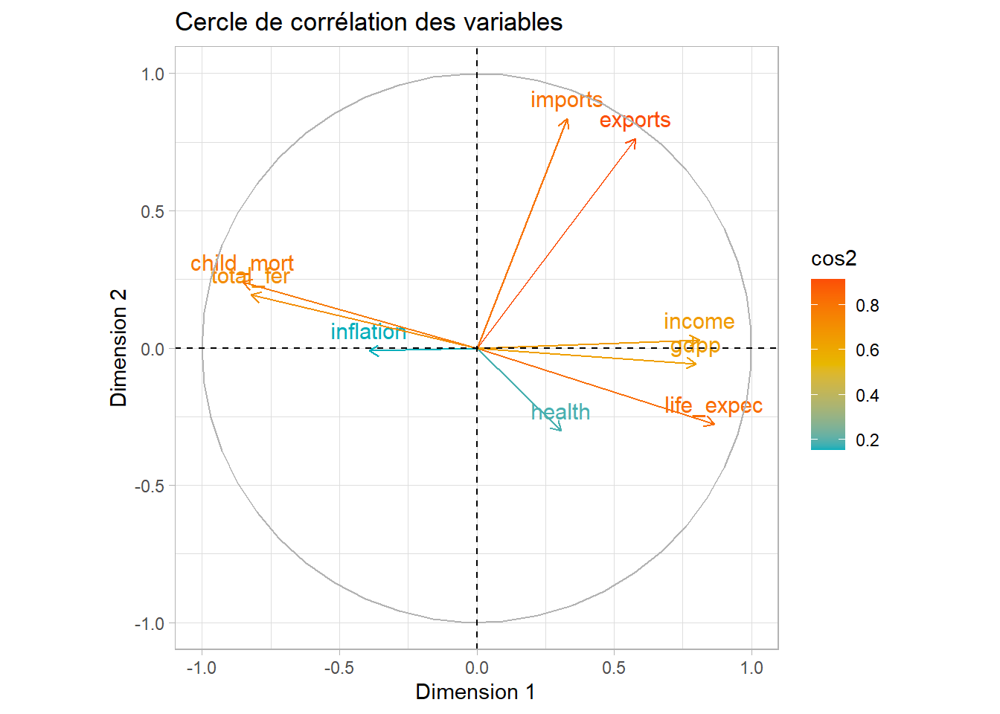{width=672}
:::

::: {.cell-output-display}
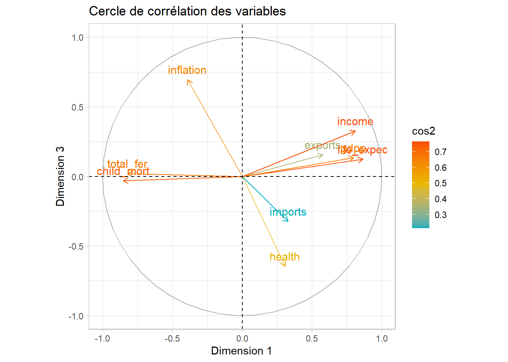{width=672}
:::

::: {.cell-output-display}
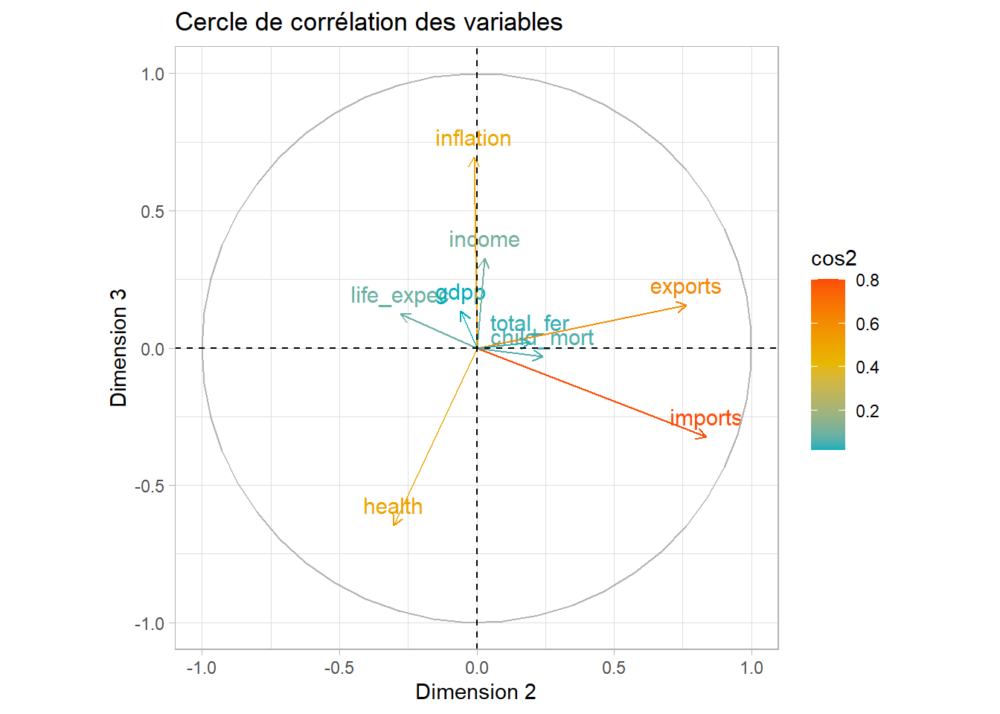{width=672}
:::

Cartes de la representation des variables sur les dimensions
:::


- **Graphique a)**

on observe que les variables `health` et `inflation` sont peu bien représentées sur le plan factoriel (valeurs de cos² faibles). À l’inverse, la variable `exports` est celle qui est la mieux projetée sur ce plan.

  - Les variables `imports` et `exports` sont davantage alignées avec la **dimension 2**, ce qui suggère que cet axe reflète essentiellement les **activités économiques extérieures** (importations et exportations). Nous pourrions ainsi interpréter **l’Axe 2** comme celui de l’**ouverture commerciale**.

  - Concernant **l’Axe 1**, il oppose le ***taux de fécondité*** et le **taux de mortalité infantile** (positivement corrélés entre eux) à l’**espérance de vie**, la **croissance du `PIB` par tête**, et aux **revenus moyens par habitant**. On peut donc interpréter cet axe comme celui du **niveau de développement socio-économique**.

  - En résumé :
    - **Axe 1** : Niveau de développement (fécondité + mortalité infantile ↔ espérance de vie, revenus, PIB)
    - **Axe 2** : Activités d’importation et d’exportation
    
- **Graphique b)**

Sur ce plan (Axe 1-3), les **importations** ne sont pas bien représentées, ce qui signifie qu’elles ont une faible contribution à la projection dans cet espace factoriel.

- La **dimension 1**, comme précédemment, semble caractériser un **niveau de développement socio-économique**, opposant les pays à forte mortalité infantile et fécondité élevée à ceux présentant une espérance de vie plus longue, un revenu moyen plus élevé, les exportations et un `PIB` par tête plus important.

- Quant à **l’Axe 3**, il oppose principalement l’**inflation** aux **dépenses de santé**. Ces deux variables apparaissent en opposition sur cet axe, suggérant que dans les pays où l’inflation est forte, la part des dépenses de santé dans le `PIB` tend à être plus faible, et inversement.

- En résumé :
  - **Axe 1** : Niveau de développement socio-économique
  - **Axe 3** : Opposition entre **taux d’inflation** et **dépenses de santé**
  
  
- **Graphique b)**

|       Toutes les variables en bleues sont mal représentées. On voit encore une oppostion entre le **taux d’inflation** et les **dépenses de santé** sur l'axe 3. Quant à l'axe 2, il décrit les activités d’importation et d’exportation.


::: {#wolframalfa .callout-important} 
# Interpretation des variables

On pouvait choisir d'afficher le cercle de corrélation des variables avec leur contribution respective en lieu et place de leur qualité de représentation. Le plus souvent les variables qui sont bien représentées sont celles qui contribuent le plus à la formation des axes factorielles. On peut également combiner ces deux critères.

On interprête que les variables qui ont une bonne contribution (critère : souvent supérieure à la contribution moyenne sur les axes choisis) ou une bonne qualité de représentations (cos2 > 0,6, mais souvent subjectif).
:::


>>> Analyses des individus


::: {.cell layout-ncol="2"}

```{.r .cell-code  code-fold="true"}
fviz_pca_ind(acp_model, 
             col.ind = "cos2",                # coloration des individus selon qualité dereprésentation
             gradient.cols = c("#00AFBB", "#E7B800", "#FC4E07"), 
             geom = c("point", "text_repel")) +   # points + labels repel
  labs(title = "Projection des individus (Dim 1 et 2)",
       x = "Dimension 1", y = "Dimension 2") +
  theme_light()

fviz_pca_ind(acp_model, axes = c(1, 3),
             col.ind = "cos2",
             gradient.cols = c("#00AFBB", "#E7B800", "#FC4E07"),
             geom = c("point", "text_repel")) +
  labs(title = "Projection des individus (Dim 1 et 3)",
       x = "Dimension 1", y = "Dimension 3") +
  theme_light()

fviz_pca_ind(acp_model, axes = c(2, 3),
             col.ind = "cos2",
             gradient.cols = c("#00AFBB", "#E7B800", "#FC4E07"),
             geom = c("point", "text_repel")) +
  labs(title = "Projection des individus (Dim 2 et 3)",
       x = "Dimension 2", y = "Dimension 3") +
  theme_light()
```

::: {.cell-output-display}
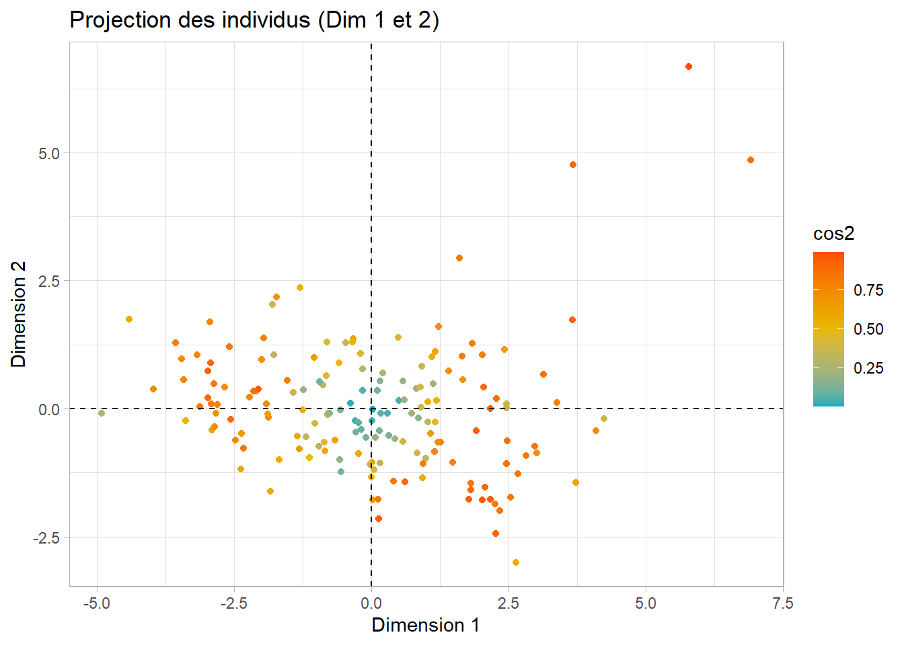{width=672}
:::

::: {.cell-output-display}
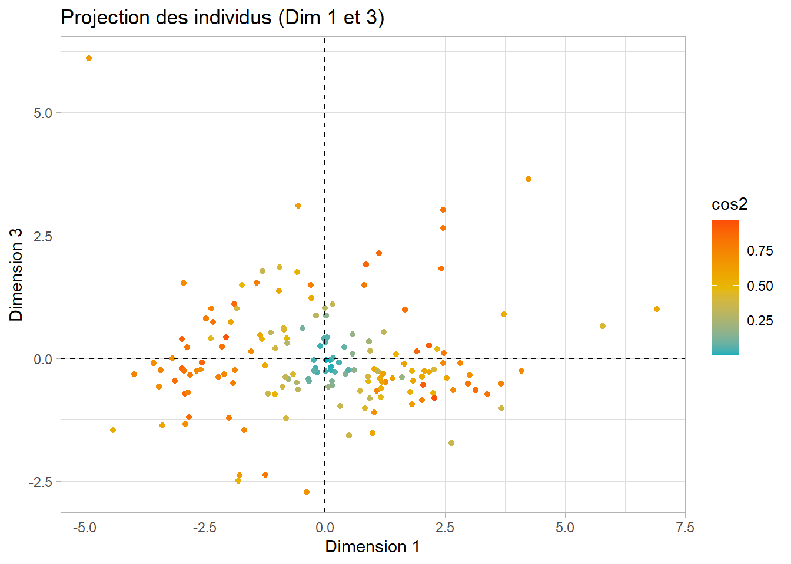{width=672}
:::

::: {.cell-output-display}
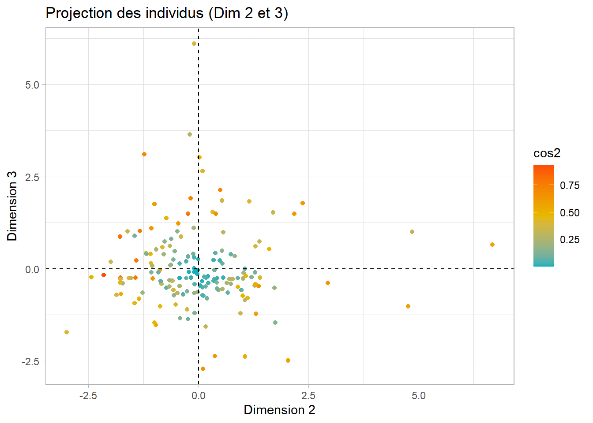{width=672}
:::

Cartes de la representation des variables sur les dimension
:::


Le principe d'analyse ne change pas. Les individus en bleu ciel sont mal représentés. On voit des points atypiques qui se démarquent. Ceux-ci contribuent fortement à la formation des axes aux quels ils sont proches.


::: {.cell}

```{.r .cell-code  code-fold="true"}
fviz_pca_ind(acp_model, 
             col.ind = "contrib",                # coloration des individus selon qualité dereprésentation
             gradient.cols = c("#00AFBB", "#E7B800", "#FC4E07")) +   # points + labels repel
  labs(title = "Projection des individus (Dim 1 et 2)",
       x = "Dimension 1", y = "Dimension 2") +
  theme_light()
```

::: {.cell-output-display}
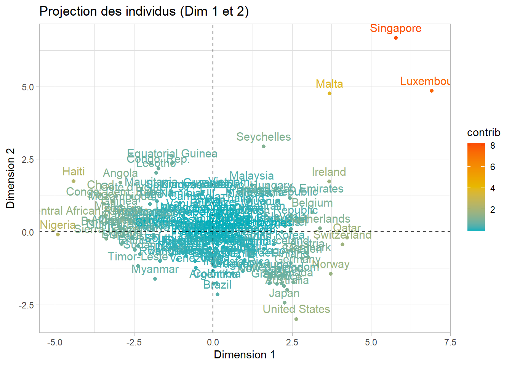{width=672}
:::
:::

Ils s'agit de `Singapore`, du `luxembourg` et éventuellemet de `Malta`. Qu'on les retire ou pas cela n'aurait pas changé quelle que chose, car les variables qu'on a ont probablement toutes des dénominateurs communs en fonction de leurs définitions (la taille de la population pour les variables par hahbitants etc.).


::: {.cell}

```{.r .cell-code}
contrib_ind_dim_1_2 <- as.data.frame(acp_model$ind$contrib[, 1:2]) %>% 
  filter(rownames(as.data.frame(acp_model$ind$contrib[, 1:2])) %in% c("Singapore", "Luxembourg", "Malta"))
knitr::kable(contrib_ind_dim_1_2, format = "html")
```

::: {.cell-output-display}
`````{=html}
<table>
 <thead>
  <tr>
   <th style="text-align:left;">   </th>
   <th style="text-align:right;"> Dim.1 </th>
   <th style="text-align:right;"> Dim.2 </th>
  </tr>
 </thead>
<tbody>
  <tr>
   <td style="text-align:left;"> Luxembourg </td>
   <td style="text-align:right;"> 6.928982 </td>
   <td style="text-align:right;"> 9.108194 </td>
  </tr>
  <tr>
   <td style="text-align:left;"> Malta </td>
   <td style="text-align:right;"> 1.960319 </td>
   <td style="text-align:right;"> 8.794095 </td>
  </tr>
  <tr>
   <td style="text-align:left;"> Singapore </td>
   <td style="text-align:right;"> 4.842860 </td>
   <td style="text-align:right;"> 17.290257 </td>
  </tr>
</tbody>
</table>

`````
:::
:::


Pour les autres plans, le processus est pareil.

---

## Clustering des pays à l'aide des K-means

|       Ici on applique directement les kmeans aux coordonnées factorielles issues de l'`ACP`. Et on avait décider de travailler que sur les trois premières dimensions. Ceci est une illustration de la réduction de dimentionalités avant de passer à l'application d'une méthode qui servira à résoudre un problème de classifications.

Etant donné qu'on veut choisir le nombre de cluster qui non seulement minimise l'inertie intra-classe (donc maximise l'inertie inter-classe), mais à partir du quel son incrémentation ne change presque plus ou de peu l'inertie intra-classe. En d'autres termes ou on n'a plus de chute brutale. `Chute` car plus le nombre `clusters` augmente, plus l'inertie-intra classe diminue.


::: {.cell}

```{.r .cell-code  code-fold="true"}
set.seed(123) # fixe la graine générative

dataTocluster <- scale(acp_model$ind$coord[,1:3]) # selection des coordonnées factorielles sur les 3 premiers axes

resKmeans <- list() # pour stocker les résultats de l'algorithme
CPtheta <- rep(0, 8) # pour stocker les inerties intra-classes (8 classes choisies de manière subjective)
for (K in 1:8){
  resKmeans[[K]] <- kmeans(dataTocluster, K, nstart = 50)
  CPtheta[K] <- resKmeans[[K]]$tot.withinss
}
```
:::


::: {.cell}

```{.r .cell-code  code-fold="true"}
df_ev_inertie <- data.frame(
  InertieIntraclasse = CPtheta,
  NombreClusters = 1:8
)

ggplot(df_ev_inertie, aes(x = NombreClusters, y = InertieIntraclasse)) +
  geom_line() +
  geom_point(shape = 21, fill = "white", color = "black", size = 3) +
  labs(
    x = "Nombre de clusters",
    y = "Inertie intra-classe"
  ) + theme_light()
```

::: {.cell-output-display}
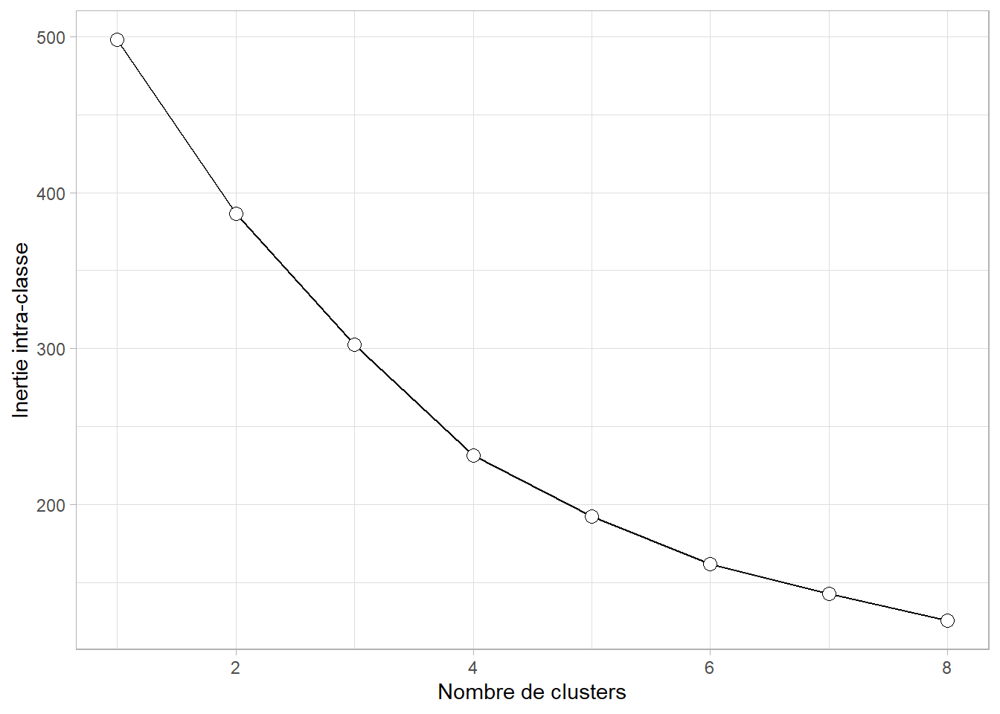{width=672}
:::
:::


D'après le critère du coude, $K=4$ (éventuellement $k=5$) est un choix pertinent. Affichons ainsi un descriptif des résultats du **k-means**.


::: {.cell}

```{.r .cell-code  code-fold="true"}
classif_4 <- resKmeans[[4]]
str(classif_4)
```

::: {.cell-output .cell-output-stdout}

```
List of 9
 $ cluster     : Named int [1:167] 2 4 3 3 4 3 4 4 4 3 ...
  ..- attr(*, "names")= chr [1:167] "Afghanistan" "Albania" "Algeria" "Angola" ...
 $ centers     : num [1:4, 1:3] 2.204 -0.907 -0.236 0.66 3.856 ...
  ..- attr(*, "dimnames")=List of 2
  .. ..$ : chr [1:4] "1" "2" "3" "4"
  .. ..$ : chr [1:3] "Dim.1" "Dim.2" "Dim.3"
 $ totss       : num 498
 $ withinss    : num [1:4] 10.7 54.5 91.6 74.6
 $ tot.withinss: num 231
 $ betweenss   : num 267
 $ size        : int [1:4] 4 52 39 72
 $ iter        : int 3
 $ ifault      : int 0
 - attr(*, "class")= chr "kmeans"
```


:::
:::

Ces chiffres signifient que :

- La `variance totale` des données est de `498`.
- La `variance intra-classe totale` est de `231`, ce qui mesure la compacité des clusters.
- La `variance inter-classe est de 267`, indiquant la séparation entre les groupes.
- Environ `54 %` de la variance totale est expliquée par la partition.
- Les `tailles des clusters` sont inégales, allant de 4 à 72 individus.
- L’algorithme a `convergé` rapidement en `3 itérations`.


La partition en 4 clusters présenterait donc un bon équilibre entre homogénéité interne et séparation externe.


::: {.cell}

```{.r .cell-code  code-fold="true"}
classif_5 <- resKmeans[[5]]
str(classif_5)
```

::: {.cell-output .cell-output-stdout}

```
List of 9
 $ cluster     : Named int [1:167] 5 3 1 1 4 3 3 3 3 1 ...
  ..- attr(*, "names")= chr [1:167] "Afghanistan" "Albania" "Algeria" "Angola" ...
 $ centers     : num [1:5, 1:3] -7.97e-05 2.68 7.00e-01 2.53e-01 -1.09 ...
  ..- attr(*, "dimnames")=List of 2
  .. ..$ : chr [1:5] "1" "2" "3" "4" ...
  .. ..$ : chr [1:3] "Dim.1" "Dim.2" "Dim.3"
 $ totss       : num 498
 $ withinss    : num [1:5] 54.3 4.79 36.17 53.68 43.34
 $ tot.withinss: num 192
 $ betweenss   : num 306
 $ size        : int [1:5] 20 3 45 51 48
 $ iter        : int 4
 $ ifault      : int 0
 - attr(*, "class")= chr "kmeans"
```


:::
:::

Ces chiffres signifient que :

- La `variance totale` des données est de `498`.
- La variance `intra-classe totale` est de `192`, indiquant la compacité des clusters.
- La `variance inter-classe` est de `306`, mesurant la séparation entre les groupes.
- Environ `61%` de la variance totale est expliquée par la partition, ce qui est une amélioration par rapport à `k=4`.
- Les tailles des clusters varient de 3 à 51 individus, indiquant une répartition inégale.
- L’algorithme a `convergé` en `4 itérations`.

|       La partition en 5 clusters améliore la séparation entre groupes et la compacité interne.  


::: {.cell}

```{.r .cell-code  code-fold="true"}
table(classif_5$cluster)
```

::: {.cell-output .cell-output-stdout}

```

 1  2  3  4  5 
20  3 45 51 48 
```


:::
:::


**On choisit $k=5$ en combinant critère du coude et variance expliquée.**

::: {#wolframalfa .callout-important} 
# Choix de k (nombre de clusters)

Le choix du k est un peu subjctif mais on a plusieurs règles permettant de le choisir. Il s'agit entre autre du critère du taux d'inertie, critère du coude etc. On aurait donc bien pu prendre k=4.
:::


>>> Représentations graphiques


::: {.cell}

```{.r .cell-code  code-fold="true"}
dataTocluster <- as.data.frame(dataTocluster)
dataTocluster <- dataTocluster %>% 
  mutate (classe = as.factor(classif_5$cluster))

ggplot(dataTocluster, aes (x = Dim.1, y = Dim.2, color = classe)) +
  geom_point() +
  geom_text_repel(aes(label = rownames(dataTocluster)), size = 3) + 
  labs(
    title = "Classification des pays (Axe 1 - Axe 3)",
    x = "Dimension 1",
    y = "Dimension 3",
    color = "Classe/Cluster"
  )+
  theme_light()
```

::: {.cell-output-display}
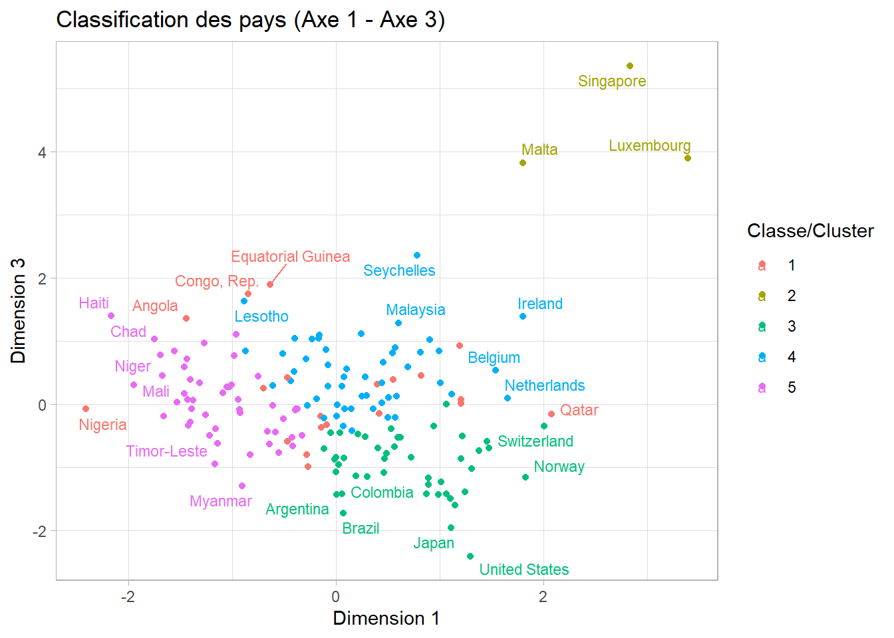{width=672}
:::
:::


|       Certains points sont non labellisés pour éviter que les noms des pays ne se chevauchent, ce qui pourrait nuire à la lisibilité du graphique. Vous trouverez en `annexe 4` les tables détaillant les différentes classes.

Sur le premier plan factoriel, on observe que **Singapour**, **Malte** et le **Luxembourg** appartiennent à la même classe. Cette proximité pourrait s'expliquer par plusieurs facteurs communs à ces pays (`cf. annexe 3`):

- **Espérance de vie élevée** : Ces pays affichent une espérance de vie parmi les plus hautes au monde, reflétant une qualité de vie et des systèmes de santé performants.

- **Faible taux de mortalité infantile** : Les taux de mortalité infantile y sont très bas, indiquant un accès généralisé aux soins prénatals et postnatals de qualité.

- **Revenu par habitant élevé** : Le `PIB` par habitant est significativement supérieur à la moyenne mondiale, traduisant une économie développée et stable.

- **Dépenses de santé élevées en pourcentage du PIB** : Ces pays investissent une part importante de leur `PIB` dans la santé, ce qui se traduit par des infrastructures médicales avancées et un personnel soignant bien formé.

- **Faible taux de fécondité** : Le taux de fécondité y est inférieur au seuil de renouvellement des générations, ce qui est caractéristique des pays développés avec un niveau d'éducation élevé et une urbanisation importante.

Ces similitudes dans les indicateurs socio-économiques et sanitaires justifient leur regroupement sur le plan factoriel de l'`ACP`.

***Vous pouvez analyser le graphique sur le plan*** ***1-3***.


::: {.cell}

```{.r .cell-code  code-fold="true"}
dataTocluster <- as.data.frame(dataTocluster)
dataTocluster <- dataTocluster %>% 
  mutate (classe = as.factor(classif_5$cluster))

ggplot(dataTocluster, aes(x = Dim.1, y = Dim.3, color = classe)) +
  geom_point() +
  geom_text_repel(aes(label = rownames(dataTocluster)), size = 3) +  # cex ≈ size = 3
  labs(
    title = "Classification des pays (Axe 1 - Axe 3)",
    x = "Dimension 1",
    y = "Dimension 3",
    color = "Classe/Cluster"
  ) +
  theme_light()
```

::: {.cell-output-display}
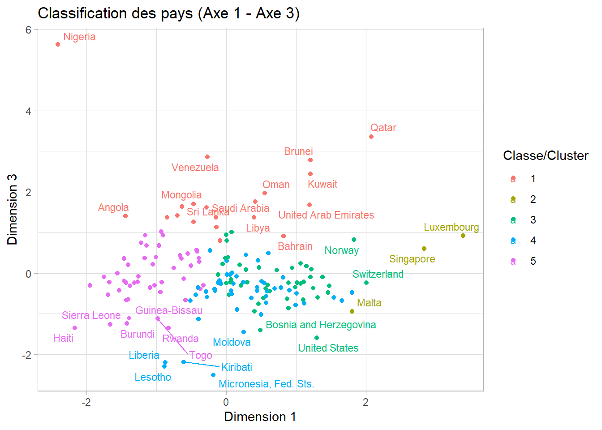{width=672}
:::
:::


--- 

# Annexes

## Annexe 1 : Test de corrélation de Pearson

Le **test de corrélation de Pearson** est utilisé pour évaluer la présence d’une relation linéaire significative entre deux variables quantitatives continues. Il est adapté lorsque les données suivent une distribution normale ou sont suffisamment symétriques.

### Objectif du test

Déterminer s’il existe une **corrélation linéaire significative** entre deux variables $X$ et $Y$.

### Paramètre testé

Le **coefficient de corrélation linéaire** $\rho$, mesurant l’intensité et le sens de la relation linéaire entre $X$ et $Y$ dans la population.

$$
\rho = \text{Corr}(X, Y)
$$

>> Hypothèses

- Hypothèse nulle $H_0$ :  
  $$
  \rho = 0
  $$
  (pas de corrélation linéaire entre $X$ et $Y$

- Hypothèse alternative $H_1$ :  
  $$
  \rho \ne 0
  $$
  (corrélation linéaire significative)

>> Statistique de test

À partir du coefficient de corrélation de l’échantillon $\rho$, la statistique de test est :

$$
t = \frac{\rho \sqrt{n - 2}}{\sqrt{1 - \rho^2}}
$$

>> Distribution de la statistique sous $H_0$

Sous $H_0$, la statistique suit une loi de Student à $n - 2$ degrés de liberté :

$$
t \sim \mathcal{T}(n - 2)
$$

>> **Règle de décision**

- Choisir un seuil de signification $\alpha$ (généralement $\alpha = 0{,}05$).
- Calculer la **valeur critique** ou la **p-value**.
- Rejeter $H_0$ si :

$$
|t| > t_{\alpha/2, n - 2}
$$

ou

$$
\text{p-value} < \alpha
$$

>> Région de rejet

Pour un test bilatéral :

$$
\mathcal{R} = \left\{ t : |t| > t_{\alpha/2, n - 2} \right\}
$$

>> Conditions d’application

- Les deux variables doivent être quantitatives continues.
- Relation supposée linéaire (à vérifier avec un nuage de points).
- Normalité des variables ou grande taille de l’échantillon.


## Annexe 2 : Algorithme des k-moyennes et détermination du nombre optimal de groupes

L’algorithme des **k-moyennes** (ou **nuées dynamiques**) est une méthode de classification non supervisée permettant de regrouper des individus en **k** groupes homogènes. Il repose sur la **minimisation de l’inertie intra-classe**, c’est-à-dire la somme des distances quadratiques entre chaque individu et le centre de son groupe.

L’algorithme fonctionne de la manière suivante :

1. Choisir le nombre de groupes $k$ à former (déterminé à l’avance).
2. Initialiser $k$ centres aléatoires.
3. Affecter chaque individu au centre le plus proche.
4. Recalculer les centres (barycentres) des groupes.
5. Répéter les étapes 3 et 4 jusqu’à stabilisation des centres.

>>> **Algorithme 1 : Algorithme de Lloyd**

**Données** : $x_1, \dots, x_n$

**Initialisation** : poser $m = 0$ et tirer au hasard $K$ points de $\mathbb{R}^p$ comme centres initiaux :
$$
\mu_1^{[m]}, \dots, \mu_K^{[m]}
$$

---

**Tant que la partition n’est pas stable** :

1. **Incrémentation du compteur** :
$$
m \leftarrow m + 1
$$

2. **Mise à jour de la partition à centres fixés** :

Affecter chaque individu à la classe dont le centre est le plus proche :
$$
P_k^{[m]} = \left\{ i : d_M(x_i, \mu_k^{[m-1]}) \leq d_M(x_i, \mu_{k'}^{[m-1]}) \ \forall k' = 1, \dots, K \right\}
$$

3. **Mise à jour des centres à partition fixée** :
$$
\mu_k^{[m]} = \frac{\sum_{i=1}^n z_{ik}^{[m]} x_i}{\sum_{i=1}^n z_{ik}^{[m]}}
$$

avec :
$$
z_{ik}^{[m]} =
\begin{cases}
1 & \text{si } i \in P_k^{[m]} \\
0 & \text{sinon}
\end{cases}
$$

---

**Résultat final** :

La partition :
$$
\mathcal{P}^{[m]} = \{P_1^{[m]}, \dots, P_K^{[m]}\}
$$

et les centres associés :
$$
\mu_1^{[m]}, \dots, \mu_K^{[m]}
$$

---

**Source** : *Cours Kmeans – ENSAI 1A, 2024-2025*  
**Enseignant** : *Javier GONZALEZ*

::: {.callout-note}
Ce processus converge généralement rapidement et il est très efficace, même sur de grands jeux de données.
:::

### Utilisation après `ACP`

L’algorithme des k-moyennes s’applique sur des variables **quantitatives**. On peut donc l’utiliser directement sur les **coordonnées factorielles** obtenues via une **Analyse en Composantes Principales (ACP)**.

Cela présente plusieurs avantages :

- Réduction de la dimension : seules les premières composantes (celles expliquant le plus de variance) sont conservées.
- Élimination de la redondance : les variables sont orthogonales.
- Meilleure visualisation des structures.

L’application des k-moyennes après `ACP` permet donc de classer les individus dans l’espace factoriel de manière plus claire et plus efficace.

### Détermination du nombre optimal de groupes $k$

Le choix de $k$ n’a pas besoin d’être exact à l’unité près car l’algorithme reste robuste. Toutefois, on peut s’aider d’un critère objectif : **la courbe des inerties intra-classes** en fonction de $k$.

La courbe présente souvent une **cassure** (méthode du **coude**), indiquant un bon compromis entre complexité du modèle et qualité du regroupement.

## Annexe 3 : Similitude de Singapore, Malta et Luxembourg


::: {.cell tbl-cap='Caractérisiques socio-économiques de Singapore, de Malta du Luxembourg'}
::: {.cell-output-display}
`````{=html}
<table>
 <thead>
  <tr>
   <th style="text-align:left;"> Country </th>
   <th style="text-align:right;"> child_mort </th>
   <th style="text-align:right;"> exports </th>
   <th style="text-align:right;"> health </th>
   <th style="text-align:right;"> imports </th>
   <th style="text-align:right;"> income </th>
   <th style="text-align:right;"> inflation </th>
   <th style="text-align:right;"> life_expec </th>
   <th style="text-align:right;"> total_fer </th>
   <th style="text-align:right;"> gdpp </th>
  </tr>
 </thead>
<tbody>
  <tr>
   <td style="text-align:left;"> Luxembourg </td>
   <td style="text-align:right;"> 2.8 </td>
   <td style="text-align:right;"> 175 </td>
   <td style="text-align:right;"> 7.77 </td>
   <td style="text-align:right;"> 142 </td>
   <td style="text-align:right;"> 91700 </td>
   <td style="text-align:right;"> 3.620 </td>
   <td style="text-align:right;"> 81.3 </td>
   <td style="text-align:right;"> 1.63 </td>
   <td style="text-align:right;"> 105000 </td>
  </tr>
  <tr>
   <td style="text-align:left;"> Malta </td>
   <td style="text-align:right;"> 6.8 </td>
   <td style="text-align:right;"> 153 </td>
   <td style="text-align:right;"> 8.65 </td>
   <td style="text-align:right;"> 154 </td>
   <td style="text-align:right;"> 28300 </td>
   <td style="text-align:right;"> 3.830 </td>
   <td style="text-align:right;"> 80.3 </td>
   <td style="text-align:right;"> 1.36 </td>
   <td style="text-align:right;"> 21100 </td>
  </tr>
  <tr>
   <td style="text-align:left;"> Singapore </td>
   <td style="text-align:right;"> 2.8 </td>
   <td style="text-align:right;"> 200 </td>
   <td style="text-align:right;"> 3.96 </td>
   <td style="text-align:right;"> 174 </td>
   <td style="text-align:right;"> 72100 </td>
   <td style="text-align:right;"> -0.046 </td>
   <td style="text-align:right;"> 82.7 </td>
   <td style="text-align:right;"> 1.15 </td>
   <td style="text-align:right;"> 46600 </td>
  </tr>
</tbody>
</table>

`````
:::
:::


On peut voir que les caractéristiques sont très proches mises à part quelques unes.

## Annexe 4 : Tables des clusters des pays du premier plan factoriel


::: {.cell}

:::


::: {.cell tbl-cap='Les pays du cluster 1'}
::: {.cell-output-display}
`````{=html}
<table>
 <thead>
  <tr>
   <th style="text-align:left;">   </th>
   <th style="text-align:left;"> classe </th>
   <th style="text-align:left;"> Pays du cluster </th>
  </tr>
 </thead>
<tbody>
  <tr>
   <td style="text-align:left;"> Algeria </td>
   <td style="text-align:left;"> 1 </td>
   <td style="text-align:left;"> Algeria </td>
  </tr>
  <tr>
   <td style="text-align:left;"> Angola </td>
   <td style="text-align:left;"> 1 </td>
   <td style="text-align:left;"> Angola </td>
  </tr>
  <tr>
   <td style="text-align:left;"> Azerbaijan </td>
   <td style="text-align:left;"> 1 </td>
   <td style="text-align:left;"> Azerbaijan </td>
  </tr>
  <tr>
   <td style="text-align:left;"> Bahrain </td>
   <td style="text-align:left;"> 1 </td>
   <td style="text-align:left;"> Bahrain </td>
  </tr>
  <tr>
   <td style="text-align:left;"> Brunei </td>
   <td style="text-align:left;"> 1 </td>
   <td style="text-align:left;"> Brunei </td>
  </tr>
  <tr>
   <td style="text-align:left;"> Congo, Rep. </td>
   <td style="text-align:left;"> 1 </td>
   <td style="text-align:left;"> Congo, Rep. </td>
  </tr>
  <tr>
   <td style="text-align:left;"> Equatorial Guinea </td>
   <td style="text-align:left;"> 1 </td>
   <td style="text-align:left;"> Equatorial Guinea </td>
  </tr>
  <tr>
   <td style="text-align:left;"> Gabon </td>
   <td style="text-align:left;"> 1 </td>
   <td style="text-align:left;"> Gabon </td>
  </tr>
  <tr>
   <td style="text-align:left;"> Indonesia </td>
   <td style="text-align:left;"> 1 </td>
   <td style="text-align:left;"> Indonesia </td>
  </tr>
  <tr>
   <td style="text-align:left;"> Kazakhstan </td>
   <td style="text-align:left;"> 1 </td>
   <td style="text-align:left;"> Kazakhstan </td>
  </tr>
  <tr>
   <td style="text-align:left;"> Kuwait </td>
   <td style="text-align:left;"> 1 </td>
   <td style="text-align:left;"> Kuwait </td>
  </tr>
  <tr>
   <td style="text-align:left;"> Libya </td>
   <td style="text-align:left;"> 1 </td>
   <td style="text-align:left;"> Libya </td>
  </tr>
  <tr>
   <td style="text-align:left;"> Mongolia </td>
   <td style="text-align:left;"> 1 </td>
   <td style="text-align:left;"> Mongolia </td>
  </tr>
  <tr>
   <td style="text-align:left;"> Nigeria </td>
   <td style="text-align:left;"> 1 </td>
   <td style="text-align:left;"> Nigeria </td>
  </tr>
  <tr>
   <td style="text-align:left;"> Oman </td>
   <td style="text-align:left;"> 1 </td>
   <td style="text-align:left;"> Oman </td>
  </tr>
  <tr>
   <td style="text-align:left;"> Qatar </td>
   <td style="text-align:left;"> 1 </td>
   <td style="text-align:left;"> Qatar </td>
  </tr>
  <tr>
   <td style="text-align:left;"> Saudi Arabia </td>
   <td style="text-align:left;"> 1 </td>
   <td style="text-align:left;"> Saudi Arabia </td>
  </tr>
  <tr>
   <td style="text-align:left;"> Sri Lanka </td>
   <td style="text-align:left;"> 1 </td>
   <td style="text-align:left;"> Sri Lanka </td>
  </tr>
  <tr>
   <td style="text-align:left;"> United Arab Emirates </td>
   <td style="text-align:left;"> 1 </td>
   <td style="text-align:left;"> United Arab Emirates </td>
  </tr>
  <tr>
   <td style="text-align:left;"> Venezuela </td>
   <td style="text-align:left;"> 1 </td>
   <td style="text-align:left;"> Venezuela </td>
  </tr>
</tbody>
</table>

`````
:::
:::


::: {.cell tbl-cap='Les pays du cluster 2'}
::: {.cell-output-display}
`````{=html}
<table>
 <thead>
  <tr>
   <th style="text-align:left;">   </th>
   <th style="text-align:left;"> classe </th>
   <th style="text-align:left;"> Pays du cluster </th>
  </tr>
 </thead>
<tbody>
  <tr>
   <td style="text-align:left;"> Luxembourg </td>
   <td style="text-align:left;"> 2 </td>
   <td style="text-align:left;"> Luxembourg </td>
  </tr>
  <tr>
   <td style="text-align:left;"> Malta </td>
   <td style="text-align:left;"> 2 </td>
   <td style="text-align:left;"> Malta </td>
  </tr>
  <tr>
   <td style="text-align:left;"> Singapore </td>
   <td style="text-align:left;"> 2 </td>
   <td style="text-align:left;"> Singapore </td>
  </tr>
</tbody>
</table>

`````
:::
:::


::: {.cell tbl-cap='Les pays du cluster 3'}
::: {.cell-output-display}
`````{=html}
<table>
 <thead>
  <tr>
   <th style="text-align:left;">   </th>
   <th style="text-align:left;"> classe </th>
   <th style="text-align:left;"> Pays du cluster </th>
  </tr>
 </thead>
<tbody>
  <tr>
   <td style="text-align:left;"> Albania </td>
   <td style="text-align:left;"> 3 </td>
   <td style="text-align:left;"> Albania </td>
  </tr>
  <tr>
   <td style="text-align:left;"> Argentina </td>
   <td style="text-align:left;"> 3 </td>
   <td style="text-align:left;"> Argentina </td>
  </tr>
  <tr>
   <td style="text-align:left;"> Armenia </td>
   <td style="text-align:left;"> 3 </td>
   <td style="text-align:left;"> Armenia </td>
  </tr>
  <tr>
   <td style="text-align:left;"> Australia </td>
   <td style="text-align:left;"> 3 </td>
   <td style="text-align:left;"> Australia </td>
  </tr>
  <tr>
   <td style="text-align:left;"> Austria </td>
   <td style="text-align:left;"> 3 </td>
   <td style="text-align:left;"> Austria </td>
  </tr>
  <tr>
   <td style="text-align:left;"> Bahamas </td>
   <td style="text-align:left;"> 3 </td>
   <td style="text-align:left;"> Bahamas </td>
  </tr>
  <tr>
   <td style="text-align:left;"> Barbados </td>
   <td style="text-align:left;"> 3 </td>
   <td style="text-align:left;"> Barbados </td>
  </tr>
  <tr>
   <td style="text-align:left;"> Bosnia and Herzegovina </td>
   <td style="text-align:left;"> 3 </td>
   <td style="text-align:left;"> Bosnia and Herzegovina </td>
  </tr>
  <tr>
   <td style="text-align:left;"> Brazil </td>
   <td style="text-align:left;"> 3 </td>
   <td style="text-align:left;"> Brazil </td>
  </tr>
  <tr>
   <td style="text-align:left;"> Canada </td>
   <td style="text-align:left;"> 3 </td>
   <td style="text-align:left;"> Canada </td>
  </tr>
  <tr>
   <td style="text-align:left;"> Chile </td>
   <td style="text-align:left;"> 3 </td>
   <td style="text-align:left;"> Chile </td>
  </tr>
  <tr>
   <td style="text-align:left;"> China </td>
   <td style="text-align:left;"> 3 </td>
   <td style="text-align:left;"> China </td>
  </tr>
  <tr>
   <td style="text-align:left;"> Colombia </td>
   <td style="text-align:left;"> 3 </td>
   <td style="text-align:left;"> Colombia </td>
  </tr>
  <tr>
   <td style="text-align:left;"> Costa Rica </td>
   <td style="text-align:left;"> 3 </td>
   <td style="text-align:left;"> Costa Rica </td>
  </tr>
  <tr>
   <td style="text-align:left;"> Croatia </td>
   <td style="text-align:left;"> 3 </td>
   <td style="text-align:left;"> Croatia </td>
  </tr>
  <tr>
   <td style="text-align:left;"> Cyprus </td>
   <td style="text-align:left;"> 3 </td>
   <td style="text-align:left;"> Cyprus </td>
  </tr>
  <tr>
   <td style="text-align:left;"> Denmark </td>
   <td style="text-align:left;"> 3 </td>
   <td style="text-align:left;"> Denmark </td>
  </tr>
  <tr>
   <td style="text-align:left;"> Dominican Republic </td>
   <td style="text-align:left;"> 3 </td>
   <td style="text-align:left;"> Dominican Republic </td>
  </tr>
  <tr>
   <td style="text-align:left;"> Ecuador </td>
   <td style="text-align:left;"> 3 </td>
   <td style="text-align:left;"> Ecuador </td>
  </tr>
  <tr>
   <td style="text-align:left;"> El Salvador </td>
   <td style="text-align:left;"> 3 </td>
   <td style="text-align:left;"> El Salvador </td>
  </tr>
  <tr>
   <td style="text-align:left;"> Finland </td>
   <td style="text-align:left;"> 3 </td>
   <td style="text-align:left;"> Finland </td>
  </tr>
  <tr>
   <td style="text-align:left;"> France </td>
   <td style="text-align:left;"> 3 </td>
   <td style="text-align:left;"> France </td>
  </tr>
  <tr>
   <td style="text-align:left;"> Germany </td>
   <td style="text-align:left;"> 3 </td>
   <td style="text-align:left;"> Germany </td>
  </tr>
  <tr>
   <td style="text-align:left;"> Greece </td>
   <td style="text-align:left;"> 3 </td>
   <td style="text-align:left;"> Greece </td>
  </tr>
  <tr>
   <td style="text-align:left;"> Iceland </td>
   <td style="text-align:left;"> 3 </td>
   <td style="text-align:left;"> Iceland </td>
  </tr>
  <tr>
   <td style="text-align:left;"> Iran </td>
   <td style="text-align:left;"> 3 </td>
   <td style="text-align:left;"> Iran </td>
  </tr>
  <tr>
   <td style="text-align:left;"> Israel </td>
   <td style="text-align:left;"> 3 </td>
   <td style="text-align:left;"> Israel </td>
  </tr>
  <tr>
   <td style="text-align:left;"> Italy </td>
   <td style="text-align:left;"> 3 </td>
   <td style="text-align:left;"> Italy </td>
  </tr>
  <tr>
   <td style="text-align:left;"> Japan </td>
   <td style="text-align:left;"> 3 </td>
   <td style="text-align:left;"> Japan </td>
  </tr>
  <tr>
   <td style="text-align:left;"> New Zealand </td>
   <td style="text-align:left;"> 3 </td>
   <td style="text-align:left;"> New Zealand </td>
  </tr>
  <tr>
   <td style="text-align:left;"> Norway </td>
   <td style="text-align:left;"> 3 </td>
   <td style="text-align:left;"> Norway </td>
  </tr>
  <tr>
   <td style="text-align:left;"> Peru </td>
   <td style="text-align:left;"> 3 </td>
   <td style="text-align:left;"> Peru </td>
  </tr>
  <tr>
   <td style="text-align:left;"> Poland </td>
   <td style="text-align:left;"> 3 </td>
   <td style="text-align:left;"> Poland </td>
  </tr>
  <tr>
   <td style="text-align:left;"> Portugal </td>
   <td style="text-align:left;"> 3 </td>
   <td style="text-align:left;"> Portugal </td>
  </tr>
  <tr>
   <td style="text-align:left;"> Romania </td>
   <td style="text-align:left;"> 3 </td>
   <td style="text-align:left;"> Romania </td>
  </tr>
  <tr>
   <td style="text-align:left;"> Russia </td>
   <td style="text-align:left;"> 3 </td>
   <td style="text-align:left;"> Russia </td>
  </tr>
  <tr>
   <td style="text-align:left;"> Serbia </td>
   <td style="text-align:left;"> 3 </td>
   <td style="text-align:left;"> Serbia </td>
  </tr>
  <tr>
   <td style="text-align:left;"> South Korea </td>
   <td style="text-align:left;"> 3 </td>
   <td style="text-align:left;"> South Korea </td>
  </tr>
  <tr>
   <td style="text-align:left;"> Spain </td>
   <td style="text-align:left;"> 3 </td>
   <td style="text-align:left;"> Spain </td>
  </tr>
  <tr>
   <td style="text-align:left;"> Sweden </td>
   <td style="text-align:left;"> 3 </td>
   <td style="text-align:left;"> Sweden </td>
  </tr>
  <tr>
   <td style="text-align:left;"> Switzerland </td>
   <td style="text-align:left;"> 3 </td>
   <td style="text-align:left;"> Switzerland </td>
  </tr>
  <tr>
   <td style="text-align:left;"> Turkey </td>
   <td style="text-align:left;"> 3 </td>
   <td style="text-align:left;"> Turkey </td>
  </tr>
  <tr>
   <td style="text-align:left;"> United Kingdom </td>
   <td style="text-align:left;"> 3 </td>
   <td style="text-align:left;"> United Kingdom </td>
  </tr>
  <tr>
   <td style="text-align:left;"> United States </td>
   <td style="text-align:left;"> 3 </td>
   <td style="text-align:left;"> United States </td>
  </tr>
  <tr>
   <td style="text-align:left;"> Uruguay </td>
   <td style="text-align:left;"> 3 </td>
   <td style="text-align:left;"> Uruguay </td>
  </tr>
</tbody>
</table>

`````
:::
:::


::: {.cell tbl-cap='Les pays du cluster 4'}
::: {.cell-output-display}
`````{=html}
<table>
 <thead>
  <tr>
   <th style="text-align:left;">   </th>
   <th style="text-align:left;"> classe </th>
   <th style="text-align:left;"> Pays du cluster </th>
  </tr>
 </thead>
<tbody>
  <tr>
   <td style="text-align:left;"> Antigua and Barbuda </td>
   <td style="text-align:left;"> 4 </td>
   <td style="text-align:left;"> Antigua and Barbuda </td>
  </tr>
  <tr>
   <td style="text-align:left;"> Belarus </td>
   <td style="text-align:left;"> 4 </td>
   <td style="text-align:left;"> Belarus </td>
  </tr>
  <tr>
   <td style="text-align:left;"> Belgium </td>
   <td style="text-align:left;"> 4 </td>
   <td style="text-align:left;"> Belgium </td>
  </tr>
  <tr>
   <td style="text-align:left;"> Belize </td>
   <td style="text-align:left;"> 4 </td>
   <td style="text-align:left;"> Belize </td>
  </tr>
  <tr>
   <td style="text-align:left;"> Bhutan </td>
   <td style="text-align:left;"> 4 </td>
   <td style="text-align:left;"> Bhutan </td>
  </tr>
  <tr>
   <td style="text-align:left;"> Botswana </td>
   <td style="text-align:left;"> 4 </td>
   <td style="text-align:left;"> Botswana </td>
  </tr>
  <tr>
   <td style="text-align:left;"> Bulgaria </td>
   <td style="text-align:left;"> 4 </td>
   <td style="text-align:left;"> Bulgaria </td>
  </tr>
  <tr>
   <td style="text-align:left;"> Cambodia </td>
   <td style="text-align:left;"> 4 </td>
   <td style="text-align:left;"> Cambodia </td>
  </tr>
  <tr>
   <td style="text-align:left;"> Cape Verde </td>
   <td style="text-align:left;"> 4 </td>
   <td style="text-align:left;"> Cape Verde </td>
  </tr>
  <tr>
   <td style="text-align:left;"> Czech Republic </td>
   <td style="text-align:left;"> 4 </td>
   <td style="text-align:left;"> Czech Republic </td>
  </tr>
  <tr>
   <td style="text-align:left;"> Estonia </td>
   <td style="text-align:left;"> 4 </td>
   <td style="text-align:left;"> Estonia </td>
  </tr>
  <tr>
   <td style="text-align:left;"> Fiji </td>
   <td style="text-align:left;"> 4 </td>
   <td style="text-align:left;"> Fiji </td>
  </tr>
  <tr>
   <td style="text-align:left;"> Georgia </td>
   <td style="text-align:left;"> 4 </td>
   <td style="text-align:left;"> Georgia </td>
  </tr>
  <tr>
   <td style="text-align:left;"> Grenada </td>
   <td style="text-align:left;"> 4 </td>
   <td style="text-align:left;"> Grenada </td>
  </tr>
  <tr>
   <td style="text-align:left;"> Guyana </td>
   <td style="text-align:left;"> 4 </td>
   <td style="text-align:left;"> Guyana </td>
  </tr>
  <tr>
   <td style="text-align:left;"> Hungary </td>
   <td style="text-align:left;"> 4 </td>
   <td style="text-align:left;"> Hungary </td>
  </tr>
  <tr>
   <td style="text-align:left;"> Ireland </td>
   <td style="text-align:left;"> 4 </td>
   <td style="text-align:left;"> Ireland </td>
  </tr>
  <tr>
   <td style="text-align:left;"> Jamaica </td>
   <td style="text-align:left;"> 4 </td>
   <td style="text-align:left;"> Jamaica </td>
  </tr>
  <tr>
   <td style="text-align:left;"> Jordan </td>
   <td style="text-align:left;"> 4 </td>
   <td style="text-align:left;"> Jordan </td>
  </tr>
  <tr>
   <td style="text-align:left;"> Kiribati </td>
   <td style="text-align:left;"> 4 </td>
   <td style="text-align:left;"> Kiribati </td>
  </tr>
  <tr>
   <td style="text-align:left;"> Kyrgyz Republic </td>
   <td style="text-align:left;"> 4 </td>
   <td style="text-align:left;"> Kyrgyz Republic </td>
  </tr>
  <tr>
   <td style="text-align:left;"> Latvia </td>
   <td style="text-align:left;"> 4 </td>
   <td style="text-align:left;"> Latvia </td>
  </tr>
  <tr>
   <td style="text-align:left;"> Lebanon </td>
   <td style="text-align:left;"> 4 </td>
   <td style="text-align:left;"> Lebanon </td>
  </tr>
  <tr>
   <td style="text-align:left;"> Lesotho </td>
   <td style="text-align:left;"> 4 </td>
   <td style="text-align:left;"> Lesotho </td>
  </tr>
  <tr>
   <td style="text-align:left;"> Liberia </td>
   <td style="text-align:left;"> 4 </td>
   <td style="text-align:left;"> Liberia </td>
  </tr>
  <tr>
   <td style="text-align:left;"> Lithuania </td>
   <td style="text-align:left;"> 4 </td>
   <td style="text-align:left;"> Lithuania </td>
  </tr>
  <tr>
   <td style="text-align:left;"> Macedonia, FYR </td>
   <td style="text-align:left;"> 4 </td>
   <td style="text-align:left;"> Macedonia, FYR </td>
  </tr>
  <tr>
   <td style="text-align:left;"> Malaysia </td>
   <td style="text-align:left;"> 4 </td>
   <td style="text-align:left;"> Malaysia </td>
  </tr>
  <tr>
   <td style="text-align:left;"> Maldives </td>
   <td style="text-align:left;"> 4 </td>
   <td style="text-align:left;"> Maldives </td>
  </tr>
  <tr>
   <td style="text-align:left;"> Mauritius </td>
   <td style="text-align:left;"> 4 </td>
   <td style="text-align:left;"> Mauritius </td>
  </tr>
  <tr>
   <td style="text-align:left;"> Micronesia, Fed. Sts. </td>
   <td style="text-align:left;"> 4 </td>
   <td style="text-align:left;"> Micronesia, Fed. Sts. </td>
  </tr>
  <tr>
   <td style="text-align:left;"> Moldova </td>
   <td style="text-align:left;"> 4 </td>
   <td style="text-align:left;"> Moldova </td>
  </tr>
  <tr>
   <td style="text-align:left;"> Montenegro </td>
   <td style="text-align:left;"> 4 </td>
   <td style="text-align:left;"> Montenegro </td>
  </tr>
  <tr>
   <td style="text-align:left;"> Morocco </td>
   <td style="text-align:left;"> 4 </td>
   <td style="text-align:left;"> Morocco </td>
  </tr>
  <tr>
   <td style="text-align:left;"> Namibia </td>
   <td style="text-align:left;"> 4 </td>
   <td style="text-align:left;"> Namibia </td>
  </tr>
  <tr>
   <td style="text-align:left;"> Netherlands </td>
   <td style="text-align:left;"> 4 </td>
   <td style="text-align:left;"> Netherlands </td>
  </tr>
  <tr>
   <td style="text-align:left;"> Panama </td>
   <td style="text-align:left;"> 4 </td>
   <td style="text-align:left;"> Panama </td>
  </tr>
  <tr>
   <td style="text-align:left;"> Paraguay </td>
   <td style="text-align:left;"> 4 </td>
   <td style="text-align:left;"> Paraguay </td>
  </tr>
  <tr>
   <td style="text-align:left;"> Samoa </td>
   <td style="text-align:left;"> 4 </td>
   <td style="text-align:left;"> Samoa </td>
  </tr>
  <tr>
   <td style="text-align:left;"> Seychelles </td>
   <td style="text-align:left;"> 4 </td>
   <td style="text-align:left;"> Seychelles </td>
  </tr>
  <tr>
   <td style="text-align:left;"> Slovak Republic </td>
   <td style="text-align:left;"> 4 </td>
   <td style="text-align:left;"> Slovak Republic </td>
  </tr>
  <tr>
   <td style="text-align:left;"> Slovenia </td>
   <td style="text-align:left;"> 4 </td>
   <td style="text-align:left;"> Slovenia </td>
  </tr>
  <tr>
   <td style="text-align:left;"> Solomon Islands </td>
   <td style="text-align:left;"> 4 </td>
   <td style="text-align:left;"> Solomon Islands </td>
  </tr>
  <tr>
   <td style="text-align:left;"> St. Vincent and the Grenadines </td>
   <td style="text-align:left;"> 4 </td>
   <td style="text-align:left;"> St. Vincent and the Grenadines </td>
  </tr>
  <tr>
   <td style="text-align:left;"> Suriname </td>
   <td style="text-align:left;"> 4 </td>
   <td style="text-align:left;"> Suriname </td>
  </tr>
  <tr>
   <td style="text-align:left;"> Thailand </td>
   <td style="text-align:left;"> 4 </td>
   <td style="text-align:left;"> Thailand </td>
  </tr>
  <tr>
   <td style="text-align:left;"> Tunisia </td>
   <td style="text-align:left;"> 4 </td>
   <td style="text-align:left;"> Tunisia </td>
  </tr>
  <tr>
   <td style="text-align:left;"> Turkmenistan </td>
   <td style="text-align:left;"> 4 </td>
   <td style="text-align:left;"> Turkmenistan </td>
  </tr>
  <tr>
   <td style="text-align:left;"> Ukraine </td>
   <td style="text-align:left;"> 4 </td>
   <td style="text-align:left;"> Ukraine </td>
  </tr>
  <tr>
   <td style="text-align:left;"> Vanuatu </td>
   <td style="text-align:left;"> 4 </td>
   <td style="text-align:left;"> Vanuatu </td>
  </tr>
  <tr>
   <td style="text-align:left;"> Vietnam </td>
   <td style="text-align:left;"> 4 </td>
   <td style="text-align:left;"> Vietnam </td>
  </tr>
</tbody>
</table>

`````
:::
:::


::: {.cell tbl-cap='Les pays du cluster 5'}
::: {.cell-output-display}
`````{=html}
<table>
 <thead>
  <tr>
   <th style="text-align:left;">   </th>
   <th style="text-align:left;"> classe </th>
   <th style="text-align:left;"> Pays du cluster </th>
  </tr>
 </thead>
<tbody>
  <tr>
   <td style="text-align:left;"> Afghanistan </td>
   <td style="text-align:left;"> 5 </td>
   <td style="text-align:left;"> Afghanistan </td>
  </tr>
  <tr>
   <td style="text-align:left;"> Bangladesh </td>
   <td style="text-align:left;"> 5 </td>
   <td style="text-align:left;"> Bangladesh </td>
  </tr>
  <tr>
   <td style="text-align:left;"> Benin </td>
   <td style="text-align:left;"> 5 </td>
   <td style="text-align:left;"> Benin </td>
  </tr>
  <tr>
   <td style="text-align:left;"> Bolivia </td>
   <td style="text-align:left;"> 5 </td>
   <td style="text-align:left;"> Bolivia </td>
  </tr>
  <tr>
   <td style="text-align:left;"> Burkina Faso </td>
   <td style="text-align:left;"> 5 </td>
   <td style="text-align:left;"> Burkina Faso </td>
  </tr>
  <tr>
   <td style="text-align:left;"> Burundi </td>
   <td style="text-align:left;"> 5 </td>
   <td style="text-align:left;"> Burundi </td>
  </tr>
  <tr>
   <td style="text-align:left;"> Cameroon </td>
   <td style="text-align:left;"> 5 </td>
   <td style="text-align:left;"> Cameroon </td>
  </tr>
  <tr>
   <td style="text-align:left;"> Central African Republic </td>
   <td style="text-align:left;"> 5 </td>
   <td style="text-align:left;"> Central African Republic </td>
  </tr>
  <tr>
   <td style="text-align:left;"> Chad </td>
   <td style="text-align:left;"> 5 </td>
   <td style="text-align:left;"> Chad </td>
  </tr>
  <tr>
   <td style="text-align:left;"> Comoros </td>
   <td style="text-align:left;"> 5 </td>
   <td style="text-align:left;"> Comoros </td>
  </tr>
  <tr>
   <td style="text-align:left;"> Congo, Dem. Rep. </td>
   <td style="text-align:left;"> 5 </td>
   <td style="text-align:left;"> Congo, Dem. Rep. </td>
  </tr>
  <tr>
   <td style="text-align:left;"> Cote d'Ivoire </td>
   <td style="text-align:left;"> 5 </td>
   <td style="text-align:left;"> Cote d'Ivoire </td>
  </tr>
  <tr>
   <td style="text-align:left;"> Egypt </td>
   <td style="text-align:left;"> 5 </td>
   <td style="text-align:left;"> Egypt </td>
  </tr>
  <tr>
   <td style="text-align:left;"> Eritrea </td>
   <td style="text-align:left;"> 5 </td>
   <td style="text-align:left;"> Eritrea </td>
  </tr>
  <tr>
   <td style="text-align:left;"> Gambia </td>
   <td style="text-align:left;"> 5 </td>
   <td style="text-align:left;"> Gambia </td>
  </tr>
  <tr>
   <td style="text-align:left;"> Ghana </td>
   <td style="text-align:left;"> 5 </td>
   <td style="text-align:left;"> Ghana </td>
  </tr>
  <tr>
   <td style="text-align:left;"> Guatemala </td>
   <td style="text-align:left;"> 5 </td>
   <td style="text-align:left;"> Guatemala </td>
  </tr>
  <tr>
   <td style="text-align:left;"> Guinea </td>
   <td style="text-align:left;"> 5 </td>
   <td style="text-align:left;"> Guinea </td>
  </tr>
  <tr>
   <td style="text-align:left;"> Guinea-Bissau </td>
   <td style="text-align:left;"> 5 </td>
   <td style="text-align:left;"> Guinea-Bissau </td>
  </tr>
  <tr>
   <td style="text-align:left;"> Haiti </td>
   <td style="text-align:left;"> 5 </td>
   <td style="text-align:left;"> Haiti </td>
  </tr>
  <tr>
   <td style="text-align:left;"> India </td>
   <td style="text-align:left;"> 5 </td>
   <td style="text-align:left;"> India </td>
  </tr>
  <tr>
   <td style="text-align:left;"> Iraq </td>
   <td style="text-align:left;"> 5 </td>
   <td style="text-align:left;"> Iraq </td>
  </tr>
  <tr>
   <td style="text-align:left;"> Kenya </td>
   <td style="text-align:left;"> 5 </td>
   <td style="text-align:left;"> Kenya </td>
  </tr>
  <tr>
   <td style="text-align:left;"> Lao </td>
   <td style="text-align:left;"> 5 </td>
   <td style="text-align:left;"> Lao </td>
  </tr>
  <tr>
   <td style="text-align:left;"> Madagascar </td>
   <td style="text-align:left;"> 5 </td>
   <td style="text-align:left;"> Madagascar </td>
  </tr>
  <tr>
   <td style="text-align:left;"> Malawi </td>
   <td style="text-align:left;"> 5 </td>
   <td style="text-align:left;"> Malawi </td>
  </tr>
  <tr>
   <td style="text-align:left;"> Mali </td>
   <td style="text-align:left;"> 5 </td>
   <td style="text-align:left;"> Mali </td>
  </tr>
  <tr>
   <td style="text-align:left;"> Mauritania </td>
   <td style="text-align:left;"> 5 </td>
   <td style="text-align:left;"> Mauritania </td>
  </tr>
  <tr>
   <td style="text-align:left;"> Mozambique </td>
   <td style="text-align:left;"> 5 </td>
   <td style="text-align:left;"> Mozambique </td>
  </tr>
  <tr>
   <td style="text-align:left;"> Myanmar </td>
   <td style="text-align:left;"> 5 </td>
   <td style="text-align:left;"> Myanmar </td>
  </tr>
  <tr>
   <td style="text-align:left;"> Nepal </td>
   <td style="text-align:left;"> 5 </td>
   <td style="text-align:left;"> Nepal </td>
  </tr>
  <tr>
   <td style="text-align:left;"> Niger </td>
   <td style="text-align:left;"> 5 </td>
   <td style="text-align:left;"> Niger </td>
  </tr>
  <tr>
   <td style="text-align:left;"> Pakistan </td>
   <td style="text-align:left;"> 5 </td>
   <td style="text-align:left;"> Pakistan </td>
  </tr>
  <tr>
   <td style="text-align:left;"> Philippines </td>
   <td style="text-align:left;"> 5 </td>
   <td style="text-align:left;"> Philippines </td>
  </tr>
  <tr>
   <td style="text-align:left;"> Rwanda </td>
   <td style="text-align:left;"> 5 </td>
   <td style="text-align:left;"> Rwanda </td>
  </tr>
  <tr>
   <td style="text-align:left;"> Senegal </td>
   <td style="text-align:left;"> 5 </td>
   <td style="text-align:left;"> Senegal </td>
  </tr>
  <tr>
   <td style="text-align:left;"> Sierra Leone </td>
   <td style="text-align:left;"> 5 </td>
   <td style="text-align:left;"> Sierra Leone </td>
  </tr>
  <tr>
   <td style="text-align:left;"> South Africa </td>
   <td style="text-align:left;"> 5 </td>
   <td style="text-align:left;"> South Africa </td>
  </tr>
  <tr>
   <td style="text-align:left;"> Sudan </td>
   <td style="text-align:left;"> 5 </td>
   <td style="text-align:left;"> Sudan </td>
  </tr>
  <tr>
   <td style="text-align:left;"> Tajikistan </td>
   <td style="text-align:left;"> 5 </td>
   <td style="text-align:left;"> Tajikistan </td>
  </tr>
  <tr>
   <td style="text-align:left;"> Tanzania </td>
   <td style="text-align:left;"> 5 </td>
   <td style="text-align:left;"> Tanzania </td>
  </tr>
  <tr>
   <td style="text-align:left;"> Timor-Leste </td>
   <td style="text-align:left;"> 5 </td>
   <td style="text-align:left;"> Timor-Leste </td>
  </tr>
  <tr>
   <td style="text-align:left;"> Togo </td>
   <td style="text-align:left;"> 5 </td>
   <td style="text-align:left;"> Togo </td>
  </tr>
  <tr>
   <td style="text-align:left;"> Tonga </td>
   <td style="text-align:left;"> 5 </td>
   <td style="text-align:left;"> Tonga </td>
  </tr>
  <tr>
   <td style="text-align:left;"> Uganda </td>
   <td style="text-align:left;"> 5 </td>
   <td style="text-align:left;"> Uganda </td>
  </tr>
  <tr>
   <td style="text-align:left;"> Uzbekistan </td>
   <td style="text-align:left;"> 5 </td>
   <td style="text-align:left;"> Uzbekistan </td>
  </tr>
  <tr>
   <td style="text-align:left;"> Yemen </td>
   <td style="text-align:left;"> 5 </td>
   <td style="text-align:left;"> Yemen </td>
  </tr>
  <tr>
   <td style="text-align:left;"> Zambia </td>
   <td style="text-align:left;"> 5 </td>
   <td style="text-align:left;"> Zambia </td>
  </tr>
</tbody>
</table>

`````
:::
:::


