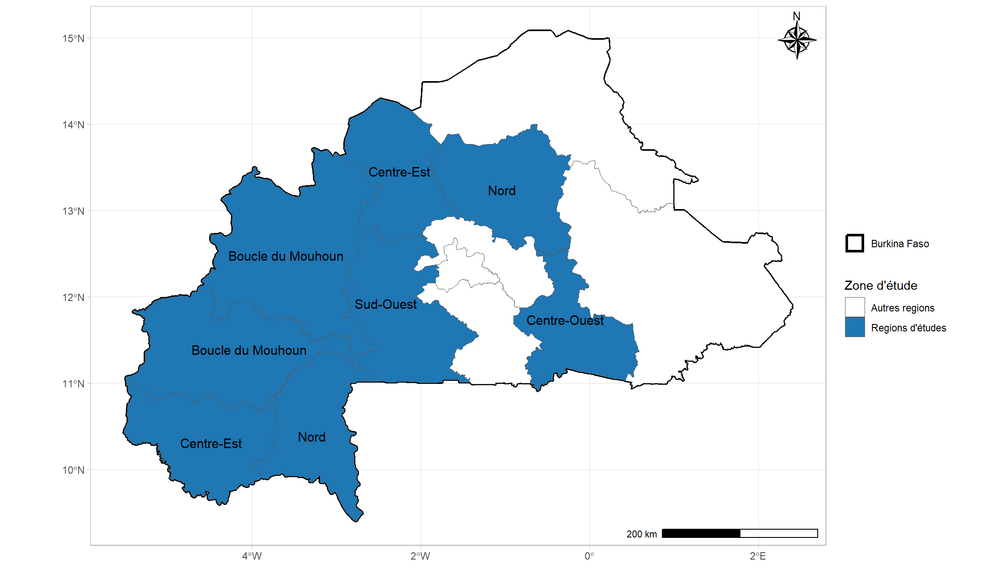
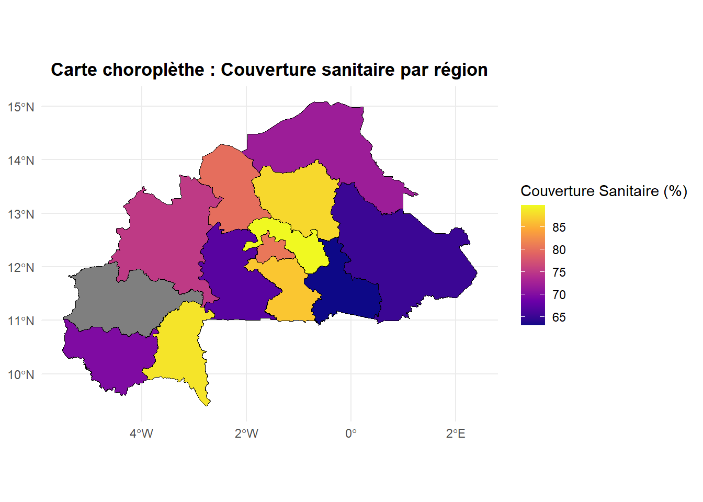
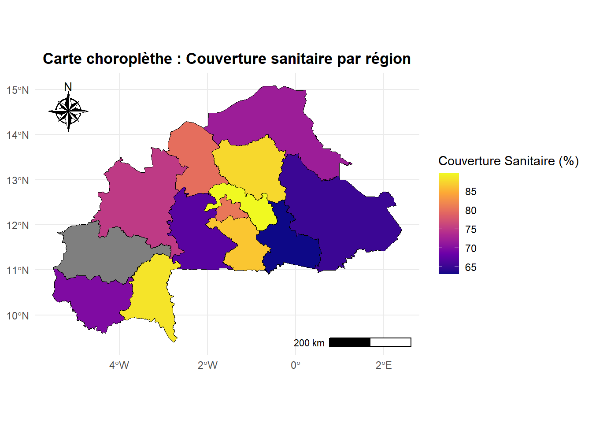
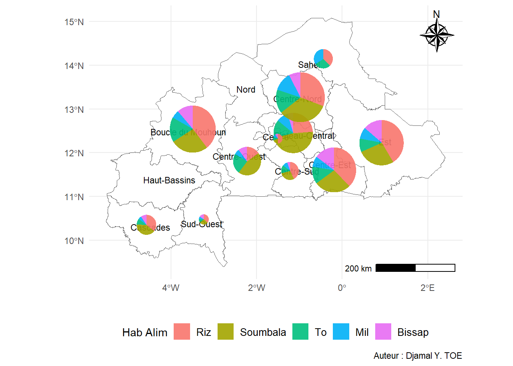

::: {.cell}

:::


::: {.cell}

```{.r .cell-code}
packages <- c("ggplot2","haven", "gtsummary", "corrr", "MASS",
              "dplyr","haven", "rstatix", "tidyverse", "ggpubr",
              "glue", "dplyr","ggspatial", "ggrepel","marmap",
              "readxl", "stringr", "colorspace", "sf", "viridis",
              "tools","ggspatial","readxl","openxlsx","grid",
              "outliers","car","ftExtra","tibble",
              "gtsummary", "wesanderson", "viridis",
              "RColorBrewer", "knitr", "kableExtra")

for (pkg in packages) {
  if (!requireNamespace(pkg, quietly = TRUE)) {
    install.packages(pkg, dependencies = T)
  }
  library(pkg, character.only = TRUE)
}
```
:::


::: {.cell}

:::


## Comment faire des cartes Choroplèthes et des cartes de proportions avec R ?

|       Les cartes choroplèthes et les cartes de proportions sont des outils puissants pour visualiser des données géospatiales dans R. Ces cartes permettent de représenter des valeurs quantitatives (par exemple, des taux de population, des moyennes) sur des zones géographiques, souvent des régions administratives comme des départements, des communes, ou des zones géographiques personnalisées.

> Introduction aux Cartes Choroplèthes et Cartes de Proportions

Les cartes choroplèthes colorient les régions géographiques en fonction de valeurs numériques ou de proportions, facilitant l'analyse spatiale et la compréhension des variations géographiques. Elles sont couramment utilisées pour des données socio-économiques, de santé publique, ou des analyses environnementales.

Les cartes de proportions sont similaires mais mettent davantage l'accent sur les ratios ou proportions par rapport à une valeur totale, comme des pourcentages ou des fractions de populations.

> Notions de Base : Polygones, Shapefiles et Coordonnées
Avant de créer ces cartes, il est important de comprendre quelques notions de base, comme les polygones et les shapefiles :


::: {#polygon .callout-tip}
# Polygones

Une zone géographique est souvent représentée par un polygone, une forme géométrique fermée qui peut avoir plusieurs côtés. Par exemple, une commune ou un département sur une carte peut être représentée comme un polygone.

:::

::: {#Shapefiles .callout-tip}
# Shapefiles

Ce sont un format de fichier standard pour stocker des informations géospatiales, y compris les coordonnées de points, de lignes et de polygones. Ils peuvent contenir les géométries des entités géographiques ainsi que leurs attributs (valeurs associées à chaque région, comme le revenu moyen ou le taux de chômage).

:::

::: {#Shapefiles .callout-tip}
# Coordonnées géographiques

Les coordonnées (latitude et longitude) permettent de positionner ces polygones sur une carte. En R, on utilise des systèmes de coordonnées géographiques et projetées pour gérer et visualiser ces données.

:::

Plusieurs pakages permettent de visualiser les données avec les cartes, ici nous interessons aux packages ***glue*** et ***sf***.

> Zone d'étude

Supposons que nous menions une étude au Burkina-Faso. Par exemple, nous mésurer des indicateurs tels que le taux de mortalité, la couverture sanitaire etc ... Le Burkina Faso est un pays qui compte 13 regions, mais notre etude s'étend seulement sur 8 regions. Il convient de montrer toutes les regions, puis de mettre en exègue celles qui nous concernent.

> Place au code

<details>
  <summary>voir/cacher le code</summary>

::: {.cell}

```{.r .cell-code}
###---- Chargement des shapefiles src = GADM
root <- getwd() ##-- la racine du repertoire

##- La carte du pays sans les polygones des regions, communes et/ou departements
path0 <- paste0(root,"/DATA_SIG/BFA2/gadm41_BFA_0.shp")

##- La carte du pays avec le polygone des regions, sans ceux des communes et/ou departements
path1 <- paste0(root,"/DATA_SIG/BFA2/gadm41_BFA_1.shp")

##- La carte du pays avec le polygone des regions, sans ceux des communes et/ou departements
path2 <- paste0("/DATA_SIG/BFA2/gadm41_BFA_2.shp")

##- La carte du pays avec le polygone des regions, sans ceux des communes et/ou departements
path3 <- paste0(root,"/DATA_SIG/BFA2/gadm41_BFA_3.shp")


##-- selection des regions concernées

study.area <-  c("Boucle du Mouhoun", "Centre-Est", "Centre-Nord",
             "Centre-Ouest", "Nord", "Sud-Ouest",
             "Haut-Bassins", "Cascades")

##-- lecture des shapefiles
pays_shp <- read_sf(glue(path0), quiet = T)
region_shp <- read_sf(glue(path1), quiet = T)
#commune_shp <- read_sf(glue(path2), quiet = T)
#province_shp <- read_sf(glue(path3), quiet = T)

##-- création d'une sous base avec les polygones des regions sélectionnés

data_region <- region_shp %>% filter(NAME_1 %in% study.area)


##-- Study area colors
study_zone_colors <- c("#1f77b4", "#ff7f0e", "#2ca02c",
                       "#3FE1B8", "#9467bd", "#8c564b",
                       "#00008B", "#4B0082")

study_zone_map <- ggplot() +
  geom_sf(data = pays_shp, aes(linewidth = "Burkina Faso"),fill = "white", color = "black") +
  geom_sf(data = region_shp, aes(fill = ifelse(
    NAME_1 %in% study.area,
    "Regions d'études",
    "Autres regions"
  ) )) +
  geom_sf_text(data = region_shp, aes(label = ifelse(
    NAME_1 %in% study.area,
    study.area,
    ""
  )), size = 4)+
  ggspatial::annotation_scale(
    location = "br",
    bar_cols = c("black", "white")
  )  +
  theme_light()+
  ggspatial::annotation_north_arrow(
    location = "tr", which_north = "true",
    pad_x = unit(0.05, "in"), pad_y = unit(0.05, "in"),
    style = ggspatial::north_arrow_nautical(
      fill = c("black", "white"),
      line_col = "black"
    )
  )+
  xlab("")+
  ylab("")+
  scale_linewidth_manual(values = c(1.2), name = "")+
  scale_fill_manual(values = c("white","#1f77b4"), name="Zone d'étude")+
  theme_light() +
  guides(
    linewidth = guide_legend(order = 1),
    fill = guide_legend(order = 2),
    color = guide_legend(order = 3)
  )
```
:::

</details>


::: {.cell layout-align="center"}

```{.r .cell-code}
study_zone_map
```

::: {.cell-output-display}
{fig-align='center' width=1152}
:::
:::


> Expliquons le code à présent

* Charger les fichier shapefiles :
  - ***glue*** : pour preparer la structure du format (optionnel)
  - ***readsf*** : pour lire les fichiers shapefiles

* Definir la zone d'étude : les fichier shapefile devient comme un dataframe, donc est manipulable au même titre que les fichiers excel, csv etc ...

* On trace d'abord la carte du pays, ensuite on ajoute la couche des regions (c'est-à-dire le shapefile des regions). On pourrait le faire simplement avec le shapefile des regions sans celui du pays.

* Ensuite on ajoute la couleur pour la zone concernée et les noms des regions sélectionnées avec `geom_sf_text`

* `annotation_scale` permet d'ajouter une barre d'échelle (scale bar) à une carte avec la position ***br*** pour dire bottom rigth (en bas à droite)

* `annotation_north_arrow` est utilisée pour ajouter une flèche du nord sur une carte créée avec ggplot2

* Pour le reste il s'agit des fonctions qu'on utilise couramment avec ggplot2

<details>
  <summary>Afficher/Masquer le tableau</summary>

::: {.cell}
::: {.cell-output-display}
`````{=html}
<table class="table table-striped table-hover table-condensed table-responsive" style="margin-left: auto; margin-right: auto;">
<caption>Tableau 1 : Les 10 premières lignes du shapefile</caption>
 <thead>
  <tr>
   <th style="text-align:left;"> GID_1 </th>
   <th style="text-align:left;"> GID_0 </th>
   <th style="text-align:left;"> COUNTRY </th>
   <th style="text-align:left;"> NAME_1 </th>
   <th style="text-align:left;"> VARNAME_1 </th>
   <th style="text-align:left;"> NL_NAME_1 </th>
   <th style="text-align:left;"> TYPE_1 </th>
   <th style="text-align:left;"> ENGTYPE_1 </th>
   <th style="text-align:left;"> CC_1 </th>
   <th style="text-align:left;"> HASC_1 </th>
   <th style="text-align:left;"> ISO_1 </th>
   <th style="text-align:left;"> geometry </th>
  </tr>
 </thead>
<tbody>
  <tr>
   <td style="text-align:left;"> BFA.1_1 </td>
   <td style="text-align:left;"> BFA </td>
   <td style="text-align:left;"> Burkina Faso </td>
   <td style="text-align:left;"> Boucle du Mouhoun </td>
   <td style="text-align:left;"> NA </td>
   <td style="text-align:left;"> NA </td>
   <td style="text-align:left;"> Région </td>
   <td style="text-align:left;"> Region </td>
   <td style="text-align:left;"> NA </td>
   <td style="text-align:left;"> BF.BO </td>
   <td style="text-align:left;"> NA </td>
   <td style="text-align:left;"> POLYGON ((-2,73901 11,71249... </td>
  </tr>
  <tr>
   <td style="text-align:left;"> BFA.2_1 </td>
   <td style="text-align:left;"> BFA </td>
   <td style="text-align:left;"> Burkina Faso </td>
   <td style="text-align:left;"> Cascades </td>
   <td style="text-align:left;"> NA </td>
   <td style="text-align:left;"> NA </td>
   <td style="text-align:left;"> Région </td>
   <td style="text-align:left;"> Region </td>
   <td style="text-align:left;"> NA </td>
   <td style="text-align:left;"> BF.CD </td>
   <td style="text-align:left;"> NA </td>
   <td style="text-align:left;"> POLYGON ((-4,591742 9,70225... </td>
  </tr>
  <tr>
   <td style="text-align:left;"> BFA.7_1 </td>
   <td style="text-align:left;"> BFA </td>
   <td style="text-align:left;"> Burkina Faso </td>
   <td style="text-align:left;"> Centre </td>
   <td style="text-align:left;"> NA </td>
   <td style="text-align:left;"> NA </td>
   <td style="text-align:left;"> Région </td>
   <td style="text-align:left;"> Region </td>
   <td style="text-align:left;"> NA </td>
   <td style="text-align:left;"> BF.CT </td>
   <td style="text-align:left;"> NA </td>
   <td style="text-align:left;"> POLYGON ((-1,2786 12,13921,... </td>
  </tr>
  <tr>
   <td style="text-align:left;"> BFA.3_1 </td>
   <td style="text-align:left;"> BFA </td>
   <td style="text-align:left;"> Burkina Faso </td>
   <td style="text-align:left;"> Centre-Est </td>
   <td style="text-align:left;"> NA </td>
   <td style="text-align:left;"> NA </td>
   <td style="text-align:left;"> Région </td>
   <td style="text-align:left;"> Region </td>
   <td style="text-align:left;"> NA </td>
   <td style="text-align:left;"> BF.CE </td>
   <td style="text-align:left;"> NA </td>
   <td style="text-align:left;"> POLYGON ((0,4371 11,67655, ... </td>
  </tr>
  <tr>
   <td style="text-align:left;"> BFA.4_1 </td>
   <td style="text-align:left;"> BFA </td>
   <td style="text-align:left;"> Burkina Faso </td>
   <td style="text-align:left;"> Centre-Nord </td>
   <td style="text-align:left;"> NA </td>
   <td style="text-align:left;"> NA </td>
   <td style="text-align:left;"> Région </td>
   <td style="text-align:left;"> Region </td>
   <td style="text-align:left;"> NA </td>
   <td style="text-align:left;"> BF.CN </td>
   <td style="text-align:left;"> NA </td>
   <td style="text-align:left;"> POLYGON ((-0,7773 12,66989,... </td>
  </tr>
  <tr>
   <td style="text-align:left;"> BFA.5_1 </td>
   <td style="text-align:left;"> BFA </td>
   <td style="text-align:left;"> Burkina Faso </td>
   <td style="text-align:left;"> Centre-Ouest </td>
   <td style="text-align:left;"> NA </td>
   <td style="text-align:left;"> NA </td>
   <td style="text-align:left;"> Région </td>
   <td style="text-align:left;"> Region </td>
   <td style="text-align:left;"> NA </td>
   <td style="text-align:left;"> BF.CO </td>
   <td style="text-align:left;"> NA </td>
   <td style="text-align:left;"> POLYGON ((-2,360162 11,0081... </td>
  </tr>
  <tr>
   <td style="text-align:left;"> BFA.6_1 </td>
   <td style="text-align:left;"> BFA </td>
   <td style="text-align:left;"> Burkina Faso </td>
   <td style="text-align:left;"> Centre-Sud </td>
   <td style="text-align:left;"> NA </td>
   <td style="text-align:left;"> NA </td>
   <td style="text-align:left;"> Région </td>
   <td style="text-align:left;"> Region </td>
   <td style="text-align:left;"> NA </td>
   <td style="text-align:left;"> BF.CS </td>
   <td style="text-align:left;"> NA </td>
   <td style="text-align:left;"> POLYGON ((-0,8624911 10,985... </td>
  </tr>
  <tr>
   <td style="text-align:left;"> BFA.8_1 </td>
   <td style="text-align:left;"> BFA </td>
   <td style="text-align:left;"> Burkina Faso </td>
   <td style="text-align:left;"> Est </td>
   <td style="text-align:left;"> NA </td>
   <td style="text-align:left;"> NA </td>
   <td style="text-align:left;"> Région </td>
   <td style="text-align:left;"> Region </td>
   <td style="text-align:left;"> NA </td>
   <td style="text-align:left;"> BF.ES </td>
   <td style="text-align:left;"> NA </td>
   <td style="text-align:left;"> POLYGON ((1,384436 11,44223... </td>
  </tr>
  <tr>
   <td style="text-align:left;"> BFA.9_1 </td>
   <td style="text-align:left;"> BFA </td>
   <td style="text-align:left;"> Burkina Faso </td>
   <td style="text-align:left;"> Haut-Bassins </td>
   <td style="text-align:left;"> NA </td>
   <td style="text-align:left;"> NA </td>
   <td style="text-align:left;"> Région </td>
   <td style="text-align:left;"> Region </td>
   <td style="text-align:left;"> NA </td>
   <td style="text-align:left;"> BF.HB </td>
   <td style="text-align:left;"> NA </td>
   <td style="text-align:left;"> POLYGON ((-4,08994 10,79044... </td>
  </tr>
  <tr>
   <td style="text-align:left;"> BFA.10_1 </td>
   <td style="text-align:left;"> BFA </td>
   <td style="text-align:left;"> Burkina Faso </td>
   <td style="text-align:left;"> Nord </td>
   <td style="text-align:left;"> NA </td>
   <td style="text-align:left;"> NA </td>
   <td style="text-align:left;"> Région </td>
   <td style="text-align:left;"> Region </td>
   <td style="text-align:left;"> NA </td>
   <td style="text-align:left;"> BF.NO </td>
   <td style="text-align:left;"> NA </td>
   <td style="text-align:left;"> POLYGON ((-1,96586 12,67774... </td>
  </tr>
</tbody>
<tfoot>
<tr>
<td style = 'padding: 0; border:0;' colspan='100%'><sup>a</sup> Source des données :  GADM</td>
</tr>
</tfoot>
</table>

`````
:::
:::

</details>


> Cartes choroplèthes

|       Les cartes choroplèthes sont des représentations graphiques qui utilisent des nuances de couleurs pour illustrer des données quantitatives ou qualitatives sur des zones géographiques. Chaque zone est remplie d'une couleur qui correspond à une valeur spécifique ou à une plage de valeurs, facilitant ainsi l'analyse des variations spatiales des données.

Les cartes choroplèthes sont idéales pour représenter des indicateurs comme le taux de mortalité, le revenu moyen, l'accès à l'eau potable, ou encore la couverture sanitaire par région.

### Exemple de carte choroplèthe

Dans cet exemple, nous allons créer une carte choroplèthe montrant la **couverture sanitaire** par région au Burkina Faso, en utilisant les données fictives créées plus haut. Pour les données, vous pouvez me contacter via LinkedIn.

- **Etape 1 :** ***Charger les shapefiles et les données***

Ici nous nous assurons que les shapefiles des régions et les données sont correctement chargés et liés entre eux. Pour cela on fait une jointure externe.


::: {.cell}

```{.r .cell-code}
##-- Joindre les données au shapefile
region_data <- region_shp %>%
  left_join(data, by = c("NAME_1" = "Region"))
```
:::


Avant de passer à l'étape 2, affichons les données générées avant jointure et ceux aprés jointures.

<details>
  <summary>Afficher/cacher le code</summary>


::: {.cell}

```{.r .cell-code}
tbl.avant.jointure <- kbl(head(data,10)) %>%
  kable_styling(bootstrap_options = c("striped", "hover", "condensed", "responsive"))

tbl.apres.jointure <- kbl(head(data,10)) %>%
  kable_styling(bootstrap_options = c("striped", "hover", "condensed", "responsive")) %>% add_footnote(label = "Source des données :  GADM")
```
:::

</details>

<details>
  <summary>Afficher/Masquer le tableau</summary>

::: {.cell layout-ncol="2" tbl-cap='Les 10 premières lignes des tables' tbl-subcap='["Avant jointure","Après jointure"]'}

```{.r .cell-code}
tbl.avant.jointure
```

::: {.cell-output-display}
`````{=html}
<table class="table table-striped table-hover table-condensed table-responsive" style="margin-left: auto; margin-right: auto;">
 <thead>
  <tr>
   <th style="text-align:left;"> Region </th>
   <th style="text-align:right;"> Population </th>
   <th style="text-align:right;"> Taux_Mortalite </th>
   <th style="text-align:right;"> Couverture_Sanitaire </th>
   <th style="text-align:right;"> Acces_Eau_Potable </th>
  </tr>
 </thead>
<tbody>
  <tr>
   <td style="text-align:left;"> Boucle du Mouhoun </td>
   <td style="text-align:right;"> 2285870 </td>
   <td style="text-align:right;"> 7,38 </td>
   <td style="text-align:right;"> 75,08 </td>
   <td style="text-align:right;"> 74,25 </td>
  </tr>
  <tr>
   <td style="text-align:left;"> Cascades </td>
   <td style="text-align:right;"> 975241 </td>
   <td style="text-align:right;"> 13,71 </td>
   <td style="text-align:right;"> 69,77 </td>
   <td style="text-align:right;"> 77,37 </td>
  </tr>
  <tr>
   <td style="text-align:left;"> Centre </td>
   <td style="text-align:right;"> 469694 </td>
   <td style="text-align:right;"> 14,30 </td>
   <td style="text-align:right;"> 80,53 </td>
   <td style="text-align:right;"> 69,87 </td>
  </tr>
  <tr>
   <td style="text-align:left;"> Centre-Est </td>
   <td style="text-align:right;"> 2183230 </td>
   <td style="text-align:right;"> 5,60 </td>
   <td style="text-align:right;"> 63,07 </td>
   <td style="text-align:right;"> 55,65 </td>
  </tr>
  <tr>
   <td style="text-align:left;"> Centre-Nord </td>
   <td style="text-align:right;"> 2424800 </td>
   <td style="text-align:right;"> 5,31 </td>
   <td style="text-align:right;"> 87,55 </td>
   <td style="text-align:right;"> 71,38 </td>
  </tr>
  <tr>
   <td style="text-align:left;"> Centre-Ouest </td>
   <td style="text-align:right;"> 1386541 </td>
   <td style="text-align:right;"> 5,82 </td>
   <td style="text-align:right;"> 67,10 </td>
   <td style="text-align:right;"> 76,33 </td>
  </tr>
  <tr>
   <td style="text-align:left;"> Centre-Sud </td>
   <td style="text-align:right;"> 872355 </td>
   <td style="text-align:right;"> 10,42 </td>
   <td style="text-align:right;"> 86,40 </td>
   <td style="text-align:right;"> 50,66 </td>
  </tr>
  <tr>
   <td style="text-align:left;"> Est </td>
   <td style="text-align:right;"> 2201761 </td>
   <td style="text-align:right;"> 7,28 </td>
   <td style="text-align:right;"> 65,13 </td>
   <td style="text-align:right;"> 72,43 </td>
  </tr>
  <tr>
   <td style="text-align:left;"> Hauts-Bassins </td>
   <td style="text-align:right;"> 1022297 </td>
   <td style="text-align:right;"> 14,14 </td>
   <td style="text-align:right;"> 71,15 </td>
   <td style="text-align:right;"> 72,35 </td>
  </tr>
  <tr>
   <td style="text-align:left;"> Nord </td>
   <td style="text-align:right;"> 376863 </td>
   <td style="text-align:right;"> 5,40 </td>
   <td style="text-align:right;"> 79,83 </td>
   <td style="text-align:right;"> 87,86 </td>
  </tr>
</tbody>
</table>

`````
:::

```{.r .cell-code}
tbl.apres.jointure
```

::: {.cell-output-display}
`````{=html}
<table class="table table-striped table-hover table-condensed table-responsive" style="margin-left: auto; margin-right: auto;">
 <thead>
  <tr>
   <th style="text-align:left;"> Region </th>
   <th style="text-align:right;"> Population </th>
   <th style="text-align:right;"> Taux_Mortalite </th>
   <th style="text-align:right;"> Couverture_Sanitaire </th>
   <th style="text-align:right;"> Acces_Eau_Potable </th>
  </tr>
 </thead>
<tbody>
  <tr>
   <td style="text-align:left;"> Boucle du Mouhoun </td>
   <td style="text-align:right;"> 2285870 </td>
   <td style="text-align:right;"> 7,38 </td>
   <td style="text-align:right;"> 75,08 </td>
   <td style="text-align:right;"> 74,25 </td>
  </tr>
  <tr>
   <td style="text-align:left;"> Cascades </td>
   <td style="text-align:right;"> 975241 </td>
   <td style="text-align:right;"> 13,71 </td>
   <td style="text-align:right;"> 69,77 </td>
   <td style="text-align:right;"> 77,37 </td>
  </tr>
  <tr>
   <td style="text-align:left;"> Centre </td>
   <td style="text-align:right;"> 469694 </td>
   <td style="text-align:right;"> 14,30 </td>
   <td style="text-align:right;"> 80,53 </td>
   <td style="text-align:right;"> 69,87 </td>
  </tr>
  <tr>
   <td style="text-align:left;"> Centre-Est </td>
   <td style="text-align:right;"> 2183230 </td>
   <td style="text-align:right;"> 5,60 </td>
   <td style="text-align:right;"> 63,07 </td>
   <td style="text-align:right;"> 55,65 </td>
  </tr>
  <tr>
   <td style="text-align:left;"> Centre-Nord </td>
   <td style="text-align:right;"> 2424800 </td>
   <td style="text-align:right;"> 5,31 </td>
   <td style="text-align:right;"> 87,55 </td>
   <td style="text-align:right;"> 71,38 </td>
  </tr>
  <tr>
   <td style="text-align:left;"> Centre-Ouest </td>
   <td style="text-align:right;"> 1386541 </td>
   <td style="text-align:right;"> 5,82 </td>
   <td style="text-align:right;"> 67,10 </td>
   <td style="text-align:right;"> 76,33 </td>
  </tr>
  <tr>
   <td style="text-align:left;"> Centre-Sud </td>
   <td style="text-align:right;"> 872355 </td>
   <td style="text-align:right;"> 10,42 </td>
   <td style="text-align:right;"> 86,40 </td>
   <td style="text-align:right;"> 50,66 </td>
  </tr>
  <tr>
   <td style="text-align:left;"> Est </td>
   <td style="text-align:right;"> 2201761 </td>
   <td style="text-align:right;"> 7,28 </td>
   <td style="text-align:right;"> 65,13 </td>
   <td style="text-align:right;"> 72,43 </td>
  </tr>
  <tr>
   <td style="text-align:left;"> Hauts-Bassins </td>
   <td style="text-align:right;"> 1022297 </td>
   <td style="text-align:right;"> 14,14 </td>
   <td style="text-align:right;"> 71,15 </td>
   <td style="text-align:right;"> 72,35 </td>
  </tr>
  <tr>
   <td style="text-align:left;"> Nord </td>
   <td style="text-align:right;"> 376863 </td>
   <td style="text-align:right;"> 5,40 </td>
   <td style="text-align:right;"> 79,83 </td>
   <td style="text-align:right;"> 87,86 </td>
  </tr>
</tbody>
<tfoot>
<tr>
<td style = 'padding: 0; border:0;' colspan='100%'><sup>a</sup> Source des données :  GADM</td>
</tr>
</tfoot>
</table>

`````
:::
:::


</details>

- **Etape 2 :** ***Créer la carte choroplèthe***

Utilisez `ggplot2` et `geom_sf()` pour afficher les régions et les colorer en fonction de la couverture sanitaire.


::: {.cell layout-align="center"}

```{.r .cell-code}
##-  Carte choroplèthe
choropleth_map <- ggplot(region_data) +
  geom_sf(aes(fill = Couverture_Sanitaire), color = "black") +
  scale_fill_viridis_c(
    option = "C",
    name = "Couverture Sanitaire (%)"
  ) +
  ggtitle("Carte choroplèthe : Couverture sanitaire par région") +
  theme_minimal() +
  theme(
    legend.position = "right",
    plot.title = element_text(hjust = 0.5, face = "bold")
  )

choropleth_map
```

::: {.cell-output-display}
{fig-align='center' width=672}
:::
:::


- **Etape 3 : ** ***Ajouter des éléments décoratifs***

Ajoutons une barre d'échelle et une flèche du nord pour rendre la carte plus informative.


::: {.cell}

```{.r .cell-code}
##- Ajout des éléments décoratifs
choropleth_map <- choropleth_map +
  ggspatial::annotation_scale(location = "br") +
  ggspatial::annotation_north_arrow(
    location = "tl", style = north_arrow_nautical()
  ) ###-- tl pour top-left (en haut à gauche)

choropleth_map
```

::: {.cell-output-display}
{width=672}
:::
:::


>  Interpréter les résultats

Examinez la carte générée et répondez aux questions suivantes :
- Quelles régions ont la meilleure couverture sanitaire ?
- Quelles régions doivent faire l'objet d'une attention particulière pour améliorer les conditions de vie ?


#### Extensions possibles

- Réalisez une carte choroplèthe pour le taux de mortalité.
- Ajoutez des annotations pour les régions ayant les valeurs extrêmes.
- Expérimentez avec d'autres palettes de couleurs en utilisant `scale_fill_brewer()` ou `scale_fill_manual()` etc ....

::: {#Shapefiles .callout-important}
# Données discrètes ?

Il se peut qu'il n'y ait pas une variabilité importante dans les données dans ce cas, au lieu d'avoir une palette, nous aurons juste des cases de couleurs comme s'agissait d'un indicateur discrèt. Dans ce cas, recoder juste cet indicateur en un indicateur qualitatif (regrouper par classe) et ensuite utiliser `scale_fill_manual()` pour definir vos couleurs manuellement ou laisser R le faire tout seul. Le graphique ci-dessous en est un exemple.

:::

![Exemple de carte avec un indicateur recodé : Indisponible pour l'instant]


> Cartes de proportions

>>> **A suivre**

> Cartes de proportions avancées


::: {.cell}

:::


::: {.cell}

:::


::: {.cell}

:::


::: {.cell}
::: {.cell-output-display}
{width=672}
:::
:::


[Retour à la page d'accueuil](https://djamal2905.github.io/djamal_website)
