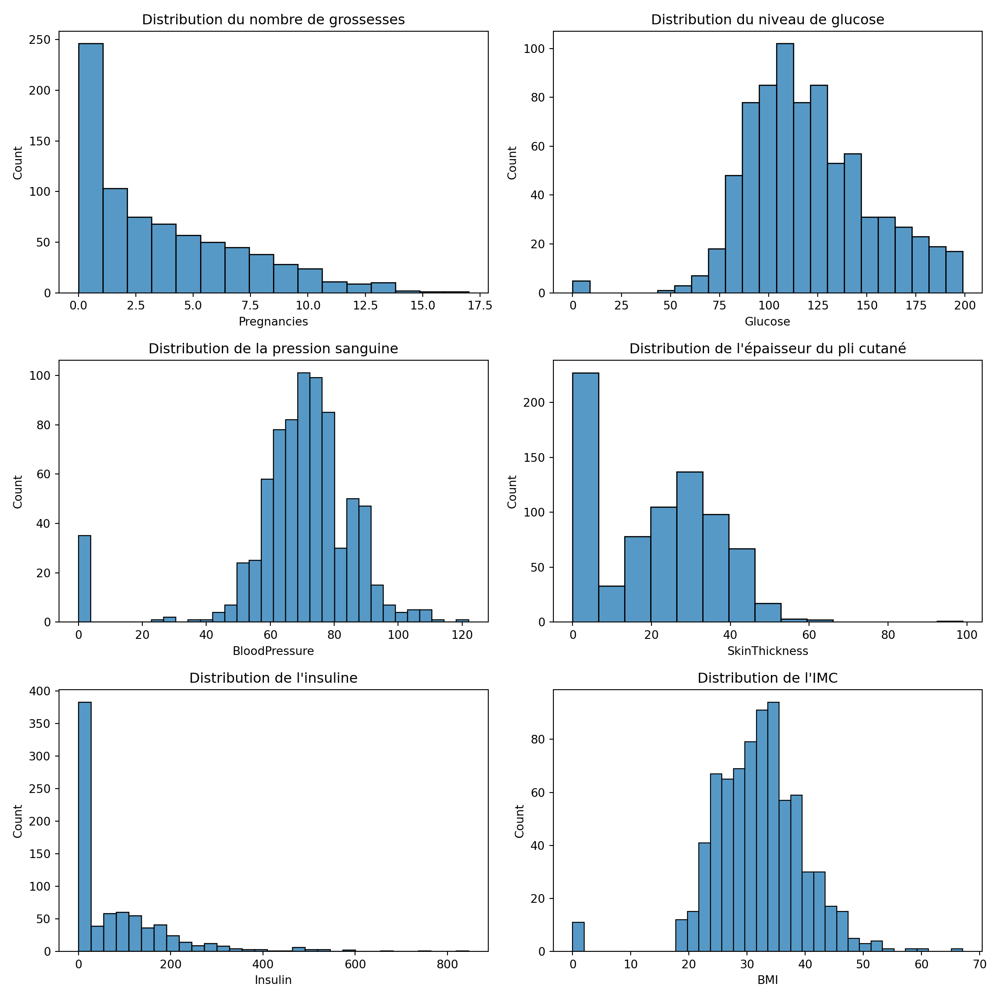
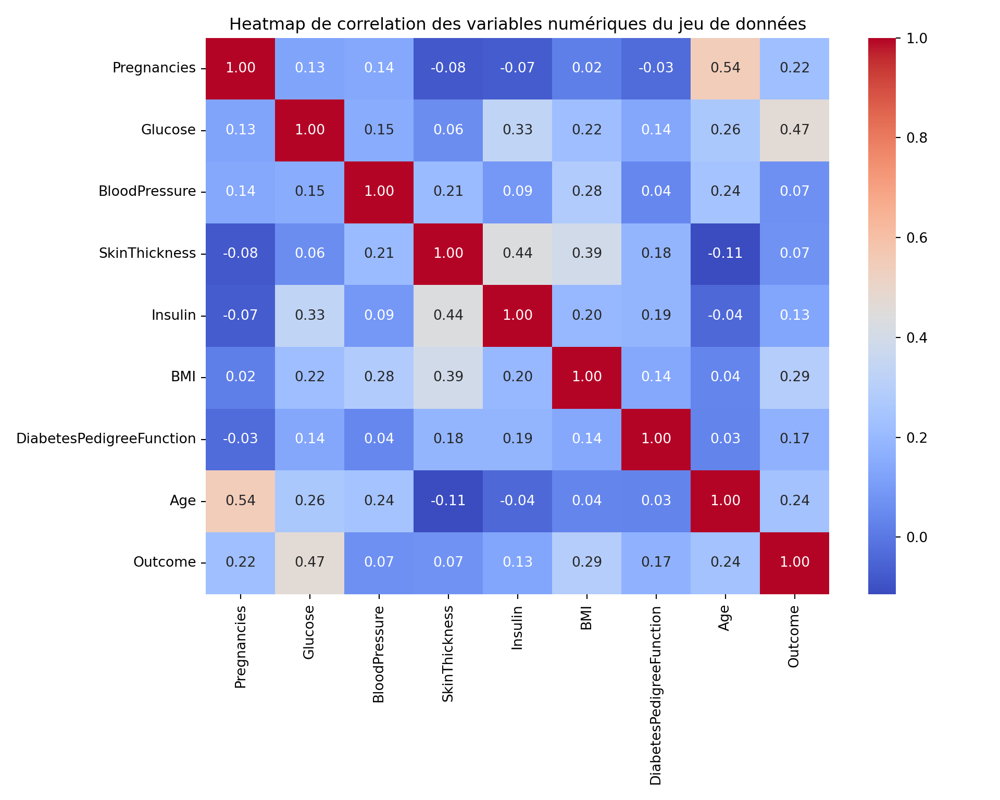
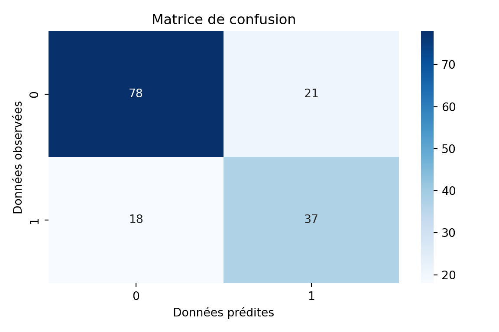
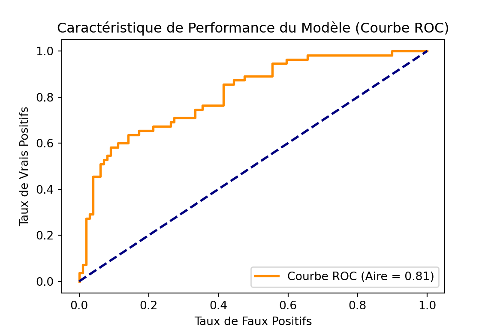

::: {.cell}

:::


# Introduction
Le modèle logistique est une technique statistique largement utilisée pour modéliser des variables dépendantes binaires ou des proportions. Il est fondamental en économétrie, en sciences sociales, en biostatistique et dans de nombreux autres domaines.

# Formulation du Modèle Logistique

La régression logistique permet de modéliser la probabilité d’un événement sous la forme :
\begin{equation}
    P(Y=1 | X) = \frac{e^{\beta_0 + \beta_1 X_1 + \dots + \beta_k X_k}}{1 + e^{\beta_0 + \beta_1 X_1 + \dots + \beta_k X_k}}.
\end{equation}

La fonction logistique peut être réécrite sous la forme des cotes (odds) :
\begin{equation}
    \frac{P(Y=1 | X)}{1 - P(Y=1 | X)} = e^{\beta_0 + \beta_1 X_1 + \dots + \beta_k X_k}.
\end{equation}

En prenant le logarithme des deux côtés, nous obtenons le modèle de régression logistique sous sa forme linéarisée :
\begin{equation}
    \log \left( \frac{P(Y=1 | X)}{1 - P(Y=1 | X)} \right) = \beta_0 + \beta_1 X_1 + \dots + \beta_k X_k.
\end{equation}

# Importance en Classification
Le modèle logistique est particulièrement utilisé en classification binaire. Il permet d’attribuer une observation à l’une des deux catégories possibles en fonction d’un seuil de probabilité (souvent fixé à 0.5). 

En apprentissage automatique, il est souvent employé pour des tâches telles que :

- La `détection de spams` dans les emails.

- La `reconnaissance de fraudes` bancaires.

- La `segmentation de clients` en fonction de leur probabilité d'achat.

# Interprétation des Coefficients

Dans un modèle logistique, chaque coefficient $\beta_i$ représente l'effet d'une variation de $X_i$ sur le logarithme des cotes. Cela signifie que pour une variation de $X_i$ d'une unité, la variation relative des cotes est donnée par :

\begin{equation}
    e^{\beta_i}.
\end{equation}

Si $\beta_i > 0$, alors une augmentation de $X_i$ accroît la probabilité de succès ($Y=1$). Si $\beta_i < 0$, alors une augmentation de $X_i$ diminue cette probabilité.

Cependant, si l’on souhaite interpréter directement l’effet de $X_i$ sur $P(Y=1)$, il faut calculer les effets marginaux :
\begin{equation}
    \frac{\partial P(Y=1 | X)}{\partial X_i} = P(Y=1 | X) (1 - P(Y=1 | X)) \beta_i.
\end{equation}

Les effets marginaux permettent d’exprimer l’impact de $X_i$ sur la probabilité directement, sans passer par les cotes.

# Méthodes d'Estimation
Les paramètres sont estimés par la méthode du maximum de vraisemblance. La fonction de vraisemblance pour $n$ observations est donnée par :
\begin{equation}
    L(\beta) = \prod_{i=1}^{n} P(Y_i | X_i)^{Y_i} (1 - P(Y_i | X_i))^{1 - Y_i}.
\end{equation}

En prenant le logarithme, nous obtenons la log-vraisemblance :
\begin{equation}
    \log L(\beta) = \sum_{i=1}^{n} \left[ Y_i \log P(Y_i | X_i) + (1 - Y_i) \log (1 - P(Y_i | X_i)) \right].
\end{equation}

L’estimation des paramètres se fait par :

- La méthode de `Newton-Raphson`.
- L’algorithme de `descente de gradient` (en apprentissage automatique).
- Des `solveurs numériques spécialisés` (comme ceux implémentés dans R ou Python).

# Applications

Le modèle logistique est utilisé dans divers domaines :

- **Médecine** : prédiction de la présence d’une maladie en fonction de facteurs de risque.

- **Marketing** : estimation de la probabilité qu’un client achète un produit donné.

- **Finance** : modélisation du risque de défaut d’un emprunteur.

- **Économie** : analyse des choix binaires comme l’adoption d’une nouvelle technologie.

# Exemple d'Application

Supposons que nous souhaitions modéliser l'effet du revenu ($X$) sur la probabilité qu'un individu possède une assurance santé ($Y$). Nous estimons alors un modèle logistique :
\begin{equation}
    P(Y=1 | X) = \frac{e^{\beta_0 + \beta_1 X}}{1 + e^{\beta_0 + \beta_1 X}}.
\end{equation}

Si l'estimation de $\beta_1$ est positive et significative, cela signifie que plus le revenu est élevé, plus la probabilité de posséder une assurance santé est grande.

# Conclusion

|       Le modèle logistique est un outil puissant pour la modélisation des variables binaires et la classification. Il permet d’assigner des probabilités à des événements et d’interpréter les relations entre variables explicatives et réponse. Son estimation repose sur le maximum de vraisemblance, et son interprétation nécessite souvent le calcul des effets marginaux pour comprendre directement l’impact des variables explicatives sur la probabilité d’occurrence de l’événement étudié.


# Place à la pratique avec des données sur le diabète

## Importation des bibliothèques necessaires


::: {.cell}

```{.python .cell-code}
import pandas as pd
import seaborn as sns
import matplotlib.pyplot as plt
from IPython.display import display
import numpy as np
```
:::


## Chargement des données et verification suscinte de leur qualité

|       Avant de commencer quoi que ce soit, il est nécessaire de préciser que les données proviennent de la plateforme `kaggle` ([!cliquez ici pour y acceder](https://www.kaggle.com/datasets/akshaydattatraykhare/diabetes-dataset)).


::: {.cell}

```{.python .cell-code}
df = pd.read_csv('diabetes-dataset.csv')
print('\nAffichage des données\n')
```

::: {.cell-output .cell-output-stdout}

```

Affichage des données
```


:::

```{.python .cell-code}
display(df.head(5))
```

::: {.cell-output .cell-output-stdout}

```
   Pregnancies  Glucose  BloodPressure  ...  DiabetesPedigreeFunction  Age  Outcome
0            6      148             72  ...                     0.627   50        1
1            1       85             66  ...                     0.351   31        0
2            8      183             64  ...                     0.672   32        1
3            1       89             66  ...                     0.167   21        0
4            0      137             40  ...                     2.288   33        1

[5 rows x 9 columns]
```


:::

```{.python .cell-code}
print('\nInformations sur les données\n')
```

::: {.cell-output .cell-output-stdout}

```

Informations sur les données
```


:::

```{.python .cell-code}
display(df.info)
```

::: {.cell-output .cell-output-stdout}

```
<bound method DataFrame.info of      Pregnancies  Glucose  ...  Age  Outcome
0              6      148  ...   50        1
1              1       85  ...   31        0
2              8      183  ...   32        1
3              1       89  ...   21        0
4              0      137  ...   33        1
..           ...      ...  ...  ...      ...
763           10      101  ...   63        0
764            2      122  ...   27        0
765            5      121  ...   30        0
766            1      126  ...   47        1
767            1       93  ...   23        0

[768 rows x 9 columns]>
```


:::

```{.python .cell-code}
print('\nResumé statistique des données\n')
```

::: {.cell-output .cell-output-stdout}

```

Resumé statistique des données
```


:::

```{.python .cell-code}
display(df.describe)
```

::: {.cell-output .cell-output-stdout}

```
<bound method NDFrame.describe of      Pregnancies  Glucose  ...  Age  Outcome
0              6      148  ...   50        1
1              1       85  ...   31        0
2              8      183  ...   32        1
3              1       89  ...   21        0
4              0      137  ...   33        1
..           ...      ...  ...  ...      ...
763           10      101  ...   63        0
764            2      122  ...   27        0
765            5      121  ...   30        0
766            1      126  ...   47        1
767            1       93  ...   23        0

[768 rows x 9 columns]>
```


:::
:::


## Chargement des données et verification suscinte de leur qualité

### Affichage des informations sur les données


::: {.cell}

```{.python .cell-code}
df = pd.read_csv('diabetes-dataset.csv')
print('\nAffichage des données\n')
```

::: {.cell-output .cell-output-stdout}

```

Affichage des données
```


:::

```{.python .cell-code}
display(df.head(5))
```

::: {.cell-output .cell-output-stdout}

```
   Pregnancies  Glucose  BloodPressure  ...  DiabetesPedigreeFunction  Age  Outcome
0            6      148             72  ...                     0.627   50        1
1            1       85             66  ...                     0.351   31        0
2            8      183             64  ...                     0.672   32        1
3            1       89             66  ...                     0.167   21        0
4            0      137             40  ...                     2.288   33        1

[5 rows x 9 columns]
```


:::

```{.python .cell-code}
print('\nInformations sur les données\n')
```

::: {.cell-output .cell-output-stdout}

```

Informations sur les données
```


:::

```{.python .cell-code}
display(df.info)
```

::: {.cell-output .cell-output-stdout}

```
<bound method DataFrame.info of      Pregnancies  Glucose  ...  Age  Outcome
0              6      148  ...   50        1
1              1       85  ...   31        0
2              8      183  ...   32        1
3              1       89  ...   21        0
4              0      137  ...   33        1
..           ...      ...  ...  ...      ...
763           10      101  ...   63        0
764            2      122  ...   27        0
765            5      121  ...   30        0
766            1      126  ...   47        1
767            1       93  ...   23        0

[768 rows x 9 columns]>
```


:::

```{.python .cell-code}
print('\nResumé statistique des données\n')
```

::: {.cell-output .cell-output-stdout}

```

Resumé statistique des données
```


:::

```{.python .cell-code}
display(df.describe)
```

::: {.cell-output .cell-output-stdout}

```
<bound method NDFrame.describe of      Pregnancies  Glucose  ...  Age  Outcome
0              6      148  ...   50        1
1              1       85  ...   31        0
2              8      183  ...   32        1
3              1       89  ...   21        0
4              0      137  ...   33        1
..           ...      ...  ...  ...      ...
763           10      101  ...   63        0
764            2      122  ...   27        0
765            5      121  ...   30        0
766            1      126  ...   47        1
767            1       93  ...   23        0

[768 rows x 9 columns]>
```


:::
:::


### Vérification des valeurs manquantes


::: {.cell}

```{.python .cell-code}
df.columns.isna().sum()
```

::: {.cell-output .cell-output-stdout}

```
0
```


:::
:::


|       Il y' a aucune valeur manquante car les données ont bien été nettoyées avant d'être mise à disposition sur `kaggle`.

### Affichage des statistiques des variables

|       Etant données que les informations sur les variables sont en ce moment ou j'écris indisponibles sur `kaggle`.


::: {.cell}

```{.python .cell-code}
print('Affichage des valeurs uniques des variables\n')
```

::: {.cell-output .cell-output-stdout}

```
Affichage des valeurs uniques des variables
```


:::

```{.python .cell-code}
for variable in df.columns:
    if variable != "DiabetesPedigreeFunction": # je saute car ça fait beaucoup long à l'affichage
      print(f'\n {variable}\n')
      print(df[variable].unique())
```

::: {.cell-output .cell-output-stdout}

```

 Pregnancies

[ 6  1  8  0  5  3 10  2  4  7  9 11 13 15 17 12 14]

 Glucose

[148  85 183  89 137 116  78 115 197 125 110 168 139 189 166 100 118 107
 103 126  99 196 119 143 147  97 145 117 109 158  88  92 122 138 102  90
 111 180 133 106 171 159 146  71 105 101 176 150  73 187  84  44 141 114
  95 129  79   0  62 131 112 113  74  83 136  80 123  81 134 142 144  93
 163 151  96 155  76 160 124 162 132 120 173 170 128 108 154  57 156 153
 188 152 104  87  75 179 130 194 181 135 184 140 177 164  91 165  86 193
 191 161 167  77 182 157 178  61  98 127  82  72 172  94 175 195  68 186
 198 121  67 174 199  56 169 149  65 190]

 BloodPressure

[ 72  66  64  40  74  50   0  70  96  92  80  60  84  30  88  90  94  76
  82  75  58  78  68 110  56  62  85  86  48  44  65 108  55 122  54  52
  98 104  95  46 102 100  61  24  38 106 114]

 SkinThickness

[35 29  0 23 32 45 19 47 38 30 41 33 26 15 36 11 31 37 42 25 18 24 39 27
 21 34 10 60 13 20 22 28 54 40 51 56 14 17 50 44 12 46 16  7 52 43 48  8
 49 63 99]

 Insulin

[  0  94 168  88 543 846 175 230  83  96 235 146 115 140 110 245  54 192
 207  70 240  82  36  23 300 342 304 142 128  38 100  90 270  71 125 176
  48  64 228  76 220  40 152  18 135 495  37  51  99 145 225  49  50  92
 325  63 284 119 204 155 485  53 114 105 285 156  78 130  55  58 160 210
 318  44 190 280  87 271 129 120 478  56  32 744 370  45 194 680 402 258
 375 150  67  57 116 278 122 545  75  74 182 360 215 184  42 132 148 180
 205  85 231  29  68  52 255 171  73 108  43 167 249 293  66 465  89 158
  84  72  59  81 196 415 275 165 579 310  61 474 170 277  60  14  95 237
 191 328 250 480 265 193  79  86 326 188 106  65 166 274  77 126 330 600
 185  25  41 272 321 144  15 183  91  46 440 159 540 200 335 387  22 291
 392 178 127 510  16 112]

 BMI

[33.6 26.6 23.3 28.1 43.1 25.6 31.  35.3 30.5  0.  37.6 38.  27.1 30.1
 25.8 30.  45.8 29.6 43.3 34.6 39.3 35.4 39.8 29.  36.6 31.1 39.4 23.2
 22.2 34.1 36.  31.6 24.8 19.9 27.6 24.  33.2 32.9 38.2 37.1 34.  40.2
 22.7 45.4 27.4 42.  29.7 28.  39.1 19.4 24.2 24.4 33.7 34.7 23.  37.7
 46.8 40.5 41.5 25.  25.4 32.8 32.5 42.7 19.6 28.9 28.6 43.4 35.1 32.
 24.7 32.6 43.2 22.4 29.3 24.6 48.8 32.4 38.5 26.5 19.1 46.7 23.8 33.9
 20.4 28.7 49.7 39.  26.1 22.5 39.6 29.5 34.3 37.4 33.3 31.2 28.2 53.2
 34.2 26.8 55.  42.9 34.5 27.9 38.3 21.1 33.8 30.8 36.9 39.5 27.3 21.9
 40.6 47.9 50.  25.2 40.9 37.2 44.2 29.9 31.9 28.4 43.5 32.7 67.1 45.
 34.9 27.7 35.9 22.6 33.1 30.4 52.3 24.3 22.9 34.8 30.9 40.1 23.9 37.5
 35.5 42.8 42.6 41.8 35.8 37.8 28.8 23.6 35.7 36.7 45.2 44.  46.2 35.
 43.6 44.1 18.4 29.2 25.9 32.1 36.3 40.  25.1 27.5 45.6 27.8 24.9 25.3
 37.9 27.  26.  38.7 20.8 36.1 30.7 32.3 52.9 21.  39.7 25.5 26.2 19.3
 38.1 23.5 45.5 23.1 39.9 36.8 21.8 41.  42.2 34.4 27.2 36.5 29.8 39.2
 38.4 36.2 48.3 20.  22.3 45.7 23.7 22.1 42.1 42.4 18.2 26.4 45.3 37.
 24.5 32.2 59.4 21.2 26.7 30.2 46.1 41.3 38.8 35.2 42.3 40.7 46.5 33.5
 37.3 30.3 26.3 21.7 36.4 28.5 26.9 38.6 31.3 19.5 20.1 40.8 23.4 28.3
 38.9 57.3 35.6 49.6 44.6 24.1 44.5 41.2 49.3 46.3]

 Age

[50 31 32 21 33 30 26 29 53 54 34 57 59 51 27 41 43 22 38 60 28 45 35 46
 56 37 48 40 25 24 58 42 44 39 36 23 61 69 62 55 65 47 52 66 49 63 67 72
 81 64 70 68]

 Outcome

[1 0]
```


:::
:::


Au vu de ces valeurs, on peut dire que (vu qu'il n'y a aucune description des disponible sur kaggle):

- `pregnancies` represente le nombre de grossesses contractées;

- `glucose` represente la quantité de glucose dans le sang;

- `BloodPressure` represente la pression sanguine;

- `SkinThickness` represente l'épaisseur du pli cutané tricipital;

- `BMI` correspond à l'Indice de Masse Corporelle (*_IMC_*)

- `Age` de la patiente

- `Insulin` représente la concentration sérique d'insuline mesurée (généralement en micro-unités par millilitre (μU/ml))

- `DiabetesPedigreeFunction` représente une mesure de la prédisposition génétique au diabète

- `Outcome` represente l'état de la patiente (atteinte ou non du diabète)

## Analyse exploratoire des données

|       Cette analyse est effectuée dans l'optique de mieux comprendre les données afin de pouvoir bien spécifier le modèle logistique.

### Analyse descriptives rapides (Voir la distribution des données)


::: {.cell}

```{.python .cell-code}
# Création de la figure avec une grille 3 lignes x 2 colonnes
fig, axes = plt.subplots(3, 2, figsize=(12, 12))

# Premier sous-graphe : Distribution du nombre de grossesses
sns.histplot(data=df['Pregnancies'], ax=axes[0, 0])
axes[0, 0].set_title("Distribution du nombre de grossesses")

# Deuxième sous-graphe : Distribution du niveau de glucose
sns.histplot(data=df['Glucose'], ax=axes[0, 1])
axes[0, 1].set_title("Distribution du niveau de glucose")

# Troisième sous-graphe : Distribution de la pression sanguine
sns.histplot(data=df['BloodPressure'], ax=axes[1, 0])
axes[1, 0].set_title("Distribution de la pression sanguine")

# Quatrième sous-graphe : Distribution de l'épaisseur du pli cutané (SkinThickness)
sns.histplot(data=df['SkinThickness'], ax=axes[1, 1])
axes[1, 1].set_title("Distribution de l'épaisseur du pli cutané")

# Cinquième sous-graphe : Distribution de l'insuline
sns.histplot(data=df['Insulin'], ax=axes[2, 0])
axes[2, 0].set_title("Distribution de l'insuline")

# Sixième sous-graphe : Distribution de l'IMC (BMI)
sns.histplot(data=df['BMI'], ax=axes[2, 1])
axes[2, 1].set_title("Distribution de l'IMC")

# Ajustement automatique des espaces pour
# éviter le chevauchement des titres et labels
plt.tight_layout()

# Affichage de la figure
plt.show()
```

::: {.cell-output-display}
{width=1152}
:::
:::


### Verification de la colinéarité

|       En effet avant de spécifier un modèle, il faut s'assurer qu'il n'y a pas multicolinéarité. C'est-à-dire verifier que les variables ne sont pas corrélées entre elles ce qui permettra d'éviter de fausses estimations.


::: {.cell}

```{.python .cell-code}
# Sélectionner que les variables numériques des données
df_variables_numeriques = df.select_dtypes(include=[np.number])

plt.figure(figsize=(10, 8))
sns.heatmap(df_variables_numeriques.corr(), annot=True, cmap='coolwarm', fmt='.2f')
plt.title('Heatmap de correlation des variables numériques du jeu de données')
plt.tight_layout()
plt.show()
```

::: {.cell-output-display}
{width=960}
:::
:::


|       Ce corrélollogramme montre que les variables ne sont pas linéairement corrélées entre elle. Donc on peut ajuster le modèle de regression logistique.

## Spécification et évalution du modèle logistique

|       A ce niveau, j'ai partitionné les données en ammont dans le but de faire du machine learning (ajustement, prediction et validation du modèle) plus tard (dans la section suivante). Nous avons les données d'entrainement qui constituent ***80%*** des données et des données de test qui en constituent ***20***. Ici j'ajuste juste un modèle de regression logistique aux données que j'essaie d'interpreter.


::: {.cell}

```{.python .cell-code}
# Les bibliothèques de machine learning
from sklearn.model_selection import train_test_split
from sklearn.linear_model import LogisticRegression
from sklearn.metrics import accuracy_score, confusion_matrix, roc_curve, auc
from sklearn.inspection import permutation_importance
```
:::


::: {.cell}

```{.python .cell-code}
# Separation des variables explicatives and de la variable dépendante

# X : matrice des variables explicatives
X = df.drop('Outcome', axis=1)

# y : variable dépendante
y = df['Outcome']

# partition des données en données de tests et d'entrainement
X_train, X_test, y_train, y_test = train_test_split(X, y, test_size=0.2, random_state=42)
```
:::


::: {.cell}

```{.python .cell-code}
import statsmodels.api as sm

# Ajout d'une colonne de 1 pour l'intercept (obligatoire dans statsmodels)
X_train_const = sm.add_constant(X_train)

# Création du modèle logistique
model = sm.Logit(y_train, X_train_const)

# Ajustement du modèle
result = model.fit()
```

::: {.cell-output .cell-output-stdout}

```
Optimization terminated successfully.
         Current function value: 0.467835
         Iterations 6
```


:::

```{.python .cell-code}
# Affichage du résumé avec les p-values
display(result.summary())
```

::: {.cell-output .cell-output-stdout}

```
                           Logit Regression Results                           
==============================================================================
Dep. Variable:                Outcome   No. Observations:                  614
Model:                          Logit   Df Residuals:                      605
Method:                           MLE   Df Model:                            8
Date:                Sun, 09 Aug 2026   Pseudo R-squ.:                  0.2752
Time:                        19:16:45   Log-Likelihood:                -287.25
converged:                       True   LL-Null:                       -396.34
Covariance Type:            nonrobust   LLR p-value:                 9.311e-43
============================================================================================
                               coef    std err          z      P>|z|      [0.025      0.975]
--------------------------------------------------------------------------------------------
const                       -9.0359      0.837    -10.802      0.000     -10.675      -7.396
Pregnancies                  0.0645      0.036      1.791      0.073      -0.006       0.135
Glucose                      0.0341      0.004      8.055      0.000       0.026       0.042
BloodPressure               -0.0139      0.006     -2.260      0.024      -0.026      -0.002
SkinThickness                0.0031      0.008      0.397      0.691      -0.012       0.019
Insulin                     -0.0018      0.001     -1.782      0.075      -0.004       0.000
BMI                          0.1026      0.017      5.948      0.000       0.069       0.136
DiabetesPedigreeFunction     0.6945      0.330      2.107      0.035       0.049       1.341
Age                          0.0371      0.011      3.400      0.001       0.016       0.058
============================================================================================
```


:::
:::


## Qualité d'Ajustement

- **Log-Likelihood** : -287.25. Un log-vraisemblance plus élevé (moins négatif) indique un meilleur ajustement.

- **Pseudo R-squared** : 0.2752. Cela signifie que le modèle explique environ 27.52% de la variabilité dans les données, ce qui indique un ajustement modéré. Dans les modèles linéaires généralisés, il est fréquent d'avoir des pseudo-R2 un peu faible.

- **LLR p-value** : 9.311e-43, très faible, indiquant que le modèle est significatif globalement.

## Adéquation du Modèle

- **Convergence** : Le modèle a convergé en 6 itérations, suggérant un bon comportement de l'algorithme d'optimisation.

- **Df Model** : 8, indiquant 8 variables explicatives.

## Interprétation des Coefficients

La probabilité $p$ que $y = 1$ (c'est-à-dire que la patiente ait le diabète) est donnée par la fonction sigmoïde :

$p = \frac{1}{1 + \exp(-\beta)}$

où :
- $\beta$ est le coefficient du modèle de régression logistique.

- $\exp(-\beta)$ représente l'exponentielle de $-\beta$.

Ainsi, cette fonction transforme la valeur linéaire \( \beta \) en une probabilité entre 0 et 1.

- **Intercept (-9.0359)** : Lorsque toutes les variables sont à 0, la probabilité prédite que y=1 est proche de 0.

- **Glucose (0.0341, p<0.001)** : Une augmentation de 1 unité de glucose augmente significativement les odds de l'issue y=1.

- **BMI (0.1026, p<0.001)** : Indique une relation positive forte entre l'IMC et l'issue.

- **BloodPressure (-0.0139, p=0.024)** : Relation négative significative, mais l'effet est faible.

- **DiabetesPedigreeFunction (0.6945, p=0.035)** : Un antécédent familial a un impact positif significatif.

- **Age (0.0371, p=0.001)** : L’âge est un facteur significatif.

- **SkinThickness et Insulin** : Effet non significatif (au seuil de risque $\alpha$ = 0,05).

## Conclusion

Le modèle a une bonne capacité prédictive mais n'explique pas toute la variabilité. Certaines variables sont significatives (Glucose, BMI, Age), alors que d'autres, comme l'Insuline, ne le sont pas.


## Machine learning

### Ajustement du modèle aux données d'apprentissage


::: {.cell}

```{.python .cell-code}
# Initialisation et entrainnement du classificateur (Regression Logistique)
model = LogisticRegression(max_iter=1000)
model.fit(X_train, y_train)
```

::: {.cell-output-display}

```{=html}
<style>#sk-container-id-1 {color: black;}#sk-container-id-1 pre{padding: 0;}#sk-container-id-1 div.sk-toggleable {background-color: white;}#sk-container-id-1 label.sk-toggleable__label {cursor: pointer;display: block;width: 100%;margin-bottom: 0;padding: 0.3em;box-sizing: border-box;text-align: center;}#sk-container-id-1 label.sk-toggleable__label-arrow:before {content: "▸";float: left;margin-right: 0.25em;color: #696969;}#sk-container-id-1 label.sk-toggleable__label-arrow:hover:before {color: black;}#sk-container-id-1 div.sk-estimator:hover label.sk-toggleable__label-arrow:before {color: black;}#sk-container-id-1 div.sk-toggleable__content {max-height: 0;max-width: 0;overflow: hidden;text-align: left;background-color: #f0f8ff;}#sk-container-id-1 div.sk-toggleable__content pre {margin: 0.2em;color: black;border-radius: 0.25em;background-color: #f0f8ff;}#sk-container-id-1 input.sk-toggleable__control:checked~div.sk-toggleable__content {max-height: 200px;max-width: 100%;overflow: auto;}#sk-container-id-1 input.sk-toggleable__control:checked~label.sk-toggleable__label-arrow:before {content: "▾";}#sk-container-id-1 div.sk-estimator input.sk-toggleable__control:checked~label.sk-toggleable__label {background-color: #d4ebff;}#sk-container-id-1 div.sk-label input.sk-toggleable__control:checked~label.sk-toggleable__label {background-color: #d4ebff;}#sk-container-id-1 input.sk-hidden--visually {border: 0;clip: rect(1px 1px 1px 1px);clip: rect(1px, 1px, 1px, 1px);height: 1px;margin: -1px;overflow: hidden;padding: 0;position: absolute;width: 1px;}#sk-container-id-1 div.sk-estimator {font-family: monospace;background-color: #f0f8ff;border: 1px dotted black;border-radius: 0.25em;box-sizing: border-box;margin-bottom: 0.5em;}#sk-container-id-1 div.sk-estimator:hover {background-color: #d4ebff;}#sk-container-id-1 div.sk-parallel-item::after {content: "";width: 100%;border-bottom: 1px solid gray;flex-grow: 1;}#sk-container-id-1 div.sk-label:hover label.sk-toggleable__label {background-color: #d4ebff;}#sk-container-id-1 div.sk-serial::before {content: "";position: absolute;border-left: 1px solid gray;box-sizing: border-box;top: 0;bottom: 0;left: 50%;z-index: 0;}#sk-container-id-1 div.sk-serial {display: flex;flex-direction: column;align-items: center;background-color: white;padding-right: 0.2em;padding-left: 0.2em;position: relative;}#sk-container-id-1 div.sk-item {position: relative;z-index: 1;}#sk-container-id-1 div.sk-parallel {display: flex;align-items: stretch;justify-content: center;background-color: white;position: relative;}#sk-container-id-1 div.sk-item::before, #sk-container-id-1 div.sk-parallel-item::before {content: "";position: absolute;border-left: 1px solid gray;box-sizing: border-box;top: 0;bottom: 0;left: 50%;z-index: -1;}#sk-container-id-1 div.sk-parallel-item {display: flex;flex-direction: column;z-index: 1;position: relative;background-color: white;}#sk-container-id-1 div.sk-parallel-item:first-child::after {align-self: flex-end;width: 50%;}#sk-container-id-1 div.sk-parallel-item:last-child::after {align-self: flex-start;width: 50%;}#sk-container-id-1 div.sk-parallel-item:only-child::after {width: 0;}#sk-container-id-1 div.sk-dashed-wrapped {border: 1px dashed gray;margin: 0 0.4em 0.5em 0.4em;box-sizing: border-box;padding-bottom: 0.4em;background-color: white;}#sk-container-id-1 div.sk-label label {font-family: monospace;font-weight: bold;display: inline-block;line-height: 1.2em;}#sk-container-id-1 div.sk-label-container {text-align: center;}#sk-container-id-1 div.sk-container {/* jupyter's `normalize.less` sets `[hidden] { display: none; }` but bootstrap.min.css set `[hidden] { display: none !important; }` so we also need the `!important` here to be able to override the default hidden behavior on the sphinx rendered scikit-learn.org. See: https://github.com/scikit-learn/scikit-learn/issues/21755 */display: inline-block !important;position: relative;}#sk-container-id-1 div.sk-text-repr-fallback {display: none;}</style><div id="sk-container-id-1" class="sk-top-container"><div class="sk-text-repr-fallback"><pre>LogisticRegression(max_iter=1000)</pre><b>In a Jupyter environment, please rerun this cell to show the HTML representation or trust the notebook. <br />On GitHub, the HTML representation is unable to render, please try loading this page with nbviewer.org.</b></div><div class="sk-container" hidden><div class="sk-item"><div class="sk-estimator sk-toggleable"><input class="sk-toggleable__control sk-hidden--visually" id="sk-estimator-id-1" type="checkbox" checked><label for="sk-estimator-id-1" class="sk-toggleable__label sk-toggleable__label-arrow">LogisticRegression</label><div class="sk-toggleable__content"><pre>LogisticRegression(max_iter=1000)</pre></div></div></div></div></div>
```

:::

```{.python .cell-code}
# faire les prediction sur les données de test
y_pred = model.predict(X_test)

# calcul du score de l'exactitude
accuracy = accuracy_score(y_test, y_pred)
print(f'Accuracy Score: {accuracy:.4f}')
```

::: {.cell-output .cell-output-stdout}

```
Accuracy Score: 0.7468
```


:::
:::

|       L'`accuracy score` de 0.7468 signifie que le modèle a correctement classé 74.68% des échantillons dans le jeu de test. Cette métrique donne une indication de la proportion des prédictions correctes par rapport au nombre total d'observations. Plus l'accuracy est proche de 1 (ou 100%), plus le modèle est performant.


### Evaluation du modèle

>> Matrice de confusion


::: {.cell}

```{.python .cell-code}
cm = confusion_matrix(y_test, y_pred)
plt.figure(figsize=(6,4))
sns.heatmap(cm, annot=True, fmt='d', cmap='Blues')
plt.title('Matrice de confusion')
plt.xlabel('Données prédites')
plt.ylabel('Données observées')
plt.tight_layout()
plt.show()
```

::: {.cell-output-display}
{width=576}
:::
:::


$$
\textbf{Vrais Positifs (VP)} = 37 \quad \text{(Modèle prédit que la patiente a le diabète et c'est correct)}
$$
$$
\textbf{Faux Positifs (FP)} = 21 \quad \text{(Modèle prédit que la patiente a le diabète, mais c'est incorrect)}
$$


$$
\textbf{Faux Négatifs (FN)} = 18 \quad \text{(Modèle prédit que la patiente n'a pas le diabète, mais c'est incorrect)}
$$


$$
\textbf{Vrais Négatifs (VN)} = 78 \quad \text{(Modèle prédit que la patiente n'a pas le diabète et c'est correct)}
$$

>>> Métriques de performance

$$
\text{Précision} = \frac{\text{VP}}{\text{VP} + \text{FP}} = \frac{37}{37 + 21} = \frac{37}{58} \approx 0.6379
$$

$$
\textbf{Rappel} (Recall) :
\text{Rappel} = \frac{\text{VP}}{\text{VP} + \text{FN}} = \frac{37}{37 + 18} = \frac{37}{55} \approx 0.6727
$$

$$
\textbf{Score F1} (F1-Score) :
\text{F1-Score} = 2 \times \frac{\text{Précision} \times \text{Rappel}}{\text{Précision} + \text{Rappel}} = 2 \times \frac{0.6379 \times 0.6727}{0.6379 + 0.6727} \approx 0.6548
$$


$$
\textbf{Exactitude} (Accuracy) :
\text{Exactitude} = \frac{\text{VP} + \text{VN}}{\text{Total}} = \frac{37 + 78}{37 + 78 + 21 + 18} = \frac{115}{154} \approx 0.7468
$$

>> Courbe de ROC


::: {.cell}

```{.python .cell-code}
y_prob = model.predict_proba(X_test)[:, 1]
fpr, tpr, thresholds = roc_curve(y_test, y_prob)
roc_auc = auc(fpr, tpr)

plt.figure(figsize=(6,4))
plt.plot(fpr, tpr, color='darkorange', lw=2, label=f'Courbe ROC (Aire = {roc_auc:.2f})')
plt.plot([0, 1], [0, 1], color='navy', lw=2, linestyle='--')
plt.xlabel('Taux de Faux Positifs')
plt.ylabel('Taux de Vrais Positifs')
plt.title('Caractéristique de Performance du Modèle (Courbe ROC)')
plt.legend(loc='lower right')
plt.show()
```

::: {.cell-output-display}
{width=576}
:::
:::


|       La **courbe ROC** (Receiver Operating Characteristic) est un graphique qui permet d'évaluer la performance d'un modèle de classification binaire. Elle trace la relation entre :

- Le Taux de Vrais Positifs (TPR, True Positive Rate) : La proportion des vrais positifs parmi les cas positifs réels.

- Le Taux de Faux Positifs (FPR, False Positive Rate) : La proportion des faux positifs parmi les cas négatifs réels.

|       La **courbe ROC** montre comment le modèle se comporte pour différents seuils de décision. Un modèle parfait aura une courbe qui monte rapidement vers le coin supérieur gauche (haute TPR et faible FPR), tandis qu'un modèle aléatoire suivra la diagonale du graphique (FPR = TPR).

|       L'**Aire Sous la Courbe (AUC)** mesure la qualité globale du modèle. Une AUC proche de 1 indique un excellent modèle, tandis qu'une AUC proche de 0.5 indique un modèle équivalent à un choix aléatoire.

Dans notre cas `AUC` vaut 0,81 donc notre modèle tient la route.


>>> Verifions qu'on a les même coefficients que ceux de l'ajustement à la section précédente


::: {.cell}

```{.python .cell-code}
model.intercept_
```

::: {.cell-output .cell-output-stdout}

```
array([-9.00707993])
```


:::
:::


::: {.cell}

```{.python .cell-code}
# affichage des coefficients estimés du modèle
model.coef_
```

::: {.cell-output .cell-output-stdout}

```
array([[ 0.06436473,  0.03410147, -0.01387533,  0.00326297, -0.00180169,
         0.10262329,  0.62588811,  0.03708342]])
```


:::
:::


Et oui on a les mêmes coefficients.

Si vous avez des questions, vous pouvez me contacter !!!

[Retour à la page d'accueuil](https://djamal2905.github.io/djamal_website)

