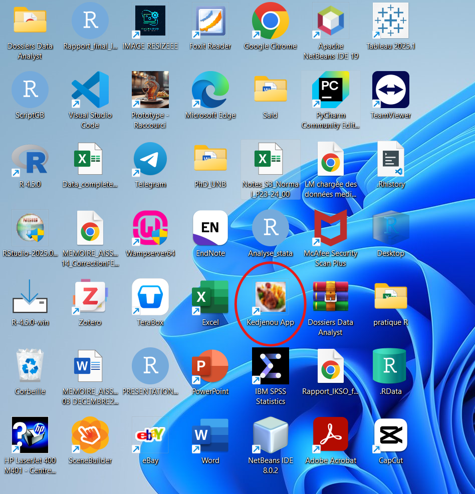
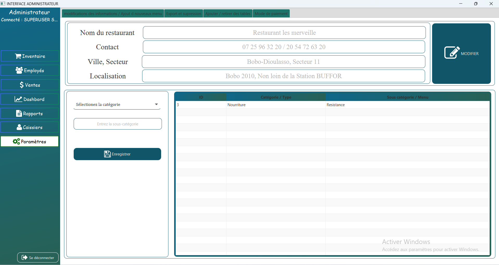

# Présentation de l'application **KedjenouXpress 🍗**

|       **KedjenouXpress** est une application de gestion de ventes conçue pour simplifier les opérations commerciales dans la restauration. Elle a été développée en `2024` pour remplacer les méthodes manuelles et offrir une solution numérique rapide, intuitive et efficace.

L'interface utilisateur bénéficie d'un design moderne et agréable, grâce à l'utilisation de styles personnalisés en **CSS** pour améliorer l'expérience visuelle et l'ergonomie.

**Skills** : **`Java`**, **`JavFx`**, **`MySql`**, **`Modélisation UML`**, **`POO`**

---

## Technologies utilisées

Les outils et technologies suivants ont été utilisés pour développer le logiciel :

-   **Java (version 8.2)** : choisi pour sa stabilité et sa compatibilité avec le développement d'applications de bureau.
-   **NetBeans** : utilisé comme environnement de développement intégré (IDE) pour sa simplicité et sa bonne intégration avec Java.
-   **WAMP** : utilisé pour héberger localement la base de données et assurer la communication entre l'application et les données, avec **MySQL** comme système de gestion de base de données relationnelle.

---

## Liens de téléchargement

-   **Java (JDK 8)** : [Télécharger Java JDK (version 8)](https://www.oracle.com/java/technologies/javase/javase8-archive-downloads.html)\
-   **NetBeans IDE** : [Télécharger NetBeans](https://netbeans.apache.org/download/index.html)\
-   **WAMP Server** : [Télécharger WAMP](https://www.wampserver.com/)

---

## Installation de WAMP Server

WAMP Server (Windows, Apache, MySQL, PHP) est un environnement de développement web local. Avant de l'installer, il est important de s'assurer que certaines **dépendances logicielles** sont présentes sur votre système.

- **1. Dépendances à installer**

WAMP Server nécessite plusieurs versions du **Microsoft Visual C++ Redistributable**, indispensables au bon fonctionnement d'Apache, MySQL et PHP. Ces bibliothèques sont parfois installées automatiquement, mais il est recommandé de les vérifier avant.

>>> **Versions requises les plus courantes**

-   Visual C++ 2008 (x86 et x64)
-   Visual C++ 2010 (x86 et x64)
-   Visual C++ 2012 (x86 et x64)
-   Visual C++ 2013 (x86 et x64)
-   Visual C++ 2015-2022 (x86 et x64)

🔗 **Télécharger toutes les versions nécessaires** ici :\
<https://learn.microsoft.com/en-us/cpp/windows/latest-supported-vc-redist>

- **2. Téléchargement de WAMP**

-   Accédez au site officiel : <https://www.wampserver.com>
-   Téléchargez la version correspondant à votre système (32 bits ou 64 bits).
-   Enregistrez le fichier `.exe` sur votre ordinateur.

- **3. Installation**

-   Lancez le fichier téléchargé (clic droit \> Exécuter en tant qu'administrateur).
-   Suivez les instructions de l'assistant d'installation :
    -   Acceptez le contrat de licence.
    -   Choisissez le répertoire d'installation (par défaut : `C:\wamp64\`).
    -   Sélectionnez votre navigateur par défaut si demandé.
    -   Choisissez également votre éditeur de texte préféré (Notepad++ par exemple).
-   Terminez l'installation.

- **4. Démarrage de WAMP**

-   Ouvrez **WAMP Server** via le menu Démarrer.

-   Une icône apparaît dans la barre des tâches :

    -   🟢 **Vert** : tous les services fonctionnent.

    -   🟡 **Orange** : un ou plusieurs services sont arrêtés.

    -   🔴 **Rouge** : aucun service ne fonctionne.

- **5. Vérification**

-   Cliquez sur l'icône WAMP \> "Localhost" : une page de bienvenue doit s'afficher.
-   Vous pouvez accéder à **phpMyAdmin** pour créer et gérer vos bases de données MySQL.

---

## Architecture de l'application (Modèle MVC)

|       L'architecture adoptée pour cette application repose sur le modèle **MVC** (*Modèle-Vue-Contrôleur*), un **patron de conception logiciel** qui vise à **séparer clairement les responsabilités** dans une application, particulièrement celles disposant d'une interface utilisateur graphique.

Ce découpage permet d'obtenir un code plus **lisible**, **maintenable**, et **facilement évolutif**. Cela facilite également le travail collaboratif en isolant les tâches : un développeur peut travailler sur la logique métier (modèle) pendant qu'un autre se concentre sur l'interface (vue).

Le modèle `MVC` est composé de **trois éléments fondamentaux** :

- **1. Modèle (Model)**

|       Le **modèle** contient les **données de l'application** ainsi que la **logique métier**. Il est responsable de la création, la mise à jour et la validation des données. Il ne s'occupe jamais de l'affichage.

**Exemple**

``` .java
public class Personne {
    private String nom;
    private int age;

    // Constructeur
    public Personne(String nom, int age) {
        this.nom = nom;
        this.age = age;
    }

    // Accesseurs (getters)
    public String getNom() {
        return nom;
    }

    public int getAge() {
        return age;
    }

    // Modificateurs (setters)
    public void setNom(String nom) {
        this.nom = nom;
    }

    public void setAge(int age) {
        if (age >= 0) {
            this.age = age;
        } else {
            System.out.println("L'âge doit être positif.");
        }
    }

    // Méthode d'affichage (optionnelle)
    public void afficherInfos() {
        System.out.println("Nom : " + nom + ", Âge : " + age);
    }
}
```

- **2. Vue (View)**

|       La **vue** est responsable de l'**affichage des données à l'utilisateur**. Elle ne contient **aucune logique métier**. Son objectif est uniquement de présenter visuellement les informations issues du modèle et de transmettre les actions de l'utilisateur au contrôleur.

**Exemple FXML (JavaFX)** d'une vue simple avec un bouton :

```md
<?xml version="1.0" encoding="UTF-8"?>

<?import javafx.scene.control.*?>
<?import javafx.scene.layout.*?>

<AnchorPane xmlns:fx="http://javafx.com/fxml" fx:controller="monappli.controllers.PersonneController">
    <children>
        <Button text="Afficher les infos" layoutX="100" layoutY="80" onAction="#afficherInfos"/>
    </children>
</AnchorPane>
```

Ce fichier FXML définit une fenêtre avec un bouton qui, lorsqu'il est cliqué, déclenche une méthode du contrôleur (nommée `afficherInfos`).

- **3. Contrôleur (Controller)**

|       Le **contrôleur** fait le lien entre la **vue** et le **modèle**. Il :

-   intercepte les **actions de l'utilisateur** (clics, saisies, etc.),
-   met à jour le **modèle** en fonction des actions,
-   demande à la **vue** de s'actualiser.

**Exemple de classe contrôleur JavaFX associée à la vue précédente :**

``` .java
package monappli.controllers;

import javafx.event.ActionEvent;
import javafx.fxml.FXML;
import monappli.models.Personne;

public class PersonneController {
    private Personne personne;

    public PersonneController() {
        // Création d'un objet Personne par défaut
        this.personne = new Personne("Jean", 28);
    }

    @FXML
    public void afficherInfos(ActionEvent event) {
        personne.afficherInfos();
    }
}
```

---

## Gestion de la base de données

|       Pour la gestion des données, le projet s'appuie sur **MySQL**, un *système de gestion de base de données relationnelle (SGBDR)* largement utilisé dans les applications professionnelles. L'interaction entre l'application Java et la base de données a été rendue possible grâce au **package `mysql-connector-java`**, téléchargé puis intégré comme **dépendance** dans le projet.

Cela a permis de **stocker localement les données**, d'assurer leur **persistence** et d'y accéder efficacement via des **requêtes SQL**.

>> **Requêtes SQL utilisées**

Plusieurs types de requêtes ont été implémentés dans le cadre de ce projet, notamment :

-   `INSERT INTO` : pour l'insertion de nouvelles données (ex. : ajout d'un produit ou d'un utilisateur) ;
-   `SELECT` : pour la récupération et l'affichage des données (liste des ventes, employés, inventaire, etc.) ;
-   `UPDATE` : pour la mise à jour d'enregistrements (ex. : modifier un produit) ;
-   `DELETE` : pour la suppression de données obsolètes ou incorrectes.

>> **Optimisation par jointures**

|       Des **jointures (`JOIN`)** ont également été utilisées pour relier plusieurs tables par exemple, les ventes, les utilisateurs et les produits, afin de produire des rapports détaillés, et **d'optimiser les filtres et recherches complexes**.

> **Remarque** : Cette architecture relationnelle a été choisie pour sa **fiabilité**, sa **performance** et sa **compatibilité** avec les outils de développement Java.

---

# Présentation de l'interface

## Demarrage de l'application

|       Après la compilation et la transformation en application exécutable, les dépendances nécessaires notamment `Java 8.2` pour le bon fonctionnement des packages requis, ainsi que le serveur WAMP pour la gestion des bases de données doivent être installées sur la machine réceptrice. Une fois ces étapes terminées, un raccourci de l'application est créé et placé sur le bureau.

```{r, echo=FALSE}
#| fig-cap: "Icone de l' application"
#| label: iconeapplibureau

```


Pour démarrer l'application, il est recommandé de faire un `clic droit` sur l'`icône de l'application`, puis de sélectionner `Exécuter en tant qu'administrateur`. Cela ouvrira la première page, qui correspond à la page d'accueil.

---

## Écran d'accueil

|       Au démarrage de l'application, une interface d'accueil a été développée. Elle permet à l'utilisateur de se connecter soit en `mode administrateur`, soit en `mode utilisateur`. Chaque mode requiert la saisie d'un `identifiant` et d'un `mot de passe`.

Un `bouton "Quitter"` est également disponible en bas de l'écran. En cas de tentative de fermeture de l'application, une `boîte de confirmation` s'affiche afin d'éviter toute fermeture accidentelle.

**Vidéo de démonstration**



---

## Partie Administrateur

|       La section `Administrateur` de l'application est constituée de `six interfaces principales`, chacune ayant un rôle spécifique dans la gestion et le suivi des activités. Ces interfaces sont les suivantes (vous pouvez visualiser les vidéos):

**1. `Inventaires`** : permet l'enregistrement et la gestion des `produits` disponibles en stock.





**2. `Employés`** : destinée à l'enregistrement et au suivi des `employés` (vendeurs, caissiers, etc.).





**3. `Ventes`** : affiche la liste des **produits vendus** et permet de suivre les transactions réalisées.





**4. `Tableau de bord (Dashboard)`** : fournit une vue **récapitulative** des ventes et autres indicateurs clés pour une vision globale de l'activité.





**5. ``Rapports``** : génère et permet d'**imprimer des rapports de vente**, facilitant ainsi l'analyse et le suivi.





**6. `Paramètres`** : offre des options de **`personnalisation de l'application`** - changement du nom de l'entreprise, de l'adresse, des informations de contact, etc.


```{r, fig.align='center', out.width="90%", out.height="80%", echo=FALSE}
#| fig-cap: "Interface Admin- Paramètre"
#| label: settings

```

---

## Utilisateurs

|       Cette interface a été conçue pour être utilisée par les **`vendeurs`** ou **`caissiers`** opérant dans l'entreprise. Elle se compose de **`quatre sous-interfaces`**, chacune ayant un rôle bien défini :

**1. `Interface principale`**

Elle permet :

-   de **vendre un produit en stock**,
-   d'**imprimer la facture** de la commande une fois validée,
-   d'**enregistrer le mode de paiement** : en espèces (cash), via des services de monnaie électronique (**Orange Money**, **Moov Money**) ou encore d'enregistrer une **commande différée**, à régler ultérieurement.

**2. `Interface "Voir Commande`**

Cette interface permet de :

-   **rechercher une commande en attente**,
-   **valider** ou **annuler** une commande lancée précédemment.

**3. `Interface "Gérer les rapports de vente`**

Elle offre la possibilité de :

-   **sélectionner une date ou une plage de dates**,
-   **imprimer les ventes réalisées** par le caissier connecté,
-   **afficher le total des ventes**, à la fois en montant (prix) et en quantité pour la période sélectionnée.





**4. `Interface État des serveurs`**

Cette dernière interface donne une vue d'ensemble sur :

-   les **quantités** et **totaux vendus**,
-   répartis **par serveur** (vendeur),
-   afin de faciliter le **suivi des performances individuelles**.


**NB : Cette interface est également accessible depuis la section Administrateur, ce qui permet à la direction de superviser les activités des vendeurs en temps réel.**

---
