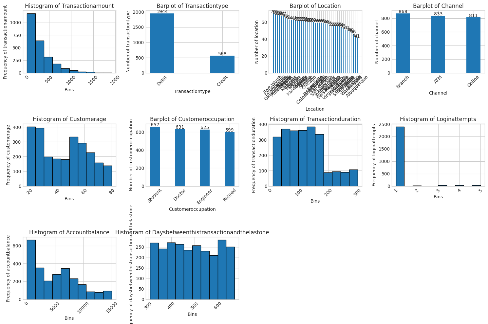
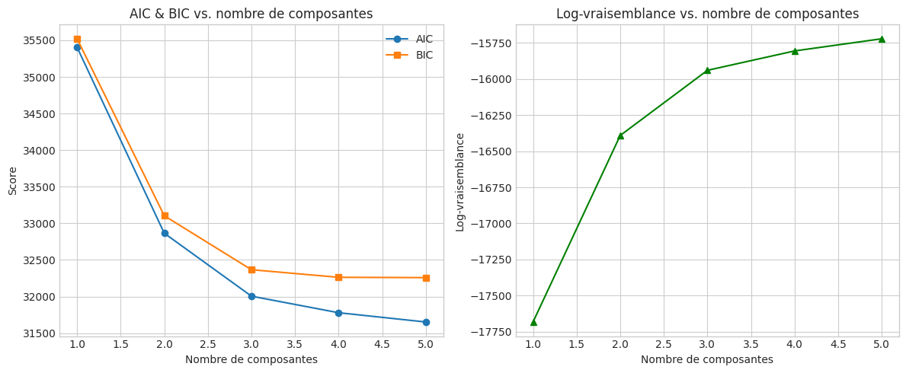
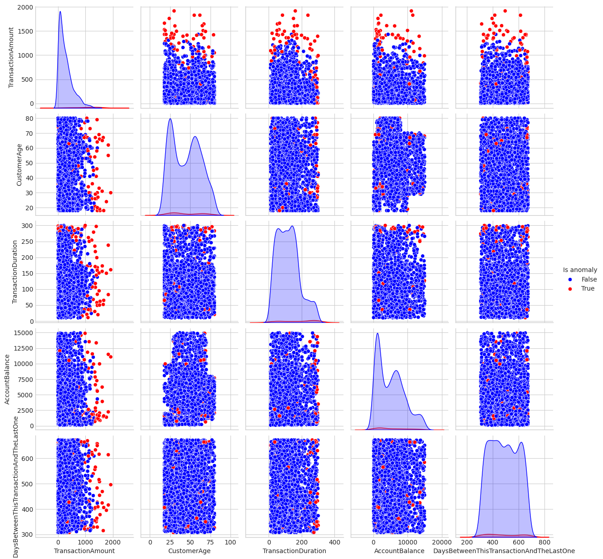

## Introduction

|       La détection de fraudes sur les transactions bancaires est un enjeu majeur pour les institutions financières. Les méthodes traditionnelles basées sur des règles statiques peinent à s’adapter aux schémas de fraude de plus en plus sophistiqués. Dès 2002, Bolton & Hand ont proposé un modèle statistique pour identifier les anomalies transactionnelles [@Bolton2002]. Depuis, de nombreuses approches ont émergé, à la fois supervisées et non supervisées, offrant des performances variables selon la disponibilité de données étiquetées, la diversité des comportements normaux et la capacité à détecter de nouvelles formes de fraude [@Phua2010; @Ngai2011; @Chalapathy2019].

> **Note**  
> Le notebook ainsi que toutes ses dépendances sont disponibles sur GitHub :  
> [Cliquez ici pour cccéder au dépôt](https://github.com/Djamal029/ANOMALY_DETECTION_GMM)


## Méthodologie

|       Pour ce mini-projet, nous adopterons une approche non supervisée utilisant un Gaussian Mixture Model (`GMM`). Le `GMM` permet de modéliser la distribution sous-jacente des transactions légitimes par une combinaison de gaussiennes, et d'identifier les observations présentant une faible vraisemblance comme anomalies [@Bishop2006].

Les étapes principales sont:

- **Prétraitement des données**:

  - Sélection des variables pertinentes (montant, temporalité, etc.);

  - Nettoyage, transformation et mise à l’échelle [@Hastie2009]

- **Estimation du GMM**:

  - Choix du nombre de composantes par critères AIC/BIC [@Schwarz1978]

  - Ajustement du modèle sur les données normalisées

- **Détection des anomalies**:

  - Calcul de la log-vraisemblance pour chaque transaction

  - Définition d’un seuil basé sur un percentile (par exemple 1%) pour isoler les transactions suspectes [@Ngai2011]

## Pratique


::: {.cell}

:::


::: {.cell}
::: {.cell-output .cell-output-stdout}

```
   Unnamed: 0 TransactionID  ... AccountBalance  PreviousTransactionDate
0           0      TX000001  ...        5112.21      2024-11-04 08:08:08
1           1      TX000002  ...       13758.91      2024-11-04 08:09:35
2           2      TX000003  ...        1122.35      2024-11-04 08:07:04
3           3      TX000004  ...        8569.06      2024-11-04 08:09:06
4           4      TX000005  ...        7429.40      2024-11-04 08:06:39

[5 rows x 17 columns]
```


:::
:::


**About Dataset** (From kaggle ([link](https://www.kaggle.com/datasets/valakhorasani/bank-transaction-dataset-for-fraud-detection)))

$\quad$ This dataset provides a detailed look into transactional behavior and financial activity patterns, ideal for exploring fraud detection and anomaly identification. It contains 2,512 samples of transaction data, covering various transaction attributes, customer demographics, and usage patterns. Each entry offers comprehensive insights into transaction behavior, enabling analysis for financial security and fraud detection applications.

**Key Features:**

- `TransactionID`: Unique alphanumeric identifier for each transaction.

- `AccountID`: Unique identifier for each account, with multiple transactions per account.

- `TransactionAmount`: Monetary value of each transaction, ranging from small everyday expenses to larger purchases.

- `TransactionDate`: Timestamp of each transaction, capturing date and time.

- `TransactionType`: Categorical field indicating 'Credit' or 'Debit' transactions.

- `Location`: Geographic location of the transaction, represented by U.S. city names.

- `DeviceID`: Alphanumeric identifier for devices used to perform the transaction.

- `IP Address`: IPv4 address associated with the transaction, with occasional changes for some accounts.

- `MerchantID`: Unique identifier for merchants, showing preferred and outlier merchants for each account.

- `AccountBalance`: Balance in the account post-transaction, with logical correlations based on transaction type and amount.

- `PreviousTransactionDate`: Timestamp of the last transaction for the account, aiding in calculating transaction frequency.

- `Channel`: Channel through which the transaction was performed (e.g., Online, ATM, Branch).

- `CustomerAge`: Age of the account holder, with logical groupings based on occupation.

- `CustomerOccupation`: Occupation of the account holder (e.g., Doctor, Engineer, Student, Retired), reflecting income patterns.

- `TransactionDuration`: Duration of the transaction in seconds, varying by transaction type.

- `LoginAttempts`: Number of login attempts before the transaction, with higher values indicating potential anomalies.

This dataset is ideal for data scientists, financial analysts, and researchers looking to analyze transactional patterns, detect fraud, and build predictive models for financial security applications. The dataset was designed for machine learning and pattern analysis tasks and is not intended as a primary data source for academic publications.


::: {.cell}
::: {.cell-output .cell-output-stdout}

```
<class 'pandas.core.frame.DataFrame'>
RangeIndex: 2512 entries, 0 to 2511
Data columns (total 17 columns):
 #   Column                   Non-Null Count  Dtype  
---  ------                   --------------  -----  
 0   Unnamed: 0               2512 non-null   int64  
 1   TransactionID            2512 non-null   object 
 2   AccountID                2512 non-null   object 
 3   TransactionAmount        2512 non-null   float64
 4   TransactionDate          2512 non-null   object 
 5   TransactionType          2512 non-null   object 
 6   Location                 2512 non-null   object 
 7   DeviceID                 2512 non-null   object 
 8   IP Address               2512 non-null   object 
 9   MerchantID               2512 non-null   object 
 10  Channel                  2512 non-null   object 
 11  CustomerAge              2512 non-null   int64  
 12  CustomerOccupation       2512 non-null   object 
 13  TransactionDuration      2512 non-null   int64  
 14  LoginAttempts            2512 non-null   int64  
 15  AccountBalance           2512 non-null   float64
 16  PreviousTransactionDate  2512 non-null   object 
dtypes: float64(2), int64(4), object(11)
memory usage: 333.8+ KB
```


:::
:::


::: {.cell}
::: {.cell-output .cell-output-stdout}

```
Unnamed: 0                 0
TransactionID              0
AccountID                  0
TransactionAmount          0
TransactionDate            0
TransactionType            0
Location                   0
DeviceID                   0
IP Address                 0
MerchantID                 0
Channel                    0
CustomerAge                0
CustomerOccupation         0
TransactionDuration        0
LoginAttempts              0
AccountBalance             0
PreviousTransactionDate    0
dtype: int64
```


:::
:::


$\quad$ Certaines variables, bien que nettoyées et sans valeurs manquantes, n’ont pas été exploitées dans l’analyse principale :  
- **TransactionID**  
- **AccountID**  
- **DeviceID**  
- **IP Address**  
- **MerchantID**  

Toutefois, selon l’objectif visé, certaines d’entre elles pourraient s’avérer très pertinentes:  
- **AccountID**: détection de comptes à risque, suivi des comportements de chaque titulaire,  
- **IP Address**: analyse spatiale et traçage géographique des connexions,  
- **MerchantID**: étude du comportement des commerçants et détection d’anomalies spécifiques à certains points de vente. 

Pour des raisons éthiques, ces détails ne seront pas explorées dans le cadre de cet **mini-projet**, car nous ne savons pas si les ID sont réels ou pas.


::: {.cell}
::: {.cell-output .cell-output-stdout}

```
   TransactionAmount  ... PreviousTransactionDate
0              14.09  ...     2024-11-04 08:08:08
1             376.24  ...     2024-11-04 08:09:35
2             126.29  ...     2024-11-04 08:07:04
3             184.50  ...     2024-11-04 08:09:06
4              13.45  ...     2024-11-04 08:06:39

[5 rows x 11 columns]
```


:::
:::


|       Les variables `TransactionDate` et `PreviousTransactionDate` peuvent nous servir à calculer une variables plus informative et utilisable qui est `TimeBetweenThisTransactionAndTheLastOne` qui pourrait être en heures ou en secondes en fonction des valeurs obtenues de la différence entre ces deux dates.


::: {.cell}
::: {.cell-output .cell-output-stdout}

```
   TransactionAmount  ... TimeBetweenThisTransactionAndTheLastOne
0              14.09  ...                                13743.65
1             376.24  ...                                11895.42
2             126.29  ...                                11581.85
3             184.50  ...                                13167.62
4              13.45  ...                                 9230.25

[5 rows x 10 columns]
```


:::
:::


::: {.cell}
::: {.cell-output .cell-output-stdout}

```
count     2512.000000
mean     11699.619928
std       2553.112387
min       7381.750000
25%       9469.435000
50%      11654.350000
75%      13935.792500
max      16120.190000
Name: TimeBetweenThisTransactionAndTheLastOne, dtype: float64
```


:::
:::

On pourrait même convertir cela en nombre de jours car le minimum est de `7381.75` heures.


::: {.cell}
::: {.cell-output .cell-output-stdout}

```
   TransactionAmount  ... DaysBetweenThisTransactionAndTheLastOne
0              14.09  ...                                   573.0
1             376.24  ...                                   496.0
2             126.29  ...                                   483.0
3             184.50  ...                                   549.0
4              13.45  ...                                   385.0

[5 rows x 10 columns]
```


:::
:::


::: {.cell}
::: {.cell-output .cell-output-stdout}

```
count    2512.000000
mean      487.857882
std       106.378910
min       308.000000
25%       395.000000
50%       486.000000
75%       581.000000
max       672.000000
Name: DaysBetweenThisTransactionAndTheLastOne, dtype: float64
```


:::
:::


|       Il est apparaît surprenant que qu'il y'ai autant de jour entre deux transaction. Nous n'avons pas fait d'erreur de calcul car si vous monter un peu plus haut et en regardant les colonnes `TransactionDate` and `PreviousTransactionDate` vous verrez que cet écart peut s'expliquer par diverses raisons sauf par une erreur de calcul de notre part. 


::: {.cell}

:::


```{.python}
import math
var_list = list(df_reduced.columns.values)
figsize = (12, 8)
n_vars = len(var_list)
# calcul automatique du nombre de colonnes si non fourni
ncols = int(math.ceil(math.sqrt(n_vars)))
nrows = int(math.ceil(n_vars / ncols))
fig, axes = plt.subplots(nrows=nrows, ncols=ncols, figsize=figsize)
axes = axes.flatten() 
plt.subplots_adjust(hspace=0.4, wspace=0.4)
bins_ = 20
for i in range(len(var_list)):
    var_name = var_list[i]
    if df_reduced[var_name].dtype in ['categorical', 'object']:
        plot_bar(df=df_reduced, var_name=var_name, ax=axes[i])
    else:
        plot_hist(df=df_reduced, var_name=var_name, ax=axes[i])

for j in range(len(var_list), len(axes)):
    axes[j].set_visible(False)

plt.tight_layout()
#plt.suptitle('Variables distribution')
plt.show()
```


::: {.cell layout-align="center"}
::: {.cell-output-display}
{#fig-var-dist fig-align='center' width=95% height=90%}
:::
:::


|       On arrive à voir que nous avons énormément de zones ou regions de transactions. On peut aussi constater que le nombre de tentatives de connexion est discret avec des valeurs faibles (à prendre en compte dans la modélisation future).


::: {.cell}
::: {.cell-output .cell-output-stdout}

```
Location
Fort Worth          70
Los Angeles         69
Oklahoma City       68
Charlotte           68
Tucson              67
Philadelphia        67
Omaha               65
Miami               64
Detroit             63
Houston             63
Memphis             63
Denver              62
Kansas City         61
Boston              61
Mesa                61
Atlanta             61
Seattle             61
Colorado Springs    60
Jacksonville        60
Fresno              60
Chicago             60
Austin              59
San Jose            59
Raleigh             59
San Antonio         59
San Diego           59
Indianapolis        58
New York            58
San Francisco       57
Nashville           55
Milwaukee           55
Las Vegas           55
Virginia Beach      55
Phoenix             55
Columbus            54
Sacramento          53
Baltimore           51
Louisville          51
Dallas              49
Washington          48
El Paso             46
Portland            42
Albuquerque         41
Name: count, dtype: int64
```


:::
:::


|       Imaginons que nous n’ayons que des données continues pour detecter les anomalies. Appliquons un modèle de mélange gaussien. 


### Log-vraisemblance complète dans un GMM

Soit :

- $X = \{x_1, \ldots, x_n\}$ : les données observées,
- $Z = \{z_1, \ldots, z_n\}$ : les variables latentes (composantes d’appartenance),
- $\Theta = \{ \pi_k, \mu_k, \Sigma_k \}_{k=1}^K$ : les paramètres du modèle,
- $z_{ik} = 1$ si $x_i$ appartient à la composante $k$, sinon $0$.

- **Vraisemblance complète**

On suppose que l’observation $x_i$ vient de la composante $k$ avec une probabilité $\pi_k$, et que la distribution conditionnelle est gaussienne :

$$
p(X, Z \mid \Theta) = \prod_{i=1}^n \prod_{k=1}^K \left[ \pi_k \, \mathcal{N}(x_i \mid \mu_k, \Sigma_k) \right]^{z_{ik}}
$$

- **Log-vraisemblance augmentée**

En prenant le logarithme, on obtient la log-vraisemblance augmentée :

$$
\log p(X, Z \mid \Theta) = \sum_{i=1}^n \sum_{k=1}^K z_{ik} \left( \log \pi_k + \log \mathcal{N}(x_i \mid \mu_k, \Sigma_k) \right)
$$

- L’algorithme EM maximise l’espérance de cette quantité (appelée **Q-fonction**) dans l’étape E :
  
$$
Q(\Theta \mid \Theta^{\text{old}}) = \mathbb{E}_{Z \mid X, \Theta^{\text{old}}} [ \log p(X, Z \mid \Theta) ]
$$


- **Algorithme EM pour un modèle de mélange gaussien (GMM)**

|       Soit un jeu de données $X = \{ x_1, x_2, \ldots, x_n \}$ avec $n$ observations,  et un GMM avec $K$ composantes. En vous épargnant de la résolution du problème : $\Theta = argmax \log p(X, Z \mid \Theta)$

- **Initialisation**

Initialiser les paramètres du modèle pour chaque composante $k = 1, \ldots, K$ :

- Les poids : $\pi_k$, avec $\sum_{k=1}^K \pi_k = 1$ et $\pi_k > 0$,
- Les moyennes : $\mu_k \in \mathbb{R}^d$,
- Les matrices de covariance : $\Sigma_k \in \mathbb{R}^{d \times d}$.


- **Étape 1 : Expectation (E-step)**

Pour chaque observation $x_i$, calculer la responsabilité $\gamma_{ik}$ qui est la probabilité que $x_i$ appartienne à la composante $k$, donnée les paramètres actuels :

$$
\gamma_{ik} = \frac{\pi_k \, \mathcal{N}(x_i \mid \mu_k, \Sigma_k)}{\sum_{j=1}^K \pi_j \, \mathcal{N}(x_i \mid \mu_j, \Sigma_j)}
$$

où $\mathcal{N}(x \mid \mu, \Sigma)$ est la densité de la loi normale multivariée.


- **Étape 2 : Maximisation (M-step)**

Mettre à jour les paramètres $\pi_k$, $\mu_k$, $\Sigma_k$ en fonction des responsabilités calculées :

- Mise à jour des poids :

$$
\pi_k = \frac{1}{n} \sum_{i=1}^n \gamma_{ik}
$$

- Mise à jour des moyennes :

$$
\mu_k = \frac{\sum_{i=1}^n \gamma_{ik} x_i}{\sum_{i=1}^n \gamma_{ik}}
$$

- Mise à jour des covariances :

$$
\Sigma_k = \frac{\sum_{i=1}^n \gamma_{ik} (x_i - \mu_k)(x_i - \mu_k)^T}{\sum_{i=1}^n \gamma_{ik}}
$$


- **Répéter**

Répéter les étapes **E** et **M** jusqu'à convergence, c’est-à-dire jusqu’à ce que la variation de la log-vraisemblance soit très faible ou qu’un nombre maximal d’itérations soit atteint.


- **Résumé**

| Étape          | Description                                             |
|----------------|---------------------------------------------------------|
| Initialisation | Fixer $\pi_k, \mu_k, \Sigma_k$ pour $k=1,\ldots,K$      |
| E-step         | Calculer les responsabilités $\gamma_{ik}$              |
| M-step         | Mettre à jour $\pi_k, \mu_k, \Sigma_k$                   |
| Répéter       | Jusqu’à convergence                                      |


::: {.cell}
::: {.cell-output .cell-output-stdout}

```
   TransactionAmount  ...  DaysBetweenThisTransactionAndTheLastOne
0              14.09  ...                                    573.0
1             376.24  ...                                    496.0
2             126.29  ...                                    483.0
3             184.50  ...                                    549.0
4              13.45  ...                                    385.0

[5 rows x 5 columns]
```


:::
:::


|       Nous disposons des variables suivantes : le montant de la transaction, l'âge du client, la durée de la transaction, le solde du compte, ainsi que le nombre de jours écoulés depuis la dernière transaction.  

Afin d'appliquer un modèle de mélange gaussien (GMM) à ces données, il est nécessaire de choisir un nombre optimal de composantes. En pratique, ce choix repose souvent sur des critères d'information tels que le **Critère d'Information d'Akaike (AIC)** ou le **Critère d'Information Bayésien (BIC)**. Plus ces critères sont faibles, meilleur est le modèle. Toutefois, il convient de rester vigilant face au risque de **surapprentissage** : un modèle trop complexe (avec trop de composantes) peut s'ajuster parfaitement aux données d'apprentissage mais perdre en capacité de généralisation.  

Dans le cadre de l’apprentissage **non supervisé**, l’évaluation du modèle est plus délicate, car nous ne disposons pas de labels permettant de valider la qualité de la segmentation. Dans certains cas, un petit échantillon d’exemples étiquetés comme anomalies est disponible, ce qui permet une évaluation ciblée du modèle entraîné. Mais dans notre situation, aucune étiquette n’est fournie, ce qui rend l’évaluation entièrement dépendante de critères internes tels que l’**AIC** (Akaike Information Criterion) et le **BIC** (Bayesian Information Criterion).

En complément, nous pouvons également calculer les **log-vraisemblances complètes** pour différents nombres de composantes, afin de visualiser la qualité d’ajustement du modèle. Enfin, une stratégie consiste à définir un **seuil d’anomalie** à partir de la distribution des log-vraisemblances : par exemple, en retenant le **5e percentile**, les observations les moins vraisemblables (c’est-à-dire situées dans les 5 % les plus faibles) seront considérées comme potentiellement anormales.


```{.python}
from sklearn.mixture import GaussianMixture
import matplotlib.pyplot as plt
from sklearn.preprocessing import StandardScaler

# Préparation des données
X_scaled = scaler.fit_transform(df_continuous)

# Paramètres
n_components_range = range(1, 6)
aic, bic, log_lik = [], [], []

# Entraînement et évaluation du modèle
for n in n_components_range:
    gmm = GaussianMixture(n_components=n, random_state=RANDOM_STATE)
    gmm.fit(X_scaled)
    aic.append(gmm.aic(X_scaled))
    bic.append(gmm.bic(X_scaled))
    log_lik.append(gmm.score(X_scaled) * len(X_scaled))

# Visualisation
ig, axes = plt.subplots(1, 2, figsize=(12, 6))

# AIC & BIC
axes[0].plot(n_components_range, aic, label='AIC', linestyle='-', marker='o')
axes[0].plot(n_components_range, bic, label='BIC', linestyle='-', marker='s')
axes[0].set_title("AIC & BIC vs. nombre de composantes", fontsize=10)
axes[0].set_xlabel("Nombre de composantes")
axes[0].set_ylabel("Score AIC/BIC")
axes[0].legend()
axes[0].grid(True)

# Log-vraisemblance
axes[1].plot(n_components_range, log_lik, label='Log-vraisemblance', color='green', marker='^')
axes[1].set_title("Log-vraisemblance vs. nombre de composantes", fontsize=10)
axes[1].set_xlabel("Nombre de composantes")
axes[1].set_ylabel("Log-vraisemblance")
axes[1].grid(True)

plt.tight_layout(pad=4)
plt.show()

```


::: {.cell layout-align="center"}
::: {.cell-output-display}
{#fig-selecting-components fig-align='center' width=95% height=90%}
:::
:::


|       On observe que plus le nombre de composantes augmente, plus les scores d’AIC et de BIC diminuent. Cependant, le **BIC** se stabilise à partir de la troisième composante, tandis que l’**AIC** continue de diminuer légèrement jusqu’à la cinquième. Cette divergence suggère qu’au-delà de trois composantes, le modèle pourrait être sujet à un **surapprentissage**.

Par ailleurs, l’évolution de la **log-vraisemblance complète** montre une augmentation nette entre une et trois composantes, suivie d’une progression beaucoup plus faible au-delà. Ces observations concordantes justifient le choix d’un modèle avec **trois composantes**, qui représente un bon compromis entre qualité d’ajustement et complexité.


::: {.cell}

:::


::: {.cell}
::: {.cell-output-display}

```{=html}
<style>#sk-container-id-1 {color: black;}#sk-container-id-1 pre{padding: 0;}#sk-container-id-1 div.sk-toggleable {background-color: white;}#sk-container-id-1 label.sk-toggleable__label {cursor: pointer;display: block;width: 100%;margin-bottom: 0;padding: 0.3em;box-sizing: border-box;text-align: center;}#sk-container-id-1 label.sk-toggleable__label-arrow:before {content: "▸";float: left;margin-right: 0.25em;color: #696969;}#sk-container-id-1 label.sk-toggleable__label-arrow:hover:before {color: black;}#sk-container-id-1 div.sk-estimator:hover label.sk-toggleable__label-arrow:before {color: black;}#sk-container-id-1 div.sk-toggleable__content {max-height: 0;max-width: 0;overflow: hidden;text-align: left;background-color: #f0f8ff;}#sk-container-id-1 div.sk-toggleable__content pre {margin: 0.2em;color: black;border-radius: 0.25em;background-color: #f0f8ff;}#sk-container-id-1 input.sk-toggleable__control:checked~div.sk-toggleable__content {max-height: 200px;max-width: 100%;overflow: auto;}#sk-container-id-1 input.sk-toggleable__control:checked~label.sk-toggleable__label-arrow:before {content: "▾";}#sk-container-id-1 div.sk-estimator input.sk-toggleable__control:checked~label.sk-toggleable__label {background-color: #d4ebff;}#sk-container-id-1 div.sk-label input.sk-toggleable__control:checked~label.sk-toggleable__label {background-color: #d4ebff;}#sk-container-id-1 input.sk-hidden--visually {border: 0;clip: rect(1px 1px 1px 1px);clip: rect(1px, 1px, 1px, 1px);height: 1px;margin: -1px;overflow: hidden;padding: 0;position: absolute;width: 1px;}#sk-container-id-1 div.sk-estimator {font-family: monospace;background-color: #f0f8ff;border: 1px dotted black;border-radius: 0.25em;box-sizing: border-box;margin-bottom: 0.5em;}#sk-container-id-1 div.sk-estimator:hover {background-color: #d4ebff;}#sk-container-id-1 div.sk-parallel-item::after {content: "";width: 100%;border-bottom: 1px solid gray;flex-grow: 1;}#sk-container-id-1 div.sk-label:hover label.sk-toggleable__label {background-color: #d4ebff;}#sk-container-id-1 div.sk-serial::before {content: "";position: absolute;border-left: 1px solid gray;box-sizing: border-box;top: 0;bottom: 0;left: 50%;z-index: 0;}#sk-container-id-1 div.sk-serial {display: flex;flex-direction: column;align-items: center;background-color: white;padding-right: 0.2em;padding-left: 0.2em;position: relative;}#sk-container-id-1 div.sk-item {position: relative;z-index: 1;}#sk-container-id-1 div.sk-parallel {display: flex;align-items: stretch;justify-content: center;background-color: white;position: relative;}#sk-container-id-1 div.sk-item::before, #sk-container-id-1 div.sk-parallel-item::before {content: "";position: absolute;border-left: 1px solid gray;box-sizing: border-box;top: 0;bottom: 0;left: 50%;z-index: -1;}#sk-container-id-1 div.sk-parallel-item {display: flex;flex-direction: column;z-index: 1;position: relative;background-color: white;}#sk-container-id-1 div.sk-parallel-item:first-child::after {align-self: flex-end;width: 50%;}#sk-container-id-1 div.sk-parallel-item:last-child::after {align-self: flex-start;width: 50%;}#sk-container-id-1 div.sk-parallel-item:only-child::after {width: 0;}#sk-container-id-1 div.sk-dashed-wrapped {border: 1px dashed gray;margin: 0 0.4em 0.5em 0.4em;box-sizing: border-box;padding-bottom: 0.4em;background-color: white;}#sk-container-id-1 div.sk-label label {font-family: monospace;font-weight: bold;display: inline-block;line-height: 1.2em;}#sk-container-id-1 div.sk-label-container {text-align: center;}#sk-container-id-1 div.sk-container {/* jupyter's `normalize.less` sets `[hidden] { display: none; }` but bootstrap.min.css set `[hidden] { display: none !important; }` so we also need the `!important` here to be able to override the default hidden behavior on the sphinx rendered scikit-learn.org. See: https://github.com/scikit-learn/scikit-learn/issues/21755 */display: inline-block !important;position: relative;}#sk-container-id-1 div.sk-text-repr-fallback {display: none;}</style><div id="sk-container-id-1" class="sk-top-container"><div class="sk-text-repr-fallback"><pre>GaussianMixture(n_components=3, random_state=42)</pre><b>In a Jupyter environment, please rerun this cell to show the HTML representation or trust the notebook. <br />On GitHub, the HTML representation is unable to render, please try loading this page with nbviewer.org.</b></div><div class="sk-container" hidden><div class="sk-item"><div class="sk-estimator sk-toggleable"><input class="sk-toggleable__control sk-hidden--visually" id="sk-estimator-id-1" type="checkbox" checked><label for="sk-estimator-id-1" class="sk-toggleable__label sk-toggleable__label-arrow">GaussianMixture</label><div class="sk-toggleable__content"><pre>GaussianMixture(n_components=3, random_state=42)</pre></div></div></div></div></div>
```

:::
:::


> Le 3ᵉ percentile est la valeur en dessous de laquelle se trouvent 3 % des observations dans un ensemble de données.

> hue dans sns.pairplot — Qu’est-ce que c’est ?
> L’argument hue sert à colorer les points en fonction d’une variable catégorielle (généralement une étiquette ou un groupe). Cela permet de visualiser les différences entre groupes dans les nuages de points.


```{.python}
from copy import deepcopy
df_continuous_with_anomalies_obs = deepcopy(df_continuous)
df_continuous_with_anomalies_obs['Is anomaly'] = anomalies

sns.pairplot(df_continuous_with_anomalies_obs, hue="Is anomaly", palette={False: "blue", True: "red"}, corner=False, height=2.5) #diag_kind="hist" ou kde pour la courbe
#plt.suptitle('Anomalies detection with a Gaussian Mixture Model')
plt.show()
```


::: {.cell layout-align="center"}
::: {.cell-output-display}
{#fig-pairplot fig-align='center' width=95% height=90%}
:::
:::


# 📊 Analyse du Pairplot des Anomalies (GMM)

Ce graphique présente une **visualisation croisée des variables continues** du jeu de données, colorée selon l’appartenance à une anomalie détectée par un **modèle de mélange gaussien (GMM)**.

- 🔵 **Bleu** : observations considérées comme **normales**
- 🔴 **Rouge** : observations identifiées comme **anomalies**


## 🎯 Variables analysées

- `CustomerAge` (Âge du client)
- `TransactionAmount` (Montant de la transaction)
- `TransactionDuration` (Durée de la transaction)
- `AccountBalance` (Solde du compte)
- `DaysBetweenThisTransactionAndTheLastOne` (Jours entre deux transactions)


## Lecture du graphique

- La **diagonale** contient les **distributions marginales** estimées de chaque variable :
  - En **bleu** : la densité des observations normales
  - En **rouge** : la densité des anomalies (souvent plus discrète car peu nombreuses)

- Les **graphiques hors-diagonale** sont des nuages de points croisant deux variables à la fois :
  - Les **points rouges** se situent souvent dans des zones de **faible densité bleue**, indiquant leur caractère atypique dans l’espace multivarié.

> 💡 **Remarque** : Un point rouge mélangé à du bleu ne signifie pas une erreur du modèle, mais une **anomalie faible**, difficile à séparer par les seules combinaisons bivariées. L’analyse multidimensionnelle du GMM est ici essentielle.

---

## Interprétation variable par variable

- **1. `TransactionAmount` (Montant de la transaction)**

  - **Distribution** : Asymétrique à droite (valeurs élevées peu fréquentes).

  - **Anomalies** :

    - Montants **très élevés (> 1 000)** souvent identifiés comme atypiques.
  
  - **Hypothèse** : Retraits importants ou virements massifs peuvent signaler des comportements inhabituels (fraude, opération exceptionnelle).


- **2. `CustomerAge` (Age du client)**

  - **Distribution** : Potentiellement bimodale (ex. : jeunes adultes et seniors).
  
  - **Anomalies** :
  
    - Clients **très jeunes (< 18 ans)** ou **très âgés (> 75 ans)**.
  
  - **Hypothèse** : Ces tranches sont minoritaires et peuvent être liées à des profils atypiques ou vulnérables.


- **3. `TransactionDuration` (Durée de la transaction)**

  - **Distribution** : Relativement étalée.
  
  - **Anomalies** :
  
    - **Très longues (> 250 s)** ou **très courtes (< 5 s)**.

  - **Hypothèse** : Durées extrêmes peuvent refléter des problèmes techniques ou des manipulations suspectes.


- **4. `AccountBalance` (Solde du compte)**

  - **Distribution** : Concentrée vers les faibles soldes, avec une queue à droite.

  - **Anomalies** :

    - **Soldes très élevés (> 12 000)** ou **très bas (≈ 0)**.
  
  - **Hypothèse** : Les extrêmes financiers peuvent attirer l’attention en détection d’anomalies.


- **5. `DaysBetweenThisTransactionAndTheLastOne` (Jours entre deux transactions)**

  - **Distribution** : Dispersée.

  - **Anomalies** :
  
    - Périodes **très courtes (< 100 jours)** ou **très longues (> 700 jours)**.
  
  - **Hypothèse** : Des écarts extrêmes dans la fréquence peuvent indiquer une activité inhabituelle.

---

## Interactions clés entre variables

- **`TransactionAmount` × `AccountBalance`**

  - **Zone à risque** : Montants et soldes simultanément élevés.
  
  - **Interprétation** : Le retrait de sommes importantes depuis un compte bien rempli peut correspondre à un comportement rare ou à surveiller.


- **`TransactionAmount` × `TransactionDuration`**

  - Anomalies dans les cas de **montants élevés + durées longues**.
  
  - **Interprétation** : Transactions longues et coûteuses peuvent signaler un traitement manuel, un bug ou une tentative malveillante.


- **`CustomerAge` × Autres variables**

  - Moins de patterns nets, mais les **jeunes ou très âgés** combinés à **des comportements extrêmes** (ex. : gros montant ou délai long) ressortent souvent comme anomalies.


---

## Cas particulier visible dans le coin bas-gauche

On observe que des **transactions nulles ou très faibles (`TransactionAmount` ≈ 0)** mais avec une **durée de traitement très longue (`TransactionDuration` > 250 s)** sont fréquemment classées comme anomalies.

> 🧩 Cela peut correspondre à une attente anormale sans transaction effective – ce qui peut indiquer une erreur technique, une fraude ou une activité suspecte.


---


## Conclusion

|       Le modèle `GMM` a permis de mettre en évidence des **observations atypiques**, définies comme ayant une **faible probabilité d’appartenance** à l’un des groupes dominants dans l’espace des variables continues.

- **Les anomalies détectées reflètent :**

- Des **valeurs extrêmes univariées**

- Des **combinaisons de comportements rares**, parfois imperceptibles dans les projections bivariées

- **Utilité :**

- Surveillance des fraudes

- Ajustement des règles de sécurité

- Compréhension des profils inhabituels


> 🔬 **Limite** : Cette analyse repose uniquement sur des variables numériques continues. Intégrer des variables catégorielles ou discrètes (ex. : type de transaction, canal utilisé) permettrait d’affiner la détection.


## Annexes

> **`Histogramme :`**

```
|        ▆
|        ▆    ▆
|    ▆   ▆    ▆   ▆
|▆   ▆   ▆▆  ▆▆▆ ▆▆
+--------------------------> valeur
```

>**`KDE (courbe lissée) :`**

```
          /\
         /  \     /\
        /    \   /  \
_______/      \_/    \_____
```
