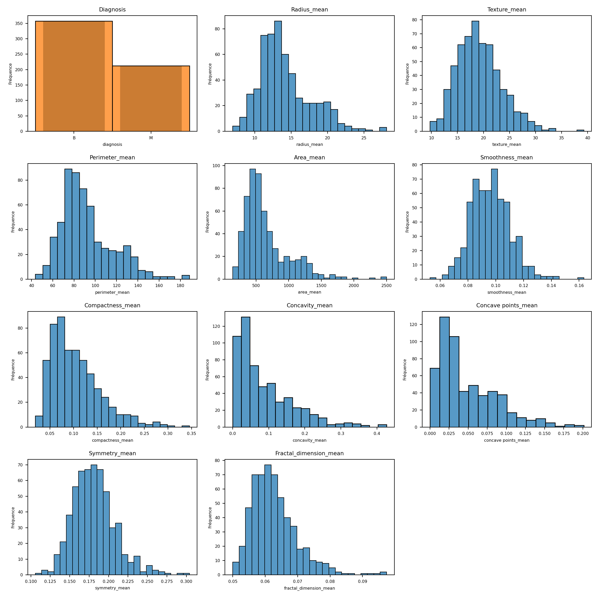
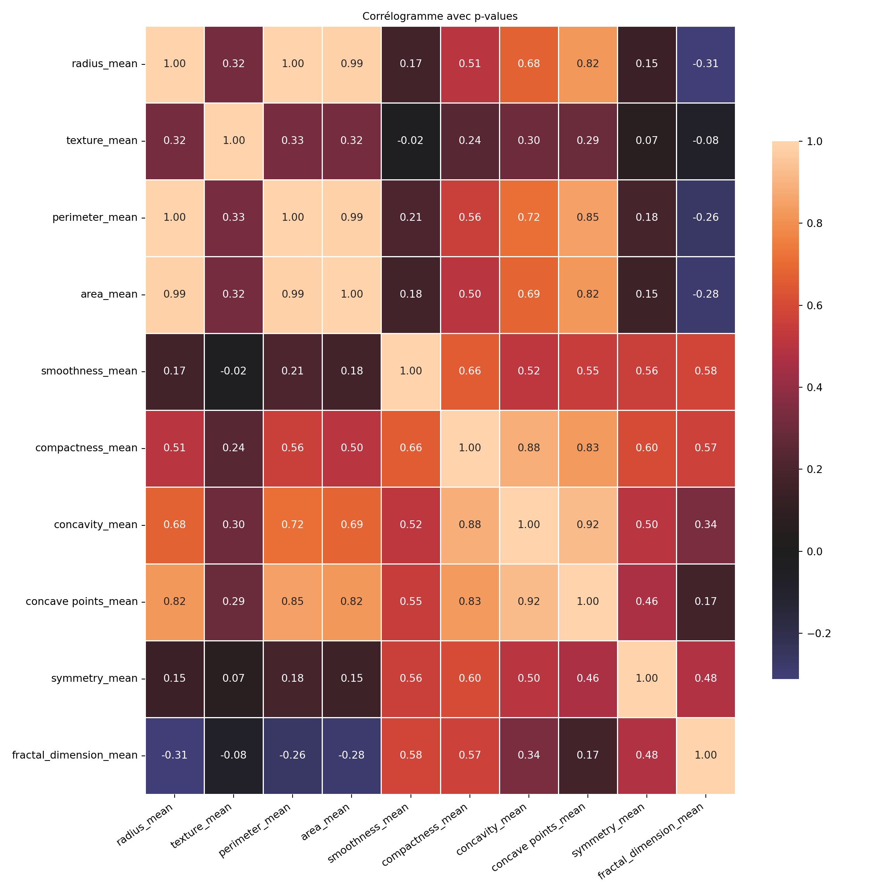
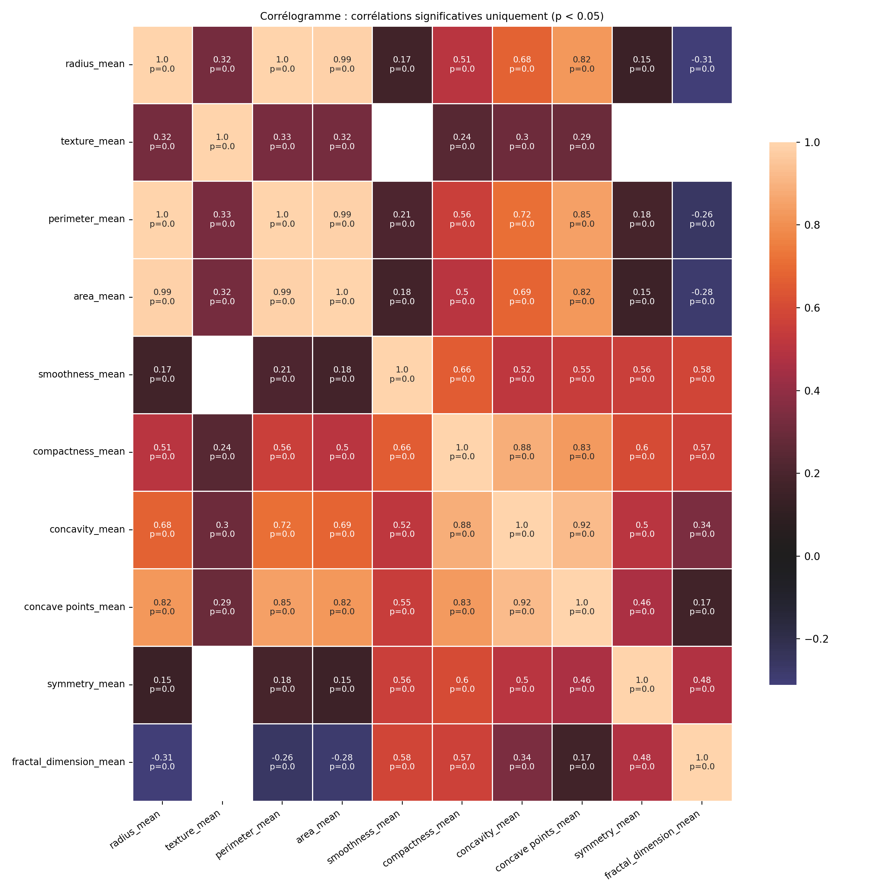
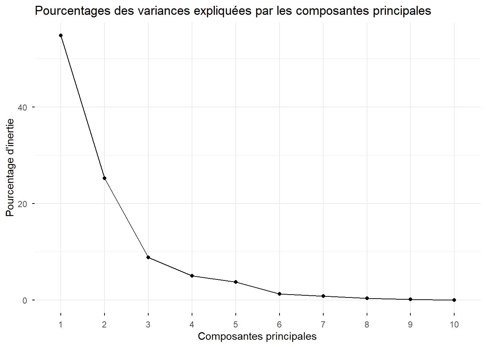
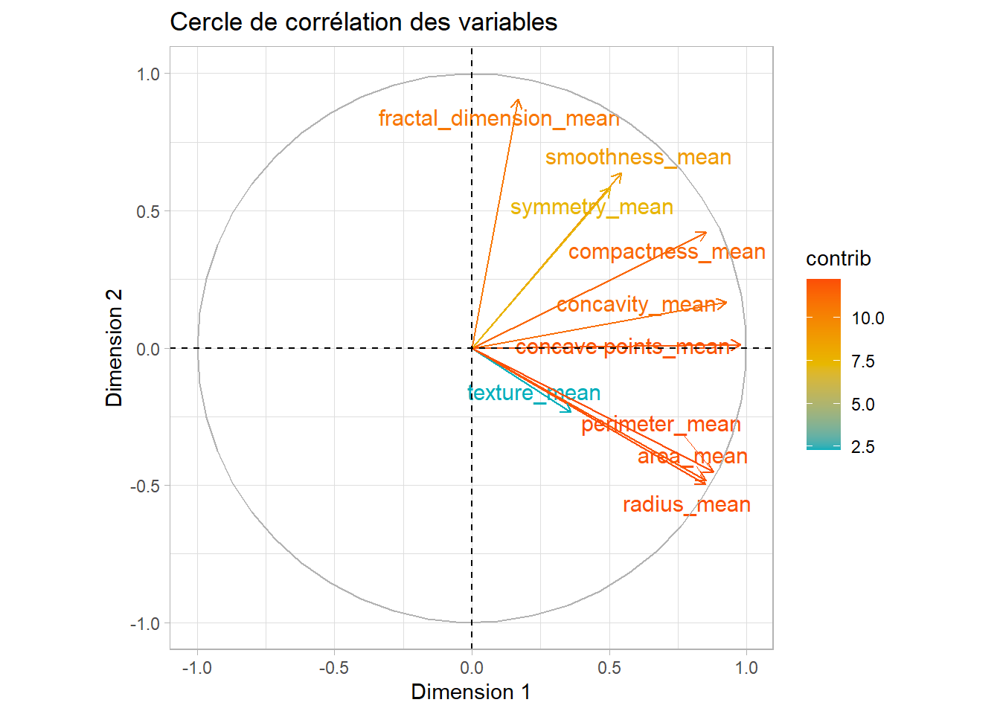
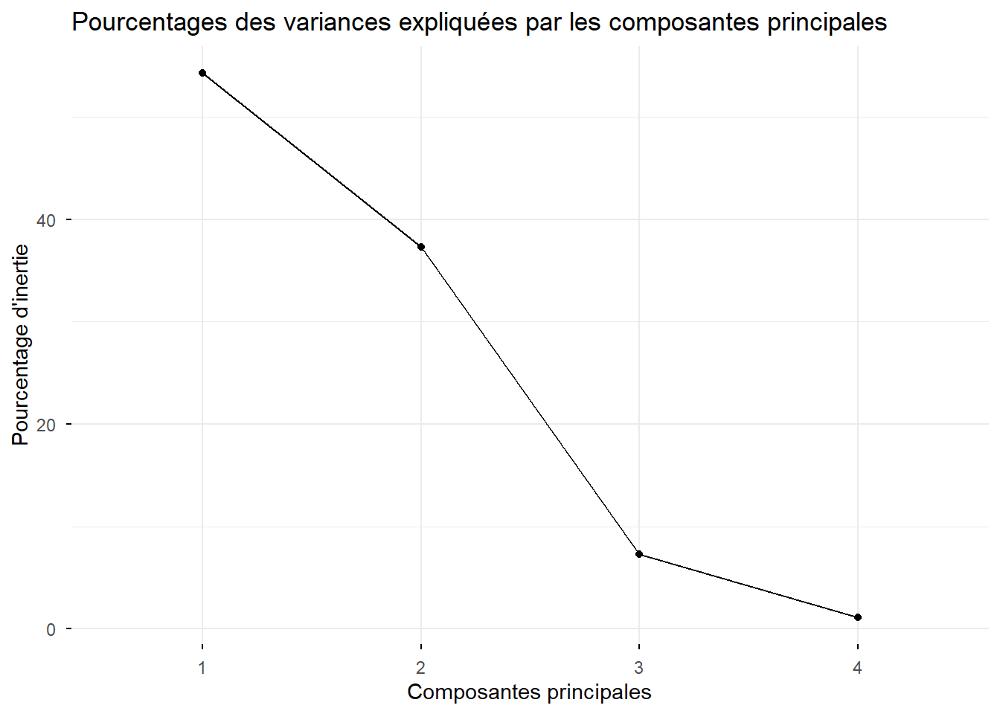
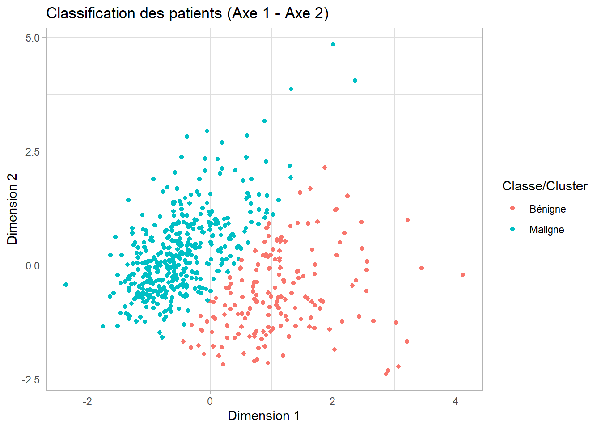
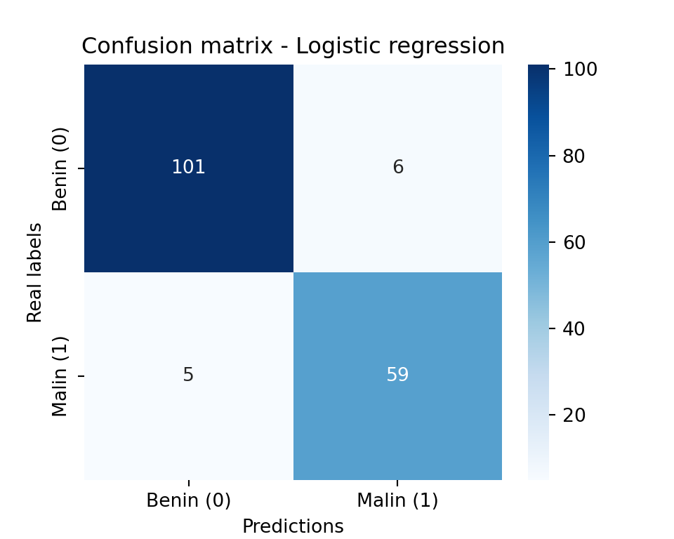

# Résumé / Abstract

Cette étude présente une approche méthodologique combinant analyse en composantes principales (`ACP`), sélection de variables, et modélisation par k plus proches voisins (`KNN`) ainsi que régression logistique pour la classification de données médicales. L’objectif principal était d’identifier les variables les plus discriminantes et d’évaluer la performance prédictive des modèles. Les résultats montrent que la réduction de dimension facilite l’interprétation, tandis que les deux modèles de classification offrent des performances satisfaisantes, avec un bon compromis entre précision et interprétabilité. Cette méthode robuste peut être étendue à d’autres jeux de données similaires.

*Ce projet est un exercice personnel visant à mettre en pratique les notions acquises.*

**Mots-clés :** `Analyse en composantes principales`, `Sélection de variables`, `K plus proches voisins`, `Régression logistique`, `Classification`, `Données médicales`.

---

This study presents a methodological approach combining principal component analysis (`PCA`), variable selection, k-nearest neighbours (`KNN`) modelling and logistic regression for the classification of medical data. The main objective was to identify the most discriminating variables and to assess the predictive performance of the models. The results show that dimension reduction facilitates interpretation, while both classification models offer satisfactory performance, with a good compromise between accuracy and interpretability. This robust method can be extended to other similar datasets.

*This project is a personal exercise to practice the concepts I have acquired.*

**Keywords:** `Principal component analysis`, `Variable selection`, `K-nearest neighbours`, `Logistic regression`, `Classification`, `Medical data`.


# Méthodologie

**1. Analyse en Composantes Principales (`ACP`)**  

|       L'`ACP` est une méthode de réduction de dimensionnalité qui permet de résumer l’information de nombreuses variables corrélées en un nombre réduit de composantes non corrélées (axes principaux).  
Cela facilite la visualisation, l’interprétation et évite la redondance dans les modèles prédictifs.

**2. Clustering `KMeans`**  

|       Une méthode non supervisée pour regrouper les observations en groupes homogènes selon leurs caractéristiques principales (issues de l’`ACP`).  
Cela permet d’identifier des profils ou clusters naturels dans les données sans utiliser la variable cible.

**Pourquoi utiliser les KMeans avant de specifier les modèles de Machine Learning ?** 

|       Le clustering KMeans, en segmentant la population en groupes homogènes, permet de : 

- identifier des sous-groupes latents aux caractéristiques distinctes qui peuvent influencer la relation entre variables explicatives et cible ; 

- détecter des structures ou hétérogénéités non visibles dans l’analyse globale ;

- améliorer la modélisation en ajustant éventuellement des modèles spécifiques par cluster ou en utilisant les clusters comme variables explicatives supplémentaires ;

- vérifier l'homogénéité au sein des groupes, ce qui peut renforcer la validité des modèles 


**3. Modèles prédictifs supervisés (régression logistique et K-NN)** 

|       Après réduction de dimension et/ou clustering, on construit des modèles supervisés pour prédire la classe (`maligne` ou `bénigne`).

- **Régression logistique** : Modèle probabiliste classique adapté aux classifications binaires;

- **K plus proches voisins (K-NN)** : Méthode basée sur la proximité dans l’espace des variables, simple mais performante;


On compare les performances des modèles sur un jeu de test afin d’évaluer leur précision et leur capacité à généraliser.

> L’ACP est faite en amont pour éviter la multicolinéarité et améliorer la robustesse des modèles.  
> Le clustering permet de découvrir la structure latente des données avant la classification.

---

## Exploration des données

L’exploration des données comprend :  
- Le résumé statistique descriptif des variables  
- La distribution de la variable cible  
- L’étude des corrélations entre variables  

Ces étapes permettent de mieux comprendre la structure et les caractéristiques de la base avant modélisation.

---

## Description des variables {-}

Les variables de cette base sont construites à partir de l’analyse de **noyaux de cellules** détectés dans des images médicales.

- `id` *(int)*  : Identifiant unique de l’observation (patient).

- `diagnosis` *(catégorielle)*  Variable cible binaire : 

  - **M** : Malignant (maligne)  
  
  - **B** : Benign (bénigne)

- **Caractéristiques mesurées**

Pour chaque noyau de cellule, 10 mesures statistiques ont été calculées, puis **la moyenne**, **l’écart-type** (erreur standard, noté `se`), et **la valeur extrême (`worst`)** ont été rapportés :

>>> Mesures de base : 

Ces mesures sont disponibles en 3 versions chacune : `.mean`, `.se`, `.worst`

| Variable de base         | Signification                                           |
|--------------------------|---------------------------------------------------------|
| `radius`                 | Rayon moyen du noyau                                    |
| `texture`                | Écart-type des valeurs de niveaux de gris               |
| `perimeter`              | Périmètre du noyau                                      |
| `area`                   | Surface du noyau                                        |
| `smoothness`             | Régularité des contours (valeurs faibles = plus lisses) |
| `compactness`            | Compacité = (périmètre² / surface) - 1.0               |
| `concavity`              | Gravité des concavités dans les contours                |
| `concave points`         | Nombre de points concaves sur les contours              |
| `symmetry`               | Symétrie de la cellule                                  |
| `fractal dimension`      | Mesure de la "rugosité" des contours                    |

Chaque mesure est donc déclinée en :

- `*_mean`

- `*_se`

- `*_worst`

Par exemple :

- `radius_mean`, `radius_se`, `radius_worst`

- `texture_mean`, `texture_se`, `texture_worst`

- ...

- `fractal_dimension_mean`, `fractal_dimension_se`, `fractal_dimension_worst`

Ce qui donne au total 30 variables `quantitatives`.

---

## Résumé des types de variables {-}

| Type de variable | Nom                            | Nombre |
|------------------|---------------------------------|--------|
| Identifiant      | `id`                            | 1      |
| Cible binaire    | `diagnosis`                     | 1      |
| Variables numériques (×10 mesures ×3 stats) | `*_mean`, `*_se`, `*_worst` | 30     |

---

## Remarques {-}

- On se focalisera uniquement sur les moyennes
- Aucune valeur manquante n’est présente dans le jeu de données.
- Les variables sont toutes numériques à l’exception de `diagnosis`.
- Un prétraitement est souvent nécessaire (standardisation, sélection de variables, etc.) avant d’entraîner un modèle.

---


# Analyse de données

## Analyse exploratoire


::: {.cell}

```{.python .cell-code}
import pandas as pd
import numpy as np
import matplotlib.pyplot as plt
import seaborn as sns
```
:::


- **Quelques statistiques descriptives**


::: {.cell}

```{.python .cell-code}
df = pd.read_csv('data.csv')
df.head()
```

::: {.cell-output .cell-output-stdout}

```
         id diagnosis  ...  fractal_dimension_worst  Unnamed: 32
0    842302         M  ...                  0.11890          NaN
1    842517         M  ...                  0.08902          NaN
2  84300903         M  ...                  0.08758          NaN
3  84348301         M  ...                  0.17300          NaN
4  84358402         M  ...                  0.07678          NaN

[5 rows x 33 columns]
```


:::
:::


::: {.cell}

```{.python .cell-code}
print('\n')
```

```{.python .cell-code}
df = df.loc[:, (df.columns.str.contains('mean')) | (df.columns == 'diagnosis')]
df.info()
```

::: {.cell-output .cell-output-stdout}

```
<class 'pandas.core.frame.DataFrame'>
RangeIndex: 569 entries, 0 to 568
Data columns (total 11 columns):
 #   Column                  Non-Null Count  Dtype  
---  ------                  --------------  -----  
 0   diagnosis               569 non-null    object 
 1   radius_mean             569 non-null    float64
 2   texture_mean            569 non-null    float64
 3   perimeter_mean          569 non-null    float64
 4   area_mean               569 non-null    float64
 5   smoothness_mean         569 non-null    float64
 6   compactness_mean        569 non-null    float64
 7   concavity_mean          569 non-null    float64
 8   concave points_mean     569 non-null    float64
 9   symmetry_mean           569 non-null    float64
 10  fractal_dimension_mean  569 non-null    float64
dtypes: float64(10), object(1)
memory usage: 49.0+ KB
```


:::
:::


::: {.cell}

```{.python .cell-code}
df.isna().sum()
```

::: {.cell-output .cell-output-stdout}

```
diagnosis                 0
radius_mean               0
texture_mean              0
perimeter_mean            0
area_mean                 0
smoothness_mean           0
compactness_mean          0
concavity_mean            0
concave points_mean       0
symmetry_mean             0
fractal_dimension_mean    0
dtype: int64
```


:::
:::


::: {.cell}

```{.python .cell-code}
print('\n')
```

```{.python .cell-code}
# on saute la première colonne (id) et la derniere columns (unnamed)
df.iloc[:, 1:df.shape[1]].describe()
```

::: {.cell-output .cell-output-stdout}

```
       radius_mean  texture_mean  ...  symmetry_mean  fractal_dimension_mean
count   569.000000    569.000000  ...     569.000000              569.000000
mean     14.127292     19.289649  ...       0.181162                0.062798
std       3.524049      4.301036  ...       0.027414                0.007060
min       6.981000      9.710000  ...       0.106000                0.049960
25%      11.700000     16.170000  ...       0.161900                0.057700
50%      13.370000     18.840000  ...       0.179200                0.061540
75%      15.780000     21.800000  ...       0.195700                0.066120
max      28.110000     39.280000  ...       0.304000                0.097440

[8 rows x 10 columns]
```


:::
:::


|       On peut également visualiser ce résumé statistique :


::: {.cell}

```{.python .cell-code}
def plot_multiple_histograms(rows=4, cols=3, figsize=(12, 12)):
    fig, axes = plt.subplots(rows, cols, figsize=figsize)
    axes = axes.flatten() 
    #total_plots = rows * cols
    columns = df.columns

    for i, col in enumerate(columns):
        if i == 0: # faire un barplot pour la variable quatégorielle
          sns.barplot(
            x=df[col].value_counts().index,
            y=df[col].value_counts().values, 
            ax=axes[i]
          )
          axes[i].set_title(str(col).capitalize(), fontsize=8)
        sns.histplot(data=df[col], ax=axes[i])
        axes[i].set_title(str(col).capitalize(), fontsize=8)
        axes[i].set_xlabel(str(col), fontsize=6)
        axes[i].set_ylabel("Fréquence", fontsize=6)
        axes[i].tick_params(axis='both', labelsize=6)

    for j in range(len(columns), len(axes)):
        fig.delaxes(axes[j])
    plt.tight_layout()
        
    plt.show()
      
```
:::


::: {.cell fig.aligne='center'}

```{.python .cell-code  code-fold="true"}
plot_multiple_histograms()
```

::: {.cell-output-display}
{#fig-hist-quanti width=90% height=95%}
:::
:::


|       L'objectif est de comparer deux modèles de classification — **Régression Logistique** et **K-Nearest Neighbors (KNN)** — pour prédire si une tumeur est **bénigne** ($B$) ou **maligne** ($M$). Le jeu de données est déséquilibré, avec une majorité de cas bénins (`~63 %`).

Afin de traiter ce déséquilibre, les actions suivantes ont été envisagées :

- **Stratification** lors de la séparation train/test.
- **Utilisation de métriques robustes** au déséquilibre (F1-score, AUC ROC).
- **Techniques correctives** potentielles : `class_weight='balanced'`.


- **Corrélogramme des variables quantitatives**


::: {.cell layout-align="center"}

```{.python .cell-code  code-fold="true"}
corr_matrix = df.iloc[:, 1:(df.shape[1])].corr()
plt.figure(figsize=(12, 12))
# mask = np.triu(np.ones_like(corr_matrix, dtype=bool))

sns.heatmap(
  corr_matrix, 
  annot=True, 
  fmt=".2f", 
  center=0,
  linewidths=0.5,
  cbar_kws={"shrink": .7},  # taille barre couleur
  xticklabels=True,
  yticklabels=True
)
plt.xticks(rotation=35, ha='right', fontsize=10)
```

::: {.cell-output .cell-output-stdout}

```
(array([0.5, 1.5, 2.5, 3.5, 4.5, 5.5, 6.5, 7.5, 8.5, 9.5]), [Text(0.5, 0, 'radius_mean'), Text(1.5, 0, 'texture_mean'), Text(2.5, 0, 'perimeter_mean'), Text(3.5, 0, 'area_mean'), Text(4.5, 0, 'smoothness_mean'), Text(5.5, 0, 'compactness_mean'), Text(6.5, 0, 'concavity_mean'), Text(7.5, 0, 'concave points_mean'), Text(8.5, 0, 'symmetry_mean'), Text(9.5, 0, 'fractal_dimension_mean')])
```


:::

```{.python .cell-code  code-fold="true"}
plt.yticks(rotation=0, fontsize=10)
```

::: {.cell-output .cell-output-stdout}

```
(array([0.5, 1.5, 2.5, 3.5, 4.5, 5.5, 6.5, 7.5, 8.5, 9.5]), [Text(0, 0.5, 'radius_mean'), Text(0, 1.5, 'texture_mean'), Text(0, 2.5, 'perimeter_mean'), Text(0, 3.5, 'area_mean'), Text(0, 4.5, 'smoothness_mean'), Text(0, 5.5, 'compactness_mean'), Text(0, 6.5, 'concavity_mean'), Text(0, 7.5, 'concave points_mean'), Text(0, 8.5, 'symmetry_mean'), Text(0, 9.5, 'fractal_dimension_mean')])
```


:::

```{.python .cell-code  code-fold="true"}
plt.subplots_adjust(bottom=0.4, left=0.3)
plt.title("Corrélogramme avec p-values", fontsize=10)
plt.tight_layout()
plt.show()
```

::: {.cell-output-display}
{fig-align='center' width=90% height=95%}
:::
:::

On a des variables qui sont fortement corrélées et d'autres non. Toutefois nous ne pouvons pas nous prononcer sur la justification statistique du lien entres elles. Pour cela nous affichons le même graphique avec les pvalues pour les associations significatives et des classes pour celles qui ne le sont pas.


::: {.cell layout-align="center"}

```{.python .cell-code}
from scipy.stats import pearsonr
cols = df.select_dtypes(include=np.number).columns  # seulement les colonnes numériques
n = len(cols)

corr_matrix = pd.DataFrame(np.zeros((n, n)), columns=cols, index=cols)
pval_matrix = pd.DataFrame(np.ones((n, n)), columns=cols, index=cols)

for i in range(n):
    for j in range(n):
        if i <= j:  # éviter les doublons
            r, p = pearsonr(df[cols[i]], df[cols[j]])
            corr_matrix.iloc[i, j] = r
            corr_matrix.iloc[j, i] = r
            pval_matrix.iloc[i, j] = p
            pval_matrix.iloc[j, i] = p
            
            
# masquer les p-values non significatives
mask_significant = pval_matrix < 0.05
annot = corr_matrix.round(2).astype(str) + "\np=" + pval_matrix.round(3).astype(str)
annot[~mask_significant] = ""

plt.figure(figsize=(12, 12))

sns.heatmap(
  corr_matrix, 
  fmt="",
  annot=annot,
  annot_kws={"size": 8},
  center=0,
  linewidths=0.5,
  mask=~mask_significant,
  cbar_kws={"shrink": .7},
  xticklabels=True,
  yticklabels=True
)

plt.xticks(rotation=35, ha='right', fontsize=9)
```

::: {.cell-output .cell-output-stdout}

```
(array([0.5, 1.5, 2.5, 3.5, 4.5, 5.5, 6.5, 7.5, 8.5, 9.5]), [Text(0.5, 0, 'radius_mean'), Text(1.5, 0, 'texture_mean'), Text(2.5, 0, 'perimeter_mean'), Text(3.5, 0, 'area_mean'), Text(4.5, 0, 'smoothness_mean'), Text(5.5, 0, 'compactness_mean'), Text(6.5, 0, 'concavity_mean'), Text(7.5, 0, 'concave points_mean'), Text(8.5, 0, 'symmetry_mean'), Text(9.5, 0, 'fractal_dimension_mean')])
```


:::

```{.python .cell-code}
plt.yticks(rotation=0, fontsize=9)
```

::: {.cell-output .cell-output-stdout}

```
(array([0.5, 1.5, 2.5, 3.5, 4.5, 5.5, 6.5, 7.5, 8.5, 9.5]), [Text(0, 0.5, 'radius_mean'), Text(0, 1.5, 'texture_mean'), Text(0, 2.5, 'perimeter_mean'), Text(0, 3.5, 'area_mean'), Text(0, 4.5, 'smoothness_mean'), Text(0, 5.5, 'compactness_mean'), Text(0, 6.5, 'concavity_mean'), Text(0, 7.5, 'concave points_mean'), Text(0, 8.5, 'symmetry_mean'), Text(0, 9.5, 'fractal_dimension_mean')])
```


:::

```{.python .cell-code}
plt.subplots_adjust(bottom=0.5, left=0.4)
plt.title("Corrélogramme : corrélations significatives uniquement (p < 0.05)", fontsize=10)
plt.tight_layout()
plt.show()
```

::: {.cell-output-display}
{fig-align='center' width=90% height=95%}
:::
:::


|       Sauf quelques unes ne sont pas significativement corrélées entre-elles mais le sont avec d'autres variables

## Analyse en composantes principales

|       Pour cette partie spéciquement ainsi que pour la partie statistique du modèle logistique, nous utiliserons le langage `R` au lieu de python car il est plus facile à prendre en main (avis personnel). Mais pour la partie `machine learning` nous utiliserons le langage `Python`.
L' `ACP` permettra d'éliminer les variables corrélées entre elles en ne gardant que les plus contributives à la formation des axes que nous choisirons (pour plus de détails visitez ma publication [Reduction de dimensionnalité, clustering non supervisé](https://djamal2905.github.io/djamal_website/ANALYSES_FACTORIELLES/acp-kmeans.html)). 


::: {.cell}

```{.r .cell-code}
df_r <- py$df
df_r$diagnosis <- as.factor(df_r$diagnosis)
str(df_r)
```

::: {.cell-output .cell-output-stdout}

```
'data.frame':	569 obs. of  11 variables:
 $ diagnosis             : Factor w/ 2 levels "B","M": 2 2 2 2 2 2 2 2 2 2 ...
 $ radius_mean           : num  18 20.6 19.7 11.4 20.3 ...
 $ texture_mean          : num  10.4 17.8 21.2 20.4 14.3 ...
 $ perimeter_mean        : num  122.8 132.9 130 77.6 135.1 ...
 $ area_mean             : num  1001 1326 1203 386 1297 ...
 $ smoothness_mean       : num  0.1184 0.0847 0.1096 0.1425 0.1003 ...
 $ compactness_mean      : num  0.2776 0.0786 0.1599 0.2839 0.1328 ...
 $ concavity_mean        : num  0.3001 0.0869 0.1974 0.2414 0.198 ...
 $ concave points_mean   : num  0.1471 0.0702 0.1279 0.1052 0.1043 ...
 $ symmetry_mean         : num  0.242 0.181 0.207 0.26 0.181 ...
 $ fractal_dimension_mean: num  0.0787 0.0567 0.06 0.0974 0.0588 ...
 - attr(*, "pandas.index")=RangeIndex(start=0, stop=569, step=1)
```


:::
:::


::: {.cell}

```{.r .cell-code  code-fold="true"}
library(FactoMineR) #install.packages("FactoMineR")
library(factoextra) #install.packages("factoextra")
library(cluster) #install.packages("cluster")

acp_model <- PCA(df_r, quali.sup = "diagnosis", scale.unit = TRUE, graph = FALSE)
```
:::


>>> Valeurs proppres : Choix des dimensions d'analyse


::: {.cell}

```{.r .cell-code  code-fold="true"}
fviz_eig(acp_model, geom = 'line') +
  labs(title = "Pourcentages des variances expliquées par les composantes principales",
       y = "Pourcentage d'inertie", x = "Composantes principales")
```

::: {.cell-output-display}
{width=672}
:::
:::


|       On observe le coude à partie de la troisième dimension. Mais en se basant sur le critère du taux d'inertie on a environ **80%** de l'information conténue dans les données. Par conséquent notre analyse sera axée sur les deux premiers axes.

>>> Analyses des variables


::: {.cell}

```{.r .cell-code  code-fold="true"}
fviz_pca_var(acp_model, col.var = "contrib", 
             gradient.cols = c("#00AFBB", "#E7B800", "#FC4E07"),
             repel = TRUE) +
  labs(title = "Cercle de corrélation des variables",
       y = "Dimension 2", x = "Dimension 1") +
  theme_light()
```

::: {.cell-output-display}
{width=672}
:::
:::


|       On voit que :

# Analyse des corrélations des variables dans le cercle de corrélations de l'ACP

- Seule la variable `texture_mean` ne semble pas être contributive. Elle présente une faible corrélation avec les composantes principales retenues et n’apporte donc pas d’information pertinente pour la distinction des groupes.

- Les variables `radius_mean`, `area_mean` et `perimeter_mean` sont fortement corrélées entre elles et contribuent à part presque que parfaitement égale à la formation des axes d'analyse. Cela est attendu car ces variables décrivent toutes la taille du noyau. En effet, la relation géométrique fondamentale entre ces mesures explique cette redondance :

  $$ 
  \text{Périmètre} \approx 2 \pi \times \text{Rayon} \quad \text{et} \quad \text{Aire} \approx \pi \times \text{Rayon}^2 
  $$

  Ainsi, ces variables capturent la même information de manière redondante, ce qui justifie de n’en conserver qu’une dans l’analyse finale.

- Les variables `smoothness_mean` et `symmetry_mean` sont également corrélées, mais `smoothness_mean` est plus contributive. Elle décrit la régularité des contours, un aspect important pour la caractérisation des formes, tandis que `symmetry_mean` apporte une information redondante et moins déterminante.

- Les variables `concave points_mean` et `concavity_mean` sont corrélées, cependant `concave points_mean` est préférée pour sa contribution plus forte à l’analyse. Ces variables caractérisent la présence et la gravité des concavités sur les contours, des indicateurs clés pour la détection de formes irrégulières.

- D’autres variables, telles que `compactness_mean`, `fractal_dimension_mean` ou `smoothness_mean`, apportent des informations complémentaires sur la forme et la texture des noyaux, bien que certaines soient corrélées. Par exemple :

  - `compactness_mean` mesure la compacité, une combinaison du périmètre et de la surface, fournissant un indicateur de la forme globale.
  
  - `fractal_dimension_mean` quantifie la complexité des contours, liée à leur rugosité ou irrégularité.

Ces variables, bien qu’ayant certaines corrélations, capturent différents aspects de la morphologie des noyaux et sont utiles pour enrichir l’analyse.


|       Pour choisir entre les variables `radius_mean`, `area_mean` et `perimeter_mean`, qui sont fortement corrélées, nous envisageons de n'en conserver qu'une seule. Pour cela, nous proposons d'utiliser un test d'**analyse de la variance** (`ANOVA`). 

Avant d'appliquer un test `ANOVA`, il est essentiel de vérifier deux conditions préalables :

- La **normalité** des données dans chaque groupe (`B` et `M`) via le test de **Shapiro-Wilk**.
- L'**homogénéité des variances** entre les groupes, via le test de **Levene**.

Selon les résultats de ces tests :

- ✅ Si les données sont **normales** et les variances **homogènes**, on applique l'**ANOVA classique**.
- ⚠️ Si les données sont **normales** mais les variances sont **différentes**, on applique l'**ANOVA avec correction de Welch**.
- ❌ Si la **normalité est violée**, on opte pour des **tests non paramétriques** :
  - Test de **Wilcoxon-Mann-Whitney** pour 2 groupes,
  - ou test de **Kruskal-Wallis** pour plus de 2 groupes.

Afin d'automatiser ce processus de vérification et de sélection du test statistique approprié, nous implémentons une fonction personnalisée. Le détail de ces vérifications (tests de Shapiro-Wilk et Levene) est fourni en **annexe**.


::: {.cell}

```{.r .cell-code  code-fold="true"}
library(car)
library(dplyr)
library(rstatix)

analyse_auto_test <- function(data, variable, group) {
  # Convertir noms en chaînes
  var <- rlang::as_string(rlang::ensym(variable))
  grp <- rlang::as_string(rlang::ensym(group))
  
  data <- data %>% 
    select(all_of(c(var, grp))) %>%
    filter(!is.na(.data[[var]]), !is.na(.data[[grp]])) %>%
    mutate(across(all_of(grp), as.factor))

  cat("###Analyse de :", var, "selon", grp, "\n\n")
  
  groupes <- levels(data[[grp]])
  nb_groupes <- length(groupes)

  # Test de normalité par groupe
  normaux <- TRUE
  for (g in groupes) {
    test <- shapiro.test(data[[var]][data[[grp]] == g])
    cat("- Groupe", g, ": p =", round(test$p.value, 4), "\n")
    if (test$p.value < 0.05) {
      normaux <- FALSE
    }
  }

  # Test de Levene
  levene <- leveneTest(as.formula(paste(var, "~", grp)), data = data)
  p_levene <- levene$`Pr(>F)`[1]
  homogene <- p_levene > 0.05
  cat("\n- Test de Levene : p =", round(p_levene, 4), 
      ifelse(homogene, "(variances homogènes)", "(variances non homogènes)"), "\n\n")

  # Choix du test
  if (normaux && homogene) {
    cat("Conditions OK → Test ANOVA classique\n")
    res <- aov(as.formula(paste(var, "~", grp)), data = data)
    pval <- summary(res)[[1]][["Pr(>F)"]][1]
    cat("$$\\text{Test d'ANOVA classique}$$\n")
    cat("**Hypothèses :**\n")
    cat("- {H_0} : les moyennes sont égales entre les groupes\n")
    cat("- {H_1} : au moins une moyenne est différente\n\n")
  } else if (normaux && !homogene) {
    cat("Variances non homogènes → Test ANOVA de Welch\n")
    res <- oneway.test(as.formula(paste(var, "~", grp)), data = data, var.equal = FALSE)
    pval <- res$p.value
    cat("$$\\text{Test d'ANOVA avec correction de Welch}$$\n")
    cat("**Hypothèses :**\n")
    cat("- {H_0} : les moyennes sont égales entre les groupes\n")
    cat("- {H_1} : au moins une moyenne est différente\n\n")
  } else if (!normaux && nb_groupes == 2) {
    cat("Données non normales → Test de Wilcoxon-Mann-Whitney\n")
    res <- wilcox.test(as.formula(paste(var, "~", grp)), data = data)
    pval <- res$p.value
    cat("$$\\text{Test de Wilcoxon-Mann-Whitney}$$\n")
    cat("**Hypothèses :**\n")
    cat("- {H_0} : les distributions des deux groupes sont égales\n")
    cat("- {H_1} : les distributions sont différentes\n\n")
  } else {
    cat("Données non normales → Test de Kruskal-Wallis\n")
    res <- kruskal.test(as.formula(paste(var, "~", grp)), data = data)
    pval <- res$p.value
    cat("$$\\text{Test de Kruskal-Wallis}$$\n")
    cat("**Hypothèses :**\n")
    cat("- {H_0} : les distributions sont identiques entre groupes\n")
    cat("- {H_1} : au moins une distribution est différente\n\n")
  }

  # Interprétation finale
  cat("**Résultat du test :** p =", round(pval, 4), "\n")
  if (pval < 0.05) {
    cat("=> Rejet de {H_0} : différence significative entre les groupes.\n")
  } else {
    cat("=>Non-rejet de {H_0} : aucune différence significative détectée.\n")
  }
}
```
:::


::: {.cell}

```{.r .cell-code}
analyse_auto_test(df_r, radius_mean, diagnosis)
```

::: {.cell-output .cell-output-stdout}

```
###Analyse de : radius_mean selon diagnosis 

- Groupe B : p = 0.668 
- Groupe M : p = 0.0019 

- Test de Levene : p = 0 (variances non homogènes) 

Données non normales → Test de Wilcoxon-Mann-Whitney
$$\text{Test de Wilcoxon-Mann-Whitney}$$
**Hypothèses :**
- {H_0} : les distributions des deux groupes sont égales
- {H_1} : les distributions sont différentes

**Résultat du test :** p = 0 
=> Rejet de {H_0} : différence significative entre les groupes.
```


:::
:::


::: {.cell}

```{.r .cell-code}
analyse_auto_test(df_r, area_mean, diagnosis)
```

::: {.cell-output .cell-output-stdout}

```
###Analyse de : area_mean selon diagnosis 

- Groupe B : p = 0.0228 
- Groupe M : p = 0 

- Test de Levene : p = 0 (variances non homogènes) 

Données non normales → Test de Wilcoxon-Mann-Whitney
$$\text{Test de Wilcoxon-Mann-Whitney}$$
**Hypothèses :**
- {H_0} : les distributions des deux groupes sont égales
- {H_1} : les distributions sont différentes

**Résultat du test :** p = 0 
=> Rejet de {H_0} : différence significative entre les groupes.
```


:::
:::


::: {.cell}

```{.r .cell-code}
analyse_auto_test(df_r, perimeter_mean, diagnosis)
```

::: {.cell-output .cell-output-stdout}

```
###Analyse de : perimeter_mean selon diagnosis 

- Groupe B : p = 0.7795 
- Groupe M : p = 4e-04 

- Test de Levene : p = 0 (variances non homogènes) 

Données non normales → Test de Wilcoxon-Mann-Whitney
$$\text{Test de Wilcoxon-Mann-Whitney}$$
**Hypothèses :**
- {H_0} : les distributions des deux groupes sont égales
- {H_1} : les distributions sont différentes

**Résultat du test :** p = 0 
=> Rejet de {H_0} : différence significative entre les groupes.
```


:::
:::


Les trois variables présentent des différences statistiquement significatives entre les groupes :

- `radius_mean` : $$p = 0$$
- `area_mean` : $$p = 0$$
- `perimeter_mean` : $$p = 0$$

Cependant, ces variables sont fortement corrélées entre elles ($$r > 0.95$$). Pour éviter la redondance d’information et les effets de multicolinéarité, nous calculerons le rapport de corrélation et prendront celle qui a le rapport le plus élévé.


::: {.cell}

```{.r .cell-code  code-fold="true"}
rapport_correlation <- function(x, groupe) {
  m_total <- mean(x, na.rm = TRUE)
  ss_total <- sum((x - m_total)^2, na.rm = TRUE)
  
  niveaux <- levels(groupe)
  ss_between <- sum(sapply(niveaux, function(g) {
    xg <- x[groupe == g]
    ng <- length(xg)
    (mean(xg) - m_total)^2 * ng
  }))
  
  eta2 <- ss_between / ss_total
  return(eta2)
}
```
:::


::: {.cell}

```{.r .cell-code}
rapport_correlation(df_r$radius_mean, df_r$diagnosis)
```

::: {.cell-output .cell-output-stdout}

```
[1] 0.5329416
```


:::
:::


::: {.cell}

```{.r .cell-code}
rapport_correlation(df_r$area_mean, df_r$diagnosis)
```

::: {.cell-output .cell-output-stdout}

```
[1] 0.5026581
```


:::
:::


::: {.cell}

```{.r .cell-code}
rapport_correlation(df_r$perimeter_mean, df_r$diagnosis)
```

::: {.cell-output .cell-output-stdout}

```
[1] 0.5515075
```


:::
:::


- `radius_mean` : $$\eta^2 = 0,5329416$$
- `area_mean` : $$\eta^2 = 0,5026581$$
- `perimeter_mean` : $$\eta^2 = 0,5515075$$

On choisit donc **`perimeter_mean`**.

Les variables finales sont donc : `perimeter_mean`, `smoothness_mean`, `fractal_dimension_mean`  et `concave points_mean`.

**Conclusion**:

L’`ACP` met en évidence des groupes de variables fortement corrélées reflétant des caractéristiques géométriques similaires. Pour optimiser le modèle, il est pertinent de réduire la redondance en conservant les variables les plus contributives au sein de chaque groupe, tout en gardant des variables complémentaires apportant des informations spécifiques sur la forme et la texture.

## Les Kmeans


::: {.cell}

```{.r .cell-code  code-fold="true"}
acp_model <- PCA(
  df_r[, c("diagnosis", "perimeter_mean", "smoothness_mean", "fractal_dimension_mean", "concave points_mean")],
  quali.sup = "diagnosis", 
  scale.unit = TRUE,
  graph = FALSE
)
#| label: inertie-val
#| code-fold: true
fviz_eig(acp_model, geom = 'line') +
  labs(title = "Pourcentages des variances expliquées par les composantes principales",
       y = "Pourcentage d'inertie", x = "Composantes principales")
```

::: {.cell-output-display}
{width=672}
:::
:::


|       Pareil, on choisit les deux premières dimensions (***+ de 80% de la variance expliquées***).
Pour faire les ***Kmeans***, nous prendrons `2` comme nombre de clusters. 


::: {.cell}

```{.r .cell-code}
dataTocluster <- scale(acp_model$ind$coord[,1:2])
resKmeans <- kmeans(dataTocluster, 2, nstart = 50)
str(resKmeans)
```

::: {.cell-output .cell-output-stdout}

```
List of 9
 $ cluster     : Named int [1:569] 2 2 2 1 2 1 2 1 2 1 ...
  ..- attr(*, "names")= chr [1:569] "1" "2" "3" "4" ...
 $ centers     : num [1:2, 1:2] -0.48 1.118 0.268 -0.624
  ..- attr(*, "dimnames")=List of 2
  .. ..$ : chr [1:2] "1" "2"
  .. ..$ : chr [1:2] "Dim.1" "Dim.2"
 $ totss       : num 1136
 $ withinss    : num [1:2] 480 255
 $ tot.withinss: num 735
 $ betweenss   : num 401
 $ size        : int [1:2] 398 171
 $ iter        : int 1
 $ ifault      : int 0
 - attr(*, "class")= chr "kmeans"
```


:::
:::


::: {.cell}

```{.r .cell-code  code-fold="true"}
table(resKmeans$cluster)
```

::: {.cell-output .cell-output-stdout}

```

  1   2 
398 171 
```


:::
:::


::: {.cell}

```{.r .cell-code}
# attribuer les noms au clusters
table(Cluster = resKmeans$cluster, Diagnosis = df_r$diagnosis)
```

::: {.cell-output .cell-output-stdout}

```
       Diagnosis
Cluster   B   M
      1 349  49
      2   8 163
```


:::
:::


|       On voit clairement que :

- **Cluster 1** contient surtout des cas M ***(163 M vs 8 B)*** → Cluster 1 ≈ "Maligne"

- **Cluster 2** contient surtout des cas B ***(349 B vs 49 M)*** → Cluster 2 ≈ "Bénigne"

>>> Représentations graphiques


::: {.cell}

```{.r .cell-code  code-fold="true"}
dataTocluster <- as.data.frame(dataTocluster)
dataTocluster <- dataTocluster %>% 
  mutate (classe = factor(
    ifelse(resKmeans$cluster == 1, "Maligne", "Bénigne"),
    levels = c("Bénigne", "Maligne")
    ), diagnosis = df_r$diagnosis)

ggplot(dataTocluster, aes (x = Dim.1, y = Dim.2, color = classe)) +
  geom_point() +
  labs(
    title = "Classification des patients (Axe 1 - Axe 2)",
    x = "Dimension 1",
    y = "Dimension 2",
    color = "Classe/Cluster"
  )+
  theme_light()
```

::: {.cell-output-display}
{#fig-classif-5 width=672}
:::
:::


**Interpretation** :

|       On observe que les patients sont **pratiquement linéairement séparables** dans le plan défini par les deux premières composantes principales. 

Cela signifie que la projection sur ces deux dimensions met bien en évidence une séparation claire entre les deux groupes (bénins et malins), ce qui est cohérent avec la qualité du clustering obtenu par k-means.

**Cette bonne séparation visuelle corrobore la pertinence des variables sélectionnées et confirme que les composantes principales résument efficacement la variance utile à la distinction des diagnostics. Nous pouvons passer à présent aux différents modèles de prédiction (regression logistique et k plus plus proches voisins)**

## `Logit` vs `KNN`


::: {.cell}

```{.python .cell-code  code-fold="true"}
# Importation des librairies nécessaires
from sklearn.model_selection import train_test_split
from sklearn.preprocessing import StandardScaler
from sklearn.linear_model import LogisticRegression
from sklearn.neighbors import KNeighborsClassifier
from sklearn.metrics import classification_report, confusion_matrix, roc_auc_score, roc_curve
from imblearn.over_sampling import SMOTE


df = df.loc[:, ["diagnosis", "perimeter_mean", "smoothness_mean", "fractal_dimension_mean", "concave points_mean"]]

# Variables explicatives et cible
X = df.drop(columns=['diagnosis'])
y = df['diagnosis']

# Séparation train/test
X_train, X_test, y_train, y_test = train_test_split(
    X, y, test_size=0.3, random_state=42, stratify=y)

# Mise à l’échelle des variables
scaler = StandardScaler()
X_train_scaled = scaler.fit_transform(X_train)
X_test_scaled = scaler.transform(X_test)

# --- Modèle 1 : Régression Logistique ---
logit = LogisticRegression(random_state=42, max_iter=1000, class_weight='balanced')
logit.fit(X_train_scaled, y_train)
```

::: {.cell-output-display}

```{=html}
<style>#sk-container-id-1 {color: black;}#sk-container-id-1 pre{padding: 0;}#sk-container-id-1 div.sk-toggleable {background-color: white;}#sk-container-id-1 label.sk-toggleable__label {cursor: pointer;display: block;width: 100%;margin-bottom: 0;padding: 0.3em;box-sizing: border-box;text-align: center;}#sk-container-id-1 label.sk-toggleable__label-arrow:before {content: "▸";float: left;margin-right: 0.25em;color: #696969;}#sk-container-id-1 label.sk-toggleable__label-arrow:hover:before {color: black;}#sk-container-id-1 div.sk-estimator:hover label.sk-toggleable__label-arrow:before {color: black;}#sk-container-id-1 div.sk-toggleable__content {max-height: 0;max-width: 0;overflow: hidden;text-align: left;background-color: #f0f8ff;}#sk-container-id-1 div.sk-toggleable__content pre {margin: 0.2em;color: black;border-radius: 0.25em;background-color: #f0f8ff;}#sk-container-id-1 input.sk-toggleable__control:checked~div.sk-toggleable__content {max-height: 200px;max-width: 100%;overflow: auto;}#sk-container-id-1 input.sk-toggleable__control:checked~label.sk-toggleable__label-arrow:before {content: "▾";}#sk-container-id-1 div.sk-estimator input.sk-toggleable__control:checked~label.sk-toggleable__label {background-color: #d4ebff;}#sk-container-id-1 div.sk-label input.sk-toggleable__control:checked~label.sk-toggleable__label {background-color: #d4ebff;}#sk-container-id-1 input.sk-hidden--visually {border: 0;clip: rect(1px 1px 1px 1px);clip: rect(1px, 1px, 1px, 1px);height: 1px;margin: -1px;overflow: hidden;padding: 0;position: absolute;width: 1px;}#sk-container-id-1 div.sk-estimator {font-family: monospace;background-color: #f0f8ff;border: 1px dotted black;border-radius: 0.25em;box-sizing: border-box;margin-bottom: 0.5em;}#sk-container-id-1 div.sk-estimator:hover {background-color: #d4ebff;}#sk-container-id-1 div.sk-parallel-item::after {content: "";width: 100%;border-bottom: 1px solid gray;flex-grow: 1;}#sk-container-id-1 div.sk-label:hover label.sk-toggleable__label {background-color: #d4ebff;}#sk-container-id-1 div.sk-serial::before {content: "";position: absolute;border-left: 1px solid gray;box-sizing: border-box;top: 0;bottom: 0;left: 50%;z-index: 0;}#sk-container-id-1 div.sk-serial {display: flex;flex-direction: column;align-items: center;background-color: white;padding-right: 0.2em;padding-left: 0.2em;position: relative;}#sk-container-id-1 div.sk-item {position: relative;z-index: 1;}#sk-container-id-1 div.sk-parallel {display: flex;align-items: stretch;justify-content: center;background-color: white;position: relative;}#sk-container-id-1 div.sk-item::before, #sk-container-id-1 div.sk-parallel-item::before {content: "";position: absolute;border-left: 1px solid gray;box-sizing: border-box;top: 0;bottom: 0;left: 50%;z-index: -1;}#sk-container-id-1 div.sk-parallel-item {display: flex;flex-direction: column;z-index: 1;position: relative;background-color: white;}#sk-container-id-1 div.sk-parallel-item:first-child::after {align-self: flex-end;width: 50%;}#sk-container-id-1 div.sk-parallel-item:last-child::after {align-self: flex-start;width: 50%;}#sk-container-id-1 div.sk-parallel-item:only-child::after {width: 0;}#sk-container-id-1 div.sk-dashed-wrapped {border: 1px dashed gray;margin: 0 0.4em 0.5em 0.4em;box-sizing: border-box;padding-bottom: 0.4em;background-color: white;}#sk-container-id-1 div.sk-label label {font-family: monospace;font-weight: bold;display: inline-block;line-height: 1.2em;}#sk-container-id-1 div.sk-label-container {text-align: center;}#sk-container-id-1 div.sk-container {/* jupyter's `normalize.less` sets `[hidden] { display: none; }` but bootstrap.min.css set `[hidden] { display: none !important; }` so we also need the `!important` here to be able to override the default hidden behavior on the sphinx rendered scikit-learn.org. See: https://github.com/scikit-learn/scikit-learn/issues/21755 */display: inline-block !important;position: relative;}#sk-container-id-1 div.sk-text-repr-fallback {display: none;}</style><div id="sk-container-id-1" class="sk-top-container"><div class="sk-text-repr-fallback"><pre>LogisticRegression(class_weight=&#x27;balanced&#x27;, max_iter=1000, random_state=42)</pre><b>In a Jupyter environment, please rerun this cell to show the HTML representation or trust the notebook. <br />On GitHub, the HTML representation is unable to render, please try loading this page with nbviewer.org.</b></div><div class="sk-container" hidden><div class="sk-item"><div class="sk-estimator sk-toggleable"><input class="sk-toggleable__control sk-hidden--visually" id="sk-estimator-id-1" type="checkbox" checked><label for="sk-estimator-id-1" class="sk-toggleable__label sk-toggleable__label-arrow">LogisticRegression</label><div class="sk-toggleable__content"><pre>LogisticRegression(class_weight=&#x27;balanced&#x27;, max_iter=1000, random_state=42)</pre></div></div></div></div></div>
```

:::

```{.python .cell-code  code-fold="true"}
y_pred_logit = logit.predict(X_test_scaled)
y_proba_logit = logit.predict_proba(X_test_scaled)[:,1]

# --- Modèle 2 : KNN ---

smote = SMOTE(random_state=42)
X_train_res, y_train_res = smote.fit_resample(X_train_scaled, y_train)
knn = KNeighborsClassifier(n_neighbors=5)
knn.fit(X_train_res, y_train_res)
```

::: {.cell-output-display}

```{=html}
<style>#sk-container-id-2 {color: black;}#sk-container-id-2 pre{padding: 0;}#sk-container-id-2 div.sk-toggleable {background-color: white;}#sk-container-id-2 label.sk-toggleable__label {cursor: pointer;display: block;width: 100%;margin-bottom: 0;padding: 0.3em;box-sizing: border-box;text-align: center;}#sk-container-id-2 label.sk-toggleable__label-arrow:before {content: "▸";float: left;margin-right: 0.25em;color: #696969;}#sk-container-id-2 label.sk-toggleable__label-arrow:hover:before {color: black;}#sk-container-id-2 div.sk-estimator:hover label.sk-toggleable__label-arrow:before {color: black;}#sk-container-id-2 div.sk-toggleable__content {max-height: 0;max-width: 0;overflow: hidden;text-align: left;background-color: #f0f8ff;}#sk-container-id-2 div.sk-toggleable__content pre {margin: 0.2em;color: black;border-radius: 0.25em;background-color: #f0f8ff;}#sk-container-id-2 input.sk-toggleable__control:checked~div.sk-toggleable__content {max-height: 200px;max-width: 100%;overflow: auto;}#sk-container-id-2 input.sk-toggleable__control:checked~label.sk-toggleable__label-arrow:before {content: "▾";}#sk-container-id-2 div.sk-estimator input.sk-toggleable__control:checked~label.sk-toggleable__label {background-color: #d4ebff;}#sk-container-id-2 div.sk-label input.sk-toggleable__control:checked~label.sk-toggleable__label {background-color: #d4ebff;}#sk-container-id-2 input.sk-hidden--visually {border: 0;clip: rect(1px 1px 1px 1px);clip: rect(1px, 1px, 1px, 1px);height: 1px;margin: -1px;overflow: hidden;padding: 0;position: absolute;width: 1px;}#sk-container-id-2 div.sk-estimator {font-family: monospace;background-color: #f0f8ff;border: 1px dotted black;border-radius: 0.25em;box-sizing: border-box;margin-bottom: 0.5em;}#sk-container-id-2 div.sk-estimator:hover {background-color: #d4ebff;}#sk-container-id-2 div.sk-parallel-item::after {content: "";width: 100%;border-bottom: 1px solid gray;flex-grow: 1;}#sk-container-id-2 div.sk-label:hover label.sk-toggleable__label {background-color: #d4ebff;}#sk-container-id-2 div.sk-serial::before {content: "";position: absolute;border-left: 1px solid gray;box-sizing: border-box;top: 0;bottom: 0;left: 50%;z-index: 0;}#sk-container-id-2 div.sk-serial {display: flex;flex-direction: column;align-items: center;background-color: white;padding-right: 0.2em;padding-left: 0.2em;position: relative;}#sk-container-id-2 div.sk-item {position: relative;z-index: 1;}#sk-container-id-2 div.sk-parallel {display: flex;align-items: stretch;justify-content: center;background-color: white;position: relative;}#sk-container-id-2 div.sk-item::before, #sk-container-id-2 div.sk-parallel-item::before {content: "";position: absolute;border-left: 1px solid gray;box-sizing: border-box;top: 0;bottom: 0;left: 50%;z-index: -1;}#sk-container-id-2 div.sk-parallel-item {display: flex;flex-direction: column;z-index: 1;position: relative;background-color: white;}#sk-container-id-2 div.sk-parallel-item:first-child::after {align-self: flex-end;width: 50%;}#sk-container-id-2 div.sk-parallel-item:last-child::after {align-self: flex-start;width: 50%;}#sk-container-id-2 div.sk-parallel-item:only-child::after {width: 0;}#sk-container-id-2 div.sk-dashed-wrapped {border: 1px dashed gray;margin: 0 0.4em 0.5em 0.4em;box-sizing: border-box;padding-bottom: 0.4em;background-color: white;}#sk-container-id-2 div.sk-label label {font-family: monospace;font-weight: bold;display: inline-block;line-height: 1.2em;}#sk-container-id-2 div.sk-label-container {text-align: center;}#sk-container-id-2 div.sk-container {/* jupyter's `normalize.less` sets `[hidden] { display: none; }` but bootstrap.min.css set `[hidden] { display: none !important; }` so we also need the `!important` here to be able to override the default hidden behavior on the sphinx rendered scikit-learn.org. See: https://github.com/scikit-learn/scikit-learn/issues/21755 */display: inline-block !important;position: relative;}#sk-container-id-2 div.sk-text-repr-fallback {display: none;}</style><div id="sk-container-id-2" class="sk-top-container"><div class="sk-text-repr-fallback"><pre>KNeighborsClassifier()</pre><b>In a Jupyter environment, please rerun this cell to show the HTML representation or trust the notebook. <br />On GitHub, the HTML representation is unable to render, please try loading this page with nbviewer.org.</b></div><div class="sk-container" hidden><div class="sk-item"><div class="sk-estimator sk-toggleable"><input class="sk-toggleable__control sk-hidden--visually" id="sk-estimator-id-2" type="checkbox" checked><label for="sk-estimator-id-2" class="sk-toggleable__label sk-toggleable__label-arrow">KNeighborsClassifier</label><div class="sk-toggleable__content"><pre>KNeighborsClassifier()</pre></div></div></div></div></div>
```

:::

```{.python .cell-code  code-fold="true"}
y_pred_knn = knn.predict(X_test_scaled)
y_proba_knn = knn.predict_proba(X_test_scaled)[:,1]
```
:::


- **Exactitude de l'entraînement des modèles**


::: {.cell}

```{.python .cell-code}
from sklearn.metrics import accuracy_score

y_train_pred_logit = logit.predict(X_train_scaled)
train_accuracy_logit = accuracy_score(y_train_pred_logit, y_train)

y_train_pred_knn = knn.predict(X_train_scaled)
train_accuracy_knn = accuracy_score(y_train_pred_knn, y_train)

print(f"Train Accuracy Logit: {train_accuracy_logit:.4f}")
```

::: {.cell-output .cell-output-stdout}

```
Train Accuracy Logit: 0.9121
```


:::

```{.python .cell-code}
print(f"Train Accuracy KNN: {train_accuracy_knn:.4f}")
```

::: {.cell-output .cell-output-stdout}

```
Train Accuracy KNN: 0.9322
```


:::
:::

- **Exactitude du test des modèles**


::: {.cell}

```{.python .cell-code}
acc_logit = accuracy_score(y_test, y_pred_logit)
acc_knn = accuracy_score(y_test, y_pred_knn)

print(f"Accuracy Régression Logistique : {acc_logit:.4f}")
```

::: {.cell-output .cell-output-stdout}

```
Accuracy Régression Logistique : 0.9357
```


:::

```{.python .cell-code}
print(f"Accuracy KNN : {acc_knn:.4f}")
```

::: {.cell-output .cell-output-stdout}

```
Accuracy KNN : 0.9006
```


:::
:::

- **INTERPRETATION**

|       L'exactitude du `modèle logistique` diminue faibelement du train au test (environ 0.004 soit 0, 4% ) alors que celle du `KNN` diminue un peu plus (environ 0.019 soit 1,9 %).
En revanche, l’exactitude du KNN diminue un peu plus, d’environ 1,9 %. Cette baisse plus marquée suggère que le modèle `KNN` s’adapte davantage aux spécificités du jeu d’entraînement (il est plus sensible aux données d’entraînement), ce qui peut traduire un léger surapprentissage.

En résumé :

- Le `modèle logistique` est plus stable et robuste, avec une capacité de généralisation meilleure.

- Le `KNN`, bien qu’ayant une meilleure précision sur le test, présente un risque un peu plus important de surajustement, ce qui peut poser problème sur des données très différentes de l’entraînement.

- **La valeur de la fonction de perte (log-loss)**

La log-loss est une mesure utile pour la régression logistique, qui reflète la qualité probabiliste des prédictions.

  - **La regression logistique** :


::: {.cell}

```{.python .cell-code}
from sklearn.metrics import log_loss

train_loss_logit = log_loss(y_train, logit.predict_proba(X_train_scaled))
test_loss_logit = log_loss(y_test, logit.predict_proba(X_test_scaled))

print(f"Log-loss train (logit): {train_loss_logit:.4f}")
```

::: {.cell-output .cell-output-stdout}

```
Log-loss train (logit): 0.1983
```


:::

```{.python .cell-code}
print(f"Log-loss test (logit): {test_loss_logit:.4f}")
```

::: {.cell-output .cell-output-stdout}

```
Log-loss test (logit): 0.1895
```


:::
:::

- `Log-loss train (0.1983)` et `log-loss test (0.1895)` sont très proches, et **la perte est même légèrement meilleure (plus faible) sur le test**.

- Cela indique que le modèle ne souffre pas de surapprentissage significatif — il généralise bien sur les données nouvelles.

 
  - **Le `KNN`** :

Le KNN n’optimise pas explicitement une fonction de perte pendant l’entraînement — c’est un algorithme instance-based, il mémorise les exemples.

On ne peut donc pas parler de "loss" au sens d’une fonction de coût minimisée.

Mais on peut évaluer la performance via la classification error $(1 - accuracy)$ ou d’autres métriques.


>> `Matrices de confusion`


::: {#fig-confusion-matrix .cell layout-ncol="2"}

```{.python .cell-code  code-fold="true"}
cm_logit = confusion_matrix(y_test, y_pred_logit)
cm_knn = confusion_matrix(y_test, y_pred_knn)

# Fonction pour tracer la matrice de confusion
def plot_cm(cm, title):
    plt.figure(figsize=(5,4))
    sns.heatmap(cm, annot=True, fmt='d', cmap='Blues',
                xticklabels=['Benin (0)', 'Malin (1)'],
                yticklabels=['Benin (0)', 'Malin (1)'])
    plt.ylabel('Real labels')
    plt.xlabel('Predictions')
    plt.title(title)
    plt.show()

plot_cm(cm_logit, "Confusion matrix - Logistic regression")
```

::: {.cell-output-display}
{#fig-confusion-matrix-1 width=480}
:::

```{.python .cell-code  code-fold="true"}
plot_cm(cm_knn, "Confusion matrix - KNN")
```

::: {.cell-output-display}
{#fig-confusion-matrix-2 width=480}
:::

Comparaison des ML (Logit vs KNN - Matrices de confusion)
:::


|       On peut voir que le `KNN` a une moins bonne prédiction sur la base de la matrice de confusion car on a :

- `100` Vrais négatifs (`vrais benin`) contre `101` pour le `modèle logit`
- `57` Vrais positifs (`vrais malin`) contre `59` pour le `modèle logit`
- `7` Faux positifs contre (`faux malin`) `6` pour le `modèle logit`


>> `Précision`, `recall`, `score F1`, `AUC`


::: {.cell}

```{.python .cell-code  code-fold="true"}
def eval_classif(y_true, y_pred, y_proba, model_name="Modèle"):
    print(f"== Results for {model_name} ==")
    print("\nClassification report : :")
    print(classification_report(y_true, y_pred, digits=4))
    auc = roc_auc_score(y_true, y_proba)
    print(f"AUC ROC : {auc:.4f}\n")

eval_classif(y_test, y_pred_logit, y_proba_logit, "Régression Logistique")
```

::: {.cell-output .cell-output-stdout}

```
== Results for Régression Logistique ==

Classification report : :
              precision    recall  f1-score   support

           B     0.9528    0.9439    0.9484       107
           M     0.9077    0.9219    0.9147        64

    accuracy                         0.9357       171
   macro avg     0.9303    0.9329    0.9315       171
weighted avg     0.9359    0.9357    0.9358       171

AUC ROC : 0.9816
```


:::

```{.python .cell-code  code-fold="true"}
eval_classif(y_test, y_pred_knn, y_proba_knn, "KNN")
```

::: {.cell-output .cell-output-stdout}

```
== Results for KNN ==

Classification report : :
              precision    recall  f1-score   support

           B     0.9327    0.9065    0.9194       107
           M     0.8507    0.8906    0.8702        64

    accuracy                         0.9006       171
   macro avg     0.8917    0.8986    0.8948       171
weighted avg     0.9020    0.9006    0.9010       171

AUC ROC : 0.9572
```


:::
:::


- **Résultats pour la Régression Logistique**

- **Exactitude globale (accuracy) :** `93,03 %`, ce qui signifie que le modèle classe correctement environ `93 patients sur 100`.  

- **Précision par classe :**

  - Pour la classe bénigne ($B$), la précision est de `95,28 %`, indiquant une bonne détection des cas bénins.
  
  - Pour la classe maligne ($M$), la précision est de `90,77 %`, également satisfaisante. Mais cet écart de précision pourraît être attribué au déquilibre des reponses (`Benin` et `Malin`) et cela malgré la stratification et la pondération. Toutefois les métriques telles que `F1-Scrore` et `AUC` sont moins sensibles au déséquilibre des classes de la variable reponse (ici la catégorie de tumeur).
  
- **Rappel (sensibilité) :**  

  - Classe bénigne : `94,39 %`, montrant une bonne capacité à détecter les vrais positifs bénins.  
  - Classe maligne : `92,19 %`, un peu moins élevée. L'explication donnée en ammont est également valide ici. 
  
- **F1-score :** `94,84 %` pour la classe bénigne et `91,47 %` pour la classe maligne, indiquant un bon équilibre global entre précision et rappel.  

- **AUC ROC :** `0,98116`, proche de 1, ce qui montre une excellente capacité de discrimination.

---


- **Résultats pour le KNN (K plus proches voisins)**

- **Exactitude globale (accuracy) :** `91,26 %`, moins bonne que celle la régression logistique. 

- **Précision par classe :**  

  - Pour la classe bénigne ($B$), la précision est de `93,46 %`, moins bonne que celle la régression logistique. 
  
  - Pour la classe maligne ($M$), la précision est de `89, 06%`, légèrement inférieure à la régression logistique.  
  
- **Rappel (sensibilité) :**

  - Classe bénigne : `93,46 %`, un peu plus faible que le rappel du modèle logit.
  
  - Classe maligne : `89, 06%`, meilleure que celui de la régression logistique. 
  
- **F1-score :** `93,46 %` pour la classe bénigne et `89,06 %` pour la classe maligne. Ces scores sont tous deux inférieurs à celui de la régression logistique.  

- **AUC ROC :** `0,9632`, très élevé, mais un peu inférieur à celui de la régression logistique.

---

**Conclusion : **

Les deux modèles présentent des performances globalement comparables pour différencier les patients bénins et malins :

- La **regression logistique** obtient une **meilleure précision globale** ainsi qu’un **meilleur équilibre du F1-score**, notamment pour la classe bénigne, témoignant d’une bonne capacité à limiter les erreurs dans cette catégorie.  

- La **régression logistique** offre un **rappel plus élevé** pour la classe bénigne et une **meilleure AUC ROC**, indiquant une excellente capacité de discrimination globale et une qualité probabiliste supérieure des prédictions.

Le modèle logistique se révèle également plus **stable et robuste**, avec une meilleure capacité de **généralisation**. En effet, bien que le **KNN** affiche une précision considérable sur le test, il présente un risque accru de **surajustement**, ce qui peut nuire à ses performances sur des données très différentes de l’entraînement.


### Concernant la fonction de perte

- La **log-loss**, métrique essentielle pour la régression logistique, reflète la qualité probabiliste des prédictions.  
- Les valeurs observées (log-loss de `0.1983` au train et `0.1895` au test) sont très proches, voire légèrement meilleures sur le test. 

- Cette stabilité confirme que le modèle logistique ne souffre pas de surapprentissage significatif et qu’il généralise efficacement sur des données nouvelles.

|       **La régression logistique est globalement préférable dans ce cas, car elle offre une performance plus équilibrée, une meilleure capacité discriminante (AUC) et une stabilité importante, ce qui la rend plus fiable pour un usage clinique ou opérationnel.**

---

# Conclusion générale

|       Dans cette étude, nous avons exploré un jeu de données complexe en appliquant d’abord une analyse en composantes principales (`ACP`) afin de réduire la dimensionnalité et d’identifier les variables les plus informatives.

|       Une classification non supervisée par `KMeans` a ensuite été réalisée pour vérifier que cette réduction du nombre de variables ne compromettait pas la structure intrinsèque des données.

La méthode `KMeans` a permis de regrouper les observations en clusters distincts, confirmant ainsi la présence de groupes homogènes correspondant aux classes `B` (bénin) et `M` (malin). Cette étape a validé que la projection sur les composantes principales préservait efficacement la séparation entre ces classes, renforçant la confiance dans la sélection des variables.

|       La sélection des variables, basée sur des critères statistiques rigoureux, a permis de retenir un ensemble pertinent de caractéristiques discriminantes entre les deux classes.

Nous avons ensuite mis en œuvre deux méthodes de classification supervisée :  

- Le k plus proches voisins (`KNN`), un modèle simple et non paramétrique, capable de capturer efficacement les similarités entre observations ;  

- La régression logistique (`logit`), un modèle probabiliste permettant d’estimer explicitement les probabilités d’appartenance à chaque classe et d’interpréter l’impact des variables explicatives.

|       Ainsi, cette démarche combinant réduction de dimension, sélection rigoureuse des variables, et modélisation par `KNN` et `logit` constitue une méthodologie robuste pour la classification et l’analyse de données biologiques ou médicales.

***_La régression logistique est globalement préférable dans ce cas, car elle offre une performance plus équilibrée, une meilleure capacité discriminante (AUC) et une stabilité importante, ce qui la rend plus fiable pour un usage clinique ou opérationnel_***

---


# Annexes


## Annexe 1 : Hypothèses et interprétations des tests statistiques

### **Test de Shapiro-Wilk**

Ce test permet de vérifier la **normalité** d’une distribution.

- **Hypothèses** :
  $$
  \begin{cases}
  H_0 : \text{Les données suivent une loi normale} \\
  H_1 : \text{Les données ne suivent pas une loi normale}
  \end{cases}
  $$

- **Interprétation de la $p$-valeur** :
  - Si $p > 0.05$ : on **ne rejette pas** ${H_0}$ $\Rightarrow$ les données peuvent être considérées comme **normales**.
  - Si $p \leq 0.05$ : on **rejette** ${H_0}$ $\Rightarrow$ les données **ne sont pas normales**.

---

### **Test de Levene**

Ce test permet de vérifier l’**homogénéité des variances** entre les groupes.

- **Hypothèses** :
  $$
  \begin{cases}
  H_0 : \text{Les variances des groupes sont égales} \\
  H_1 : \text{Les variances des groupes sont différentes}
  \end{cases}
  $$

- **Interprétation de la $p$-valeur** :
  - Si $p > 0.05$ : on **ne rejette pas** ${H_0}$ $\Rightarrow$ les variances sont **homogènes**.
  - Si $p \leq 0.05$ : on **rejette** ${H_0}$ $\Rightarrow$ les variances sont **différentes**.

---

### **Test d’ANOVA classique**

Ce test compare les **moyennes** de plusieurs groupes. Il nécessite que les données soient **normales** et que les variances soient **homogènes**.

- **Hypothèses** :
  $$
  \begin{cases}
  H_0 : \mu_1 = \mu_2 = \cdots = \mu_k \\
  H_1 : \exists \, i \ne j \text{ tel que } \mu_i \ne \mu_j
  \end{cases}
  $$

- **Interprétation de la $p$-valeur** :
  - Si $p > 0.05$ : on **ne rejette pas** ${H_0}$ $\Rightarrow$ les moyennes sont **statistiquement égales**.
  - Si $p \leq 0.05$ : on **rejette** ${H_0}$ $\Rightarrow$ au moins une moyenne est **différente**.

---

### **Test d’ANOVA de Welch**

Ce test est une **version robuste de l’ANOVA** utilisée lorsque l’**homogénéité des variances n’est pas respectée**, mais que les données restent normales.

- **Hypothèses** :
  $$
  \begin{cases}
  H_0 : \mu_1 = \mu_2 = \cdots = \mu_k \\
  H_1 : \exists \, i \ne j \text{ tel que } \mu_i \ne \mu_j
  \end{cases}
  $$

- **Interprétation de la $p$-valeur** : identique à celle du test ANOVA classique.

---

### **Test de Kruskal-Wallis**

Test non paramétrique utilisé en cas de **non-normalité** ou lorsque les données sont **ordinales**.

- **Hypothèses** :
  $$
  \begin{cases}
  H_0 : \text{Les distributions des groupes sont identiques} \\
  H_1 : \text{Au moins une distribution est différente}
  \end{cases}
  $$

- **Interprétation de la $p$-valeur** :
  - Si $p > 0.05$ : on **ne rejette pas** ${H_0}$ $\Rightarrow$ les distributions sont considérées comme **similaires**.
  - Si $p \leq 0.05$ : on **rejette** ${H_0}$ $\Rightarrow$ **au moins une** des distributions **diffère significativement**.


> Remarque : Tous ces tests renvoient une **$p$-valeur** qui est comparée au seuil de signification habituellement fixé à **5%** ($\alpha = 0.05$).


## Annexe 2:

Le rapport de corrélation $\eta^2$ est une mesure de l'effet qui quantifie la proportion de la variance expliquée par un facteur.

Il est défini par la formule suivante :

$$
\eta^2 = \frac{\sum_{i=1}^{k} n_i (\bar{y}_i - \bar{y})^2}{\sum_{i=1}^{k} \sum_{j=1}^{n_i} (y_{ij} - \bar{y})^2}
$$

où :

- $k$ est le nombre de groupes,
- $n_i$ est la taille du groupe $i$,
- $\bar{y}_i$ est la moyenne du groupe $i$,
- $\bar{y}$ est la moyenne globale,
- $y_{ij}$ est l'observation $j$ du groupe $i$.

Cette mesure permet d'évaluer l'ampleur de la différence entre les groupes, en indiquant la proportion de la variance totale attribuable à la variation entre groupes.


# Références {-}

- Source des données : [Kaggle – Breast Cancer Wisconsin (Diagnostic)](https://www.kaggle.com/datasets/uciml/breast-cancer-wisconsin-data)
- Wolberg, W.H., et al. (1995). UCI Machine Learning Repository.

