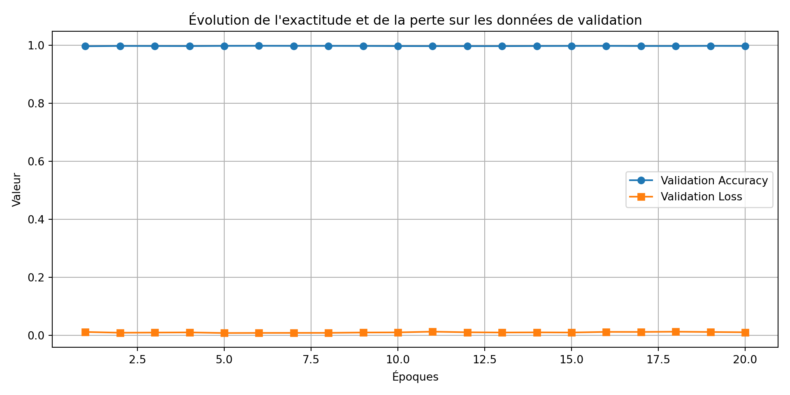

# 🎯 Contexte

Ce projet vise à créer une intelligence artificielle capable de jouer au jeu **ShiFuMi** (*pierre-papier-ciseaux*) contre un humain. L’objectif est de reconnaître automatiquement les gestes d'une main via une **webcam**, et de répondre en temps réel. Ce prototype est développé **seul**, en utilisant les outils suivants :

- **CNN pré-entraîné (MobileNetV2)** pour classifier les images de mains,
- **TensorFlow/Keras** pour l'entraînement,
- **YOLOv8** (en préparation) pour la détection en direct via webcam,

---

# 🧠 Objectif technique

- Créer un modèle de **classification d’images** pour reconnaître trois gestes : `pierre`, `papier`, `ciseaux`,
- Utiliser un modèle léger et rapide adapté à la webcam : **MobileNetV2**,
- Préparer l'intégration en live avec **détection par YOLOv8** + **reconnaissance par CNN**.

---

# ⚙️ Données pour le CNN

Les images sont triées dans des dossiers selon leur classe :

```rmd
dataset/
├── paper
|   ├── train
│   └── val
├── rock/
|   ├── train
│   └── val
├── scissors/
|   ├── train
│   └── val
```

|       Ici je ne fais pas de test mais au cours de l'entrainement j'évalue le modèle avec les images du dossier `val`. Néanmoins il est important de créer un dossier test qui va servir de test après l'entraienement du modèle. Les données étaient disponibles publiquement sur `Kaggle`, issues de différentes sources ouvertes. Etant volumineuses, je ne pourrai pas les mettre sur le dépot `git public`. Parcontre les `notebook` et les `script .py` y seront.

# ⚙️ Données pour yolov8

Les données pour l'entrainement du modèle `yolov8` proviennent de la plateforme `ROBOT FLOW`. L'idée derrière le fait d'entraîner le modèle `YOLO` vient du fait que je veux pouvoir detecter les mains dans une images et ensuite les passer au modèle `CNN` pour la classification. 
|       La structure des données `YOLO` est un peu particulière. En effet, elle a bésoin d'images mais pas que, il faut qu'elles soient **annontées**. De manière claire, il faut en plus des images, les labels qui lui sont associés (coordonnées des images). 

# 🔮 Données d'entraînement pour YOLOv8

Les données utilisées pour entraîner le modèle **YOLOv8** proviennent de la plateforme **[Robot Flow](https://robotflow.ai)**. Cette plateforme propose une interface conviviale pour la collecte et l'annotation de données, ce qui en fait un outil idéal pour les projets de vision par ordinateur.

## 🤔 Pourquoi entraîner YOLOv8 ?

|       L'objectif principal de l'entraînement de ce modèle est de **détecter les mains** dans des images issues d'une webcam ou d'une vidéo. Cette détection constitue une première étape essentielle avant de transmettre la région d'intérêt (ROI), c'est-à-dire la main détectéeà un modèle **CNN** pour effectuer la **classification du geste** (pierre, feuille, ciseaux).

Cette stratégie en deux étapes permet de :

* Réduire le bruit visuel autour de la main (fond, visage, objets parasites)
* Augmenter la précision du classifieur `CNN` en se concentrant uniquement sur la main

## 📚 Structure des données YOLO

Le format d'attente de `YOLO` est spécifique : chaque image d'entraînement doit être accompagnée d'un **fichier d'annotation `.txt`** contenant les informations de localisation des objets (ici, la main).

L'organisation des données se présente généralement ainsi :

```rmd
datasets/yolo_hand/
├── images/
│   ├── train/
│   │   ├── img_001.jpg
│   │   ├── img_002.jpg
│   └── val/
│       ├── img_101.jpg
│       ├── img_102.jpg
├── labels/
│   ├── train/
│   │   ├── img_001.txt
│   │   ├── img_002.txt
│   └── val/
│       ├── img_101.txt
│       ├── img_102.txt
```

|       Chaque fichier `.txt` contient une ou plusieurs lignes correspondant aux objets détectés dans l'image, selon le format suivant :

```
<class_id> <x_center> <y_center> <width> <height>
```

* Toutes les valeurs sont **normalisées** entre 0 et 1 relativement à la taille de l'image.
* `class_id` correspond ici à la main, donc souvent 0 dans le cadre d'un problème mono-classe.

## 🚀 Entraînement avec Ultralytics (Exemple)

Pour entraîner le modèle YOLOv8, on utilise la commande suivante :

```bash
yolo task=detect mode=train \
  model=yolov8n.pt \
  data=config.yaml \
  epochs=50 \
  imgsz=640
```

Où le fichier `config.yaml` contient :

```yaml
path: datasets/yolo_hand
train: images/train
val: images/val

names:
  0: main
```

::: {#wolframalfa .callout-important} 
# Pourquoi le notebook n'est pas publié ?

L'outil de dévéloppement du site ne supporte pas la bibliothèque `tensorflow`, du coup cela rend impossible le déploiement du site car l'exécution des code du notebook ne passe pas. Toutefois, une fois les `notebooks` et `scripts` entièrement mis au propres, je les mettrai à disposition sur un dépot public `github`. Neanmoins étant donné que les données ne m'appartiennent pas et que je n'ai plus en ma possession certains liens directs vers celles-ci, elle ne seront pas publiées. Parcontre la structure des repertoires sera donnée.
:::

# Premiers résultats (entrainement du CNN)

|       Au lieu de partir de zéro pour l'entraînement du modèle, j'ai préféré utiliser un modèle déjà préentraîné afin d'améliorer la précision et accélérer la convergence. A cet effet j'ai lancé l'entrainement avec `20 itérations`. Cependant, il est important de souligner que le fait d’utiliser un modèle préentraîné ne signifie pas que celui-ci peut directement classifier correctement les gestes de la main sans un entraînement spécifique sur le jeu de données (téléchargé sur kaggle).

En effet, le modèle préentraîné, ici `MobileNetV2`, a été initialement entraîné sur une large base d’images génériques (ImageNet) et connaît bien les caractéristiques générales des images, comme les formes et les textures. Mais pour reconnaître précisément des gestes spécifiques (pierre, papier, ciseaux), il faut le reformer (`fine-tuning`[^1]) avec mes images annotées.


[^1]: Le fine-tuning est une technique d’apprentissage supervisé qui consiste à prendre un modèle préentraîné sur un grand jeu de données général (comme `ImageNet`) et à le réentraîner sur un jeu de données spécifique à un problème particulier.

En d’autres termes, au lieu de démarrer l’entraînement d’un réseau de neurones à partir de zéro (ce qui nécessite beaucoup de données et de temps), on part d’un modèle qui connaît déjà des caractéristiques générales (par exemple, détecter des formes, des textures, des couleurs). Ensuite, on "ajuste" ou "affine" ce modèle en lui apprenant à reconnaître des classes plus spécifiques, comme ici les gestes de la main (pierre, feuille, ciseaux).

> Résultats obtenus

- **Précision sur les données d'entraînement et de validation** : après quelques epochs, le modèle atteint une bonne exactitude (`accuracy rate`) (99%), ce qui indique qu’il a bien appris à différencier les classes sur mes images.

- **Sur-apprentissage (overfitting) :** grâce à l’utilisation de techniques comme la régularisation et l’augmentation des données (data augmentation), j’ai limité le sur-apprentissage, ce qui permet au modèle de mieux généraliser sur de nouvelles images.

- **Limites éventuelles** : malgré ces résultats encourageants, la classification en conditions réelles (ex. en direct via webcam) peut être plus complexe en raison des variations d’éclairage, de position des mains, et du fond. Etant donnée qu'à ce stade, l'entraînement du modèle `YOLO` n'est pas encore terminé je ne peux pas me prononcer avec certiude sur ces limites. 

> Test des résultats obtenus

## Entraînement du modèle YOLO (Epochs=33/100)

|       Etant donné que le modèle était entrainé local et du fait qu'il mettait du temps, j'ai volontairement stoppé l'entraînement à la 33-ième itération. Car à ce stade les résultats de la détections des mains étaient satisfaisants (**MAP**[^2] environ égale à 0,94). Voici un extrait du résultat :




## Entraînement du modèle CNN

|       Une fois le modèle `YOLO` prêt à detecter les mains dans une image, le `boxe` (pour dire le cadre/rectangle contenant la main) est envoyé au modèle `CNN` afin qu'il puisse classer la main parmis les trois gestes : `paper` pour ***papier***, `rock` pour ***pierre*** et `scissors` pour ***ciseau***. 

La vidéo ci-après illustre le résultat.




[^2]: **Mean Average Precision** : C'est la métrique principale utilisée pour évaluer les performances d'un modèle de détection comme `YOLO`. 
**Précision (Precision)**

# Annexes 1 : CNN - entraînement et validation


::: {.cell}
::: {.cell-output-display}
{width=960}
:::
:::


# Annexe 2 : MAP

La MAP (**Mean Average Precision**) : C'est la métrique principale utilisée pour évaluer les performances d'un modèle de détection comme `YOLO`. 
**Précision (Precision)**

La précision indique combien de prédictions faites par le modèle sont *correctes*.

$$
\text{Précision} = \frac{\text{Vrais positifs}}{\text{Vrais positifs} + \text{Faux positifs}}
$$

- **Rappel (Recall)**

Le rappel indique combien d’objets réels ont été *correctement détectés*.

$$
\text{Rappel} = \frac{\text{Vrais positifs}}{\text{Vrais positifs} + \text{Faux négatifs}}
$$

- **AP : Average Precision**

L’*AP (Average Precision)* est la *moyenne* de la précision à différents niveaux de rappel pour *une seule classe d'objet*.

- **mAP : mean Average Precision**

Le *mAP* est la moyenne des *AP* pour *toutes les classes*. Si le modèle détecte plusieurs objets (main, poing, doigt pointé), on calcule l’AP pour chacune, puis on fait la moyenne.
