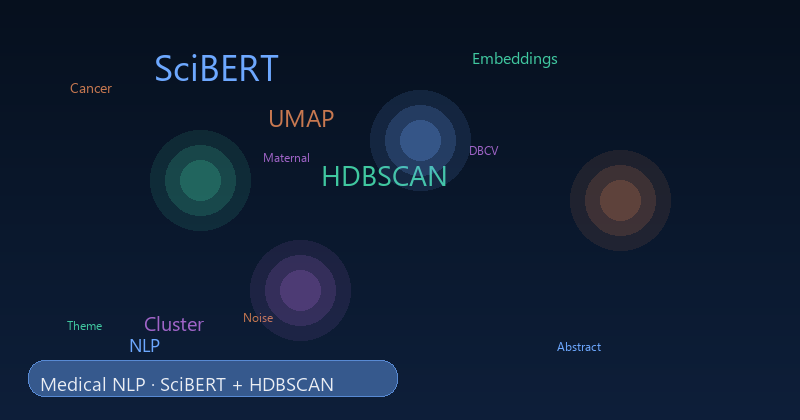
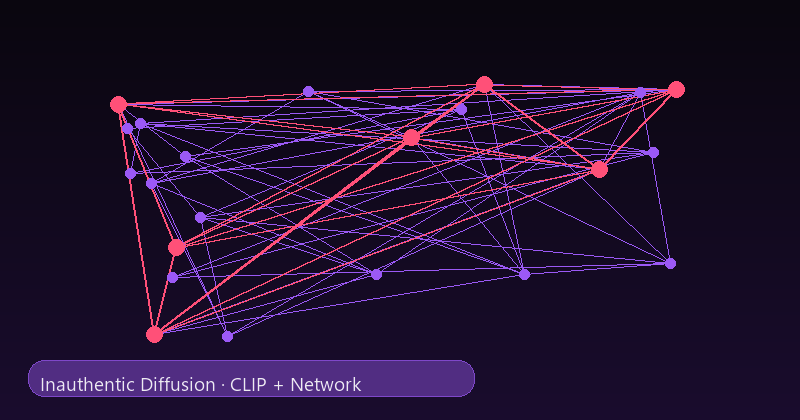
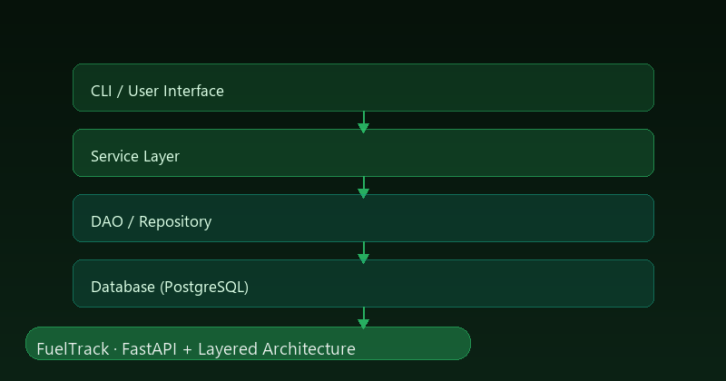
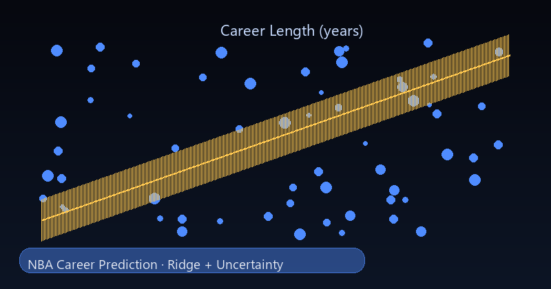
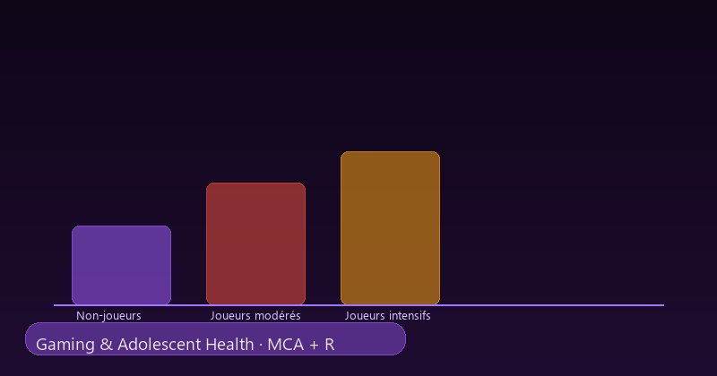
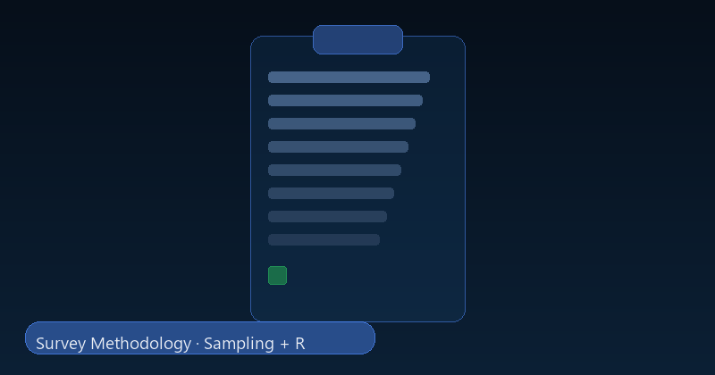
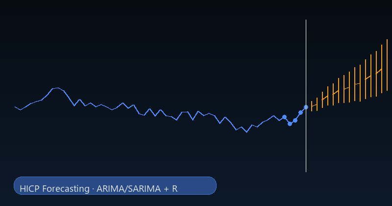
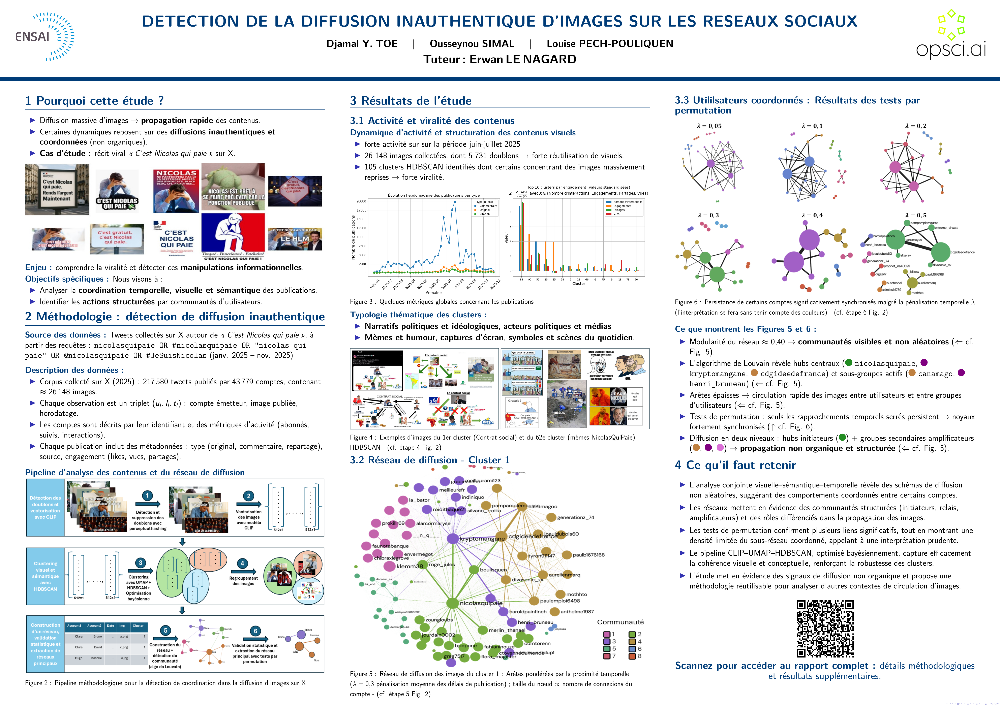
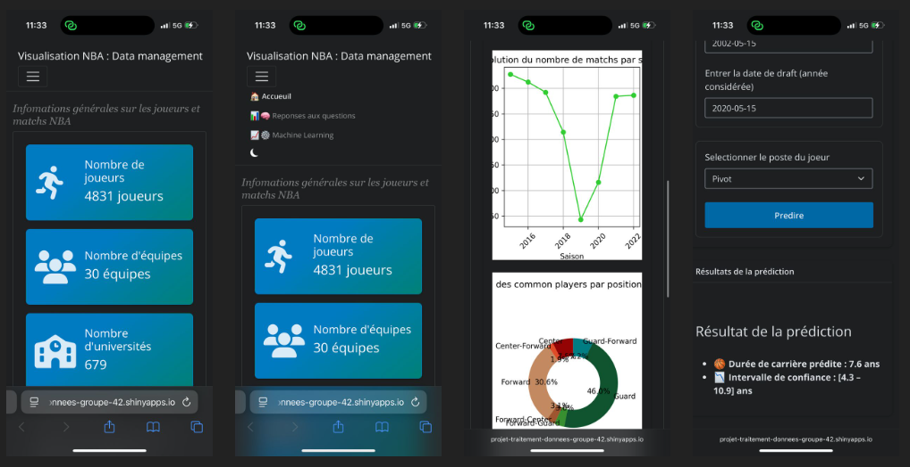

```{=html}
<div class="portfolio-shell">
  <aside class="sidebar" aria-label="Profile sidebar">
    <div class="sidebar-card">
      
      <h1 class="name">Djamal TOE</h1>
      <p class="title">Data Scientist &amp; Machine Learning Engineer</p>
      <p class="bio">Academic projects from statistical foundations to advanced ML, Deep Learning, Network Science, and NLP.</p>
    </div>
  </aside>

  <div class="main-panel">
    <header class="topbar" aria-label="Top navigation">
      <button class="menu-toggle" id="menuToggle" aria-label="Open navigation drawer" aria-expanded="false">Menu</button>
      <a class="brand-pill" href="index.qmd" aria-label="Djamal TOE home"></a>
      <nav class="nav-links" aria-label="Primary navigation">
        <a href="index.qmd">Home</a>
        <a href="experience.qmd">Experience</a>
        <a class="active" href="academic-projects.qmd">Academic</a>
        <a href="personal-projects.qmd">Personal</a>
        <a href="skills.qmd">Skills</a>
        <a href="education.qmd">Education</a>
        <a href="blog.qmd">Blog</a>
        <a href="about.qmd">About</a>
      </nav>
    </header>

    <main id="main-content">
      <section class="section-card">
        <div class="section-header">
          <div>
            <h2 class="section-title">Academic Projects</h2>
            <p class="section-lead">These projects were completed throughout my academic training and now include clearer context on the problem, the methodology, and the main results.</p>
          </div>
        </div>

        <div class="project-grid">
          <article class="project-card academic-box">
            
            <h3 class="project-title">From Medical Texts to Meaningful Patterns</h3>
            <p class="project-description">Why TF-IDF was not enough for long biomedical abstracts, and how SciBERT + UMAP + HDBSCAN revealed four interpretable themes.</p>
            <div class="tag-list"><span class="tag-pill"><i class="bi bi-filetype-py tag-icon" aria-hidden="true"></i><span>Python</span></span><span class="tag-pill"><i class="bi bi-cpu tag-icon" aria-hidden="true"></i><span>Machine Learning</span></span><span class="tag-pill"><i class="bi bi-chat-left-text tag-icon" aria-hidden="true"></i><span>NLP</span></span><span class="tag-pill"><i class="bi bi-diagram-3 tag-icon" aria-hidden="true"></i><span>Unsupervised Learning</span></span></div>
            <div class="project-foot"><span class="project-meta">Case study</span><button class="project-link btn-secondary" data-project="p1">More details <svg width="14" height="14" viewBox="0 0 24 24" fill="none" stroke="currentColor" stroke-width="2" aria-hidden="true"><path d="M5 12h14M13 6l6 6-6 6"/></svg></button></div>
          </article>

          <article class="project-card academic-box">
            
            <h3 class="project-title">Identifying Inauthentic Image Sharing and Coordinated Behavior</h3>
            <p class="project-description">How synchronized image diffusion was studied with CLIP, temporal networks, and clustering to detect coordinated behavior.</p>
            <div class="tag-list"><span class="tag-pill"><i class="bi bi-filetype-py tag-icon" aria-hidden="true"></i><span>Python</span></span><span class="tag-pill"><i class="bi bi-camera tag-icon" aria-hidden="true"></i><span>Computer Vision</span></span><span class="tag-pill"><i class="bi bi-image tag-icon" aria-hidden="true"></i><span>CLIP</span></span><span class="tag-pill"><i class="bi bi-lightning-charge-fill tag-icon" aria-hidden="true"></i><span>PyTorch</span></span><span class="tag-pill"><i class="bi bi-diagram-3 tag-icon" aria-hidden="true"></i><span>Network Science</span></span></div>
            <div class="project-foot"><span class="project-meta">Recommendation received</span><button class="project-link btn-secondary" data-project="p2">More details <svg width="14" height="14" viewBox="0 0 24 24" fill="none" stroke="currentColor" stroke-width="2" aria-hidden="true"><path d="M5 12h14M13 6l6 6-6 6"/></svg></button></div>
          </article>

          <article class="project-card academic-box">
            
            <h3 class="project-title">FuelTrack</h3>
            <p class="project-description">A layered fuel-price application built for non-technical and technical users, from data ingestion to analysis and deployment.</p>
            <div class="tag-list"><span class="tag-pill"><i class="bi bi-filetype-py tag-icon" aria-hidden="true"></i><span>Python</span></span><span class="tag-pill"><i class="bi bi-lightning-charge tag-icon" aria-hidden="true"></i><span>FastAPI</span></span><span class="tag-pill"><i class="bi bi-github tag-icon" aria-hidden="true"></i><span>GitHub</span></span><span class="tag-pill"><i class="bi bi-bar-chart-line tag-icon" aria-hidden="true"></i><span>Data Visualization</span></span><span class="tag-pill"><i class="bi bi-layers tag-icon" aria-hidden="true"></i><span>Layered Architecture</span></span></div>
            <div class="project-foot"><span class="project-meta">Case study</span><button class="project-link btn-secondary" data-project="p3">More details <svg width="14" height="14" viewBox="0 0 24 24" fill="none" stroke="currentColor" stroke-width="2" aria-hidden="true"><path d="M5 12h14M13 6l6 6-6 6"/></svg></button></div>
          </article>

          <article class="project-card academic-box">
            
            <h3 class="project-title">Predicting NBA Career Length</h3>
            <p class="project-description">How player features, position, and age were turned into a predictive model with uncertainty-aware evaluation.</p>
            <div class="tag-list"><span class="tag-pill"><i class="bi bi-filetype-py tag-icon" aria-hidden="true"></i><span>Python</span></span><span class="tag-pill"><i class="bi bi-cpu tag-icon" aria-hidden="true"></i><span>Machine Learning</span></span><span class="tag-pill"><i class="bi bi-graph-up-arrow tag-icon" aria-hidden="true"></i><span>Regression</span></span><span class="tag-pill"><i class="bi bi-dice-5 tag-icon" aria-hidden="true"></i><span>Uncertainty</span></span></div>
            <div class="project-foot"><span class="project-meta">Case study</span><button class="project-link btn-secondary" data-project="p4">More details <svg width="14" height="14" viewBox="0 0 24 24" fill="none" stroke="currentColor" stroke-width="2" aria-hidden="true"><path d="M5 12h14M13 6l6 6-6 6"/></svg></button></div>
          </article>

          <article class="project-card academic-box">
            
            <h3 class="project-title">The Link Between Gaming and Adolescent Health</h3>
            <p class="project-description">A public-health study of gaming habits and adolescent health using exploratory analysis, MCA, and association tests.</p>
            <div class="tag-list"><span class="tag-pill"><i class="bi bi-r-circle tag-icon" aria-hidden="true"></i><span>R</span></span><span class="tag-pill"><i class="bi bi-graph-up tag-icon" aria-hidden="true"></i><span>Applied Statistics</span></span><span class="tag-pill"><i class="bi bi-heart-pulse tag-icon" aria-hidden="true"></i><span>Public Health</span></span><span class="tag-pill"><i class="bi bi-grid-3x3-gap tag-icon" aria-hidden="true"></i><span>MCA</span></span></div>
            <div class="project-foot"><span class="project-meta">Case study</span><button class="project-link btn-secondary" data-project="p5">More details <svg width="14" height="14" viewBox="0 0 24 24" fill="none" stroke="currentColor" stroke-width="2" aria-hidden="true"><path d="M5 12h14M13 6l6 6-6 6"/></svg></button></div>
          </article>

          <article class="project-card academic-box">
            
            <h3 class="project-title">Practical Survey Project</h3>
            <p class="project-description">A complete survey workflow, from question design and sampling to digital collection and analysis-ready data.</p>
            <div class="tag-list"><span class="tag-pill"><i class="bi bi-r-circle tag-icon" aria-hidden="true"></i><span>R</span></span><span class="tag-pill"><i class="bi bi-clipboard-data tag-icon" aria-hidden="true"></i><span>Survey Methodology</span></span><span class="tag-pill"><i class="bi bi-journal-text tag-icon" aria-hidden="true"></i><span>Data Collection</span></span><span class="tag-pill"><i class="bi bi-graph-up tag-icon" aria-hidden="true"></i><span>Statistics</span></span></div>
            <div class="project-foot"><span class="project-meta">Case study</span><button class="project-link btn-secondary" data-project="p6">More details <svg width="14" height="14" viewBox="0 0 24 24" fill="none" stroke="currentColor" stroke-width="2" aria-hidden="true"><path d="M5 12h14M13 6l6 6-6 6"/></svg></button></div>
          </article>

          <article class="project-card academic-box">
            
            <h3 class="project-title">Forecasting the Harmonised Index of Consumer Prices</h3>
            <p class="project-description">A comparison of classical forecasting approaches for monthly inflation data, with model selection and evaluation.</p>
            <div class="tag-list"><span class="tag-pill"><i class="bi bi-r-circle tag-icon" aria-hidden="true"></i><span>R</span></span><span class="tag-pill"><i class="bi bi-clock-history tag-icon" aria-hidden="true"></i><span>Time Series</span></span><span class="tag-pill"><i class="bi bi-graph-up-arrow tag-icon" aria-hidden="true"></i><span>Forecasting</span></span><span class="tag-pill"><i class="bi bi-bar-chart-line tag-icon" aria-hidden="true"></i><span>ARIMA/SARIMA</span></span></div>
            <div class="project-foot"><span class="project-meta">Case study</span><button class="project-link btn-secondary" data-project="p7">More details <svg width="14" height="14" viewBox="0 0 24 24" fill="none" stroke="currentColor" stroke-width="2" aria-hidden="true"><path d="M5 12h14M13 6l6 6-6 6"/></svg></button></div>
          </article>
        </div>
      </section>

      <section class="section-card">
        <div class="section-header"><div><h2 class="section-title">Academic Projects - Overall Progression</h2></div></div>
        <p class="section-lead">Statistical Foundations → Survey Methodology → Public Health Statistics → Machine Learning → Software Engineering → Computer Vision &amp; Network Science → NLP &amp; Unsupervised Learning.</p>
      </section>
    </main>
  </div>
</div>

<div class="modal-backdrop" id="academicModalBackdrop"></div>
<div class="modal-panel" id="academicModal" role="dialog" aria-modal="true" aria-labelledby="academicModalTitle"></div>

<div class="drawer-backdrop" id="drawerBackdrop"></div>
<div class="sidebar-drawer" id="mobileDrawer" aria-label="Mobile navigation drawer">
  <div class="sidebar-card">
    
    <h2 class="name">Djamal TOE</h2>
    <p class="title">Data Scientist &amp; Machine Learning Engineer</p>
    <h3>Navigate</h3>
    <ul class="contact-list">
      <li><a href="index.qmd">Home</a></li>
      <li><a href="experience.qmd">Experience</a></li>
      <li><a href="academic-projects.qmd">Academic Projects</a></li>
      <li><a href="personal-projects.qmd">Personal Projects</a></li>
      <li><a href="skills.qmd">Skills</a></li>
      <li><a href="education.qmd">Education</a></li>
      <li><a href="blog.qmd">Blog</a></li>
      <li><a href="about.qmd">About</a></li>
    </ul>
  </div>
</div>
```

<script>
  const academicDetails = {
    p1: {
      title: "From Medical Texts to Meaningful Patterns",
      body: `
        <p><strong>Dates:</strong> March 2026 - April 2026 · <strong>Institution:</strong> ENSAI</p>
        <p><strong>Context:</strong> Scientific abstracts are dense, long, and semantically rich, so TF-IDF-style representations were too limited to recover themes in a meaningful way.</p>
        <p><strong>Why this matters:</strong> the goal was not only to cluster texts, but to produce groups that were interpretable enough to support downstream literature exploration.</p>
        <p><strong>Methodology:</strong> Python pipeline with SciBERT embeddings, UMAP reduction, HDBSCAN clustering, and Bayesian optimization to tune the clustering configuration.</p>
        <p><strong>Pipeline:</strong> Abstracts → SciBERT embeddings → UMAP → HDBSCAN → validation and interpretation.</p>
        <p><strong>Results:</strong> The final structure produced 4 coherent themes plus a noise group: cancer/survival, maternal health, reproductive health/genetics, and contraception/access to care.</p>
        <p><strong>Quality checks:</strong> DBCV was around 0.5, the noise ratio was about 17%, and the clustering was stable enough to support interpretation without overfitting the parameter search.</p>
        <p><strong>Contribution:</strong> End-to-end work from text representation to cluster interpretation and result communication.</p>
      `
    },
    p2: {
      title: "Identifying Inauthentic Image Sharing and Coordinated Behavior",
      body: `
        <p><strong>Dates:</strong> December 2025 - April 2026 · <strong>Institution:</strong> ENSAI</p>
        <p><strong>Context:</strong> The project studied whether visually similar posts spreading at the same time were just organic diffusion or a sign of coordinated behavior.</p>
        <p><strong>Why this matters:</strong> image similarity alone is not enough, so visual, temporal, and network signals had to be combined to understand the propagation structure.</p>
        <p><strong>Data:</strong> about 217k posts, 43k accounts, and 26k images.</p>
        <p><strong>Methodology:</strong> perceptual hashing, CLIP embeddings, UMAP, HDBSCAN, Bayesian optimization, temporal network analysis, permutation testing, FDR control, and Louvain community detection.</p>
        <p><strong>Pipeline:</strong> Posts → preprocessing → pHash → CLIP → UMAP → HDBSCAN → temporal networks → statistical testing → community analysis.</p>
        <p><strong>Results:</strong> the analysis suggested that diffusion was not fully organic, with a pattern consistent with multi-level amplification.</p>
        <p><strong>Poster focus:</strong> this poster represents and interprets one cluster in detail, showing how the visual, temporal, and network signals converged around that group.</p>
        <p><strong>Interpretation:</strong> central accounts were not always directly coordinated, which showed why a multi-layer approach was necessary instead of a pure similarity score.</p>
        <p><strong>Contribution:</strong> End-to-end work across computer vision, machine learning, statistical testing, and network science.</p>
        <figure class="modal-figure">
          
          <figcaption>Poster summarizing one representative cluster and its interpretation.</figcaption>
        </figure>
      `
    },
    p3: {
      title: "FuelTrack - Interactive Fuel Price Analysis",
      body: `
        <p><strong>Dates:</strong> September 2025 - November 2025 · <strong>Institution:</strong> ENSAI · <strong>Role:</strong> Tech Lead</p>
        <p><strong>Context:</strong> fuel-price data is public, but it is fragmented and hard to use directly without a clear technical structure and a friendly interface.</p>
        <p><strong>Why this matters:</strong> the aim was to hide the complexity of the full pipeline from the user while keeping the solution robust for technical teams.</p>
        <p><strong>Methodology:</strong> layered architecture (CLI → Service → DAO → DB), XML ingestion, PostgreSQL storage, FastAPI, authentication, temporal analysis, station comparison, and interactive visualisation.</p>
        <p><strong>Results:</strong> the application was delivered end to end with more than 520 unit tests and around 75% coverage.</p>
        <p><strong>Impact:</strong> users can inspect fuel prices through a simple application instead of manually handling ingestion, storage, and analysis steps.</p>
        <p><strong>Contribution:</strong> architecture, Python implementation, FastAPI integration, test strategy, and technical coordination.</p>
      `
    },
    p4: {
      title: "Predicting the Career Length of NBA Players",
      body: `
        <p><strong>Dates:</strong> March 2025 - May 2025 · <strong>Institution:</strong> ENSAI</p>
        <p><strong>Context:</strong> player careers are highly variable, so the model had to predict duration while also quantifying uncertainty instead of giving a single opaque number.</p>
        <p><strong>Why this matters:</strong> the task combined data harmonisation, predictive modelling, and interpretation for a domain where decisions depend on more than raw accuracy.</p>
        <p><strong>Methodology:</strong> harmonisation across 1946-2023 datasets, feature encoding, multicollinearity checks, ridge regularisation, k-fold validation, prediction intervals, a custom sklearn class, and a Shiny interface.</p>
        <p><strong>Results:</strong> the final model reached an RMSE of about 4 years; age at entry, position, and performance indicators were among the most important predictors.</p>
        <p><strong>Validation:</strong> more than 214 unit tests were used to secure the workflow and the application layer.</p>
        <p><strong>Contribution:</strong> data preparation, modelling, uncertainty quantification, testing, and interface design.</p>
        <div class="modal-links">
          <a class="btn-secondary" href="https://djamal2905.github.io/djamal_website/projet-traitement-donnees/report_writing/Presentation/presentation-ptd.html#/title-slide" target="_blank" rel="noopener noreferrer">Open slides</a>
          <a class="btn-secondary" href="https://projet-traitement-donnees-groupe-42.shinyapps.io/basket-nba-groupe42/" target="_blank" rel="noopener noreferrer">Open Shiny app</a>
        </div>
        <figure class="modal-figure">
          
          <figcaption>Interactive Shiny app used to explore NBA career-length predictions.</figcaption>
        </figure>
      `
    },
    p5: {
      title: "The Link Between Gaming and Adolescent Health",
      body: `
        <p><strong>Dates:</strong> December 2024 - May 2025 · <strong>Institution:</strong> ENSAI</p>
        <p><strong>Context:</strong> ESCAPAD 2022 survey data was used to explore how gaming and gambling habits relate to physical and mental health indicators in adolescents.</p>
        <p><strong>Why this matters:</strong> the analysis aimed to describe associations and profiles, not causal effects, so interpretation had to stay statistically careful.</p>
        <p><strong>Methodology:</strong> data cleaning, recoding, exploratory analysis, Fisher exact tests, Chi-square tests, MCA, and multivariate profile interpretation.</p>
        <p><strong>Results:</strong> intensive gaming was associated with less favorable indicators such as higher ADRS, sleep issues, and worse self-perceived health, with distinct gender profiles emerging.</p>
        <p><strong>Contribution:</strong> data preparation, analysis, interpretation, and communication of the findings.</p>
      `
    },
    p6: {
      title: "Practical Survey Project",
      body: `
        <p><strong>Dates:</strong> May 2023 - June 2023 · <strong>Institution:</strong> Universite Nazi Boni</p>
        <p><strong>Context:</strong> the goal was to build a complete survey pipeline, not just analyse data after the fact.</p>
        <p><strong>Why this matters:</strong> the project covered the full chain from problem definition to field collection, so sampling and questionnaire design had to be consistent with the final analysis.</p>
        <p><strong>Methodology:</strong> objectives, hypotheses, protocol, sample-size calculation, questionnaire design, coding, KoboCollect form building, field collection, and preparation of the analysis dataset.</p>
        <p><strong>Results:</strong> the work produced an operational survey workflow and practical experience in field data quality management.</p>
        <p><strong>Contribution:</strong> protocol design, calculations, form development, data collection, and preparation.</p>
      `
    },
    p7: {
      title: "Forecasting the Harmonised Index of Consumer Prices",
      body: `
        <p><strong>Dates:</strong> November 2021 - December 2021 · <strong>Institution:</strong> Universite Nazi Boni</p>
        <p><strong>Context:</strong> monthly HICP data were analysed to compare classical forecasting methods on a real economic series with trend and seasonality.</p>
        <p><strong>Why this matters:</strong> the objective was to understand which family of methods was more appropriate, not only to fit one model in isolation.</p>
        <p><strong>Methodology:</strong> SES, DES, Holt-Winters, trend regression, ARIMA, and SARIMA were compared through a structured forecasting workflow.</p>
        <p><strong>Results:</strong> the comparison clarified how smoothing, trend, autoregressive, and seasonal approaches behave on the same series and strengthened model-selection practice.</p>
        <p><strong>Contribution:</strong> model implementation, comparison, and extension toward ARIMA/SARIMA analysis.</p>
      `
    }
  };

  const modal = document.getElementById('academicModal');
  const modalBackdrop = document.getElementById('academicModalBackdrop');

  function openProjectModal(projectId) {
    const data = academicDetails[projectId];
    if (!data) return;
    modal.innerHTML = `
      <button class="modal-close" id="closeAcademicModal" aria-label="Close details">×</button>
      <h2 id="academicModalTitle">${data.title}</h2>
      ${data.body}
    `;
    modal.classList.add('open');
    modalBackdrop.classList.add('open');
    document.body.style.overflow = 'hidden';
    document.getElementById('closeAcademicModal')?.addEventListener('click', closeProjectModal);
  }

  function closeProjectModal() {
    modal.classList.remove('open');
    modalBackdrop.classList.remove('open');
    const drawerOpen = document.getElementById('mobileDrawer')?.classList.contains('open');
    if (!drawerOpen) {
      document.body.style.overflow = '';
    }
  }

  modalBackdrop?.addEventListener('click', closeProjectModal);

  document.querySelectorAll('[data-project]').forEach((btn) => {
    btn.addEventListener('click', () => openProjectModal(btn.getAttribute('data-project')));
  });

  document.addEventListener('keydown', (event) => {
    if (event.key === 'Escape') closeProjectModal();
  });
</script>
<script src="assets/site.js"></script>
