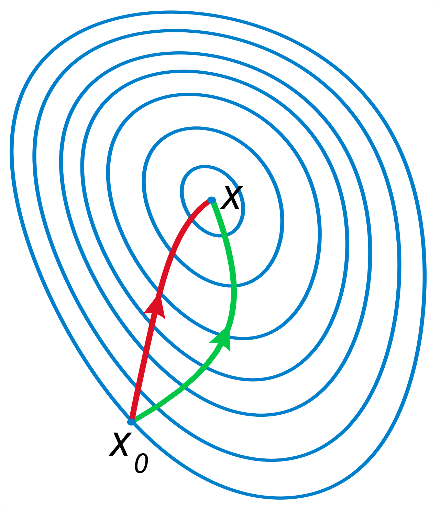

```{=html}
<div class="portfolio-shell">
  <aside class="sidebar" aria-label="Profile sidebar">
    <div class="sidebar-card">
      
      <h1 class="name">Djamal TOE</h1>
      <p class="title">Data Scientist &amp; Machine Learning Engineer</p>
      <p class="bio">Notes on ML, statistics, Bayesian methods, computer vision, and practical data science.</p>
      <div class="meta-list">
        <span class="meta-item"><i class="bi bi-pen" aria-hidden="true"></i> Tutorials</span>
        <span class="meta-item"><i class="bi bi-lightbulb" aria-hidden="true"></i> Concepts</span>
        <span class="meta-item"><i class="bi bi-share" aria-hidden="true"></i> Expérience</span>
      </div>
    </div>
  </aside>

  <div class="main-panel">
    <header class="topbar" aria-label="Top navigation">
      <button class="menu-toggle" id="menuToggle" aria-label="Open navigation drawer" aria-expanded="false"><i class="bi bi-list" aria-hidden="true"></i></button>
      <a class="brand-pill" href="index.qmd" aria-label="Djamal TOE home"></a>
      <nav class="nav-links" aria-label="Primary navigation">
        <a href="index.qmd">Home</a>
        <a href="experience.qmd">Experience</a>
        <a href="academic-projects.qmd">Academic</a>
        <a href="personal-projects.qmd">Personal</a>
        <a href="skills.qmd">Skills</a>
        <a href="education.qmd">Education</a>
        <a class="active" href="blog.qmd">Blog</a>
        <a href="about.qmd">About</a>
      </nav>
    </header>

    <main id="main-content">

      <!-- ══ SECTION: À venir ══════════════════════════════════════════ -->
      <section class="section-card">
        <div class="section-header">
          <div>
            <h2 class="section-title">Articles à venir</h2>
            <p class="section-lead">Sujets en préparation : le contenu arrivera progressivement.</p>
          </div>
        </div>

        <div class="project-grid">

          <!-- Card: CLIP & DINOv2 -->
          <article class="project-card blog-card">
            <div class="project-thumb">
              
            </div>
            <h3 class="project-title">Qu'est-ce que CLIP et DINOv2 ?</h3>
            <p class="project-description">Comprendre les modèles de représentation visuelle contrastive et auto-supervisée : CLIP d'OpenAI et DINOv2 de Meta.</p>
            <div class="tag-list">
              <span class="tag-pill"><i class="bi bi-camera tag-icon" aria-hidden="true"></i><span>Computer Vision</span></span>
              <span class="tag-pill"><i class="bi bi-lightning-charge-fill tag-icon" aria-hidden="true"></i><span>Deep Learning</span></span>
              <span class="tag-pill"><i class="bi bi-filetype-py tag-icon" aria-hidden="true"></i><span>Python</span></span>
            </div>
            <div class="project-foot">
              <span class="project-meta blog-coming-soon"><i class="bi bi-clock" aria-hidden="true"></i> À venir</span>
              <button class="project-link btn-secondary" disabled aria-disabled="true">Bientôt disponible</button>
            </div>
          </article>

          <!-- Card: Surrogate models -->
          <article class="project-card blog-card">
            <div class="project-thumb">
              
            </div>
            <h3 class="project-title">C'est quoi un surrogate pour des modèles lourds ?</h3>
            <p class="project-description">Cas du MCMC et du XGBoost : pourquoi approximer un modèle coûteux et comment construire un surrogate efficace.</p>
            <div class="tag-list">
              <span class="tag-pill"><i class="bi bi-cpu tag-icon" aria-hidden="true"></i><span>Machine Learning</span></span>
              <span class="tag-pill"><i class="bi bi-graph-up tag-icon" aria-hidden="true"></i><span>Statistiques</span></span>
              <span class="tag-pill"><i class="bi bi-filetype-py tag-icon" aria-hidden="true"></i><span>Python</span></span>
            </div>
            <div class="project-foot">
              <span class="project-meta blog-coming-soon"><i class="bi bi-clock" aria-hidden="true"></i> À venir</span>
              <button class="project-link btn-secondary" disabled aria-disabled="true">Bientôt disponible</button>
            </div>
          </article>

          <!-- Card: Bayesian optimization -->
          <article class="project-card blog-card">
            <div class="project-thumb">
              
            </div>
            <h3 class="project-title">Pourquoi utiliser l'optimisation bayésienne ?</h3>
            <p class="project-description">L'optimisation bayésienne pour le tuning d'hyperparamètres et au-delà : intuition, acquisition functions, et cas pratiques.</p>
            <div class="tag-list">
              <span class="tag-pill"><i class="bi bi-calculator tag-icon" aria-hidden="true"></i><span>Bayésien</span></span>
              <span class="tag-pill"><i class="bi bi-cpu tag-icon" aria-hidden="true"></i><span>Machine Learning</span></span>
              <span class="tag-pill"><i class="bi bi-filetype-py tag-icon" aria-hidden="true"></i><span>Python</span></span>
            </div>
            <div class="project-foot">
              <span class="project-meta blog-coming-soon"><i class="bi bi-clock" aria-hidden="true"></i> À venir</span>
              <button class="project-link btn-secondary" disabled aria-disabled="true">Bientôt disponible</button>
            </div>
          </article>

          <!-- Card: Bayesian experience -->
          <article class="project-card blog-card">
            <div class="project-thumb">
              
            </div>
            <h3 class="project-title">Partage d'expérience sur le bayésien</h3>
            <p class="project-description">Retour d'expérience sur la modélisation bayésienne en conditions réelles : MCMC, HMC, NUTS, Stan, et ce qu'on n'apprend pas dans les cours.</p>
            <div class="tag-list">
              <span class="tag-pill"><i class="bi bi-calculator tag-icon" aria-hidden="true"></i><span>Bayésien</span></span>
              <span class="tag-pill"><i class="bi bi-graph-up tag-icon" aria-hidden="true"></i><span>Statistiques</span></span>
              <span class="tag-pill"><i class="bi bi-share tag-icon" aria-hidden="true"></i><span>Expérience</span></span>
            </div>
            <div class="project-foot">
              <span class="project-meta blog-coming-soon"><i class="bi bi-clock" aria-hidden="true"></i> À venir</span>
              <button class="project-link btn-secondary" disabled aria-disabled="true">Bientôt disponible</button>
            </div>
          </article>

        </div>
      </section>

      <!-- ══ SECTION: Déjà disponible ══════════════════════════════════ -->
      <section class="section-card">
        <div class="section-header">
          <div>
            <h2 class="section-title">Articles disponibles</h2>
            <p class="section-lead">Tutoriels et notes déjà rédigés.</p>
          </div>
          <a class="project-link btn-secondary" href="blog/index.qmd">Tous les articles &rarr;</a>
        </div>

        <div class="project-grid">

          <!-- Card: SIG -->
          <article class="project-card blog-card">
            <a class="project-thumb" href="content/data-visualization/cartography-r/SIG.html">
              
            </a>
            <h3 class="project-title">Création de cartes choroplèthes avec R</h3>
            <p class="project-description">Tutoriel complet sur la cartographie thématique avec R : données géographiques, sf, ggplot2, et visualisation de statistiques territoriales.</p>
            <div class="tag-list">
              <span class="tag-pill"><i class="bi bi-r-circle tag-icon" aria-hidden="true"></i><span>R</span></span>
              <span class="tag-pill"><i class="bi bi-globe tag-icon" aria-hidden="true"></i><span>SIG</span></span>
              <span class="tag-pill"><i class="bi bi-pie-chart-fill tag-icon" aria-hidden="true"></i><span>Data Viz</span></span>
            </div>
            <div class="project-foot">
              <span class="project-meta">Décembre 2024</span>
              <a class="project-link btn-secondary" href="content/data-visualization/cartography-r/SIG.html">Lire l'article</a>
            </div>
          </article>

          <!-- Card: Gradient descent -->
          <article class="project-card blog-card">
            <a class="project-thumb" href="content/machine-learning/gradient-descent/gradient-descent-linear-reg.html">
              
            </a>
            <h3 class="project-title">Descente de gradient pour la régression linéaire</h3>
            <p class="project-description">Implémentation pas-à-pas de la descente de gradient pour la régression linéaire : intuition géométrique, calcul du gradient et convergence.</p>
            <div class="tag-list">
              <span class="tag-pill"><i class="bi bi-filetype-py tag-icon" aria-hidden="true"></i><span>Python</span></span>
              <span class="tag-pill"><i class="bi bi-calculator tag-icon" aria-hidden="true"></i><span>Optimisation</span></span>
              <span class="tag-pill"><i class="bi bi-cpu tag-icon" aria-hidden="true"></i><span>Machine Learning</span></span>
            </div>
            <div class="project-foot">
              <span class="project-meta">Juin 2025</span>
              <a class="project-link btn-secondary" href="content/machine-learning/gradient-descent/gradient-descent-linear-reg.html">Lire l'article</a>
            </div>
          </article>

          <!-- Card: Presentations with Quarto & R -->
          <article class="project-card blog-card">
            <a class="project-thumb" href="content/data-visualization/presentations/presentations.html">
              
            </a>
            <h3 class="project-title">Comment faire des présentations avec Quarto et R</h3>
            <p class="project-description">Guide pratique pour créer des slides professionnelles avec Quarto Reveal.js et R : mise en page, thèmes, fragments et intégration de code.</p>
            <div class="tag-list">
              <span class="tag-pill"><i class="bi bi-r-circle tag-icon" aria-hidden="true"></i><span>R</span></span>
              <span class="tag-pill"><i class="bi bi-easel tag-icon" aria-hidden="true"></i><span>Quarto</span></span>
              <span class="tag-pill"><i class="bi bi-pie-chart-fill tag-icon" aria-hidden="true"></i><span>Data Viz</span></span>
            </div>
            <div class="project-foot">
              <span class="project-meta">Novembre 2024</span>
              <a class="project-link btn-secondary" href="content/data-visualization/presentations/presentations.html">Lire l'article</a>
            </div>
          </article>

        </div>
      </section>

    </main>
  </div>
</div>

<div class="drawer-backdrop" id="drawerBackdrop"></div>
<div class="sidebar-drawer" id="mobileDrawer" aria-label="Mobile navigation drawer">
  <div class="sidebar-card">
    
    <h2 class="name">Djamal TOE</h2>
    <p class="title">Data Scientist &amp; Machine Learning Engineer</p>
    <h3>Navigate</h3>
    <ul class="contact-list">
      <li><a href="index.qmd">Home</a></li>
      <li><a href="experience.qmd">Experience</a></li>
      <li><a href="academic-projects.qmd">Academic</a></li>
      <li><a href="personal-projects.qmd">Personal</a></li>
      <li><a href="skills.qmd">Skills</a></li>
      <li><a href="education.qmd">Education</a></li>
      <li><a href="blog.qmd">Blog</a></li>
      <li><a href="about.qmd">About</a></li>
    </ul>
  </div>
</div>
```

<script src="assets/site.js"></script>
