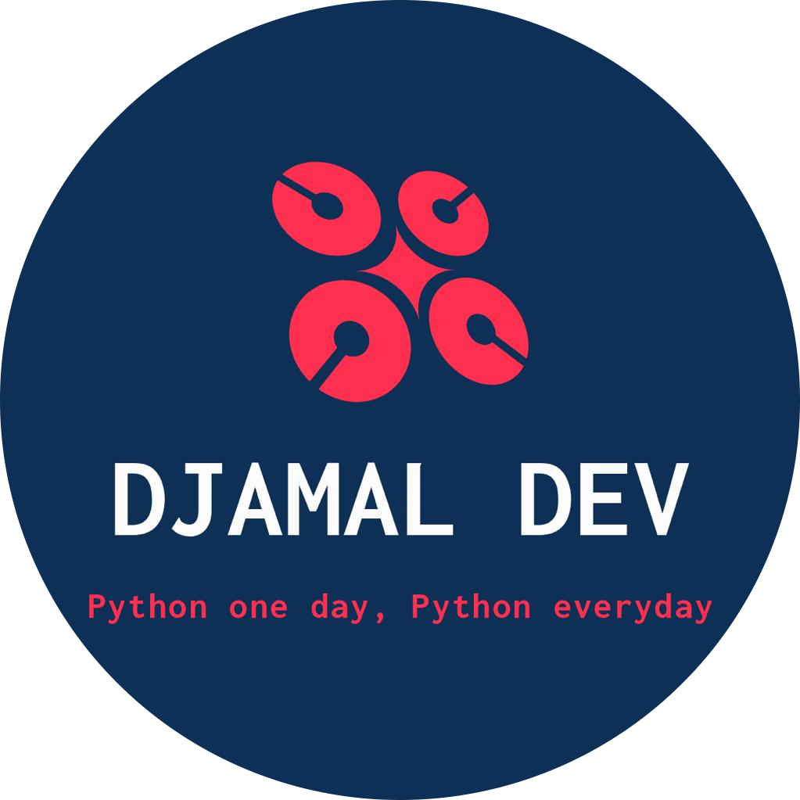

```{=html}
<div class="portfolio-shell">
  <aside class="sidebar" aria-label="Profile sidebar"><div class="sidebar-card" style="padding: 1.2rem;"><h1 class="name">Djamal TOE</h1><p class="title">Data Scientist &amp; Machine Learning Engineer</p><p class="bio">Open to collaborations, technical discussions, and research-oriented projects.</p></div></aside>
  <div class="main-panel">
    <header class="topbar" aria-label="Top navigation"><button class="menu-toggle" id="menuToggle" aria-label="Open navigation drawer" aria-expanded="false">Menu</button><a class="brand-pill" href="index.qmd" aria-label="Djamal TOE home"></a><nav class="nav-links" aria-label="Primary navigation"><a href="index.qmd">Home</a><a href="experience.qmd">Experience</a><a href="academic-projects.qmd">Academic Projects</a><a href="personal-projects.qmd">Personal Projects</a><a href="skills.qmd">Skills</a><a href="education.qmd">Education</a><a href="blog.qmd">Blog</a><a href="about.qmd">About</a></nav></header>
    <main id="main-content">
      <section class="section-card"><div class="section-header"><div><h2 class="section-title">Contact</h2><p class="section-lead">Direct channels without exposing an email address publicly.</p></div></div>
        <div class="contact-card">
          <ul class="contact-list">
            <li><strong>LinkedIn</strong><br /><a href="https://www.linkedin.com/in/djamal-toe-7a18432b0/">linkedin.com/in/djamal-toe-7a18432b0</a></li>
            <li><strong>GitHub</strong><br /><a href="https://github.com/djamal2905/djamal_website">github.com/djamal2905/djamal_website</a></li>
            <li><strong>Email</strong><br />Available on request via LinkedIn</li>
          </ul>
        </div>
      </section>
    </main>
  </div>
</div>
<div class="drawer-backdrop" id="drawerBackdrop"></div><div class="sidebar-drawer" id="mobileDrawer" aria-label="Mobile navigation drawer"><div class="sidebar-card" style="padding: 1rem;"><h2 class="name">Djamal TOE</h2><p class="title">Data Scientist &amp; Machine Learning Engineer</p><h3>Navigate</h3><ul class="contact-list" style="padding:0; list-style:none;"><li><a href="index.qmd">Home</a></li><li><a href="experience.qmd">Experience</a></li><li><a href="academic-projects.qmd">Academic Projects</a></li><li><a href="personal-projects.qmd">Personal Projects</a></li><li><a href="skills.qmd">Skills</a></li><li><a href="education.qmd">Education</a></li><li><a href="blog.qmd">Blog</a></li><li><a href="about.qmd">About</a></li></ul></div></div>
```
<script>
  const menuToggle = document.getElementById('menuToggle');
  const mobileDrawer = document.getElementById('mobileDrawer');
  const drawerBackdrop = document.getElementById('drawerBackdrop');
  function toggleDrawer(force) { const open = typeof force === 'boolean' ? force : !mobileDrawer.classList.contains('open'); mobileDrawer.classList.toggle('open', open); drawerBackdrop.classList.toggle('open', open); menuToggle.setAttribute('aria-expanded', open ? 'true' : 'false'); document.body.style.overflow = open ? 'hidden' : ''; }
  menuToggle?.addEventListener('click', () => toggleDrawer()); drawerBackdrop?.addEventListener('click', () => toggleDrawer(false)); document.addEventListener('keydown', (event) => { if (event.key === 'Escape') toggleDrawer(false); });
</script>
