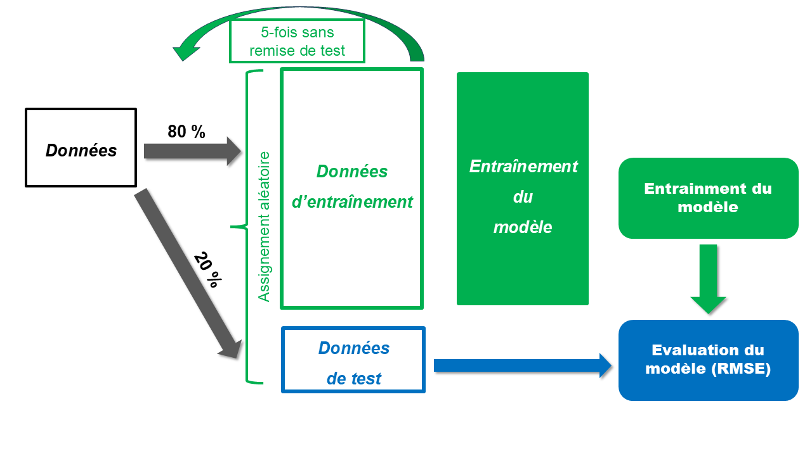

```{r setup, include=FALSE}
knitr::opts_chunk$set(echo = FALSE, eval = TRUE, message = FALSE, warning = FALSE)
library(reticulate)
use_python("C:/Users/Djamal TOE/AppData/Local/Programs/Python/Python311")
```

```{r chargement, message=FALSE, echo=FALSE, include=FALSE, warning=FALSE}
rm(list=ls())

###--- package à installer

packages <- c("dplyr", "kableExtra")

###--- Boucle pour installer et charger les packages
for (pkg in packages) {
  if (!requireNamespace(pkg, quietly = TRUE)) {
    install.packages(pkg, dependencies = T)
  }
  library(pkg, character.only = TRUE)
}

display_table <- function(data, cap_, nrow_ = 10){
  tab <- kable(head(data, nrow_), booktabs = TRUE, linesep = "", caption = cap_, align = c("l", rep("r", ncol(data))), format = "simple", escape = FALSE)
  return(tab)
}

```

```{python, echo = TRUE}
import numpy as np
import pandas as pd
import matplotlib.pyplot as plt
import seaborn as sns
from sklearn.preprocessing import StandardScaler, OneHotEncoder
from sklearn.compose import ColumnTransformer
from sklearn.pipeline import Pipeline
import math
plt.style.use('deeplearning.mplstyle')
```


## Résumé

|       À la suite de mes cours d'optimisation et de calcul numérique, j'ai souhaité implémenter moi-même l’algorithme de la descente de gradient. J’ai choisi comme premier cas d’application la **`régression linéaire`**, dans le but d’estimer les paramètres optimaux (`w`, `b`) qui minimisent la fonction de coût (généralement l’erreur quadratique moyenne).

Même si, dans le cas de la régression linéaire, il existe une solution analytique explicite par la méthode des moindres carrés, cette situation est idéale pour comprendre et tester l'efficacité de la descente de gradient. En revanche, pour des modèles plus complexes comme la régression logistique, une solution analytique n’est plus disponible. Dans ces cas, on utilise systématiquement des **`méthodes numériques`** comme la descente de gradient.
En pratique, il faut s’assurer que les données soient réparties de manière équilibrée selon des critères comme le sexe ou l’éducation entre les jeux d’apprentissage, de validation (avec la validation croisée) et de test, pour éviter que l’évaluation du modèle soit faussée. 

---

## Abstract

|       Following my courses in optimisation and numerical computation, I wanted to implement the gradient descent algorithm myself. My first application was to linear regression, with the aim of estimating the optimal parameters (`w`, `b`) that minimise the cost function (generally the mean square error).

Even though, in the case of linear regression, there is an explicit analytical solution using the method of least squares, this situation is ideal for understanding and testing the effectiveness of gradient descent. However, for more complex models such as logistic regression, an analytical solution is no longer available. In these cases, numerical methods such as gradient descent are systematically used.
In practice, care must be taken to ensure that the data is distributed evenly according to criteria such as gender or education between the training, validation (with cross-validation) and test sets, to avoid distorting the evaluation of the model.

---

## Introduction

|       L’objectif de ce document est de présenter l’implémentation de l’algorithme de descente de gradient dans le cas de la régression linéaire multiple, afin de mieux comprendre le principe d’optimisation itérative. On commence par un rappel de la régression linéaire classique, avant de dériver la fonction de coût et ses gradients par rapport aux paramètres. Ensuite, l’algorithme est appliqué à un jeu de données simulé pour illustrer sa convergence et les effets du taux d’apprentissage.

Dans une deuxième partie, nous discuterons des limites de l’approche analytique, notamment dans des contextes où la descente de gradient devient incontournable (régression logistique, réseaux de neurones, etc.).


---

## Un peu de formalisme

|       Nous souhaitons minimiser une fonction objective, appelée également **`fonction de coût`**. Avant de chercher une méthode numérique pour effectuer cette minimisation, il est essentiel de s’assurer que la fonction admet bien un minimum, et que celui-ci est **`unique`**.

En effet, une fonction peut présenter **`plusieurs minima locaux`**, et l’objectif est généralement d’atteindre le **`minimum global`**. Pour garantir l’existence d’un minimum global, on fait appel au **`théorème de Weierstrass`**, qui stipule qu’une fonction continue sur un ensemble compact atteint un minimum (et un maximum).

Mais pour garantir l’unicité du minimum, on utilise la notion de **`convexité`**. Une fonction strictement convexe sur un domaine convexe possède un unique minimum qui est donc le minimum global.  

> 💡 Si votre fonction de coût est **`concave`** (au lieu d’être convexe), il suffit d’en prendre l’opposé. La maximisation d’une fonction concave revient à minimiser son opposée, qui sera convexe.

Ainsi, **la stricte convexité** de la fonction objective est une propriété cruciale : elle permet de garantir l’unicité du minimum et donc la convergence de l’algorithme vers une solution bien définie.

Je n'entrerai pas dans trop de details mathématiques. Si vous voulez en savoir plus (condition d'application du théorème de weierstrass -> sémi-continuité + espace de contraintes borné ou semi-continuité + coercivité + espace de contraintes fermé) consultez cette page : <<https://en.wikipedia.org/wiki/Extreme_value_theorem>> et faites des recherches supplémentaires.


---

## Algorithme de la descente de gradient : cas de la regression linéaire

- **Fonction de coût de la regression linéaire**

La fonction de coût utilisée pour la régression linéaire est la \textbf{fonction de coût quadratique moyenne} (ou `Mean Squared Error`, MSE). Elle s'écrit comme suit :

$$
\begin{equation}
    J(w, b) = \frac{1}{2m} \sum_{i=1}^{m} \left( \hat{y}^{(i)} - y^{(i)} \right)^2
\end{equation}
$$

où :

\begin{itemize}
    \item $m$ est le nombre d'exemples d'entraînement,
    \item $y^{(i)}$ est la vraie étiquette de l'exemple $i$,
    \item $\hat{y}^{(i)} = w^T x^{(i)} + b$ est la prédiction du modèle pour l'exemple $i$,
    \item $w$ est le vecteur de poids, $b$ le biais.
\end{itemize}

\bigskip

En ***notation vectorielle***, on peut réécrire la fonction de coût sous la forme :

$$
\begin{equation}
    J(w, b) = \frac{1}{2m} (\hat{Y} - Y)^T (\hat{Y} - Y)
\end{equation}
$$

où :

\begin{itemize}
    \item $\hat{Y} = Xw + b$ est le vecteur des prédictions (de taille $m \times 1$),
    \item $Y$ est le vecteur des vraies valeurs (de taille $m \times 1$),
    \item la norme au carré peut s’écrire :
\end{itemize}

$$
\begin{equation}
    J(w, b) = \frac{1}{2m} \left\| \hat{Y} - Y \right\|^2
\end{equation}
$$

- 🔻 **Descente de Gradient**

L’objectif de la descente de gradient est de déterminer les paramètres optimaux $w$ et $b$ qui minimisent la fonction de coût. Pour cela, on utilise un algorithme **itératif** qui met progressivement à jour ces paramètres **dans le sens opposé au gradient**.

À chaque itération, les nouvelles valeurs de $w$ et $b$ doivent idéalement conduire à une **diminution de la fonction de coût**. Si la fonction **augmente**, cela peut être dû à :

- un **taux d’apprentissage** ($\alpha$) trop **élevé**, provoquant une **divergence** ;
- une **erreur de code**, par exemple un mauvais calcul du gradient.

En revanche, si la fonction de coût diminue **trop lentement**, cela peut signifier :

- un taux d’apprentissage trop **faible**, causant une **convergence lente** ou incomplète.

> ⚠️ Dans certains cas, la fonction de coût peut **onduler** à chaque itération (oscillations), souvent à cause d’une mauvaise normalisation ou d’un $\alpha$ mal ajusté.

---

## 🔎 Vérification de la convergence

Pour s’assurer que l’algorithme converge correctement, on peut :

- **Tracer graphiquement** la valeur de la fonction de coût à chaque itération.
- Fixer un **seuil de tolérance** :

$$
\text{Si } \|\nabla J(w, b)\| < \varepsilon, \text{ alors on arrête l'algorithme.}
$$

---

## ⚙️ Mise à jour des paramètres

La descente de gradient met à jour **simultanément** les poids et le biais selon la règle :

$$
w := w - \alpha \cdot \frac{\partial J(w, b)}{\partial w}
$$

$$
b := b - \alpha \cdot \frac{\partial J(w, b)}{\partial b}
$$

où :

- $J(w, b)$ est la fonction de coût,
- $\alpha$ est le **learning rate**.

---

## 🧪 Remarques pratiques

- Un **taux d’apprentissage dynamique** (adaptatif) peut améliorer la convergence.
- Des techniques comme **momentum**, **RMSprop** ou **Adam** sont des variantes plus stables.


```{python, echo=FALSE, fig.align='center', out.width='90%', out.height='80%'}
#| label: fig-fiting
#| fig-cap: Learning example

# Generating iterations
np.random.seed(42)
iterations = np.arange(0, 100)

# Simulation of cost behaviour
convergence_bonne = np.exp(-0.05 * iterations) + 0.05 * np.random.randn(100)
divergence = 0.1 * iterations + 0.5 * np.random.rand(100)

# Layout
plt.figure(figsize=(8, 4))
plt.plot(iterations, convergence_bonne, label='Good convergence', color='green', linewidth=1.2)
plt.plot(iterations, divergence, label='Divergence', color='red', linewidth=1.2)

plt.xlabel("Iterations")
plt.ylabel("Simulated cost")
plt.title("Different behaviours of the cost function", fontsize=12)
plt.legend()
plt.tight_layout()
plt.show()

```

::: {.callout-note title="Descente de Gradient et Régularisation"}

L’**algorithme de descente de gradient** est une méthode d’optimisation utilisée pour ajuster les paramètres d’un modèle en minimisant une fonction de coût. Il repose sur le calcul du gradient (ou pente) de cette fonction par rapport aux paramètres, et sur une mise à jour itérative jusqu’à convergence.

Cependant, en pratique, on rencontre souvent le **problème de surapprentissage (overfitting)**, notamment lorsque :

- Le nombre de variables est élevé par rapport au nombre d’observations.
- Certaines variables explicatives n’apportent que peu ou pas d'information utile.
- Le modèle devient trop complexe, capturant le bruit au lieu du signal.

Pour pallier cela, plusieurs stratégies existent :

- 🔄 **Augmenter la taille du jeu de données** : plus de données permet de mieux généraliser.
- 🧠 **Sélectionner judicieusement les variables** : par des techniques comme le *feature selection*, on garde seulement les plus pertinentes.
- 🛡️ **Appliquer une régularisation** (comme Lasso ou Ridge) : on pénalise la complexité du modèle pour éviter l’ajustement excessif.

👉 Ces aspects seront peut-être explorés plus en détail dans une prochaine publication à travers un **modèle de régression logistique appliqué à des données réelles**, où la sélection de variables et la régularisation joueront un rôle central.

:::

::: {.callout-tip title="La Régression Polynomiale"}

La **régression polynomiale** est une extension de la régression linéaire où l'on introduit des puissances supplémentaires des variables explicatives pour capturer des relations **non linéaires** entre les variables.

Exemple :

$$
y = w_0 + w_1 x + w_2 x^2 + w_3 x^3 + \dots + w_d x^d + \varepsilon
$$

Cela permet au modèle de s’adapter à des courbes complexes, mais augmente également le **risque de surapprentissage**. Plus le degré \( d \) est élevé, plus le modèle est flexible, mais moins il généralise bien si les données ne sont pas suffisantes.

➡️ Il est donc **essentiel de combiner cette approche avec des techniques de validation croisée et de régularisation**, pour trouver le bon compromis entre biais et variance.

:::


## Applications

|       Dans cette section, nous coommençons d'abord par simuler un jeu de données synthétiques représentant des individus caractérisés par leur âge, leur niveau d'éducation, leur sexe, ainsi que leur salaire annuel. Le salaire est généré à partir d’un modèle probabiliste basé sur des salaires de base associés à chaque niveau d'éducation, auxquels s’ajoute un effet linéaire de l’âge, et une part d’aléa simulée à l’aide d’une distribution normale.

```{python, echo = TRUE}
#| label: data-gen


# generating data
# fixing generator seed
np.random.seed(42)

# number of observation
size = 1000

# creating age variable
ages = np.random.randint(low=21, high=66, size=size)

# creating education level variable
levels = ['BAC', 'Bachelor degree', 'Msc', 'PhD']
educ_level = np.random.choice(levels, size=size, p=[0.1, 0.2, 0.3, 0.4])

# creating sexe variable
sexes = ['M', 'F']
sexe = np.random.choice(sexes, size=size)


# creating annual salary (Euro) based on the different informations above
base_salary = {
    'BAC': 25000,
    'Bachelor degree': 30000,
    'Msc': 45000,
    'PhD': 75000
}

salary = np.asarray([
  round(np.random.normal(base_salary[edu_lvl] + (age*2), 100)) 
  for edu_lvl, age in zip(educ_level, ages)
])

df = pd.DataFrame(
    {
        'salary': salary,
        'ages': ages,
        'sex': sexe,
        'education': educ_level
    }
)
```


- **Algorithme du calcul de la fonction de coût**

```{python, echo = TRUE}
#| label: cost-fun


def compute_cost_fn(x:np.ndarray, y:np.ndarray, w:np.array, b:float) -> float:
    """
        Calculates the cost function (MSE divided by 2)
        for multivariate linear regression.

        Args:
            x (np.ndarray): Matrix of explanatory variables (shape: [m, n])
            y (np.ndarray): Vector of target values (shape: [m,])
            w (np.ndarray): Weight vector (shape: [n,])
            b (float): Bias (scalar)

        Returns:
            float: Value of the cost function
    """
    m = x.shape[0]
    y_hat = x@w + b
    squared_error = np.sum((y - y_hat)**2)
    cost_fn = squared_error/(2*m)
    return cost_fn
```


- **Algorithme du calcul du gradient de la fonction de coût**


```{python, echo = TRUE}
#| label: gradient-fun

def compute_gradient(x:np.ndarray, y:np.ndarray, w:np.array, b:float) -> tuple:
    """
    Calculates the gradient of the cost function (MSE) with respect to weights w and bias b.

    Args:
        x (np.ndarray): Matrix of input features of form (m, n),
        where m is the number of observations
                        and n is the number of explanatory variables.
        y (np.ndarray): Vector of target values (m, ).
        w (np.ndarray): Weight vector (n, ).
        b (float): Scalar bias.

    Returns:
        tuple: A pair (fw_prime, fb_prime) containing :
            - fw_prime (np.ndarray): The gradient of the cost function with respect to w, 
            of the form (n, ).
            - fb_prime (float): The gradient of the cost function with respect to b.
    """
    m = x.shape[0]
    y_hat = x @ w + b
    error = y_hat - y
    fw_prime = (x.T @ error)/m
    fb_prime = np.sum(error)/m
    return fw_prime, fb_prime
```


- **Algorithme de la descente de gradient**

```{python, echo = TRUE}
#| label: gradient-descent-fun

from typing import Callable
from copy import deepcopy
def gradient_descent(
    x: np.ndarray,
    y: np.ndarray,
    alpha: float,
    w_in: np.array,
    b_in: float,
    max_iter: int,
    tolerance: float,
    cost_fn: Callable,
    gradient_compute_fn: Callable) -> dict:
    """
    Performs gradient descent to adjust
    the parameters w and b.

    Args:
        x (np.ndarray): Input data (m, n)
        y (np.ndarray): Target (m,)
        w_in (np.ndarray): Initial weight (n,)
        b_in (float): Initial bias
        alpha (float): Learning rate
        max_iter (int): Maximum number of iterations
        tolerance (float): Convergence threshold
        cost_fn (Callable): Cost function
        gradient_compute_fn (Callable): Gradient calculation function

    Returns:
        dict: History of parameters and cost at each iteration
    """

    w = deepcopy(w_in)
    b = b_in
    cost_fn_and_params_hist = {}
    for i in range(max_iter):
        fw_i, fb_i = gradient_compute_fn(x, y, w, b)
        w = w - alpha*fw_i
        b = b - alpha*fb_i
        cost_fn_i = cost_fn(x, y, w, b)
        cost_fn_and_params_hist[i] = {
            'w': w.copy(),
            'b': b,
            'cost_fn': cost_fn_i
        }
        if i % 15000 == 0: # you can adjust: I don't want to display all the iterations
            print(
                f'Iteraion {i} : \n|(w, b) = ({w}, {b:4f}) | cost_fn = {cost_fn_i:4f}|'
            )
        if np.linalg.norm(fw_i) < tolerance and abs(fb_i) < tolerance:
            print(
                f'The algorithm converges at the {i}-th iteration'
                f'\nThen we have (w, b) = ({w}, {b:4f}) & cost_fn = {cost_fn_i:4f}'
                )
            break
    return cost_fn_and_params_hist
```


---

## 📊 Analyse exploratoire : Relation entre salaire et variables explicatives

Ici on veut predire le salaire d'un individu en fonction de son niveau d'éducation, de son âge et de son sexe.

- **Premières lignes de la table**

```{python, echo=TRUE}
#| label: first-row
df_5 = df.loc[:5, :]
```

```{r, echo=TRUE}
#| label: tbl-first
#| tbl-cap: The first lines of our database
#| tbl-cap-location: top

df_5_r = py$df_5
display_table(df_5_r, "", nrow_ = 5)
```


- **Résumé statistique de la table**

```{python, echo=TRUE}
#| label: statistical-summary

df.describe() # displays the statistical summary of numerical variables
```

- **Distribution du salaire en fonction des features**

```{python, echo=TRUE}
#| label: features-selection

X_features = df.drop('salary', axis=1).columns.to_list()
X_features
```


```{python, fig.align='center', echo= TRUE, out.width='90%', out.height='80%'}
#| label: fig-dist-plot
#| fig-cap: Distribution of variables as a function of salary

fig, axes = plt.subplots(1, 3, figsize = (12, 8))
for i in range(len(axes)):
    axes[i].scatter(y=df['salary'], x=df[df.columns.to_list()[i + 1]])
    axes[i].set_xlabel(X_features[i].capitalize(), fontsize=10)
    axes[i].set_ylabel('Salary', size=10)
    axes[i].set_xlabel(X_features[i].capitalize(), size=10)
    axes[i].tick_params(axis='x', rotation=45)
    axes[i].set_title(f'Relation between salary and {X_features[i].capitalize()}', size=10)
plt.legend()
plt.tight_layout()
plt.show()

```


### 👴 Relation entre le salaire et l'âge

- **🔍 Observation :**
  - Les salaires sont regroupés autour de quelques valeurs fixes (25k, 30k, 45k, 75k), indépendamment de l'âge.
  - La distribution semble en **paliers**, pas de tendance linéaire visible.

- **💡 Interprétation :**
  - Il **n’existe pas de relation linéaire claire** entre l’âge et le salaire.
  - L’âge **n’est pas un facteur explicatif majeur** du salaire dans cet échantillon.
  - 👉 Il faudrait explorer d'autres variables comme l’`éducation`, ect..

---

### 🚻 Relation entre le salaire et le sexe

- **🔍 Observation :**
  - Les salaires des femmes (`F`) et des hommes (`M`) sont répartis de manière similaire.
  - Aucune **différence salariale flagrante** n’apparaît sur ce graphique.

- **💡 Interprétation :**
  - Le **sexe ne semble pas avoir d’influence directe** sur le salaire ici.
  - 📌 Une analyse plus fine (ex. tests statistiques) serait nécessaire pour confirmer l’absence d’écart significatif (mais ce n'est pas le but ici, [Cliquez ici pour voir une publication dans laquelle je réalise des tests statistiques afin de selectionner les variables essentielles pour la spécification de mon modèle](https://djamal2905.github.io/djamal_website/content/machine-learning/breast-tumor-classification/work.html)).

---

### 🎓 Relation entre le salaire et le niveau d'éducation

- **🔍 Observation :**
  - Le salaire **augmente avec le niveau de diplôme** :
    - PhD 🧑🔬 > MSc 👨🎓 > Bachelor 👨🏫 > BAC 🎒
  - Cette progression est claire et **ordonnée**.

- **💡 Interprétation :**
  - Le **niveau d’éducation est un facteur prédictif fort** du salaire.
  - Il existe une **relation croissante et logique** entre diplôme obtenu et rémunération.

---

### ✅ Conclusion de l'analyse exploratoire rapide

> 🧠 **De prime abord**, on pourrait penser qu’il existe une relation non linéaire entre les variables explicatives et le salaire.  
> En réalité, seule la variable **🎓 niveau d'éducation** montre une **relation cohérente et croissante**.  
> Ni **👴 l’âge**, ni **🚻 le sexe** ne présentent d’influence claire sur le salaire.  
> Cette analyse souligne l'importance d’une **exploration visuelle et statistique** avant toute modélisation.


---


## Data preprocessing

::: {.callout-important}
## Code pour partitionner les données

La fonction suivante permet de diviser vos données en ensembles d’entraînement et de test pour la validation du modèle. Il est important de s’assurer que les deux ensembles contiennent toutes les catégories ou modalités des variables catégorielles (***indice : stratification***). La fonction ci-dessous ne prend pas cela en charge automatiquement. Cependant, grâce à la taille de notre jeu de données et à l’utilisation de la graine aléatoire fixée à 42, nous pouvons garantir que ces caractéristiques sont bien présentes dans les deux ensembles.
:::

```{.python}
>>> train['education'].unique()
array(['Bachelor degree', 'PhD', 'Msc', 'BAC'], dtype=object)
>>> test['education'].unique()
array(['Msc', 'PhD', 'BAC', 'Bachelor degree'], dtype=object)
>>>
```


```{python, echo = TRUE}
#| label: data-partition

def create_data_partition(df, train_ratio):
    """
        Creates a random partition of the DataFrame into training and test sets.

        Args:
            df (pd.DataFrame): the complete DataFrame
            train_ratio (float): the proportion of rows to be used for training (ex: 0.8)

        Returns:
            tuple: (train_df, test_df)
    """
    nrow_df = df.shape[0]
    nrow_train = round(nrow_df*train_ratio)
    train_idx = np.random.choice(df.index, size=nrow_train, replace=False)
    test_idx = df.index.difference(train_idx)
    train_df = df.iloc[train_idx]
    test_df = df.iloc[test_idx]

    return (train_df, test_df)

```


|       Une fois les données simulées, nous procédons à leur séparation en deux sous-ensembles distincts : un ensemble d'entraînement, utilisé pour ajuster le modèle, et un ensemble de test, destiné à l’évaluer. La fonction `create_data_partition` réalise une partition aléatoire selon un ratio défini (ici 80% pour l’entraînement, 20% pour le test). Ensuite, les variables explicatives (`ages`, `education`, `sex`) sont traitées via une pipeline de prétraitement : les variables numériques sont standardisées (centrées-réduites) tandis que les variables catégorielles sont transformées en indicatrices (encodage one-hot, sans la première modalité). Enfin, la variable cible (`salary`) est également standardisée pour assurer une convergence efficace de l'algorithme de descente de gradient.


```{python, echo = TRUE}
#| label: data-ing

# data preprocessing

# geting train and test datasets
np.random.seed(42)
train, test = create_data_partition(df, 0.8)


# selecting features
X = train.drop('salary', axis=1)

# selecting target variable
y = train['salary']

# standardization of the target variable
scaler_y = StandardScaler()
onehot_encoder_educ = OneHotEncoder()
y_scaled = scaler_y.fit_transform(y.values.reshape(-1, 1)).flatten()

# one-hot encodings & standardization : pipeline treatment
numeric_features = ['ages']
categorical_features = ['education', 'sex']

preprocessor = ColumnTransformer(transformers=[
        ('num', StandardScaler(), numeric_features),
        ('cat', OneHotEncoder(drop='first'), categorical_features)
])

# transform numerical values by standardize them and categorical one by dummy them
X_processed = preprocessor.fit_transform(X=X)
```

:::{.callout-important}
## ⚠️ Important : `fit_transform()` vs `transform()`

Toujours utiliser `fit_transform()` **uniquement sur les données d'entraînement**, et `transform()` sur les données de validation ou de test.

Cela s’applique à **tous les types de preprocessing**, notamment :

- 🟦 **StandardScaler** : la moyenne et l’écart-type doivent être appris sur le *train* uniquement.
- 🟧 **OneHotEncoder** : les catégories doivent être identifiées à partir du *train* et appliquées de manière cohérente au *test*.

❌ Ne jamais faire `fit_transform()` sur le test, car cela introduit du **data leakage** (les données de test influencent le modèle).
:::

---

## Application de l'algorithme de la descente de gradient

|       Comme mentionné précédemment, le choix du `learning rate` (ou taux d’apprentissage) est un paramètre crucial dans l’algorithme de descente de gradient. Un taux trop élevé peut empêcher la convergence du modèle, tandis qu’un taux trop faible peut rendre l’apprentissage extrêmement lent. Afin d’identifier un taux optimal, plusieurs valeurs sont testées, et celle qui permet de minimiser au mieux la fonction de coût est retenue.


```{python, echo=TRUE}
#| label: run-gradient


alphas = [1e-1, 1e-2] # , 1e-3, 1e-4, 1e-5 à ajouter si vous voulez, je veux juste reduire l'affichage
n_features = X_processed.shape[1]
w = np.zeros(n_features)
b = np.random.randint(100, size=1)[0]
b = int(b)
tolerance = 1e-3
max_iters = 50000
cost_fn = compute_cost_fn
gradient_fn = compute_gradient
all_histories = {}
for alpha in alphas:
    print(f'Runing the algorithm for alpha : {alpha}\n')
    w = np.zeros(n_features)
    b = int(np.random.randint(100, size=1)[0])
    history = gradient_descent(
        X_processed,
        y_scaled,
        alpha=alpha,
        w_in=w,
        b_in=b,
        max_iter=max_iters,
        tolerance=tolerance,
        cost_fn=cost_fn,
        gradient_compute_fn=gradient_fn)
    print('\n')
    all_histories[str(alpha)] = history
```

|       Ici, on constate directement que notre algorithme a convergé (critère de *tolérance*) pour chacun des taux d’apprentissage (`learning rate`) testés.

Après cet entraînement, il est intéressant de déterminer quel `learning rate` a permis d’obtenir le meilleur résultat. Le code suivant est particulièrement utile lorsqu’on teste plusieurs valeurs de `learning rate` (plus de deux).


```{python, echo=TRUE}
#| label: see-good-alpha

best_alpha = None
min_cost = float('inf')

for alpha, hist in all_histories.items():
    costs = [v['cost_fn'] for v in hist.values()]
    min_cost_alpha = min(costs)
    print(f"Alpha {alpha} ➤ Min cost: {min_cost_alpha:.5f}")
    if min_cost_alpha < min_cost:
        min_cost = min_cost_alpha
        best_alpha = alpha

print(f"\n✅ Best alpha: {best_alpha} with min cost: {min_cost:.2f}")
```

Avec ces deux `learning rates`, la fonction de coût atteint 0, ce qui signifie que l’algorithme a bien convergé puisque la fonction de coût est toujours positive.


```{python, echo=TRUE}
#| label: get-good-alpha

def get_best_w_b(cost_fn_and_params_hist: dict):
    hist_len = len(cost_fn_and_params_hist)
    best_of_hist = cost_fn_and_params_hist[hist_len-1]
    return best_of_hist
  
def predict(w, b, X):
    return X @ w + b
  
hist = all_histories['0.01']
best = get_best_w_b(hist)
```

|       On peut maintenant calculer nos prédictions et vérifier leur qualité par rapport aux données réelles. Rappelons que les données ont été standardisées, il faudra donc ramener les prédictions à leur échelle d’origine pour une interprétation correcte.


```{python, echo=TRUE}
#| label: getting-pred

# standardised predictions
ypred_scaled = predict(best['w'], best['b'], X_processed).reshape((-1, 1))
print(f'Standardised data (first 4 values): {ypred_scaled[:4]}\n\n')

# normal scale
y_pred = scaler_y.inverse_transform(ypred_scaled)
print(f'Data on normal scale (first 4 values): {y_pred[:4]}\n\n')

# display of optimal parameters
print(f'Optimum parameters : {best}')
```

L'erreur quadratique moyenne sur les données d'apprentissage est donc **0.00610**.


```{python, fig.align='center', echo= TRUE, out.width='90%', out.height='80%'}
#| label: fig-plot-prediction
#| fig-cap: Predcitions vs Real data

fig, axes = plt.subplots(1, 3, figsize = (12, 8))
for i in range(len(axes)):
    axes[i].scatter(train[X_features[i]], train['salary'], label='target')
    axes[i].scatter(train[X_features[i]], y_pred, c='orange', label='predicted')
    axes[i].set_ylabel('Salary', size=10)
    axes[i].set_xlabel(X_features[i].capitalize(), size=10)
    axes[i].tick_params(axis='x', rotation=45)
    axes[i].set_title(f'Relation between salary and {X_features[i].capitalize()}', size=10)
plt.legend()
plt.tight_layout()
plt.show()
```


|       On peut voir que l'ajustement est très satisfaisant, mais il reste  à déterminer s'il ne s'agit pas d'un `surapprentissage`. Pour cela nous allons utiliser les données de test, pour évaluer le modèle entrainé. 

## Evaluation du modèle

|       Pour évaluer le modèle nous utilisons la **validation croisée** car elle est robuste en terme d'évaluation de performance d'un modèle.

- **But principal** : Évaluer la performance d’un modèle de manière fiable et robuste, en réduisant le biais dû à une simple séparation train/test.

- **Étape 1 : Partition des données**  
  Diviser l’ensemble des données en *k* sous-ensembles (ou « folds ») de taille à peu près égale.

- **Étape 2 : Boucle sur les folds**  
  Pour chaque fold (de 1 à k) :  
  - Utiliser ce fold comme ensemble de test (validation).  
  - Utiliser les *k-1* autres folds comme ensemble d’entraînement.

- **Étape 3 : Entraînement**  
  Entraîner le modèle uniquement sur les données d’entraînement (les *k-1* folds).

- **Étape 4 : Évaluation**  
  Tester le modèle entraîné sur le fold de test (le fold laissé de côté), calculer une métrique de performance (ex : erreur quadratique moyenne).

- **Étape 5 : Agrégation**  
  Répéter les étapes 2 à 4 pour chaque fold, puis calculer la moyenne (et éventuellement l’écart-type) des performances obtenues sur chaque fold.

- **Avantages** :  
  - Meilleure estimation de la généralisation du modèle sur des données nouvelles.  
  - Réduit le sur-apprentissage lié à un seul découpage train/test.  
  - Utilise efficacement toutes les données pour entraînement et validation.

- **Inconvénients** :  
  - Coût computationnel plus élevé, car le modèle est entraîné *k* fois.  
  - Peut être sensible au choix de *k* (souvent 5 ou 10).


```{r, fig.align='center', echo= FALSE, out.width='90%', out.height='80%'}
#| label: fig-kfold-illustration
#| fig-cap: Illustration of a cross-validation process


```


```{python, echo = FALSE}
#| label: gradient-descent-fun-without-print

from typing import Callable
from copy import deepcopy
def gradient_descent(
    x: np.ndarray,
    y: np.ndarray,
    alpha: float,
    w_in: np.array,
    b_in: float,
    max_iter: int,
    tolerance: float,
    cost_fn: Callable,
    gradient_compute_fn: Callable) -> dict:
    """
    Effectue la descente de gradient pour ajuster
    les paramètres w et b.

    Args:
        x (np.ndarray): Données d'entrée (m, n)
        y (np.ndarray): Cible (m,)
        w_in (np.ndarray): Poids initial (n,)
        b_in (float): Biais initial
        alpha (float): Taux d'apprentissage
        max_iter (int): Nombre maximal d'itérations
        tolerance (float): Seuil de convergence
        cost_fn (Callable): Fonction de coût
        gradient_compute_fn (Callable): Fonction de calcul du gradient

    Returns:
        dict: Historique des paramètres et coût à chaque itération
    """

    w = deepcopy(w_in)
    b = b_in
    cost_fn_and_params_hist = {}
    for i in range(max_iter):
        fw_i, fb_i = gradient_compute_fn(x, y, w, b)
        w = w - alpha*fw_i
        b = b - alpha*fb_i
        cost_fn_i = cost_fn(x, y, w, b)
        cost_fn_and_params_hist[i] = {
            'w': w.copy(),
            'b': b,
            'cost_fn': cost_fn_i
        }
        if np.linalg.norm(fw_i) < tolerance and abs(fb_i) < tolerance:
            print(
                f'The algorithm converges at the {i}-th iteration'
                f'\nThen we have (w, b) = ({w}, {b:4f}) & cost_fn = {cost_fn_i:4f}'
                )
            break
    return cost_fn_and_params_hist
```

```{python}
def compute_accuracy(X, y_true, w, b):
    y_pred = X @ w + b
    y_pred_class = (y_pred >= 0.5).astype(int)  # ou seuil ajusté
    return np.mean(y_pred_class == y_true)
```


```{python, echo=TRUE}
#| label: k-fold

from sklearn.metrics import r2_score

def k_fold_cross_validation(df, k, alpha, max_iters, tolerance, cost_fn, gradient_fn):
    """
    Perform k-fold cross-validation using gradient descent.

    Args:
        df (pd.DataFrame): full dataset (training set)
        k (int): number of folds
        alpha (float): learning rate
        max_iters (int): maximum number of iterations for gradient descent
        tolerance (float): convergence threshold
        cost_fn (Callable): cost function
        gradient_fn (Callable): gradient computation function

    Returns:
        dict: dictionnaire avec listes des mse_train, mse_test, r2_train, r2_test
    """
    # Shuffle the DataFrame index
    df = df.sample(frac=1).reset_index(drop=True)
    fold_size = len(df) // k
    
    mse_train_list = []
    mse_test_list = []
    r2_train_list = []
    r2_test_list = []
    
    for fold in range(k):
        # Define start and end indices for the test fold
        start = fold * fold_size
        end = (fold + 1) * fold_size if fold != k - 1 else len(df)
        
        # Split the data into test and train folds
        test_df = df.iloc[start:end]
        train_df = pd.concat([df.iloc[:start], df.iloc[end:]], axis=0)
        
        # Prepare features and target for train and test
        X_train = train_df.drop('salary', axis=1)
        y_train = train_df['salary']
        X_test = test_df.drop('salary', axis=1)
        y_test = test_df['salary']
        
        print('-'*10)
        print(f"\nFold {fold+1}:")
        print("Train unique education:", train_df['education'].unique())
        print("Test unique education:", test_df['education'].unique())
        print("Train unique sex:", train_df['sex'].unique())
        print("Test unique sex:", test_df['sex'].unique())
        print()
        
        numeric_features = ['ages']
        categorical_features = ['education', 'sex']

        preprocessor = ColumnTransformer(transformers=[
            ('num', StandardScaler(), numeric_features),
            ('cat', OneHotEncoder(drop='first'), categorical_features)
        ])
        
        # Preprocess the data using our pipeline
        X_train_processed = preprocessor.fit_transform(X_train)
        y_train_scaled = scaler_y.fit_transform(y_train.values.reshape(-1, 1)).flatten()
        
        X_test_processed = preprocessor.transform(X_test)
        y_test_scaled = scaler_y.transform(y_test.values.reshape(-1, 1)).flatten()
        
        # Initialize parameters
        n_features = X_train_processed.shape[1]
        w = np.zeros(n_features)
        b = 0
        
        # Run gradient descent on training data
        history = gradient_descent(
            X_train_processed,
            y_train_scaled,
            alpha=alpha,
            w_in=w,
            b_in=b,
            max_iter=max_iters,
            tolerance=tolerance,
            cost_fn=cost_fn,
            gradient_compute_fn=gradient_fn
        )
        
        # Retrieve best parameters from last iteration
        last_iter = max(history.keys())
        w_best = history[last_iter]['w']
        b_best = history[last_iter]['b']
        
        # Predictions
        y_pred_train = X_train_processed @ w_best + b_best
        y_pred_test = X_test_processed @ w_best + b_best
        
        # Compute cost function (cost_fn returns half MSE)
        train_cost_half = cost_fn(X_train_processed, y_train_scaled, w_best, b_best)
        test_cost_half = cost_fn(X_test_processed, y_test_scaled, w_best, b_best)
        
        # Compute full MSE (because Gradient descent divided it by 2)
        train_mse = 2 * train_cost_half
        test_mse = 2 * test_cost_half
        
        # Compute R2 scores
        train_r2 = r2_score(y_train_scaled, y_pred_train)
        test_r2 = r2_score(y_test_scaled, y_pred_test)
        
        print(f'Fold {fold + 1}/{k} - Train MSE: {train_mse:.5f} | Test MSE: {test_mse:.5f}')
        print(f'Fold {fold + 1}/{k} - Train RMSE: {np.sqrt(train_mse):.5f} | Test RMSE: {np.sqrt(test_mse):.5f}')
        print(f'Fold {fold + 1}/{k} - Train R²: {train_r2:.5f} | Test R²: {test_r2:.5f}')
        
        mse_train_list.append(train_mse)
        mse_test_list.append(test_mse)
        r2_train_list.append(train_r2)
        r2_test_list.append(test_r2)
        
        print('-'*10)
        print('\n'*3)
    
    print(f'\nMedian Train MSE over {k} folds: {np.median(mse_train_list):.5f}')
    print(f'Median Test MSE over {k} folds: {np.median(mse_test_list):.5f}')
    print(f'Median Train R² over {k} folds: {np.median(r2_train_list):.5f}')
    print(f'Median Test R² over {k} folds: {np.median(r2_test_list):.5f}')
    results =  {
        "mse_train": mse_train_list,
        "mse_test": mse_test_list,
        "r2_train": r2_train_list,
        "r2_test": r2_test_list
    }
    return results
```


```{python, echo = TRUE}
#| label: testing-kfold model

np.random.seed(42)
k = 5
alpha = 0.01
max_iters = 10000
tolerance = 1e-4

results = k_fold_cross_validation(train, k, alpha, max_iters, tolerance, compute_cost_fn, compute_gradient)
```

|       On peut remaquer qu'à chaque fold nos modalités sont présentes et dans les données de test et dans celles de l'apprentissage. 


La validation croisée en 5 plis (K-Fold Cross-Validation) a été utilisée pour évaluer la performance du modèle. Les valeurs ci-dessous correspondent à la racine carrée de la fonction de coût (Root Mean Square Error, RMSE), **calculée sur des données de sortie standardisées**.

### Résultats par pli (RMSE Train vs Test)

- ✅ Fold 1 :` 0.03362 vs 0.03346`
- ✅ Fold 2 :` 0.03263 vs 0.03142`
- ✅ Fold 3 :` 0.03005 vs 0.02598`
- ✅ Fold 4 :` 0.03941 vs 0.04801`
- ✅ Fold 5 :` 0.03251 vs 0.03157 `

|       Dans 4 des 5 folds, le MSE_test ≤ MSE_train, ce qui est surprenant mais pas impossible si la validation est bien faite et que les données sont très régulières.

L’écart est faible dans tous les cas sauf pour le fold 4, où :

`MSE_test` = `0.00231` **>** `MSE_train` = `0.00155`

Cela suggère un `légère suradaptation` (overfitting) pour ce fold, mais l’`écart reste raisonnable`.


### Visualisation de la somme erreurs quadratiques par pli


```{python, fig.align='center', echo= TRUE, out.width='90%', out.height='80%'}
#| label: fig-rmse-value-plot
#| fig-cap: Model Performance Metrics per Fold

mse_train_list = results['mse_train']
mse_test_list = results['mse_test']
r2_train_list = results['r2_train']
r2_test_list = results['r2_test']

mse_median_train = np.median(mse_train_list)
mse_median_test = np.median(mse_test_list)
r2_median_train = np.median(r2_train_list)
r2_median_test = np.median(r2_test_list)


folds = np.arange(1, 6)

fig, axes = plt.subplots(1, 2, figsize=(12,6.5))

# --MSE--

axes[0].plot(folds, mse_train_list, label='Train MSE', linestyle='--', marker='o', linewidth=1.5)
axes[0].plot(folds, mse_test_list, label='Test MSE', linestyle='--', marker='o', linewidth=1.5)
axes[0].axhline(y=mse_median_train, color='r', linestyle='--', linewidth=1.5, label=f'Train Median MSE = {mse_median_train:.5f}')
axes[0].axhline(y=mse_median_test, color='g', linestyle='--', linewidth=1.5, label=f'Test Median MSE = {mse_median_test:.5f}')
axes[0].set_title('MSE per fold', fontsize=10)
axes[0].set_xlabel('Fold', fontsize=10)
axes[0].set_ylabel('MSE (standardized scale)', fontsize=10)
axes[0].legend(fontsize=8)
axes[0].tick_params(axis='both', which='major', labelsize=8)

# --R2--

axes[1].plot(folds, r2_train_list, label='Train R²', linestyle='--', marker='o', linewidth=1.5)
axes[1].plot(folds, r2_test_list, label='Test R²', linestyle='--', marker='o', linewidth=1.5)
axes[1].axhline(y=r2_median_train, color='r', linestyle='--', linewidth=1.5, label=f'Train Median R² = {r2_median_train:.5f}')
axes[1].axhline(y=r2_median_test, color='g', linestyle='--', linewidth=1.5, label=f'Test Median R² = {r2_median_test:.5f}')
axes[1].set_title('R² per fold', fontsize=10)
axes[1].set_xlabel('Fold', fontsize=10)
axes[1].set_ylabel('R²', fontsize=10)
axes[1].legend(fontsize=8)
axes[1].tick_params(axis='both', which='major', labelsize=8)

plt.tight_layout()
plt.subplots_adjust(left=0.1, wspace=0.25)
plt.show()

```

|       Ce graphique présente les performances d’un modèle à travers une validation croisée à 5 plis (**5-fold cross-validation**), en utilisant deux métriques : **MSE (Mean Squared Error)** et **R² (coefficient de détermination)**.

### 📉 MSE par pli

- **Lignes bleues (Train MSE)** et **lignes orange (Test MSE)** montrent la performance sur les données d'entraînement et de test respectivement.
- Les performances sont très similaires entre les différents plis, avec de **faibles valeurs de MSE**, ce qui indique une bonne qualité de prédiction.
- Une exception est observée pour le pli 4, où le **Test MSE** est sensiblement plus élevé (~0.0023), suggérant une possible instabilité ou une complexité locale non bien capturée par le modèle.
- **Lignes horizontales** :
  - 🔴 Rouge pointillée : médiane du MSE d'entraînement (≈ 0.00106)
  - 🟢 Verte pointillée : médiane du MSE de test (≈ 0.00100)

> **Interprétation** : Le modèle généralise bien dans l’ensemble, avec un **léger sur-apprentissage** possible sur le pli 4.

### 📈 R² par pli

- Le **R² d'entraînement** et **de test** est très élevé pour tous les plis, indiquant que le modèle explique **plus de 99.88 %** de la variance des données.

- Une baisse est observée pour le pli 4 avec un **Test R² ≈ 0.9978**, ce qui reste néanmoins très performant.
- **Lignes horizontales** :
  - 🔴 Rouge pointillée : médiane du R² d'entraînement (≈ 0.99894)
  - 🟢 Verte pointillée : médiane du R² de test (≈ 0.99894)

---

|       En somme nous pouvons dirre que :

- Le modèle est **très performant**, avec des **erreurs faibles** et un **pouvoir explicatif élevé** sur l'ensemble des plis.

- Le pli 4 montre une **légère instabilité**, ce qui pourrait justifier une exploration complémentaire sur les données de ce pli.

- Dans l'ensemble, les résultats montrent un **excellent compromis biais-variance**, avec une **bonne généralisation**.


## Evaluation du modèle final sur les données de test


```{python, echo=TRUE}
#| label: testing-final model

# selecting test features
X_test = test.drop('salary', axis=1)

# transforming test features (one hot encodings and standardization)
X_test_processed = preprocessor.transform(X=X_test)

# predictions on standardized test features
y_pred_test_scaled = predict(best['w'], best['b'], X_test_processed).reshape((-1, 1))

# reverse scaling
y_pred_test = scaler_y.inverse_transform(y_pred_test_scaled).reshape(200,)


# getting real y and changing the shape
y_true_test = test['salary'].values.reshape(200,)
```

|       Maintenant calculons le `RMSE` des erreurs commises en prédisant. D'abord essayons de visualiser cela de manière séparée car il me vient à l'idée d'ordonner les différents arrays obtenus, mais avant faut que je sois sûre que les salaires réels (pas dans le sens économique du terme mais pour dire salaire observé) et ceux prédits ont la même allure.

```{python, fig.align='center', echo= TRUE, out.width='90%', out.height='80%'}
#| label: fig-testing-final-plot
#| fig-cap: 'Observed Slaries and Predicted Salaries visualisation'

fig, axes = plt.subplots(1, 2, figsize=(12, 8))
abs_ = np.arange(1, 201, 1)

axes[0].plot(abs_, y_true_test, c='g', label='Observed salaries', linewidth=1)
axes[0].set_title('Observed Salaries', fontsize=10)
axes[0].set_xlabel('Data points', fontsize=10)
axes[0].set_ylabel('Salary', fontsize=10)

axes[1].plot(abs_, y_pred_test, c='b', label='Predicted salaries', linewidth=1)
axes[1].set_title('Predicted Salaries', fontsize=10)
axes[1].set_xlabel('Data points', fontsize=10)
axes[1].set_ylabel('Salary', fontsize=10)

plt.tight_layout()
plt.show()
```

|       En effet les deux courbe ont pratiquement la même allure, essayons de voir ce que ça donne quand on les arrange de manière croissante.


```{python, fig.align='center', echo= TRUE, out.width='90%', out.height='80%'}
#| label: fig-testing-final-sorted-plot
#| fig-cap: 'Observed Slaries VS Predicted Salaries'

y_pred_test_sorted = np.sort(y_pred_test)
y_true_test_sorted = np.sort(y_true_test)
plt.figure(figsize=(12, 8))
abs_ = np.arange(1, 201, 1)
plt.plot(abs_,y_true_test_sorted , c='g', label='Observed values of the salary', linewidth=1)
plt.plot(abs_, y_pred_test_sorted, c='b',label='Predicted values of the salary', linewidth=1)
plt.ylabel('Salary')
plt.xlabel('Data points')
plt.legend(fontsize=10)
plt.tight_layout()
plt.show()
```

::: {.callout-note}
## Analyse graphique des salaires prédits vs observés

Les courbes des salaires prédits et observés montrent une forte similarité.  
Cela suggère que le modèle est capable de bien capturer la relation entre les variables explicatives et le salaire, indiquant ainsi une **bonne capacité de généralisation** sur les données de test.
:::


- **Calcul de la racine de l'erreur quadratique moyenne**

```{python}
y_true_test_ = test['salary'].values.reshape(200,1)
```


```{python, echo = TRUE}
#| label: testing-final-rmse
# RMSE on standardised salaries
y_true_test_scaled = scaler_y.transform(y_true_test_).reshape(200, )

rmse_scaled = np.sqrt(np.mean((y_pred_test_scaled - y_true_test_scaled)**2))
print(f"standardized RMSE : {rmse_scaled:.2f}\n")


# RMSE on original wages
rmse_original = np.sqrt(
  (1/200)*(y_pred_test - y_true_test).T @ (y_pred_test - y_true_test)
)
print(f"original RMSE : {rmse_original:.2f}\n")
```

::: {.callout-warning title="⚠️ Attention à l’interprétation : overfitting ou déséquilibre ?"}

Le fait que la `RMSE` sur le test soit nettement plus élevée que celle obtenue en validation croisée peut provenir de :

🔁 Overfitting : le modèle a trop appris les spécificités du jeu d'entraînement (même via cross-validation), et généralise mal (ce qui est moins probable).

⚖️ Déséquilibre dans les variables catégorielles : il se peut que la répartition des niveaux d’éducation ou des sexes soit différente entre le train et le test, ce qui fausse l’évaluation (Ce qui est plus probable car au debut j'avais mentionné ce soucis).

Il est donc essentiel d’examiner les distributions des variables dans chaque ensemble pour comprendre la cause exacte.

🧑‍🏫 Mais rappelons que le but ici n'était pas de construire le meilleur modèle, mais de montrer concrètement la mise en œuvre de l’algorithme de descente de gradient en contexte réel.

Ce genre d’écart illustre parfaitement pourquoi la généralisation est un défi fondamental en machine learning.
:::


- **Interprétation de la RMSE en valeur réelle**

|       Les salaires dans notre dataset varient entre environ **24 933 €** et **75 318 €**, ce qui explique qu’une `RMSE` d’environ `284 €` soit cohérente.

Pour mieux comprendre ce que signifie cette erreur moyenne, considérons l’échelle des salaires :  
la différence entre le minimum et le maximum est d’environ **50 385 €**.

Ainsi, une `RMSE` de `284 €` correspond à une erreur moyenne relative d’environ :

$$
\frac{284}{50 385} \approx 0.0056 \quad \text{soit} \quad 0{,}56\%
$$


---

## Conclusion générale

|         En résumé, la **descente de gradient** s’est révélée être un algorithme simple, intuitif et pourtant puissant pour la **minimisation de la fonction de coût** dans le cadre de la régression linéaire. En parcourant de manière itérative la direction opposée au gradient, l'algorithme permet une réduction monotone du coût à chaque itération.

Nous avons vu que ce procédé consiste à ajuster les coefficients du modèle à partir d’un point initial, en effectuant des pas proportionnels au négatif du gradient et calibrés par le **taux d’apprentissage**. Tant que celui-ci est bien choisi (pas trop grand, pas trop petit), la procédure converge vers un minimum local de la fonction de coût. Toutefois, nous avons aussi montré que certains cas (comme des ravins étroits ou des matrices Hessiennes mal conditionnées) peuvent ralentir la convergence ou provoquer des oscillations.

|       **La faible erreur en euros (300 sur des milliers) sur les données de test, combinée à une RMSE relativement faible en validation croisée, suggère que le modèle est bien calibré et capable de généraliser efficacement. Cependant, l'écart entre l'entraînement et la validation pourrait indiquer un léger surapprentissage, bien que cet écart soit modéré**.


### Points clés à retenir

1. **Principe de fonctionnement**  
   Le paramètre $\theta$ est mis à jour selon $\theta \leftarrow \theta - \gamma \nabla_\theta J(\theta)$, avec $J$ la fonction de coût et $\alpha$ le pas d’apprentissage.

2. **Monotonie et convergence** 

   À chaque étape, la valeur du coût décroît (tant que $\alpha$ est convenablement choisie), garantissant la progression vers un minimum local.

3. **Limites de la méthode** 

   La descente de gradient peut rencontrer des difficultés de convergence lorsqu’on affine le minimum dans des zones étroites ou avec des gradients très pontuels. D’autres méthodes, comme le `gradient conjugué` ou `Newton`, peuvent alors offrir un gain en performance.
   
:::{.callout-warning title="⚠️ Attention : Influence de l'échelle des variables explicatives"}
Lorsque les variables explicatives ont des échelles très différentes, cela peut provoquer un comportement non optimal de la descente de gradient.

Par exemple :
- Une variable $x_1$ variant entre 0 et 1
- Une autre variable $x_2$ variant entre 10 et 50

Un petit poids $w_2$ associé à $x_2$ peut entraîner une variation importante de la prédiction, tandis qu’un poids $w_1$ beaucoup plus grand associé à $x_1$ pourrait n’avoir qu’un effet marginal.

**Conséquences :**
- La surface de la fonction de coût est très étirée dans certaines directions.
- La descente de gradient progresse très lentement, zigzague ou peut ne jamais converger.
- Le nombre d’itérations nécessaires augmente fortement.

👉 C’est pourquoi **la normalisation des variables** (standardisation ou min-max scaling) est une étape cruciale avant d’entraîner un modèle linéaire avec descente de gradient.
:::
   
:::{.callout-important}
## ⚠️ Important : `fit_transform()` vs `transform()`

Toujours utiliser `fit_transform()` **uniquement sur les données d'entraînement**, et `transform()` sur les données de validation ou de test.

Cela s’applique à **tous les types de preprocessing**, notamment :

- 🟦 **StandardScaler** : la moyenne et l’écart-type doivent être appris sur le *train* uniquement.
- 🟧 **OneHotEncoder** : les catégories doivent être identifiées à partir du *train* et appliquées de manière cohérente au *test*.

❌ Ne jamais faire `fit_transform()` sur le test, car cela introduit du **data leakage** (les données de test influencent le modèle).
:::


### Perspectives

- **Amélioration du pas ($\gamma$)** : l’usage d’un pas adaptatif ou de schémas comme l’apprentissage décroissant peut améliorer la rapidité et la robustesse de la convergence.

- **Extensions avancées** : l’ajout de régularisation (comme Ridge ou Lasso) ou le passage à des variantes stochastiques (SGD) ou mini-batch permet de généraliser la méthode à des ensembles plus volumineux et à la modélisation en profondeur.

- **Combinaison avec d'autres algorithmes** : pour pallier les inefficacités, on peut intégrer des techniques comme le momentum, AdaGrad, RMSprop ou Adam, qui corrélent le gradient pour accélérer la convergence et stabiliser l’apprentissage.

### Finalement

|       La descente de gradient traduit élégamment les principes fondamentaux de l’**optimisation itérative** : à chaque étape, un petit ajustement calculé éloigne le modèle de l’erreur, jusqu’à atteindre la valeur optimale des paramètres \(\theta\). Même si elle n’est pas sans défauts, cette méthode demeure une **brique essentielle** en apprentissage automatique, particulièrement en régression linéaire, et sert de base à des méthodes plus sophistiquées.

---

## Remerciements et retour d’expérience

J’ai été ravi d’avoir consacré près de **20 heures** à la préparation et à la rédaction de cette publication. 

Cet effort m’a permis de :

- consolider mes acquis en **Python**,  
- approfondir mes connaissances en **Machine Learning**, tant sur le plan **théorique que pratique**,  
- renforcer ma **rigueur méthodologique** dans le traitement des données, l’expérimentation et l’analyse des résultats.

Ce projet m’a également offert une excellente opportunité de structurer une démarche complète de modélisation, depuis la génération des données jusqu’à l’interprétation finale des performances du modèle.

Je suis enthousiaste à l’idée de poursuivre cette exploration dans de futures publications de ce genre (travailler à la mano), notamment sur des cas réels avec des modèles plus avancés comme la **régression logistique** ou des approches **régularisées**.

Mon cours d'optimisation et de méthode de calcul numériques m'a été d'une grande utilité en 1A à l'ENSAI.


---

## Annexes

### 1. Standardisation des variables

|       La **standardisation** permet de centrer et réduire les variables numériques pour qu’elles aient une moyenne nulle et un écart-type unitaire.

Pour une variable continue $x$, la standardisation est donnée par :

$$
x_{\text{std}} = \frac{x - \mu_x}{\sigma_x}
$$

où :

- $\mu_x = \dfrac{1}{n} \sum_{i=1}^n x_i$ est la moyenne,
- $\sigma_x = \sqrt{\dfrac{1}{n} \sum_{i=1}^n (x_i - \mu_x)^2}$ est l’écart-type.

Après avoir entraîné le modèle sur les données standardisées, on peut revenir à l’échelle réelle avec :

$$
\hat{y} = \hat{y}_{\text{std}} \cdot \sigma_y + \mu_y
$$

où $\mu_y$ et $\sigma_y$ sont la moyenne et l’écart-type de la variable cible $y$.

---

### 2. Codage One-Hot

Le **One-Hot Encoding** transforme une variable catégorielle à $k$ modalités en $k$ colonnes binaires.

Soit une variable catégorielle :

$$
\text{cat} \in \{c_1, c_2, \ldots, c_k\}
$$

On crée un vecteur :

$$
\mathbf{v} = (v_1, v_2, \ldots, v_k) \quad \text{où} \quad
v_j =
\begin{cases}
1 & \text{si } \text{cat} = c_j \\
0 & \text{sinon}
\end{cases}
$$

Afin d’éviter la redondance, on supprime une modalité (ex. via `drop='first'`) pour éviter le piège des variables muettes (dummy variable trap).

---

### 3. Calcul de la RMSE

La **Root Mean Square Error** (RMSE) mesure l'écart quadratique moyen entre les valeurs prédites $\hat{y}_i$ et observées $y_i$ :

$$
\text{RMSE} = \sqrt{ \frac{1}{n} \sum_{i=1}^n (y_i - \hat{y}_i)^2 }
$$

En notation vectorielle, si $\mathbf{y}$ est le vecteur des valeurs observées et $\hat{\mathbf{y}}$ celui des valeurs prédites :

$$
\text{RMSE} = \sqrt{ \frac{1}{n} (\mathbf{y} - \hat{\mathbf{y}})^T (\mathbf{y} - \hat{\mathbf{y}}) }
$$

Cette métrique est exprimée dans l’unité de la variable cible (ici, les euros), ce qui la rend facile à interpréter dans un contexte réel.

---

Ces opérations sont fondamentales dans toute pipeline de traitement pour la régression ou tout autre algorithme supervisé.

