```{r chargement, message=FALSE, echo=FALSE, include=FALSE, warning=FALSE}
rm(list=ls())

###--- package à installer

packages <- c("dplyr",
              "kableExtra", "tidyr",
              "lubridate", "patchwork")

###--- Boucle pour installer et charger les packages
for (pkg in packages) {
  if (!requireNamespace(pkg, quietly = TRUE)) {
    install.packages(pkg, dependencies = T)
  }
  library(pkg, character.only = TRUE)
}

display_table <- function(data, cap_, nrow_ = 10){
  tab <- kable(head(data, nrow_), booktabs = TRUE, linesep = "", caption = cap_, align = c("l", rep("r", ncol(data)-1)), format = "simple", escape = FALSE)
  return(tab)
}

```

## Introduction

### Contexte

|       La `NBA` (National Basketball Association) est la ligue professionnelle de basketball la plus compétitive au monde. Depuis plus de 75 ans, elle réunit les meilleurs talents, entraîneurs et infrastructures. Aujourd'hui, la ligue est composée de 30 équipes réparties entre deux conférences (Est et Ouest), disputant chacune 82 matchs de saison régulière. Les huit meilleures équipes de chaque conférence accèdent ensuite aux séries éliminatoires (play-offs), structurées en quatre tours successifs en format au meilleur des sept matchs [@guan2022research; @teramoto2010relative].

|       Malgré son prestige, la carrière moyenne d’un joueur en `NBA` reste relativement courte. Plusieurs études montrent que cette longévité varie selon l’origine des joueurs et leur parcours : par exemple, les joueurs étrangers sans passage par une université américaine semblent avoir une carrière plus brève que ceux issus du système universitaire des `USA` [@RePEc:sae:jospec:v:19:y:2018:i:6:p:873-883].

|       Du point de vue des données, la `NBA` génère une volumétrie importante d’informations sur les joueurs : caractéristiques physiques, parcours, statistiques de jeu, durée de carrière, etc. Ces données sont une opportunité pour mener une analyse exploratoire orientée **science des données**, dans le but d’identifier des patterns significatifs.

L’objectif de cette étude est donc d’**utiliser les données disponibles pour prédire la durée de carrière d’un joueur NBA** à partir d’attributs personnels (âge, position, parcours académique, etc.) à l’aide de modèles de machine learning.

### Mise en contexte du projet

|       Dans le prolongement de l’introduction, cette section vise à expliciter la méthodologie adoptée pour répondre aux différentes questions posées dans le cadre de ce projet, qu’il s’agisse des questions obligatoires ou de celles laissées au choix de l’équipe.

|       Nous commencerons par une présentation claire et synthétique de la classe que nous avons développée pour structurer notre l'apprentissage automatique. Cette classe, que nous avons construite manuellement, intègre des fonctionnalités avancées telles que la gestion des variables catégorielles, la détection de la multicolinéarité, la validation croisée, ainsi que la régularisation de type Ridge. Elle se distingue notamment de l’implémentation classique ***`LinearRegression`*** de la bibliothèque ***`scikit-learn`***, en y ajoutant des méthodes personnalisées adaptées à nos besoins spécifiques.

|       Ensuite, nous détaillerons les principales étapes du processus de modélisation, en expliquant comment les méthodes de cette classe nous permettent de mettre en œuvre une régression linéaire multiple de manière complète et contrôlée. Nous décrirons le rôle de chaque méthode dans le traitement des données, l'entraînement du modèle, l'évaluation des performances et l'interprétation des résultats, notamment à travers le calcul d’intervalles de confiance et d’indicateurs d’erreur comme le RMSE.

|       Par ailleurs, une application web interactive a été développée avec **Shiny** afin de rendre notre travail accessible à travers une interface utilisateur conviviale. Nous présenterons cette application en détail : son objectif, son fonctionnement, et ses principales fonctionnalités. Nous expliquerons également les choix techniques qui ont guidé son développement, ainsi que la manière dont elle permet de visualiser et d’interagir avec les résultats issus de notre modèle de régression.

|       Enfin, nous proposerons un retour critique sur notre expérience de projet. Cette partie mettra en lumière les défis rencontrés tout au long du processus, les solutions que nous avons mises en œuvre, ainsi que la manière dont nous avons organisé et coordonné notre travail en équipe. Nous partagerons les enseignements tirés de cette collaboration, tant sur le plan technique que méthodologique et humain.

## Cadre du projet

|       Ce projet s'inscrit dans le cadre des **travaux de fin d'année** des étudiants de première année à l'École Nationale de la Statistique et de l'Analyse de l'Information (ENSAI).  
Il constitue le volet **informatique appliqué aux données** du programme académique.

L’objectif est de mobiliser les compétences acquises en programmation, modélisation et analyse pour résoudre une problématique concrète à partir de données réelles.

➡️ Les **slides de la présentation** sont disponibles à l'adresse suivante : [Accéder aux slides](https://djamal2905.github.io/djamal_website/content/machine-learning/nba-career-prediction/report_writing/Presentation/presentation-ptd.html)


## Aspects techniques du projet

### Présentation du jeu de données

|       L'étude repose sur un ensemble de données relatives au basketball, plus précisément à la ligue américaine : la `NBA`. Ces données nous ont été fournies sous forme de plusieurs fichiers CSV, que nous avons convertis en tables pour les besoins du traitement. Chaque fichier contient des informations spécifiques sur les matchs, les équipes ou les joueurs de la ligue. Les données sur les confrontations entre équipes couvrent la période allant de 1946 à 2023.

|       La table ***`common_player_info`*** fournit des caractéristiques de certains joueurs telles que leur nom, prénom, date de naissance, année de draft, statut de "greatest" ou non, durée de carrière, taille, poids, etc. La table ***`draft_combine_history`*** contient quant à elle des informations intéressantes sur la draft des joueurs : université d'origine, équipe de destination, rang de draft, etc. Enfin, la table ***`game`*** recense les matchs de la `NBA` de la saison 1946-1947 à la saison 2022-2023**. On y trouve notamment des variables essentielles pour filtrer les données et mener nos analyses : *saison, date de match, issue de la rencontre (victoire ou défaite), et nombre de points marqués par chaque équipe lors des confrontations*. C’est sur ces trois tables principalement que nous réaliserons notre traitement.

### Exploration et harmonisation des données

|       Lors de la phase exploratoire des données, nous avons constaté que les informations de la table ***`game`*** pouvaient évoluer d'une saison à l'autre. En effet, il n'est pas rare qu'une franchise change de nom, notamment lorsqu'elle déménage dans une nouvelle ville. Par exemple, les Seattle SuperSonics sont devenus les Oklahoma City Thunder après leur relocalisation, et les New Jersey Nets ont été renommés Brooklyn Nets après leur installation à Brooklyn.
Afin d'éviter de biaiser nos résultats en considérant à tort que deux noms différents correspondent à deux équipes distinctes, nous avons effectué des recherches sur les 30 franchises de la `NBA`, accompagnés par l'`IA`, pour identifier celles ayant changé de nom entre 1946 et 2023.

|       À l'aide de manipulations de tables avec *`pandas`* et de dictionnaires, nous avons harmonisé les noms afin d'attribuer à chaque franchise son nom actuel. Cette étape nous permet ainsi de travailler avec un ensemble cohérent de 30 modalités représentant les franchises existantes.

|       De plus, dans la table ***`game`***, les confrontations des playoffs sont absentes pour les saisons suivantes : 1958-1959, 1960-1961, 1964-1965, 1968-1969, 1993-1994, 1995-1996, 1999-2000, 2001-2002 et 2005-2006. Il est donc impossible de déterminer le vainqueur du titre pour ces saisons à partir des seules données disponibles. Nous avons donc recherché et récupéré sur Internet les vainqueurs du titre NBA pour ces années. Ainsi, lorsque l'analyse porte sur le nombre de titres `NBA` remportés par chaque franchise ou sur l'identification du champion lors d'une saison précise, ces données externes sont intégrées à l'analyse.

### Réponses aux questions

|       L'un des objectifs principaux de ce projet était de mener une première analyse exploratoire des données afin de répondre à un certain nombre d'interrogations. Parmi celles-ci, deux questions nous ont été imposées.

#### Présentation des questions posées {#sec:questions}

|       Les deux questions obligatoires définies dans le cadre du projet sont les suivantes :

- Q1. Quelles sont les équipes ayant remporté au moins 3 titres `NBA`, en précisant le nombre de titres pour chacune d'elles ?

- Q2. Quel était le classement des conférences Ouest et Est à la fin de la saison régulière 2022-2023 ?

|       Les questions ci-dessous sont celles que nous avons jugées les plus intéressantes à explorer et auxquelles nous avons choisi d'apporter des réponses :

- Q3. Quelle est la taille et le poids médians des joueurs selon leur poste ?

- Q4. Quelles sont les universités ayant formé le plus de joueurs évoluant en `NBA` ?

- Q5. En dehors des États-Unis, quels sont les pays d'origine les plus représentés parmi les joueurs `NBA` ?

- Q6. Quelle est l'évolution du nombre de rencontres sur périodes données en `NBA` ?

- Q7. Qui sont les numéros 1 de la draft lors des 5 dernières saisons ?

- Q8. Quelles sont les équipes ayant obtenu le plus de victoires et de défaites durant les 5 dernières saisons régulières ?

- Q9. Quels sont les champions `NBA` au cours des 8 dernières saisons ?

- Q10. Quelles sont les équipes ayant remporté le titre `NBA` deux années consécutives ?

#### Présentation des réponses apportées

|       Les réponses aux questions sont toutes dans le notebook jupyter (***`reponses_aux_questions.ipynb`***). Dans le présent document, nous présentons celles concernant les questions obligatoires, ainsi qu'une question supplémentaire que nous jugeons particulièrement pertinente.

- **Les équipes ayant remporté au moins 3 titres NBA**

|       Lorsqu'on observe le nombre de titres remportés par chaque franchise en `NBA`, on constate une grande variabilité. Par ailleurs, en se concentrant sur les équipes ayant remporté au moins 3 titres, plusieurs franchises emblématiques ressortent, ayant marqué l'histoire du basketball en `NBA` (cf. tableau d'après). On observe que les **Boston Celtics** et les Los **Angeles Lakers** dominent largement le palmarès, avec chacun 17 titres sur la période 1946-2023. Ils sont suivis par les **Golden State Warriors**, qui en comptent 7.

```{r , echo=FALSE, message=FALSE, warning=FALSE}
#| label: tab-nb-titre
# readLines(con = "../Exportations/tables/RQ_results_q1.csv")
tab <- read.csv(file = "../Exportations/tables/RQ_results_q1.csv")
tab <- tidyr::tibble(tab) %>% rename(`Nombre de titre NBA` = Nombre.de.titre.NBA)

display_table(data = tab, cap_ = "Récapitulatif du nombre de titre gagné de chaque franchise", nrow_ = nrow(tab))
```

- **Le classement des conférences Ouest et Est à la fin de la saison régulière 2022-2023**

|       Pour déterminer les meilleures équipes de chaque conférence, nous avons analysé leur nombre de victoires durant la saison régulière 2022-2023. Le classement inclut également le total de points marqués par chaque franchise. En cas d'égalité, ce total permet de départager les équipes. Ainsi, **les vainqueurs des conférences Est et Ouest sont respectivement les Milwaukee Bucks et les Denver Nuggets** (cf. le tableau ci-dessous).

```{r tab-class-conf, echo=FALSE, message=FALSE, warning=FALSE}
# readLines(con = "../Exportations/tables/RQ_results_q2_conf_Est.csv")
tab_est <- read.csv(file = "../Exportations/tables/RQ_results_q2_conf_Est.csv")
tab_ouest <- read.csv(file = "../Exportations/tables/RQ_results_q2_conf_Ouest.csv")

tab_est <- tidyr::tibble(tab_est) %>% rename(`Equipe conférence Est` = Équipe)
tab_ouest <- tidyr::tibble(tab_ouest) %>% rename(`Equipe conférence Ouest` = Équipe)
tab <- cbind(tab_est, tab_ouest)
display_table(data = tab, cap_ = "Classement des conférences Ouest et Est à la fin de la saison régulière 2022-2023", nrow_ = 15)
```


- **Les équipes ayant remporté le titre NBA deux années consécutives**

|       Remporter le titre `NBA` deux années de suite est un exploit rare, compte tenu de la forte compétitivité entre les franchises. Parmi celles qui y sont parvenues, **8 équipes** ont réussi à conserver leur titre deux saisons consécutives : **Los Angeles Lakers, Syracuse Nationals, Boston Celtics, Detroit Pistons, Chicago Bulls, Houston Rockets, Miami Heat, Golden State Warriors**. Il est à noter que les Boston Celtics détiennent un record historique avec 8 titres consécutifs entre les saisons 1958-1959 et 1965-1966.


#### Présentation des methodes utilisées {#sec:classe-reponse}

|       Pour répondre aux différentes questions, nous avons créé une classe ***`Reponse`*** dans laquelle chaque question fait l’objet d’une méthode dédiée. Ces méthodes intègrent des paramètres afin de permettre aux utilisateurs d'afficher les résultats tout en pouvant appliquer des filtres personnalisés.

|       Concernant la première question obligatoire, nous avons défini une méthode prenant en paramètres ***`nb_victoire_min`*** (le nombre minimal de titres à remporter), ***`debut_periode`*** et ***`fin_periode`*** (années délimitant la période d'étude). Ces deux derniers paramètres permettent de filtrer les données sur la période souhaitée. Ensuite, nous récupérons les vainqueurs de chaque saison et comptons les titres remportés par chaque franchise à l'aide de manipulations avec pandas. Enfin, nous ne conservons que celles ayant remporté un nombre de titres supérieur ou égal à celui indiqué.

|       Pour la deuxième question obligatoire, une autre méthode a été créée avec les paramètres ***`season`*** (saison d'intérêt) et ***`end`*** (date de fin pour limiter les matchs pris en compte). Si le paramètre ***`end`*** est fourni, le classement est calculé à cette date précise ; sinon, le classement à la fin de la saison régulière est affiché. Ces paramètres permettent de filtrer les confrontations selon la saison choisie et, le cas échéant, selon la date limite.

|       Pour répondre à la dixième question relative aux équipes ayant remporté au moins 2 années consécutives le titre, une méthode prenant les paramètres ***`N`***, ***`debut_periode`*** et ***`fin_periode`*** a été conçue. Elle permet d'identifier les équipes ayant remporté le titre au moins ***`N`*** années consécutives dans une période définie. Après filtrage des données, les vainqueurs sont extraits, et un traitement via la manipulation de dictionnaires permet de repérer les franchises ayant remporté le titre plusieurs années de suite.

|       De façon générale, les autres méthodes de la classe ***`Reponse`*** suivent une logique similaire : elles exploitent des paramètres pour affiner les résultats et répondre plus précisément aux besoins de l'utilisateur, contrairement à des méthodes fixes sans personnalisation. Ces traitements sont rendus possibles grâce aux fonctionnalités offertes par le package ***`pandas`***.

```{r diagramme-de-classe, fig.align='center', fig.cap="Diagramme de classes", out.width="95%", out.height="95%", echo=FALSE}
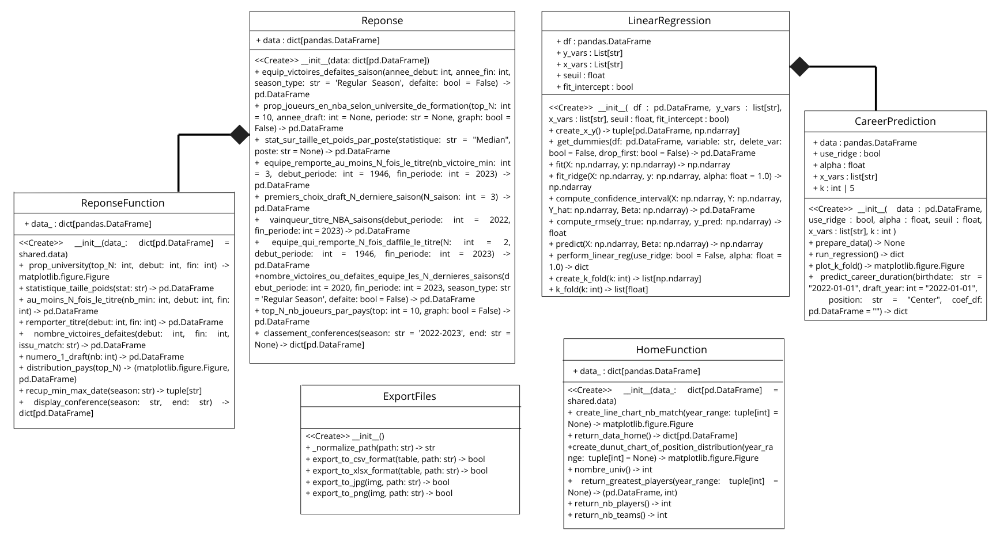
```

### Présentation de la problématique considérée et de la réponse apportée


|       Comme énoncé et justifié dans l'introduction, notre problématique est la suivante : **Prédire la durée de carrière des joueurs en `NBA`**.

#### **Comment nous sommes parvenus à répondre à cette problématique ?**

|       Pour répondre à la problématique, nous avons choisi d'utiliser un **modèle de régression linéaire multiple**. Ce modèle permet de prédire la durée de carrière des joueurs à partir de leurs caractéristiques individuelles.

Nous avons identifié la table ***`common_player_info`*** comme base pertinente pour l'entraînement. Cette table contient plusieurs informations sur les joueurs. Les variables explicatives que nous avons sélectionnées sont : la **date de naissance**, l'**année de draft**, le **poste** occupé sur le terrain, la **taille**, le **poids**. La **durée de carrière** est notre variable cible.

Plutôt que d’utiliser directement le modèle de régression linéaire de ***`scikit-learn (LinearRegression)`***, nous avons choisi **d’implémenter notre propre classe**, nommée **`LinearRegression`**.
Cette classe permet :

- d’entraîner (ajuster) un modèle;

- de réaliser des prédictions;

- d’évaluer les performances du modèle à l’aide de **k-fold cross-validation** [^1].

Nous avons également :

- intégré une méthode de **régression Ridge** pour traiter d’éventuels problèmes de multicolinéarité;

- calculé les **intervalles de confiance** pour les prédictions.


Un diagramme de flux détaillant le fonctionnement de notre classe est présenté en **annexe**.

Finalement, pour des problèmes de **multicolinéarité** entre certaines variables explicatives et des ajustements peu satisfaisants, nous avons choisi d’inclure **l’âge à la draft** ( _année de draft - année de naissance_) et la **position** (poste sur le terrain), ces deux variables s'étant révélées **plus pertinentes** que la taille ou le poids.


Notre modèle final avait donc pour formule :

\begin{equation}
  \text{Durée de carrière} = \beta_0 + \beta_1 \cdot \text{Âge à la draft} + \sum_{j=1}^{k} \beta_{j+1} \cdot \text{Position}_j + \varepsilon
(\#eq:label)
\end{equation}

où $\beta_0$ est l'ordonnée à l'origine (intercept), $\beta_1$ est le coefficient associé à l'âge à la draft, $\text{Position}_j$ représente les variables indicatrices pour les différentes positions, $\beta_{j+1}$ sont les coefficients qui leur sont associés et $\varepsilon$ est le terme d'erreur.
Les variables omises, telles que la `taille` et le `poids`, influencent directement la position d'un joueur. Par exemple, un joueur plus grand est souvent appelé à jouer au poste de pivot. De même, un joueur possédant une grande taille, un poids important et une bonne rapidité physique sera généralement affecté aux postes d'`ailier fort` et de `pivot` simultanément. En gardant ces variables, il y'avait une incohérence dans les résultats certainement dûe à la multicolinéarité entre elles et la `position`. La reponse à la question 3 confirme le lien entre le poste occupé sur le terrain, la taille et le poids (cf. figure en annexes).

Le notebook ***`apprentissage_automatique.ipynb`*** permet de retrouver les résultats dans la section d'après.

#### **Reponse apportée à la problématique** {#sec:results-ml}


##### **Résultats de l’entraînement et interprétations**

Nous avons réentraîné notre modèle sur l’ensemble des données disponibles, sans réserver de jeu de test.  
**Pourquoi ?** Pour exploiter toute l’information disponible et améliorer la précision du modèle final.  
**Mais comment garantir sa fiabilité ?**  
Nous nous basons entièrement sur les résultats issus de la **validation croisée** : la moyenne des erreurs quadratiques moyennes (`RMSE`) était de **4,59**, avec une faible variabilité (**écart-type de 0,12**).  
Cela indique une bonne capacité de généralisation du modèle.

##### **Analyse des effets**

Le modèle confirme des tendances observées dans la réalité :
- Plus l’**âge à la draft** est élevé, plus la **durée de carrière est courte**.
- Les joueurs occupant le poste de **pivot ou ailier fort** ont en moyenne une carrière plus longue, grâce à leur polyvalence.

Sur la figure des resultats de l'entrainement du modèle (graphique **a)**), nous constatons que les performances de notre classe `LinearRegression` sont comparables à celles du module `linear_model` de **Scikit-learn**.

##### **Exemple de prédiction**

Pour un joueur de **18 ans**, sélectionné au poste de **pivot**, le modèle prédit :
- **Durée de carrière estimée : 7,6 ans**
- **Intervalle de confiance : [4,3 ; 10,9]**

##### **Limites**

Même si l’intervalle de confiance renforce la crédibilité des résultats, il convient de noter que la RMSE reste élevée (**environ 4,6 ans**), ce qui signifie que les erreurs de prédiction peuvent être importantes dans certains cas.

```{r, fig.align='center', out.width="45%", out.height="30%", echo=FALSE}
#| label: fig-res-apprentissage-auto
#| fig-cap: Résultats de l'entrainement du modèle
#| fig-subcap:
#|   - "Resultat de notre modèle VS celui de Sci-kit Learn"
#|   - "Moyennes des erreurs quadratiques moyennes"
#| layout-ncol: 2
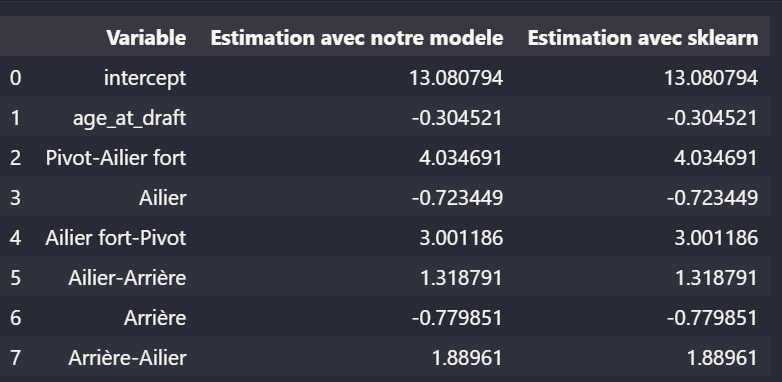
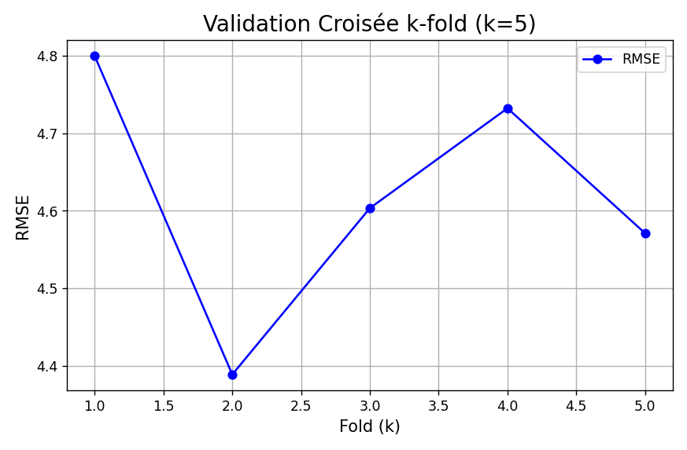
```


[^1]: La validation croisée est une technique permettant d’évaluer la performance d’un modèle en le testant sur plusieurs sous-ensembles des données. Elle permet de mieux estimer la généralisation du modèle [@run2023modele].

### Lien entre les classe créées et l'application

|       Dans un souci de modularité, nous avons structuré notre application autour de trois interfaces principales, chacune encapsulée dans une classe distincte.

- La première interface est la **page d'accueil**, qui ne fait pas directement appel aux classes ***`LinearRegression`*** ou ***`Reponse`***. Elle sert principalement d’introduction à l’application mais est basée sur une classe.

- La seconde interface, **Reponses aux questions**, repose sur la classe ***`Reponse`*** (détaillé en annexe) pour répondre aux requêtes des utilisateurs. Elle permet également d’appliquer des filtres sur les résultats, comme l’affichage des médianes, moyennes selon le choix de l'utilisateur, ou encore un filtrage par date.

- Enfin, la page **Machine Learning** présente les résultats d’entraînement du modèle ajusté ainsi que sa validation. Elle offre aussi la possibilité à l’utilisateur de faire des prédictions en renseignant les caractéristiques (***features***) d’un joueur de la `NBA`. Cette page utilise une classe ***`CareerPrediction`***, laquelle dépend elle-même de la classe ***`LinearRegression`***.


### Architecture du projet


|       La figure ci-dessous présente l’architecture générale du projet. Chaque dossier a été conçu pour répondre à une préoccupation spécifique. Pour que ces dossiers soient reconnus comme des paquets Python, des fichiers ***`__init__.py`*** y ont été ajoutés avec la définition des modules. Un fichier ***`setup.py`*** permet de gérer les dépendances internes et de faciliter les interactions entre les différents modules.
Enfin, tous les packages nécessaires à l’exécution des codes ainsi que leurs versions sont listés dans le fichier ***`requirements.txt`***.


```{r architecture-projet, fig.align='center', fig.cap="Architecture du projet", out.width="55%", out.height="55%", echo=FALSE}
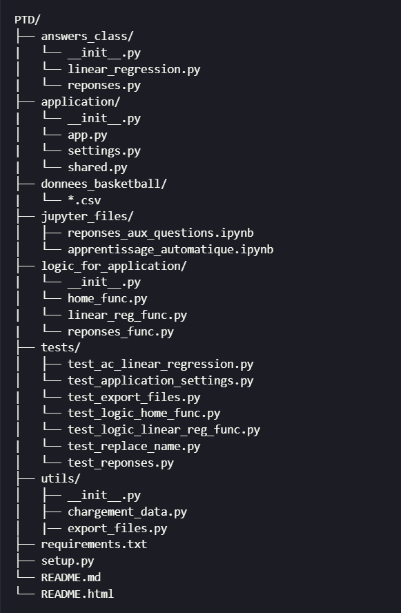
```


### Packages et bibliothèques utilisés

|       Le projet repose sur plusieurs bibliothèques Python essentielles, parmi lesquelles :

- **Pandas** : utilisée pour la manipulation de données tabulaires, elle facilite le traitement et la transformation des données structurées.
- **Matplotlib** : permet de créer des visualisations détaillées et personnalisées sous forme de graphiques.
- **NumPy** : utile pour les opérations mathématiques et la gestion efficace de tableaux multidimensionnels.
- **Scikit-learn** : utilisée pour les tâches de machine learning. Elle nous a permis de comparer nos implémentations personnalisées avec les modèles standards de la bibliothèque).
- **Shiny** : a été utilisée pour développer l’interface utilisateur de l’application.

Ces outils ont été essentiels pour mener à bien les étapes d’analyse, de modélisation et de visualisation du projet.


### Couverture des tests

|       La quasi-totalité des **classes** et **fonctions** a été testée, y compris celles liées aux pages de l’application web développée.
Au total, **214 tests** ont été réalisés, assurant une **couverture de plus de 94% du code**.

```{r test, fig.align='center', fig.cap="Tests effectués", out.width="55%", out.height="55%", echo=FALSE}
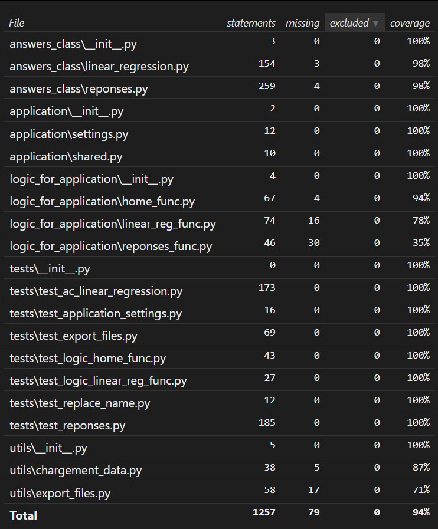
```

## Utilisation de l'application

### Page d’Accueil

La page **Accueil** présente des **statistiques générales** sur la `NBA` :

- Nombre total de joueurs,
- Nombre d’équipes,
- Nombre d’universités représentées.

L’utilisateur peut également explorer avec des filtres :

- Le nombre de joueurs **Greatest** [^2],
- L’évolution du nombre de matchs par saison,
- La répartition des **positions** de joueurs entre deux années définies.

Ces éléments sont illustrés en figure ci-dessous.


```{r home-page, fig.align='center', out.width="75%", out.height="45%", fig.cap="Page d'accueuil de l'application", echo=FALSE}
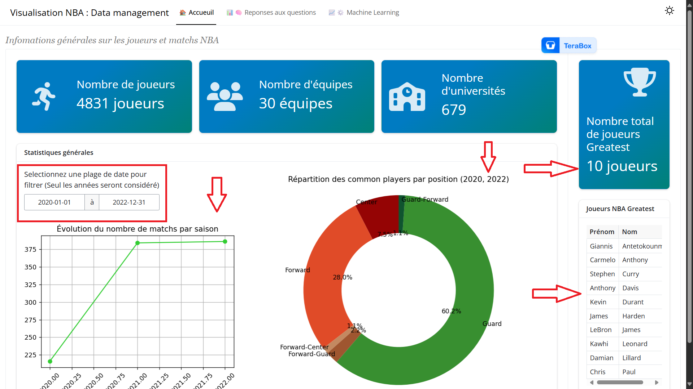
```

[^2]: Un joueur *Greatest* est un joueur faisant partie de la sélection des 75 meilleurs joueurs de l’histoire de la NBA, désignée à l’occasion du 75e anniversaire de la ligue.

### Page de reponses aux questions

Cette page permet à l’utilisateur de :

- Visualiser les **résultats des analyses**,
- Interagir avec la base via des **champs de saisie dynamiques**.

Exemple : pour la question ***"Classer les universités selon le nombre de joueurs formés"***, l'utilisateur peut :

- Définir une **période**,
- Sélectionner le **Top N** universités.

Les réponses sont regroupées par **catégories** (Joueurs, Équipes, etc.).

La figure ci-dessous illustre ce qui a été dis en ammont.

```{r answers, fig.align='center', out.width="75%", out.height="55%", fig.cap="Page de reponses aux questions de l'application", echo=FALSE}
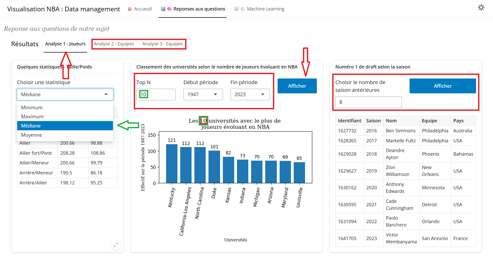
```

### Page des résultats du modèle d'apprentissage supervisé et de prédiction de la durée de carrière : Machine Learning

|       Sur cette page nous affichons les résultats du modèle à la suite de son entraînement puis la validation du modèle. On voit que l'erreur quadratique moyenne [^3] tourne autour de 4,6 en moyenne (le graphique à droite sur la juste en bas). Ensuite pour permettre à l'utilisateur de prédire la durée de carrière d'un joueur lambda, des champs de saisies sont affichés. Il pourra donc entrer la date de naissance du joueur, la date de sa draft et choisir sa position. Même s'il ne connait pas les date exacte, ce n'est pas grave, c'est l'année qui importe. Ensuite en cliquant sur le bouton **Predire** il obtient la prédiction avec un intervalle de confiance.
L'application a été déployée sur un server posit (version gratuite) et **responsive** donc s'adapte à différentes tailles d'écran. Pour acceder à l'application [cliquez ici](https://projet-traitement-donnees-groupe-42.shinyapps.io/basket-nba-groupe42/).

```{r, fig.align='center', out.width="75%", out.height="55%", fig.cap="Page des résultats du modèle d'apprentissage supervisé et de prédiction de la durée de carrière", echo=FALSE}
#| label: ml-model
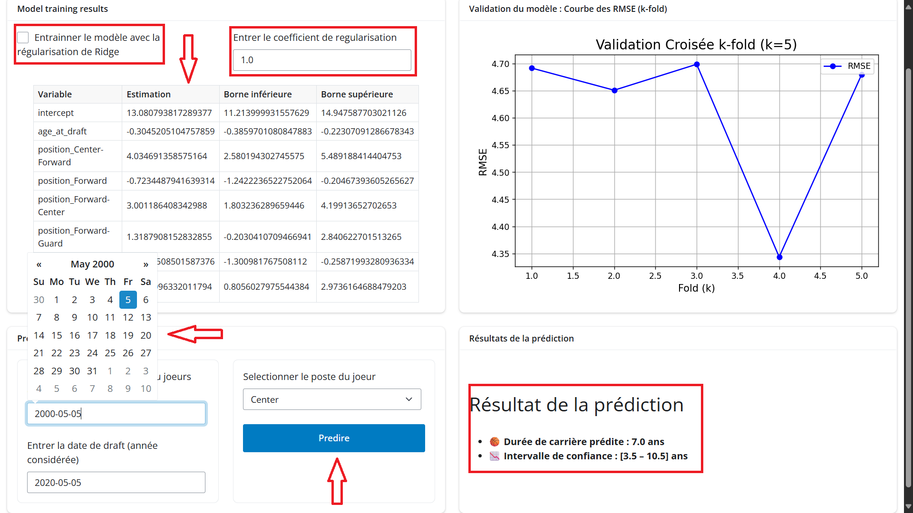
```


```{r, fig.align='center', out.width="45%", out.height="30%", echo=FALSE}
#| layout-ncol: 4


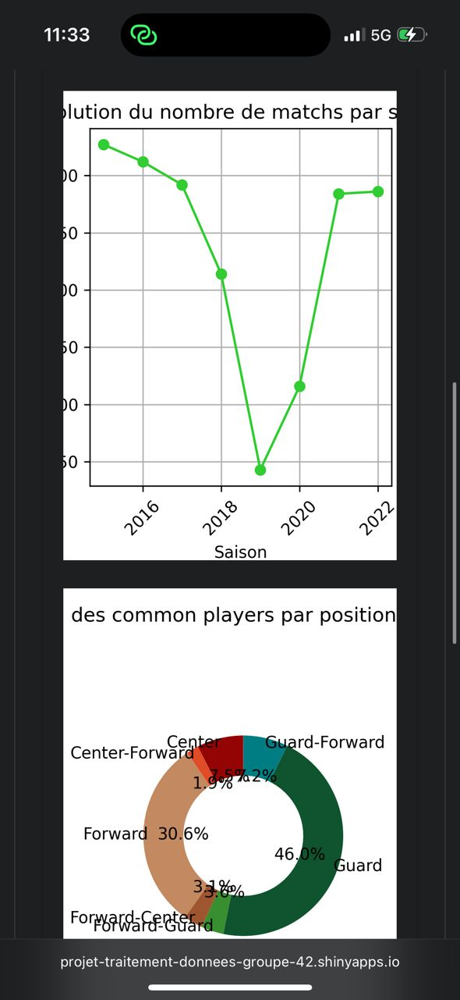
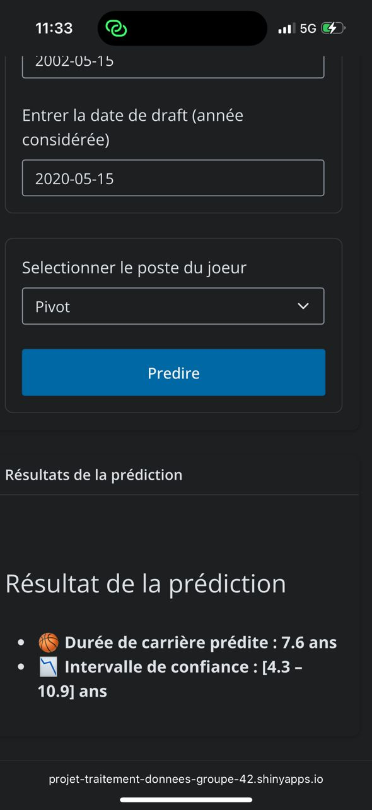
```

[^3]: L’erreur quadratique moyenne (Root Mean Squared Error ou RMSE) est définie comme la racine carrée de la moyenne des carrés des écarts entre les valeurs prédites $\hat{y}_i$ et les valeurs réelles $y_i$ :
$$
\text{RMSE} = \sqrt{\frac{1}{n} \sum_{i=1}^{n} (\hat{y}_i - y_i)^2}
$$
Plus la `RMSE` est faible, plus le modèle est précis.


## Retour d’expérience

### Réponse aux attentes

|           Au cours du projet, nous avons été confrontés à plusieurs défis. En effet, au départ, les attentes concernant les questions et le rendu n’étaient pas totalement claires. Toutefois, grâce aux explications de notre tutrice **Manon EVAIN**, les choses se sont rapidement clarifiées. Elle nous a notamment encouragé à structurer notre code en classes, à les tester rigoureusement, et surtout à implémenter nous-mêmes le modèle d’apprentissage automatique.

Ces recommandations, combinées à nos efforts, nous ont poussés à aller au-delà des exigences initiales : nous avons ainsi **modularisé l’ensemble du projet**, afin d’en faciliter la **maintenabilité** et la **réutilisabilité**.

Concernant les réponses aux questions, il a fallu faire preuve de **minutie** et de **rigueur**, notamment pour identifier les observations manquantes susceptibles de fausser les résultats par rapport aux données officielles disponibles en ligne. À la fin du projet, nous avons aussi dû gérer un problème de **changement des noms d’équipes** dans le temps. Pour y remédier rapidement, nous avons développé une fonction spécifique, évitant ainsi des erreurs dans nos analyses.

Enfin, la mise en œuvre manuelle du modèle d’apprentissage automatique a été particulièrement bénéfique. Elle nous a permis non seulement de renforcer nos compétences en **statistiques**, mais aussi de mieux comprendre leur **implémentation informatique**.

### Travail en équipe

Dès le début, nous avons défini les différentes questions, puis nous les avons réparties équitablement, chacun répondant en moyenne à trois questions. L’utilisation de **GitHub** a grandement facilité le travail collaboratif, notamment pour surmonter les contraintes de **distance géographique**.

Par ailleurs, lors de nos séances de travail en autonomie, nous avons veillé à **partager nos méthodes** respectives, afin que chacun puisse **comprendre et valider** les approches adoptées par les autres. Cette coopération constante nous a permis de rester alignés tout au long du projet.

### Satisfaction du travail final

|       Nous sommes satisfaits du travail accompli, bien que certains aspects puissent être améliorés. Le projet a demandé un fort investissement, mais a suscité un réel intérêt. Nous avons exploré de nouvelles compétences, notamment en développant une interface graphique. Cela nous a poussés à sortir de notre zone de confort, tout en veillant à la qualité du rendu. En somme, ce fut une belle opportunité d'apprentissage, tant sur le plan technique qu'en équipe.


## Conclusion

|       Ce projet s’inscrit pleinement dans le domaine de l’informatique appliquée au traitement de données. À travers l’analyse des données issues de la `NBA`, nous avons mis en oeuvre une chaîne complète de traitement : du nettoyage des données à leur exploration statistique, jusqu'à la mise en place d’un modèle de machine learning supervisé.

Nous avons ainsi développé une solution permettant de prédire la durée de carrière des joueurs à partir de variables explicatives pertinentes, en mobilisant des techniques issues de la régression linéaire et en appliquant des méthodes de validation croisée. Ce travail nous a permis de mieux comprendre les enjeux liés à la préparation des données (feature engineering, gestion des valeurs manquantes, encodage des variables catégorielles), étape cruciale en apprentissage automatique. Ces étapes nous ont également permis d'apporter des réponses correctes aux différentes questions posées.

Par ailleurs, le projet a donné lieu à la création d’une application interactive en Python (framework Shiny for Python), offrant une visualisation dynamique des données et des résultats, et illustrant l’intérêt d’outils informatiques modernes pour valoriser les analyses.

Ce projet nous a permis de consolider nos compétences en programmation, en traitement de données et en machine learning, tout en approfondissant notre capacité à travailler en équipe sur un projet structuré, dans une logique proche des pratiques professionnelles en data science.


## Liste des sigles et abréviations

- `CSV` : *Comma-Separated Values*  
  Format de fichier texte utilisé pour stocker des données tabulaires avec des virgules comme séparateurs.

- `IA` : *Intelligence Artificielle*  
  Ensemble de techniques visant à simuler l’intelligence humaine par des machines.

- `IMC` : *Indice de Masse Corporelle*  
  Indicateur utilisé pour évaluer la corpulence d’une personne à partir de son poids et de sa taille.

- `JPG` : *Joint Photographic Experts Group*  
  Format de fichier image compressé couramment utilisé.

- `NBA` : *National Basketball Association*  
  Ligue professionnelle de basketball nord-américaine.

- `OLS` : *Ordinary Least Squares (Moindres Carrés Ordinaires)*  
  Méthode d’estimation en régression linéaire consistant à minimiser la somme des carrés des erreurs.

- `PNG` : *Portable Network Graphics*  
  Format d’image sans perte de qualité, adapté au web.

- `RMSE` : *Root Mean Squared Error (Erreur Quadratique Moyenne Racine)*  
  Mesure statistique de l’écart type des résidus de prédiction.

- `USA` : *États-Unis d’Amérique*  
  Pays dont les franchises de la NBA sont majoritairement issues.


# Annexes

## Annexe 1 : Algorithme utilisé pour le machine learning Modèle de regression linéaire {#sec:ml}

```{r linearRegExplication, fig.align='center', out.width="95%", out.height="70%", fig.cap="Diagramme de flux des méthodes de la classe LinearRegression", echo=FALSE}
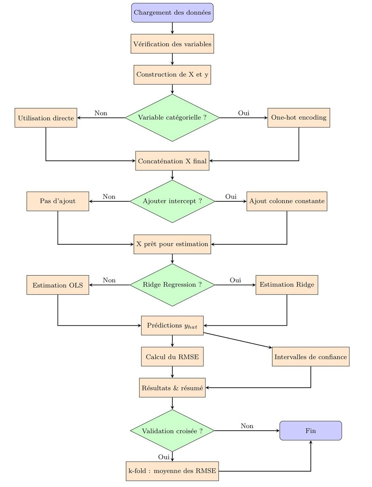
```

## Annexe 2 : Description des classes {#sec:m2}

**Classe Reponse**

|       La méthode ***__init__()*** avant d'initialiser la classe ***Reponse*** doit :

- Vérifier que l'argument ***data*** est bien un dictionnaire.
- Vérifier que toutes les valeurs sont des objets de type ***pandas.DataFrame***.

|       La méthode ***equip_victoires_defaites_saison()*** retourne une table contenant le nombre de victoires ou de défaites pour chaque équipe entre les saisons données.

|       La méthode ***prop_joueurs_en_nba_selon_universite_de_formation()*** retourne une table contenant le Top N des universités selon le nombre de leurs étudiants ayant évolué en NBA. Si ***graph = True***, la méthode renvoie également un diagramme à barres.

|       La méthode ***stat_sur_taille_et_poids_par_poste()*** retourne une table contenant la statistique demandée sur la taille et le poids des joueurs selon leur poste.

|       La méthode ***equipe_remporte_au_moins_N_fois_le_titre()*** retourne une table listant les équipes ayant remporté au moins le nombre de titres requis.

|       La méthode ***premiers_choix_draft_N_derniere_saison()*** retourne une table contenant les premiers choix de draft sur les ***N*** dernières saisons.

|       La méthode ***vainqueur_titre_NBA_saisons()*** retourne une table contenant les vainqueurs du titre NBA sur la période choisie ou sur les saisons d'une période définie.

|       La méthode ***equipe_qui_remporte_N_fois_daffile_le_titre()*** retourne une table listant les équipes ayant remporté au moins ***N*** titres consécutifs.

|       La méthode ***nombre_victoires_ou_defaites_equipe_les_N_dernieres_saisons()*** retourne une table listant les équipes ayant obtenu le plus de victoires ou de défaites pour chaque saison d'une période donnée. Elle renvoie le nombre de défaites si ***defaite = True***.

|       La méthode ***top_N_nb_joueurs_par_pays()*** retourne une table indiquant la répartition des joueurs NBA selon leur pays d'origine. Si ***graph = True***, elle retourne également un diagramme à barres.

|       La méthode ***classement_conferences()*** retourne un dictionnaire contenant deux tables, un pour chaque conférence (Est et Ouest). Pour chaque table, on retrouve le classement des équipes selon leur nombre de victoires obtenues en saison régulière.

**Classe HomeFunction**

|       La méthode ***__init__()*** initialise la classe avec un dictionnaire de ***DataFrames*** contenant les données à visualiser dans l'interface.

|       La méthode ***create_line_chart_nb_match()*** retourne un graphique représentant l'évolution du nombre de matchs joués par saison, sur une période donnée.

|       La méthode ***return_data_home()*** retourne les données principales affichées sur la page d'accueil dans l'interface.

|       La méthode ***create_dunut_chart_of_position_distribution()*** retourne un graphique en forme de donut chart illustrant la répartition des joueurs selon leur poste, pour une période donnée.

|       La méthode ***nombre_univ()*** retourne un entier représentant le nombre total d'universités ayant formé des joueurs NBA présent dans la base de données.

|       La méthode ***return_greatest_players()*** retourne une table des joueurs les plus marquants (statut de greatest) sur une période donnée, ainsi que le nombre de joueurs inclus.

|       La méthode ***return_nb_players()*** retourne un entier représentant le nombre total de joueurs dans la base.

|       La méthode ***return_nb_teams()*** retourne un entier représentant le nombre total d'équipes présentes dans les données.

**Classe ReponseFunction**


|       La méthode ***__init__()*** initialise la classe avec un dictionnaire de ***DataFrames*** contenant les données nécessaires à l'affichage.

|       La méthode ***prop_university()*** retourne un diagramme représentant les universités ayant formé le plus de joueurs `NBA`, selon une période et un top N définis.

|       La méthode ***statistique_taille_poids()*** retourne une table contenant une statistique (moyenne, médiane, etc.) sur la taille ou le poids des joueurs NBA, utilisée pour une représentation tabulaire dans l'interface.

|       La méthode ***au_moins_N_fois_le_titre()*** retourne une table listant les équipes ayant remporté au moins un certain nombre de titres `NBA` sur une période donnée. Les données sont destinées à un affichage dans l'interface.

|       La méthode ***remporter_titre()*** retourne une table avec les équipes ayant remporté le titre NBA au cours de la période spécifiée. Affichage sous de tableau dans l'interface.

|       La méthode ***nombre_victoires_defaites()*** retourne une table indiquant l'équipe avec le plus de nombre de victoires ou de défaites sur la saison régulière, pour une période donnée.

|       La méthode ***numero_1_draft()*** retourne une table listant les joueurs sélectionnés en premier lors de la draft pour les ***nb*** dernières années. Idéal pour un tableau historique.

|       La méthode ***distribution_pays()*** retourne à la fois une table et un diagramme illustrant la répartition des joueurs `NBA` par pays d'origine, selon un Top N défini.

|       La méthode ***recup_min_max_date()*** retourne deux chaînes de caractères représentant la date de début et de fin d'une saison. Elle est utilisée pour ajuster dynamiquement les filtres temporels dans l'interface.

|       La méthode ***display_conference()*** retourne le classement des équipes dans les conférences Est et Ouest pour une saison donnée.

**Classe LinearRegression**


|       La méthode ***__init__()*** : vérifie types, colonnes, seuil et intercept ; nettoie df ; crée X et y

|       La méthode ***create_x_y()***: dichotomise les variables catégorielles ; ajoute un intercept si demandé

|       La méthode ***get_dummies()*** : transforme une variable catégorielle en colonnes indicatrices

|       La méthode ***fit()*** : estimation `OLS` par pseudoinverse ; avertit si multicolinéarité

|       La méthode ***fit_ridge()*** : estimation Ridge avec paramètre alpha ; intercept non pénalisé

|       La méthode ***compute_confidence_interval()*** : calcule les intervalles de confiance des coefficients

|       La méthode ***compute_rmse()*** : calcule la racine de l’erreur quadratique moyenne

|       La méthode ***predict()*** : génère les prédictions via X %*% Beta

|       La méthode ***perfom_linear_reg()*** : pipeline complet (fit, predict, IC, RMSE) en `OLS` ou Ridge

|       La méthode ***create_k_fold(I)*** : génère aléatoirement k sous-échantillons pour validation croisée

|       La méthode ***k_fold()*** : exécute la validation croisée k-fold et renvoie les ***RMSE}

**Classe CareerPrediction**


|       La méthode ***__init__(data, use_ridge=FALSE, x_vars=list(), alpha=1.0, k=5)*** vérifie que ***data*** est un ***data.frame***, initialise les attributs (***use_ridge***, ***alpha***, ***k***, etc.), clone les données et appelle ***prepare_data()***.

|       La méthode ***prepare_data()*** convertit ***draft_year*** et extrait ***birth_year*** de ***birthdate***, remplace “undrafted” par 0, filtre les joueurs dont la carrière s’achève $\leq$ 2022 et garde ceux dont ***age_at_draft*** > 0.  Elle définit ***x_vars = c("age_at_draft", "position")*** et instancie un modèle ***LinearRegression***.

|       La méthode ***run_regression()*** reconstruit le modèle ***LinearRegression*** avec ***y_var = "season_exp"*** et ***x_vars = c("age_at_draft","position")***. Elle Lance ***perfom_linear_reg(use_ridge, alpha)***, renvoie les résultats (coefficients, IC, RMSE).

|       La méthode ***plot_k_fold()*** exécute ***k_fold(k)*** pour obtenir les ***RMSE} par fold, puis crée un graphique ***matplotlib*** et retourne l’objet ***figure***.

|       La méthode ***predict_career_duration(birthdate, draft_year, position, coef_df)*** calcule ***age-at-draft***, construit le vecteur de features (dont les dummy variables de ***position***), récupère l’***intercept*** et les coefficients estimés dans ***coef_df***. Elle agrège contributions de chaque variable pour produire ***duree_predite*** et son ***intervalle_confiance***.

**Classe ExportFiles**

|       La méthode ***__init__()*** initialise l’exporteur (aucun paramètre requis)
|       La méthode ***normalize_path(path)*** normalise un chemin en remplaçant les backslashes par des slashs.

|       La méthode ***export_to_csv_format(table, path)*** vérifie que ***table*** est un ***DataFrame*** ou ***Series*** et que ***path*** est une chaîne, normalise le chemin et exporte la table en ***CSV} (sans index)

|       La méthode ***export_to_xlsx_format(table, path)*** effectue les mêmes contrôles de type que pour le `CSV`, convertit une ***Series*** en ***DataFrame*** si nécessaire et exporte au format Excel `.xlsx`

|       La méthode ***export_to_jpg(img, path)*** vérifie que ***img*** est une ***matplotlib.figure.Figure*** et que ***path*** est une chaîne, normalise le chemin et enregistre la figure au format `JPG`

|       La méthode ***export_to_png(img, path)*** effectue mêmes contrôles que pour `JPG` normalise le chemin et enregistre la figure au format `PNG`

### Annexes 3 : Lien visuel éventuel entre le poste occupé sur le terrain, la taille et le poids des joueurs {#sec:taille-poids-position-sec}

```{r, fig.align='center', fig.cap="Taille et poids médians par poste en NBA", out.width="60%", out.height="60%", echo=FALSE}
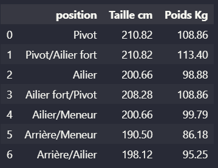
```


|       Sur cette figure, on peut voir que les ***ailiers forts/pivots***, ***pivots*** et les ***pivots/ailiers forts*** sont les **plus lourds** et les **plus grands** en médiane. Ce qui traduirait une corrélation intrinsèque entre le poste, la taille et le poids des joueurs.

# 👥 COLLABORATEURS {.center}
---

::: {.collaborators style="font-size: 1.2em; line-height: 1.8em;"}
- **Ousseynou SIMAL** : Élève ingénieur à l'École Nationale de la Statistique et de l'Analyse de l'Information (ENSAI)  
- **Denis THAYANANTHARAJAH** : Élève attaché à l'École Nationale de la Statistique et de l'Analyse de l'Information (ENSAI)  
- **Karima JABRI** : Élève attachée à l'École Nationale de la Statistique et de l'Analyse de l'Information (ENSAI) 
:::

## REFERENCES BIBLIOGRAPHIQUES


