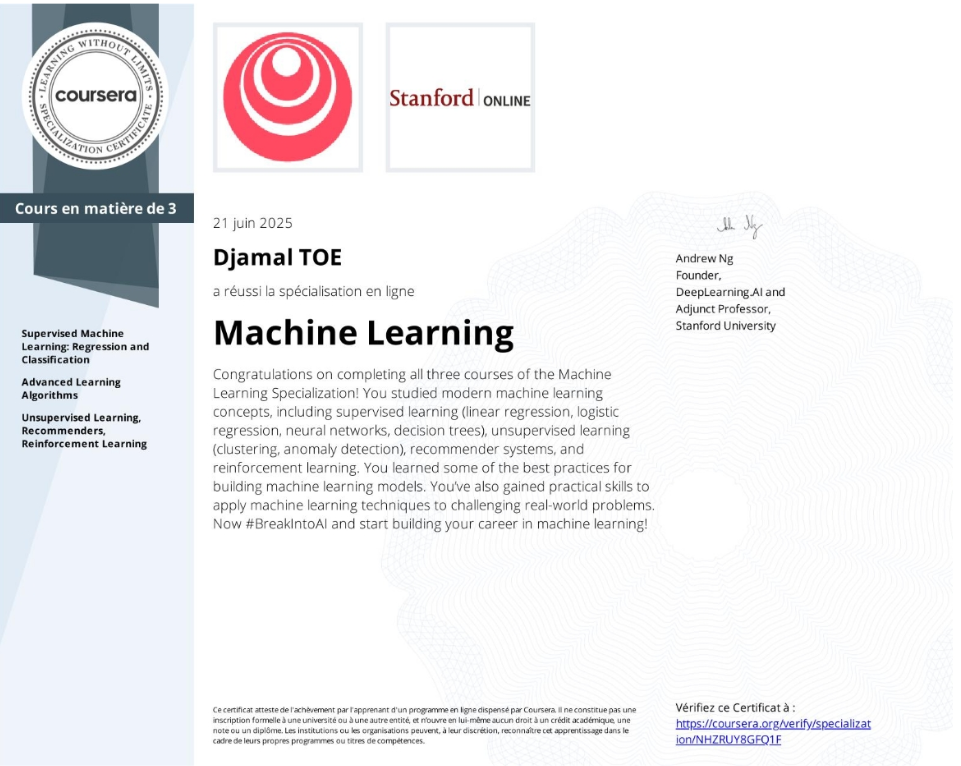
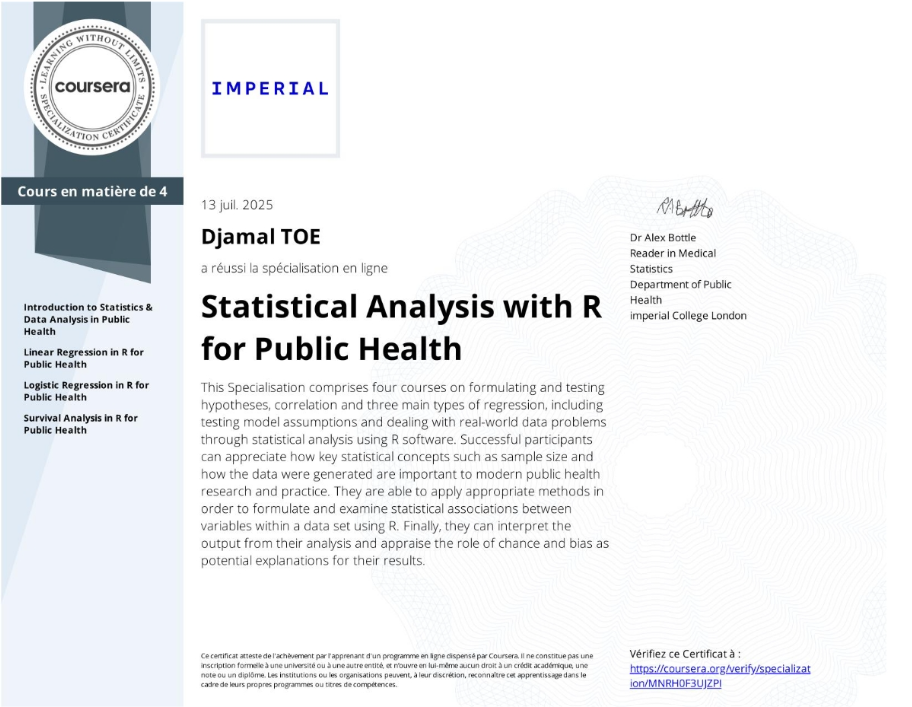
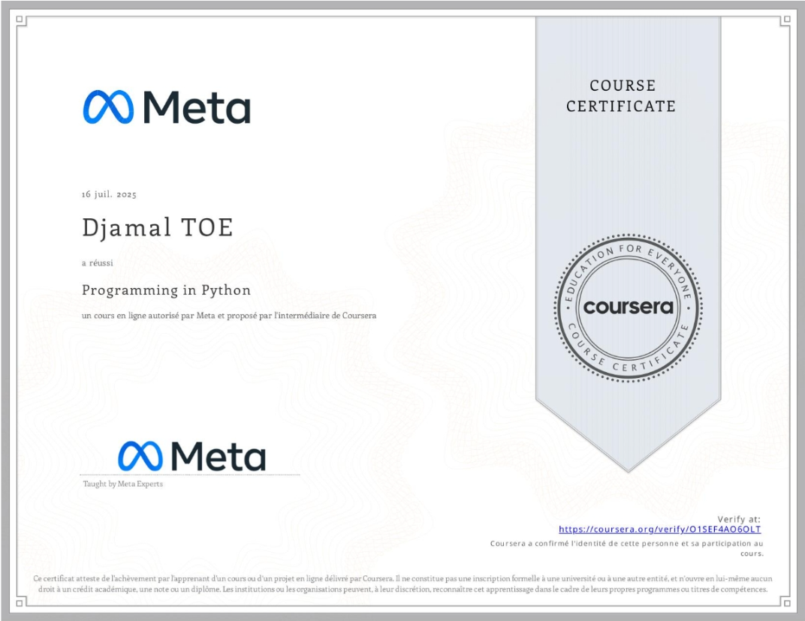
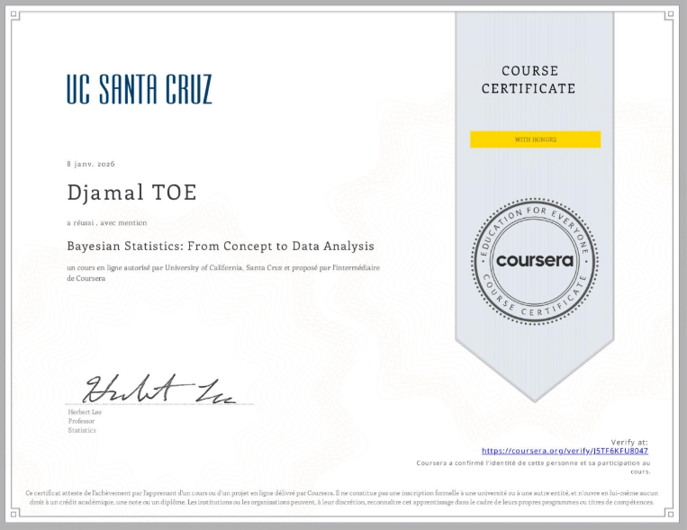

```{=html}
<div class="portfolio-shell">
  <aside class="sidebar" aria-label="Profile sidebar"><div class="sidebar-card" style="padding: 1.2rem;"><h1 class="name">Djamal TOE</h1><p class="title">Data Scientist &amp; Machine Learning Engineer</p></div></aside>
  <div class="main-panel">
    <header class="topbar" aria-label="Top navigation"><button class="menu-toggle" id="menuToggle" aria-label="Open navigation drawer" aria-expanded="false">Menu</button><a class="brand-pill" href="index.qmd" aria-label="Djamal TOE home"></a><nav class="nav-links" aria-label="Primary navigation"><a href="index.qmd">Home</a><a href="experience.qmd">Experience</a><a href="academic-projects.qmd">Academic Projects</a><a href="personal-projects.qmd">Personal Projects</a><a href="skills.qmd">Skills</a><a class="active" href="education.qmd">Education</a><a href="blog.qmd">Blog</a><a href="about.qmd">About</a></nav></header>
    <main id="main-content">
      <section class="section-card"><div class="section-header"><div><h2 class="section-title">Education</h2><p class="section-lead">Training that blends statistical rigor, Bayesian modelling, and applied software engineering.</p></div></div>
        <div class="timeline-list">
          <article class="timeline-card">
            <div class="timeline-topline"><span class="timeline-badge"></span>ENSAI</div>
            <div class="timeline-meta">Engineering cycle in Data Science &amp; Statistical Engineering · 2024–2026</div>
            <p>Advanced training in applied statistics, Bayesian inference, machine learning, reproducible analysis, and software-oriented data science with emphasis on decision support.</p>
            <ul>
              <li>Bayesian modelling and applied uncertainty quantification.</li>
              <li>Machine learning, NLP, computer vision, and statistical engineering.</li>
              <li>Reproducible pipelines, technical communication, and scientific reporting.</li>
            </ul>
          </article>
          <article class="timeline-card">
            <div class="timeline-topline"><span class="timeline-badge"></span>Université Nazi Boni</div>
            <div class="timeline-meta">Bachelor in Statistics and Computer Science · 2021–2024</div>
            <p>Foundational training in probability, inferential statistics, survey methods, programming, and applied data analysis.</p>
            <ul>
              <li>Statistics, probability, and quantitative modelling.</li>
              <li>Programming, databases, and applied computing workflows.</li>
              <li>Survey methods, data collection, and exploratory analysis.</li>
            </ul>
          </article>
        </div>
      </section>
      <section class="section-card">
        <div class="section-header"><div><h2 class="section-title">Formations</h2><p class="section-lead">Training and specialized courses that reinforce my data science, statistics, and AI skill set with visual certificates.</p></div></div>
        <div class="project-grid">
          <article class="project-card certification-card">
            
            <h3 class="project-title">Machine Learning Specialization</h3>
            <p class="project-meta">Stanford University · Deep Learning</p>
            <div class="tag-list"><span class="tag-pill"><i class="bi bi-lightning-charge-fill tag-icon" aria-hidden="true"></i><span>Deep Learning</span></span><span class="tag-pill"><i class="bi bi-cpu tag-icon" aria-hidden="true"></i><span>Neural networks</span></span><span class="tag-pill"><i class="bi bi-graph-up tag-icon" aria-hidden="true"></i><span>Model evaluation</span></span><span class="tag-pill"><i class="bi bi-robot tag-icon" aria-hidden="true"></i><span>Machine Learning (supervised)</span></span><span class="tag-pill"><i class="bi bi-map tag-icon" aria-hidden="true"></i><span>Machine Learning (unsupervised)</span></span><span class="tag-pill"><i class="bi bi-shield-check tag-icon" aria-hidden="true"></i><span>Reinforcement learning</span></span><span class="tag-pill"><i class="bi bi-filetype-py tag-icon" aria-hidden="true"></i><span>Python</span></span><span class="tag-pill"><i class="bi bi-cloud tag-icon" aria-hidden="true"></i><span>TensorFlow</span></span></div>
          </article>
          <article class="project-card certification-card">
            
            <h3 class="project-title">R for Public Health</h3>
            <p class="project-meta">Imperial College London · Statistics</p>
            <div class="tag-list"><span class="tag-pill"><i class="bi bi-r-circle tag-icon" aria-hidden="true"></i><span>R</span></span><span class="tag-pill"><i class="bi bi-heart-pulse tag-icon" aria-hidden="true"></i><span>Biostatistics</span></span><span class="tag-pill"><i class="bi bi-globe tag-icon" aria-hidden="true"></i><span>Public health</span></span><span class="tag-pill"><i class="bi bi-graph-up-arrow tag-icon" aria-hidden="true"></i><span>Regression (Logistic, Cox, Linear)</span></span></div>
          </article>
          <article class="project-card certification-card">
            
            <h3 class="project-title">Python Programming</h3>
            <p class="project-meta">Meta · Python</p>
            <div class="tag-list"><span class="tag-pill"><i class="bi bi-book tag-icon" aria-hidden="true"></i><span>Programming Principles</span></span><span class="tag-pill"><i class="bi bi-terminal tag-icon" aria-hidden="true"></i><span>Development Environment</span></span><span class="tag-pill"><i class="bi bi-filetype-code tag-icon" aria-hidden="true"></i><span>Test Script Development</span></span><span class="tag-pill"><i class="bi bi-box-seam tag-icon" aria-hidden="true"></i><span>Object Oriented Programming (OOP)</span></span><span class="tag-pill"><i class="bi bi-filetype-py tag-icon" aria-hidden="true"></i><span>Python Programming</span></span><span class="tag-pill"><i class="bi bi-box-arrow-in-down tag-icon" aria-hidden="true"></i><span>Package and Software Management</span></span><span class="tag-pill"><i class="bi bi-braces tag-icon" aria-hidden="true"></i><span>Functional Design</span></span><span class="tag-pill"><i class="bi bi-shield-check tag-icon" aria-hidden="true"></i><span>Test Driven Development (TDD)</span></span><span class="tag-pill"><i class="bi bi-code-slash tag-icon" aria-hidden="true"></i><span>Computer Programming</span></span><span class="tag-pill"><i class="bi bi-diagram-3 tag-icon" aria-hidden="true"></i><span>Data Structures</span></span><span class="tag-pill"><i class="bi bi-cloud tag-icon" aria-hidden="true"></i><span>Cloud Hosting</span></span><span class="tag-pill"><i class="bi bi-check2-square tag-icon" aria-hidden="true"></i><span>Software Testing</span></span></div>
          </article>
          <article class="project-card certification-card">
            
            <h3 class="project-title">Microsoft Excel</h3>
            <p class="project-meta">Microsoft · Data analytics</p>
            <div class="tag-list"><span class="tag-pill"><i class="bi bi-file-earmark-spreadsheet tag-icon" aria-hidden="true"></i><span>Excel</span></span><span class="tag-pill"><i class="bi bi-graph-up-arrow tag-icon" aria-hidden="true"></i><span>Dashboards</span></span><span class="tag-pill"><i class="bi bi-brush tag-icon" aria-hidden="true"></i><span>Data cleaning</span></span><span class="tag-pill"><i class="bi bi-bar-chart-line tag-icon" aria-hidden="true"></i><span>Business Intelligence</span></span></div>
          </article>
          <article class="project-card certification-card">
            
            <h3 class="project-title">Bayesian Statistics</h3>
            <p class="project-meta">Specialized training · Bayesian inference</p>
            <div class="tag-list"><span class="tag-pill"><i class="bi bi-calculator tag-icon" aria-hidden="true"></i><span>Bayesian inference</span></span><span class="tag-pill"><i class="bi bi-graph-up tag-icon" aria-hidden="true"></i><span>Uncertainty quantification</span></span><span class="tag-pill"><i class="bi bi-shield-check tag-icon" aria-hidden="true"></i><span>Probabilistic modelling</span></span><span class="tag-pill"><i class="bi bi-r-circle tag-icon" aria-hidden="true"></i><span>R</span></span></div>
          </article>
        </div>
      </section>
    </main>
  </div>
</div>
<div class="drawer-backdrop" id="drawerBackdrop"></div><div class="sidebar-drawer" id="mobileDrawer" aria-label="Mobile navigation drawer"><div class="sidebar-card" style="padding: 1rem;"><h2 class="name">Djamal TOE</h2><p class="title">Data Scientist &amp; Machine Learning Engineer</p><h3>Navigate</h3><ul class="contact-list" style="padding:0; list-style:none;"><li><a href="index.qmd">Home</a></li><li><a href="experience.qmd">Experience</a></li><li><a href="academic-projects.qmd">Academic Projects</a></li><li><a href="personal-projects.qmd">Personal Projects</a></li><li><a href="skills.qmd">Skills</a></li><li><a href="education.qmd">Education</a></li><li><a href="blog.qmd">Blog</a></li><li><a href="about.qmd">About</a></li></ul></div></div>
```
<script>
  const menuToggle = document.getElementById('menuToggle');
  const mobileDrawer = document.getElementById('mobileDrawer');
  const drawerBackdrop = document.getElementById('drawerBackdrop');
  function toggleDrawer(force) { const open = typeof force === 'boolean' ? force : !mobileDrawer.classList.contains('open'); mobileDrawer.classList.toggle('open', open); drawerBackdrop.classList.toggle('open', open); menuToggle.setAttribute('aria-expanded', open ? 'true' : 'false'); document.body.style.overflow = open ? 'hidden' : ''; }
  menuToggle?.addEventListener('click', () => toggleDrawer()); drawerBackdrop?.addEventListener('click', () => toggleDrawer(false)); document.addEventListener('keydown', (event) => { if (event.key === 'Escape') toggleDrawer(false); });
</script>
