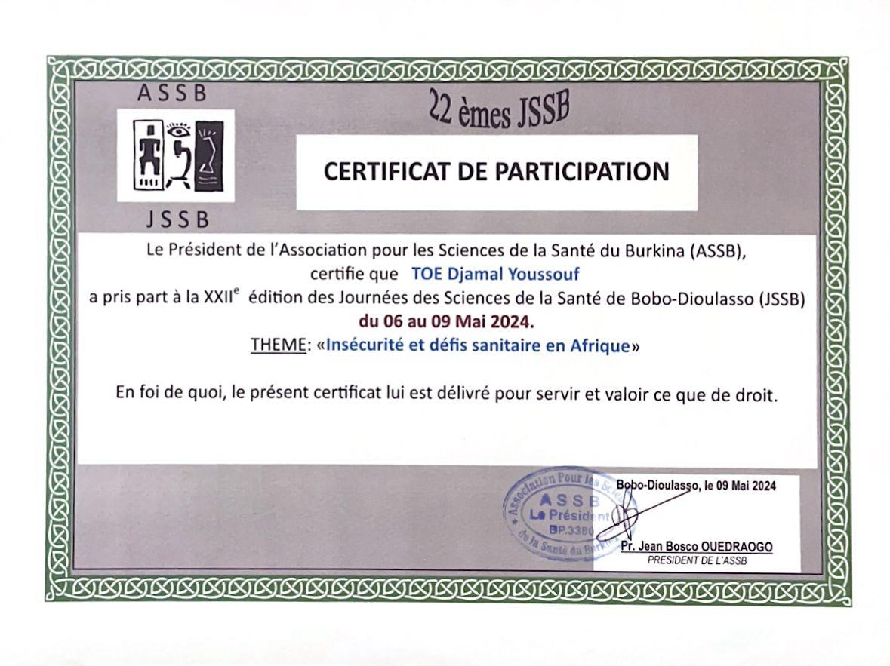
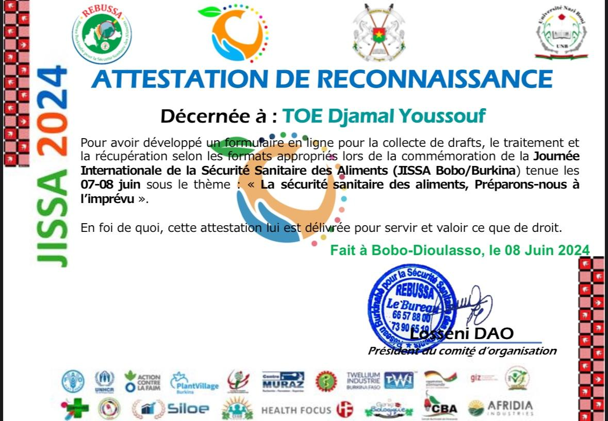
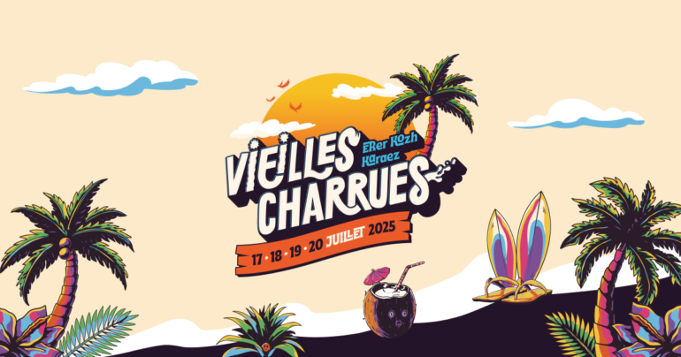

```{=html}
<div class="portfolio-shell">
  <aside class="sidebar" aria-label="Profile sidebar">
    <div class="sidebar-card" style="padding: 1.2rem;">
      
      <h1 class="name">Djamal TOE</h1>
      <p class="title">Data Science Engineering Student</p>
      <p class="bio">Statistics, machine learning, NLP, computer vision, and applied software.</p>
      <div class="meta-list"><span class="meta-item">France</span><span class="meta-item">ENSAI</span><span class="meta-item">Applied ML</span></div>
      <div class="sidebar-section"><h3>Contact</h3><ul class="contact-list" style="padding:0;list-style:none;"><li><strong>Email</strong><br />Available on request</li><li><strong>LinkedIn</strong><br /><a href="https://www.linkedin.com/in/djamal-toe-7a18432b0/">Profile</a></li></ul></div>
    </div>
  </aside>
  <div class="main-panel">
    <header class="topbar" aria-label="Top navigation"><button class="menu-toggle" id="menuToggle" aria-label="Open navigation drawer" aria-expanded="false">Menu</button><a class="brand-pill" href="index.qmd" aria-label="Djamal TOE home"></a><nav class="nav-links" aria-label="Primary navigation"><a href="index.qmd">Home</a><a class="active" href="experience.qmd">Experience</a><a href="academic-projects.qmd">Academic Projects</a><a href="personal-projects.qmd">Personal Projects</a><a href="skills.qmd">Skills</a><a href="education.qmd">Education</a><a href="blog/index.qmd">Blog</a><a href="about.qmd">About</a></nav></header>
    <main id="main-content">
      <section class="section-card">
        <div class="section-header"><div><h2 class="section-title">Experience</h2><p class="section-lead">Progression from public-health statistics to Bayesian modelling, clinical-development decision support, and applied analytics.</p></div></div>
        <div class="timeline-list">
          <article class="timeline-card">
            <div class="timeline-topline"><span class="timeline-badge"></span>Data Scientist · Servier France</div>
            <div class="timeline-meta">Internship · May 2026 - Present · Ile-de-France, France · On-site</div>
            <p><strong>Bayesian modelling for Probability of Success (PoS) and decision support in clinical development:</strong> focused on statistical evidence synthesis, uncertainty quantification, and operational go/no-go decisions rather than machine learning modelling.</p>
            <p><strong>Context:</strong> clinical development is long, costly, and uncertain; Phase II evidence may not translate directly into Phase III success when endpoints, trial designs, and patient populations differ.</p>
            <p><strong>Problem statement:</strong> teams need reliable and transparent answers to questions such as: what is the probability of success of a future or ongoing trial, how should interim evidence be translated into later-phase decisions, and how can uncertainty be communicated effectively for clinical and business stakeholders.</p>
            <ul>
              <li>Built Bayesian PoS models and decision-support workflows for clinical trial planning and portfolio review using Stan and MCMC-based inference.</li>
              <li>Implemented Hamiltonian Monte Carlo (HMC) and No-U-Turn Sampling (NUTS) to quantify uncertainty in clinical projection models.</li>
              <li>Mapped Phase II evidence into Phase III decision frameworks across continuous, binary, and survival endpoints.</li>
              <li>Designed user-centered decision-support outputs so non-technical stakeholders could explore scenarios with confidence.</li>
              <li>Developed reproducible data products and dashboards in R, R Shiny, HTML, CSS, and JavaScript.</li>
            </ul>
            <div class="tag-list"><span class="tag-pill"><i class="bi bi-r-circle tag-icon" aria-hidden="true"></i><span>R</span></span><span class="tag-pill"><i class="bi bi-window-stack tag-icon" aria-hidden="true"></i><span>R Shiny</span></span><span class="tag-pill"><i class="bi bi-code-slash tag-icon" aria-hidden="true"></i><span>HTML</span></span><span class="tag-pill"><i class="bi bi-brush tag-icon" aria-hidden="true"></i><span>CSS</span></span><span class="tag-pill"><i class="bi bi-filetype-js tag-icon" aria-hidden="true"></i><span>JavaScript</span></span><span class="tag-pill"><i class="bi bi-gear tag-icon" aria-hidden="true"></i><span>Bayesian modelling</span></span><span class="tag-pill"><i class="bi bi-graph-up-arrow tag-icon" aria-hidden="true"></i><span>Decision support</span></span><span class="tag-pill"><i class="bi bi-filetype-stan tag-icon" aria-hidden="true"></i><span>Stan</span></span></div>
          </article>

          <article class="timeline-card">
            <div class="timeline-topline"><span class="timeline-badge"></span>Data Scientist - Volunteer Study · Les Vieilles Charrues</div>
            <div class="timeline-meta">Internship · July 2025 - August 2025 · Carhaix-Plouguer, Brittany, France · Hybrid</div>
            <p>Study of volunteer candidate profiles at the Vieilles Charrues Festival.</p>
            <ul>
              <li>Cleaned and automated preprocessing workflows: duplicates, missing values, recoding, and feature engineering.</li>
              <li>Performed exploratory analyses with advanced visualizations to characterize profile patterns.</li>
              <li>Applied Multiple Correspondence Analysis (MCA) to uncover latent profile structures.</li>
              <li>Built and validated a logistic regression model for candidate acceptance.</li>
              <li>Evaluated model performance with ROC analysis and goodness-of-fit diagnostics.</li>
              <li>AUC: 68% (results confidential).</li>
            </ul>
            <div class="tag-list"><span class="tag-pill">MCA</span><span class="tag-pill">Logistic regression</span><span class="tag-pill">ROC</span><span class="tag-pill">Data preprocessing</span></div>
          </article>

          <article class="timeline-card">
            <div class="timeline-topline"><span class="timeline-badge"></span>Data Science Intern · Centre MURAZ</div>
            <div class="timeline-meta">January 2024 - April 2024 · Bobo-Dioulasso, Burkina Faso · On-site</div>
            <p>Evaluation of public-health interventions for malaria reduction in a context where intervention strategy is critical for sub-Saharan Africa due to persistent high disease burden and mortality risk.</p>
            <ul>
              <li>Led statistical evaluation of intervention effectiveness on hierarchical epidemiological data.</li>
              <li>Built Poisson and negative-binomial mixed-effects models to account for overdispersion and clustering.</li>
              <li>Automated cleaning, analysis, and reporting pipelines in R for reproducibility.</li>
              <li>Developed interactive R Shiny dashboards for epidemiological exploration and communication.</li>
              <li>Key result: approximately 42% reduction in malaria occurrence rate in targeted villages, all else being equal.</li>
            </ul>
            <div class="tag-list"><span class="tag-pill">Statistical modelling</span><span class="tag-pill">Mixed models</span><span class="tag-pill">R Shiny</span><span class="tag-pill">Epidemiology</span></div>
          </article>

          <article class="timeline-card">
            <div class="timeline-topline"><span class="timeline-badge"></span>Intern in Biostatistics · Centre MURAZ</div>
            <div class="timeline-meta">August 2023 - December 2023 · Bobo-Dioulasso, Burkina Faso · On-site</div>
            <p>Data analysis and field support in public-health research as an early stage of professional development.</p>
            <ul>
              <li>Conducted hypothesis testing, inference, and modelling for operational research support.</li>
              <li>Performed exploratory multivariate analysis using PCA, MCA, and CFA.</li>
              <li>Designed structured data collection forms to improve field-data quality.</li>
              <li>Contributed to mapping and interviewer deployment planning in an elderly-care support project.</li>
              <li>Participated in scientific dissemination and technical discussion events.</li>
            </ul>
            <div class="tag-list"><span class="tag-pill">PCA</span><span class="tag-pill">MCA</span><span class="tag-pill">CFA</span><span class="tag-pill">Field data</span></div>
          </article>
        </div>
      </section>

      <section class="section-card">
        <div class="section-header"><div><h2 class="section-title">Bénévolat</h2><p class="section-lead">Volunteer contributions in health sciences, event logistics, and scientific communication.</p></div></div>
        <div class="project-grid volunteer-grid">
          <article class="project-card volunteer-card">
            
            <h3 class="project-title">Member of the Logistics Committee</h3>
            <p class="project-meta">Burkina Faso Health Sciences Association (ASSB) · May 2024 · 1 month · Santé</p>
            <p>Organized the presentation schedule, managed event equipment, coordinated speakers, and provided technical supervision for a health sciences conference.</p>
            <ul>
              <li>Organized the presentation schedule for speakers.</li>
              <li>Managed equipment such as projectors, microphones, and cables.</li>
              <li>Coordinated with speakers to ensure smooth presentations.</li>
              <li>Provided technical supervision during the event.</li>
            </ul>
          </article>
          <article class="project-card volunteer-card">
            
            <h3 class="project-title">Developer</h3>
            <p class="project-meta">World Food Safety Day (JISSA 2024), Bobo-Dioulasso · March 2024 - April 2024 · 2 months · Santé</p>
            <p>Built a digital submission and review workflow for scientific contributions to the World Food Safety Day event.</p>
            <ul>
              <li>Created an online form for collecting draft submissions with KoboCollect and Python integration.</li>
              <li>Developed an application for processing and retrieving scientific drafts using Python and KoboCollect workflows.</li>
              <li>Improved submission efficiency for the event's scientific committee.</li>
            </ul>
            <div class="tag-list"><span class="tag-pill"><i class="bi bi-filetype-py tag-icon" aria-hidden="true"></i><span>Python</span></span><span class="tag-pill"><i class="bi bi-cloud-upload tag-icon" aria-hidden="true"></i><span>KoboCollect</span></span><span class="tag-pill"><i class="bi bi-journal-text tag-icon" aria-hidden="true"></i><span>Scientific workflows</span></span><span class="tag-pill"><i class="bi bi-database tag-icon" aria-hidden="true"></i><span>Data collection</span></span></div>
          </article>
          <article class="project-card volunteer-card">
            
            <h3 class="project-title">Festival Volunteer Support</h3>
            <p class="project-meta">Les Vieilles Charrues · July 2025 - August 2025 · Carhaix-Plouguer, France · Hybrid</p>
            <p>Supported festival operations through logistics coordination, catering support, and volunteer profile analysis.</p>
            <ul>
              <li>Assisted with volunteer logistics and communication.</li>
              <li>Helped coordinate schedules and service delivery during event days.</li>
            </ul>
          </article>
        </div>
      </section>
    </main>
  </div>
</div>
<div class="drawer-backdrop" id="drawerBackdrop"></div><div class="sidebar-drawer" id="mobileDrawer" aria-label="Mobile navigation drawer"><div class="sidebar-card" style="padding: 1rem;"><h2 class="name">Djamal TOE</h2><p class="title">Data Scientist &amp; Machine Learning Engineer</p><h3>Navigate</h3><ul class="contact-list" style="padding:0; list-style:none;"><li><a href="index.qmd">Home</a></li><li><a href="experience.qmd">Experience</a></li><li><a href="academic-projects.qmd">Academic Projects</a></li><li><a href="personal-projects.qmd">Personal Projects</a></li><li><a href="skills.qmd">Skills</a></li><li><a href="education.qmd">Education</a></li><li><a href="blog/index.qmd">Blog</a></li><li><a href="about.qmd">About</a></li></ul></div></div>
```

<script>
  const menuToggle = document.getElementById('menuToggle');
  const mobileDrawer = document.getElementById('mobileDrawer');
  const drawerBackdrop = document.getElementById('drawerBackdrop');
  function toggleDrawer(force) {
    const open = typeof force === 'boolean' ? force : !mobileDrawer.classList.contains('open');
    mobileDrawer.classList.toggle('open', open);
    drawerBackdrop.classList.toggle('open', open);
    menuToggle.setAttribute('aria-expanded', open ? 'true' : 'false');
    document.body.style.overflow = open ? 'hidden' : '';
  }
  menuToggle?.addEventListener('click', () => toggleDrawer());
  drawerBackdrop?.addEventListener('click', () => toggleDrawer(false));
  document.addEventListener('keydown', (event) => { if (event.key === 'Escape') toggleDrawer(false); });
</script>
