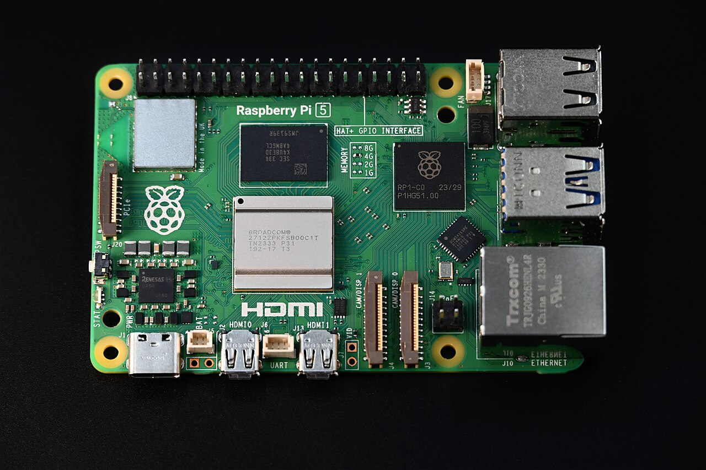
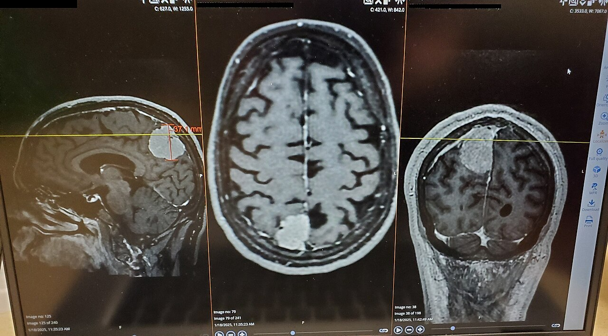
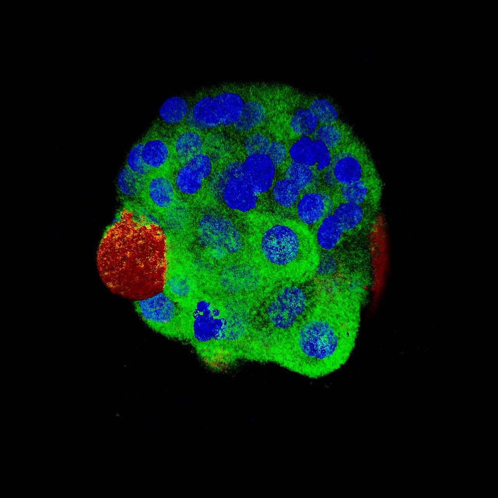

```{=html}
<div class="portfolio-shell">
  <aside class="sidebar" aria-label="Profile sidebar">
    <div class="sidebar-card">
      
      <h1 class="name">Djamal TOE</h1>
      <p class="title">Data Scientist &amp; Machine Learning Engineer</p>
      <p class="bio">Personal projects document my ML progression: experimentation, stronger evaluation, better engineering practices, and increasing reproducibility.</p>
      <div class="meta-list"><span class="meta-item">Machine Learning</span><span class="meta-item">Deep Learning</span><span class="meta-item">AI applications</span></div>
    </div>
  </aside>

  <div class="main-panel">
    <header class="topbar" aria-label="Top navigation">
      <button class="menu-toggle" id="menuToggle" aria-label="Open navigation drawer" aria-expanded="false"><i class="bi bi-list" aria-hidden="true"></i></button>
      <a class="brand-pill" href="index.qmd" aria-label="Djamal TOE home"></a>
      <nav class="nav-links" aria-label="Primary navigation">
        <a href="index.qmd">Home</a>
        <a href="experience.qmd">Experience</a>
        <a href="academic-projects.qmd">Academic</a>
        <a class="active" href="personal-projects.qmd">Personal</a>
        <a href="skills.qmd">Skills</a>
        <a href="education.qmd">Education</a>
        <a href="blog/index.qmd">Blog</a>
        <a href="about.qmd">About</a>
      </nav>
    </header>

    <main id="main-content">
      <section class="section-card">
        <div class="section-header">
          <div>
            <h2 class="section-title">Personal Projects</h2>
            <p class="section-lead">Built from the former publications universe, these projects show practical ML and AI experimentation across computer vision, statistics, and applied analytics.</p>
          </div>
        </div>

        <div class="project-grid">
          <article class="project-card">
            <a class="project-thumb" href="content/programming/aelyn/aelyn.html"></a>
            <h3 class="project-title">AELYN — Local Voice Assistant</h3>
            <p class="project-description">Wake-word voice assistant orchestrating a local LLM and specialised agents, built to run on a Raspberry Pi.</p>
            <div class="tag-list"><span class="tag-pill"><i class="bi bi-filetype-py tag-icon" aria-hidden="true"></i><span>Python</span></span><span class="tag-pill"><i class="bi bi-mic tag-icon" aria-hidden="true"></i><span>Voice</span></span><span class="tag-pill"><i class="bi bi-cpu tag-icon" aria-hidden="true"></i><span>Raspberry Pi</span></span><span class="tag-pill"><i class="bi bi-box tag-icon" aria-hidden="true"></i><span>Ollama</span></span></div>
            <div class="project-foot"><span class="blog-coming-soon"><i class="bi bi-hourglass-split" aria-hidden="true"></i> En cours</span><a class="project-link btn-secondary" href="content/programming/aelyn/aelyn.html">Explore project</a></div>
          </article>

          <article class="project-card">
            <a class="project-thumb" href="content/machine-learning/abstract-analyzer/abstract-analyzer.html"></a>
            <h3 class="project-title">Abstract Analyzer</h3>
            <p class="project-description">Reusable tool to cluster and explore scientific abstracts, generalised from an ENSAI NLP project.</p>
            <div class="tag-list"><span class="tag-pill"><i class="bi bi-filetype-py tag-icon" aria-hidden="true"></i><span>Python</span></span><span class="tag-pill"><i class="bi bi-chat-left-text tag-icon" aria-hidden="true"></i><span>NLP</span></span><span class="tag-pill"><i class="bi bi-diagram-3 tag-icon" aria-hidden="true"></i><span>Clustering</span></span></div>
            <div class="project-foot"><span class="blog-coming-soon"><i class="bi bi-hourglass-split" aria-hidden="true"></i> À venir</span><a class="project-link btn-secondary" href="content/machine-learning/abstract-analyzer/abstract-analyzer.html">Explore project</a></div>
          </article>

          <article class="project-card">
            <a class="project-thumb" href="content/machine-learning/brain-tumor-classification/brain-tumor-classification-effcientnet.html"></a>
            <h3 class="project-title">Brain Tumor Classification with EfficientNetB5</h3>
            <p class="project-description">Multi-class MRI image classification with augmentation and evaluation.</p>
            <div class="tag-list"><span class="tag-pill"><i class="bi bi-filetype-py tag-icon" aria-hidden="true"></i><span>Python</span></span><span class="tag-pill"><i class="bi bi-lightning-charge-fill tag-icon" aria-hidden="true"></i><span>PyTorch</span></span><span class="tag-pill"><i class="bi bi-camera tag-icon" aria-hidden="true"></i><span>Computer Vision</span></span></div>
            <div class="project-foot"><span class="project-meta">2025</span><a class="project-link btn-secondary" href="content/machine-learning/brain-tumor-classification/brain-tumor-classification-effcientnet.html">Explore project</a></div>
          </article>

          <article class="project-card">
            <a class="project-thumb" href="content/machine-learning/shifumi-cnn-yolov8/shifumi-cnn-yolov8.html"></a>
            <h3 class="project-title">Shifumi Gesture Recognition (CNN + YOLOv8)</h3>
            <p class="project-description">Real-time hand detection and gesture classification pipeline.</p>
            <div class="tag-list"><span class="tag-pill"><i class="bi bi-filetype-py tag-icon" aria-hidden="true"></i><span>Python</span></span><span class="tag-pill"><i class="bi bi-lightning-charge-fill tag-icon" aria-hidden="true"></i><span>PyTorch</span></span><span class="tag-pill"><i class="bi bi-camera tag-icon" aria-hidden="true"></i><span>Computer Vision</span></span><span class="tag-pill"><i class="bi bi-bullseye tag-icon" aria-hidden="true"></i><span>YOLO</span></span></div>
            <div class="project-foot"><span class="project-meta">2025</span><a class="project-link btn-secondary" href="content/machine-learning/shifumi-cnn-yolov8/shifumi-cnn-yolov8.html">Explore project</a></div>
          </article>

          <article class="project-card">
            <a class="project-thumb" href="content/machine-learning/anomaly-detection-gmm/anomaly-detection-in-transactions-GMM.html"></a>
            <h3 class="project-title">Anomaly Detection in Transactions (GMM)</h3>
            <p class="project-description">Unsupervised anomaly scoring and suspicious cluster exploration.</p>
            <div class="tag-list"><span class="tag-pill"><i class="bi bi-filetype-py tag-icon" aria-hidden="true"></i><span>Python</span></span><span class="tag-pill"><i class="bi bi-cpu tag-icon" aria-hidden="true"></i><span>Machine Learning</span></span><span class="tag-pill"><i class="bi bi-github tag-icon" aria-hidden="true"></i><span>GitHub</span></span></div>
            <div class="project-foot"><span class="project-meta">2025</span><a class="project-link btn-secondary" href="content/machine-learning/anomaly-detection-gmm/anomaly-detection-in-transactions-GMM.html">Explore project</a></div>
          </article>

          <article class="project-card">
            <a class="project-thumb" href="content/machine-learning/acp-kmeans/acp-kmeans.html"></a>
            <h3 class="project-title">PCA + KMeans Country Segmentation</h3>
            <p class="project-description">Dimension reduction and clustering for socio-economic indicators.</p>
            <div class="tag-list"><span class="tag-pill"><i class="bi bi-r-circle tag-icon" aria-hidden="true"></i><span>R</span></span><span class="tag-pill"><i class="bi bi-graph-up tag-icon" aria-hidden="true"></i><span>Statistics</span></span><span class="tag-pill"><i class="bi bi-cpu tag-icon" aria-hidden="true"></i><span>Machine Learning</span></span></div>
            <div class="project-foot"><span class="project-meta">2025</span><a class="project-link btn-secondary" href="content/machine-learning/acp-kmeans/acp-kmeans.html">Explore project</a></div>
          </article>

          <article class="project-card">
            <a class="project-thumb" href="content/machine-learning/breast-tumor-classification/Breast-Tumor-Article.html"></a>
            <h3 class="project-title">Breast Tumor Classification (PCA, KNN, Logit)</h3>
            <p class="project-description">Statistical and ML comparison on imbalanced medical data.</p>
            <div class="tag-list"><span class="tag-pill"><i class="bi bi-filetype-py tag-icon" aria-hidden="true"></i><span>Python</span></span><span class="tag-pill"><i class="bi bi-graph-up tag-icon" aria-hidden="true"></i><span>Statistics</span></span><span class="tag-pill"><i class="bi bi-cpu tag-icon" aria-hidden="true"></i><span>Machine Learning</span></span></div>
            <div class="project-foot"><span class="project-meta">2025</span><a class="project-link btn-secondary" href="content/machine-learning/breast-tumor-classification/Breast-Tumor-Article.html">Explore project</a></div>
          </article>

          <article class="project-card">
            <a class="project-thumb" href="content/programming/voice-assistant/assistant_virtuel.html"></a>
            <h3 class="project-title">Assistant Virtuel Python</h3>
            <p class="project-description">Speech-based automation and assistant workflows.</p>
            <div class="tag-list"><span class="tag-pill"><i class="bi bi-filetype-py tag-icon" aria-hidden="true"></i><span>Python</span></span><span class="tag-pill"><i class="bi bi-github tag-icon" aria-hidden="true"></i><span>GitHub</span></span><span class="tag-pill"><i class="bi bi-gear-fill tag-icon" aria-hidden="true"></i><span>Automation</span></span></div>
            <div class="project-foot"><span class="project-meta">2022</span><a class="project-link btn-secondary" href="content/programming/voice-assistant/assistant_virtuel.html">Explore project</a></div>
          </article>

          <article class="project-card">
            <a class="project-thumb" href="content/programming/java-mysql-desktop-app/desktop-app-java-mysql.html"></a>
            <h3 class="project-title">KedjeBoost Desktop App</h3>
            <p class="project-description">JavaFX desktop application for boutique management with MySQL persistence and reporting.</p>
            <div class="tag-list"><span class="tag-pill"><i class="bi bi-filetype-java tag-icon" aria-hidden="true"></i><span>Java</span></span><span class="tag-pill"><i class="bi bi-window tag-icon" aria-hidden="true"></i><span>JavaFX</span></span><span class="tag-pill"><i class="bi bi-database tag-icon" aria-hidden="true"></i><span>MySQL</span></span></div>
            <div class="project-foot"><span class="project-meta">2024</span><a class="project-link btn-secondary" href="content/programming/java-mysql-desktop-app/desktop-app-java-mysql.html">Explore project</a></div>
          </article>
        </div>
      </section>
    </main>
  </div>
</div>

<div class="drawer-backdrop" id="drawerBackdrop"></div>
<div class="sidebar-drawer" id="mobileDrawer" aria-label="Mobile navigation drawer">
  <div class="sidebar-card">
    
    <h2 class="name">Djamal TOE</h2>
    <p class="title">Data Scientist &amp; Machine Learning Engineer</p>
    <h3>Navigate</h3>
    <ul class="contact-list">
      <li><a href="index.qmd">Home</a></li>
      <li><a href="experience.qmd">Experience</a></li>
      <li><a href="academic-projects.qmd">Academic</a></li>
      <li><a href="personal-projects.qmd">Personal</a></li>
      <li><a href="skills.qmd">Skills</a></li>
      <li><a href="education.qmd">Education</a></li>
      <li><a href="blog/index.qmd">Blog</a></li>
      <li><a href="about.qmd">About</a></li>
    </ul>
  </div>
</div>
```

<script src="assets/site.js"></script>
