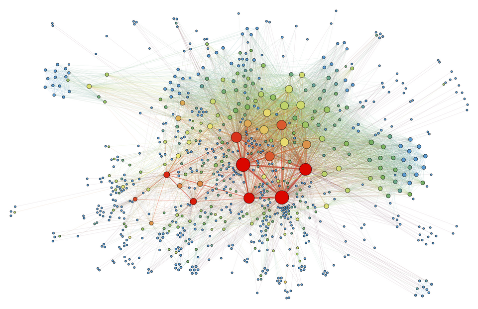
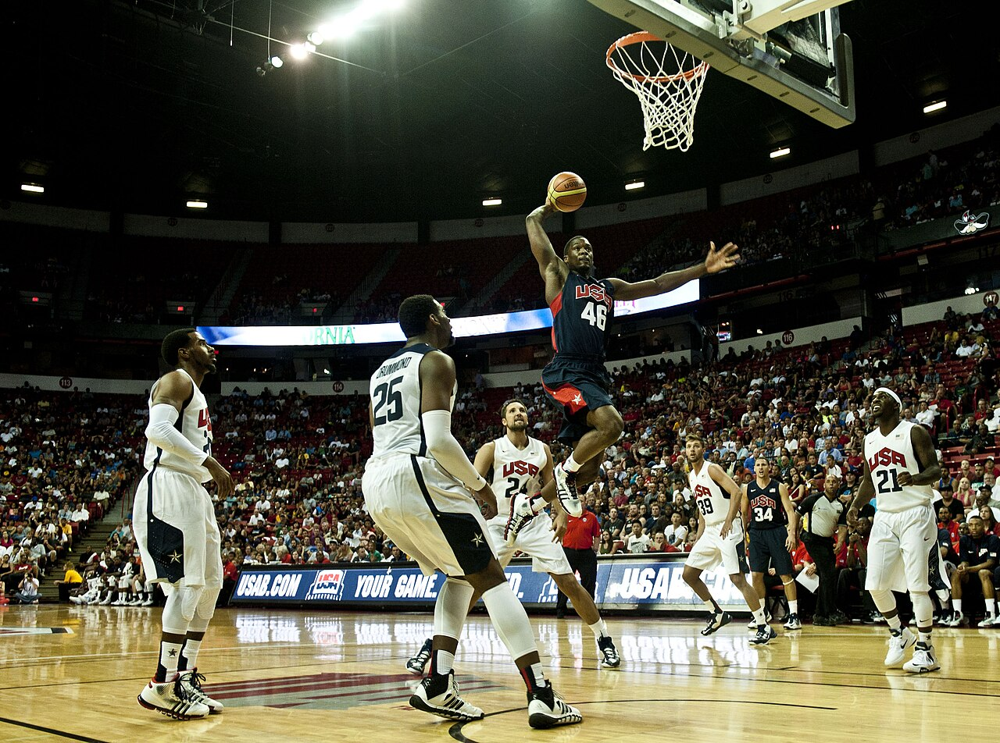
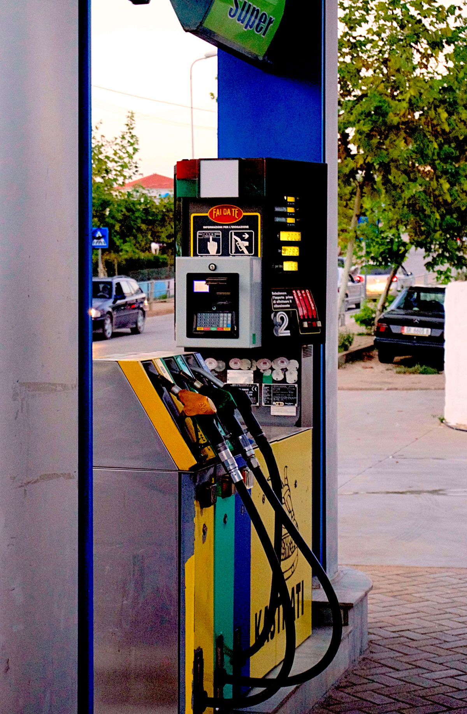

```{=html}
<div class="portfolio-shell">
  <aside class="sidebar" aria-label="Profile sidebar">
    <div class="sidebar-card">
      
      <h1 class="name">Djamal TOE</h1>
      <p class="title">Data Scientist · Biostatistics &amp; Machine Learning Engineer</p>
      <p class="bio">Selected academic and applied projects, with case studies about the question, methods, and results.</p>
      <div class="meta-list"><span class="meta-item">Statistics</span><span class="meta-item">Machine Learning</span><span class="meta-item">Research</span></div>
    </div>
  </aside>

  <div class="main-panel">
    <header class="topbar" aria-label="Top navigation">
      <button class="menu-toggle" id="menuToggle" aria-label="Open navigation drawer" aria-expanded="false"><i class="bi bi-list" aria-hidden="true"></i></button>
      <a class="brand-pill" href="index.qmd" aria-label="Djamal TOE home"></a>
      <nav class="nav-links" aria-label="Primary navigation">
        <a href="index.qmd">Home</a>
        <a href="experience.qmd">Experience</a>
        <a href="academic-projects.qmd">Academic</a>
        <a class="active" href="personal-projects.qmd">Personal Projects</a>
        <a href="skills.qmd">Skills</a>
        <a href="education.qmd">Education</a>
        <a href="blog/index.qmd">Blog</a>
        <a href="about.qmd">About</a>
      </nav>
    </header>

    <main id="main-content">
      <section class="section-card">
        <div class="section-header">
          <div>
            <h2 class="section-title">Personal Projects</h2>
            <p class="section-lead">Explore the data, methods, and results behind these academic and applied projects.</p>
          </div>
        </div>
        <div class="project-grid">
          <article class="project-card">
            <a class="project-thumb" href="stories/projects/medical-texts-scibert.html"></a>
            <h3 class="project-title"><a href="stories/projects/medical-texts-scibert.html">From medical texts to meaningful patterns</a></h3>
            <p class="project-description">Exploring biomedical abstracts with SciBERT and unsupervised learning.</p>
            <div class="project-foot"><span class="project-meta">NLP · Unsupervised learning</span><a class="project-link btn-secondary" href="stories/projects/medical-texts-scibert.html">Explore story</a></div>
          </article>
          <article class="project-card">
            <a class="project-thumb" href="stories/projects/inauthentic-image-sharing.html"></a>
            <h3 class="project-title"><a href="stories/projects/inauthentic-image-sharing.html">Identifying inauthentic image sharing and coordinated behaviour</a></h3>
            <p class="project-description">Studying image diffusion and coordination with computer vision and temporal networks.</p>
            <div class="project-foot"><span class="project-meta">Computer vision · Network science</span><a class="project-link btn-secondary" href="stories/projects/inauthentic-image-sharing.html">Explore story</a></div>
          </article>
          <article class="project-card">
            <a class="project-thumb" href="stories/projects/gaming-adolescent-health.html"></a>
            <h3 class="project-title"><a href="stories/projects/gaming-adolescent-health.html">The link between gaming and adolescent health</a></h3>
            <p class="project-description">A public-health study of gaming habits and adolescent health.</p>
            <div class="project-foot"><span class="project-meta">Public health · Applied statistics</span><a class="project-link btn-secondary" href="stories/projects/gaming-adolescent-health.html">Explore story</a></div>
          </article>
          <article class="project-card">
            <a class="project-thumb" href="stories/projects/nba-career-length.html"></a>
            <h3 class="project-title"><a href="stories/projects/nba-career-length.html">Predicting the career length of NBA players</a></h3>
            <p class="project-description">Predicting career length from player profiles and performance indicators.</p>
            <div class="project-foot"><span class="project-meta">Machine learning · Sports</span><a class="project-link btn-secondary" href="stories/projects/nba-career-length.html">Explore story</a></div>
          </article>
          <article class="project-card">
            <a class="project-thumb" href="stories/projects/fueltrack.html"></a>
            <h3 class="project-title"><a href="stories/projects/fueltrack.html">FuelTrack: interactive fuel-price analysis</a></h3>
            <p class="project-description">A layered application for exploring and comparing fuel prices.</p>
            <div class="project-foot"><span class="project-meta">Data application · Visualization</span><a class="project-link btn-secondary" href="stories/projects/fueltrack.html">Explore story</a></div>
          </article>
          <article class="project-card">
            <a class="project-thumb" href="stories/projects/hicp-forecasting.html"></a>
            <h3 class="project-title"><a href="stories/projects/hicp-forecasting.html">Forecasting the Harmonised Index of Consumer Prices</a></h3>
            <p class="project-description">Forecasting consumer prices with time-series methods and uncertainty estimates.</p>
            <div class="project-foot"><span class="project-meta">Time series · Forecasting</span><a class="project-link btn-secondary" href="stories/projects/hicp-forecasting.html">Explore story</a></div>
          </article>
          <article class="project-card">
            <a class="project-thumb" href="stories/projects/practical-survey.html"></a>
            <h3 class="project-title"><a href="stories/projects/practical-survey.html">Practical survey project</a></h3>
            <p class="project-description">A survey workflow from questionnaire design and sampling to analysis-ready data.</p>
            <div class="project-foot"><span class="project-meta">Survey methods · Statistics</span><a class="project-link btn-secondary" href="stories/projects/practical-survey.html">Explore story</a></div>
          </article>
        </div>
      </section>
    </main>
  </div>
</div>
<div class="drawer-backdrop" id="drawerBackdrop"></div>
<div class="sidebar-drawer" id="mobileDrawer" aria-label="Mobile navigation drawer">
  <div class="sidebar-card">
    
    <h2 class="name">Djamal TOE</h2>
    <p class="title">Data Scientist · Biostatistics &amp; Machine Learning Engineer</p>
    <h3>Navigate</h3>
    <ul class="contact-list">
      <li><a href="index.qmd">Home</a></li>
      <li><a href="experience.qmd">Experience</a></li>
      <li><a href="academic-projects.qmd">Academic Projects</a></li>
      <li><a href="personal-projects.qmd">Personal Projects</a></li>
      <li><a href="skills.qmd">Skills</a></li>
      <li><a href="education.qmd">Education</a></li>
      <li><a href="blog/index.qmd">Blog</a></li>
      <li><a href="about.qmd">About</a></li>
    </ul>
  </div>
</div>
```
<script src="assets/site.js"></script>
